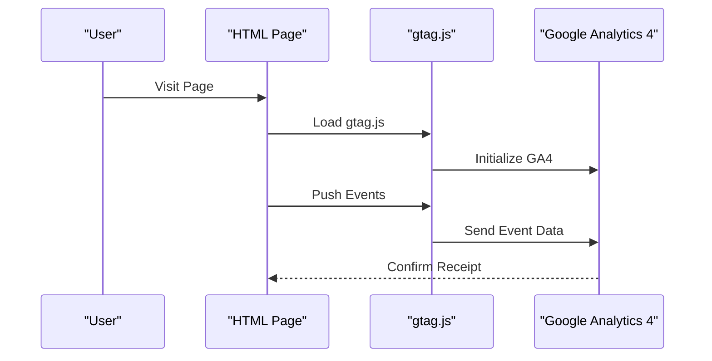
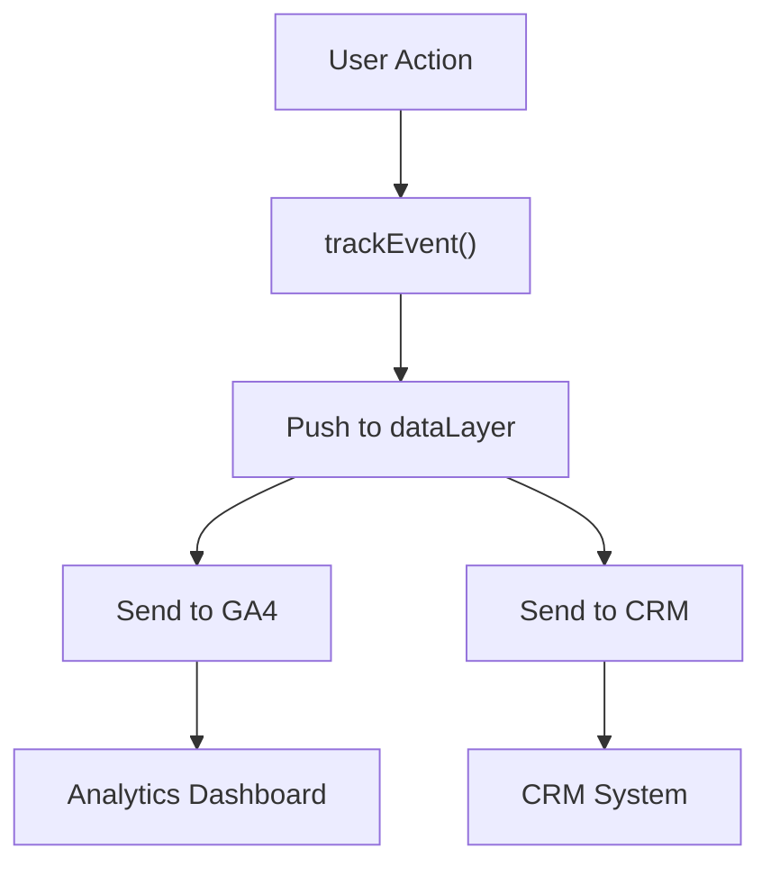
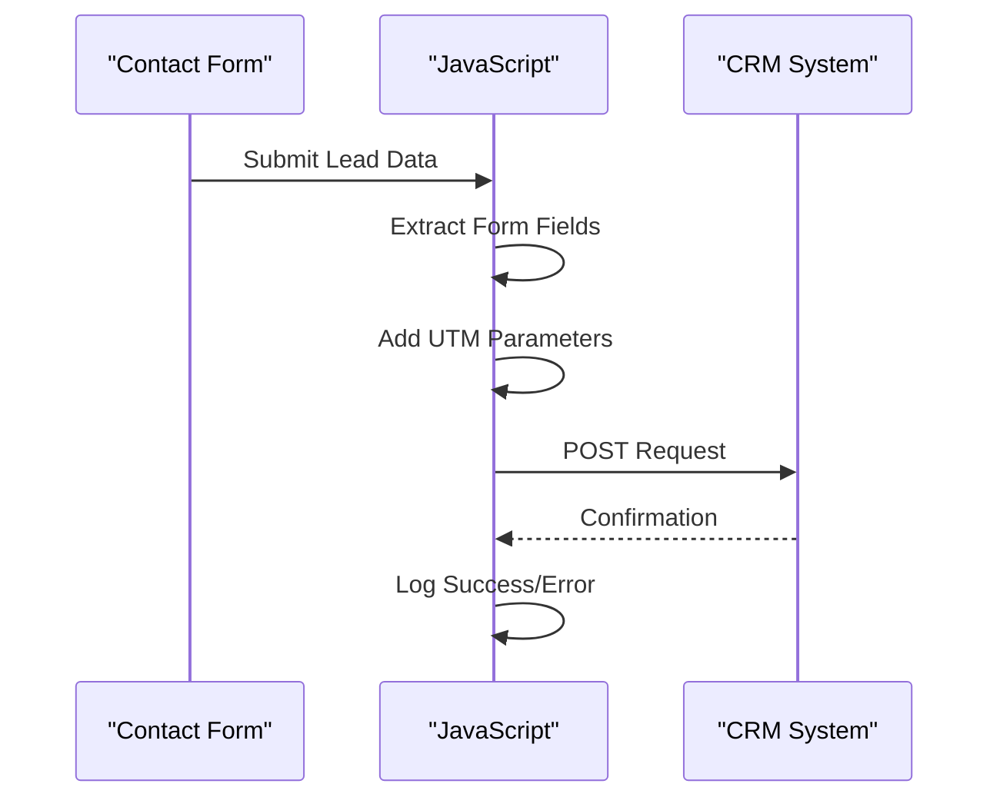
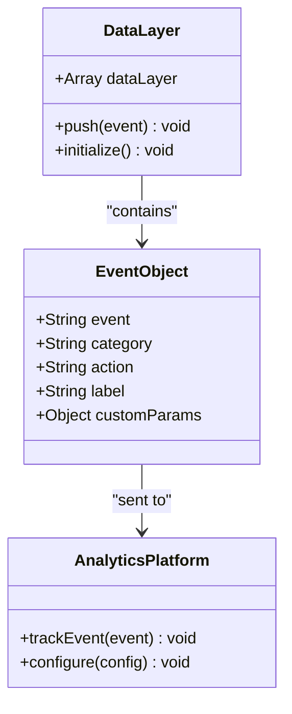

# Analytics & Tracking

<cite>
**Referenced Files in This Document**
- [index.html](file://index.html)
- [assets/main.js](file://assets/main.js)
- [portfolio.html](file://portfolio.html)
- [price.html](file://price.html)
- [founder.html](file://founder.html)
- [README.md](file://README.md)
</cite>

## Table of Contents
1. [Introduction](#introduction)
2. [Google Analytics 4 Integration](#google-analytics-4-integration)
3. [Custom TrackEvent Function](#custom-trackevent-function)
4. [CRM Integration](#crm-integration)
5. [DataLayer Implementation](#datalayer-implementation)
6. [Event Tracking Implementation](#event-tracking-implementation)
7. [Privacy Considerations](#privacy-considerations)
8. [Debugging and Monitoring](#debugging-and-monitoring)
9. [Best Practices](#best-practices)
10. [Troubleshooting Guide](#troubleshooting-guide)

## Introduction

The Knyazev Pro landing site implements a comprehensive analytics and tracking system designed to capture user interactions, monitor conversion funnels, and integrate with external CRM systems. The implementation follows modern web analytics standards while maintaining privacy compliance and providing robust debugging capabilities.

The tracking system consists of three main components:
- **Google Analytics 4 (GA4) Integration**: For website performance monitoring and user behavior analysis
- **Custom TrackEvent Function**: For capturing specific user interactions and micro-conversions
- **CRM Integration**: For lead management and customer relationship tracking

## Google Analytics 4 Integration

### Implementation Overview

The site uses Google Analytics 4 through the gtag.js library, which provides modern analytics capabilities with enhanced privacy controls and cross-platform tracking.



**Diagram sources**
- [index.html](file://index.html#L1-L20)
- [assets/main.js](file://assets/main.js#L347-L353)

### Initialization Sequence

The GA4 integration requires proper initialization in the HTML head section:

```html
<!-- Google Analytics 4 Script -->
<script async src="https://www.googletagmanager.com/gtag/js?id=G-XXXXXXXXXX"></script>
<script>
  window.dataLayer = window.dataLayer || [];
  function gtag(){dataLayer.push(arguments);}
  gtag('js', new Date());
  gtag('config', 'G-XXXXXXXXXX');
</script>
```

### Configuration Requirements

| Parameter | Description | Implementation |
|-----------|-------------|----------------|
| **Measurement ID** | Unique identifier for GA4 property | Replace `G-XXXXXXXXXX` with actual ID |
| **Data Layer** | Global container for event data | Automatically initialized in main.js |
| **Event Timing** | Real-time event transmission | Events pushed immediately upon user interaction |

**Section sources**
- [index.html](file://index.html#L1-L20)
- [assets/main.js](file://assets/main.js#L347-L353)

## Custom TrackEvent Function

### Function Architecture

The custom `trackEvent` function serves as the primary interface for capturing user interactions across the site. It implements a standardized event structure that ensures consistency in data collection.



**Diagram sources**
- [assets/main.js](file://assets/main.js#L347-L353)

### Event Structure and Naming Conventions

The tracking system uses a hierarchical event naming convention:

| Level | Format | Example | Purpose |
|-------|--------|---------|---------|
| **Category** | `CTA`, `Lead`, `Product`, `Cases` | Business context | High-level event grouping |
| **Action** | `open_mini_brief`, `scroll_to_consultation` | User behavior | Specific interaction type |
| **Label** | `button_click`, `modal`, `expand` | Additional context | Detailed description |

### Supported Event Categories

#### Call-to-Action (CTA) Events
- **Purpose**: Track button clicks and navigation actions
- **Examples**: `CTA:open_mini_brief:button_click`, `CTA:scroll_to_consultation:button_click`

#### Lead Generation Events
- **Purpose**: Monitor form submissions and lead creation
- **Examples**: `Lead:mini_brief_submit:modal`, `Lead:consultation_form:submit`

#### Product Interaction Events
- **Purpose**: Track product page interactions
- **Examples**: `Product:toggle_includes:expand`, `Product:toggle_examples:collapse`

#### Portfolio Interaction Events
- **Purpose**: Monitor portfolio filtering and navigation
- **Examples**: `Cases:filter:industry`, `Cases:filter:brand`

**Section sources**
- [assets/main.js](file://assets/main.js#L78-L144)
- [assets/main.js](file://assets/main.js#L347-L353)

## CRM Integration

### sendToCRM Function

The CRM integration is implemented through the `sendToCRM` function, which currently serves as a stub for future CRM system integration. The function accepts lead data and prepares it for submission to external CRM systems.



**Diagram sources**
- [assets/main.js](file://assets/main.js#L335-L345)

### Lead Data Structure

The CRM integration expects a structured lead object containing essential contact information and campaign data:

| Field | Type | Description | Example |
|-------|------|-------------|---------|
| **name** | String | Contact name | "Иван Петров" |
| **email** | String | Email address | "ivan@example.com" |
| **company** | String | Company name | "TechCorp" |
| **phone** | String | Phone number | "+7 (999) 123-45-67" |
| **message** | String | Inquiry message | "Interested in advertising video" |
| **source** | String | UTM parameters | "utm_source=google&utm_medium=cpc" |

### CRM System Compatibility

The implementation is designed to support multiple CRM platforms:

- **AmoCRM**: Enterprise CRM with advanced automation
- **Bitrix24**: Russian market CRM with integrated communication
- **HubSpot**: American CRM with marketing automation
- **Salesforce**: Global enterprise CRM platform

### Implementation Template

```javascript
async function sendToCRM(lead) {
  try {
    const response = await fetch('https://your-crm-webhook', {
      method: 'POST',
      headers: {
        'Content-Type': 'application/json'
      },
      body: JSON.stringify({
        ...lead,
        timestamp: new Date().toISOString(),
        source: (new URLSearchParams(location.search)).toString()
      })
    });
    
    if (!response.ok) {
      throw new Error(`CRM API Error: ${response.status}`);
    }
    
    console.log('CRM lead submitted successfully:', lead);
  } catch (err) {
    console.error('CRM submission failed:', err);
  }
}
```

**Section sources**
- [assets/main.js](file://assets/main.js#L335-L345)

## DataLayer Implementation

### DataLayer Architecture

The dataLayer serves as the central hub for event data, providing a standardized interface between the tracking functions and analytics platforms.



**Diagram sources**
- [assets/main.js](file://assets/main.js#L347-L353)

### DataLayer Initialization

The dataLayer is automatically initialized when the first event is pushed:

```javascript
window.dataLayer = window.dataLayer || [];
window.dataLayer.push({
  event: 'custom_event',
  category: 'CTA',
  action: 'open_mini_brief',
  label: 'button_click'
});
```

### Event Payload Structure

Each event pushed to the dataLayer follows a consistent structure:

| Property | Type | Required | Description |
|----------|------|----------|-------------|
| **event** | String | Yes | Event identifier (`custom_event`) |
| **category** | String | Yes | Event category (CTA, Lead, Product, etc.) |
| **action** | String | Yes | Specific action performed |
| **label** | String | Yes | Additional context or state |
| **timestamp** | Number | Auto | Unix timestamp of event |
| **page** | String | Auto | Current page URL |

### DataLayer Best Practices

1. **Consistent Naming**: Use standardized event names across all pages
2. **Minimal Payload**: Include only essential data to reduce payload size
3. **Error Handling**: Implement robust error handling for dataLayer operations
4. **Privacy Compliance**: Ensure dataLayer respects user privacy preferences

**Section sources**
- [assets/main.js](file://assets/main.js#L347-L353)

## Event Tracking Implementation

### Button Click Tracking

Button click events are tracked automatically for all interactive elements with the `data-action` attribute:

```javascript
// Automatic tracking for CTA buttons
document.querySelectorAll('[data-action]').forEach(btn => {
  btn.addEventListener('click', () => {
    const action = btn.getAttribute('data-action');
    trackEvent('CTA', action, 'button_click');
  });
});
```

### Form Submission Tracking

Form submissions trigger comprehensive tracking including lead data extraction and CRM integration:

```javascript
briefForm.addEventListener('submit', async (e) => {
  e.preventDefault();
  const formData = new FormData(briefForm);
  const lead = Object.fromEntries(formData.entries());
  lead.source = (new URLSearchParams(location.search)).toString();
  
  await sendToCRM(lead);
  trackEvent('Lead', 'mini_brief_submit', 'modal');
  briefModal.close();
});
```

### Interactive Element Tracking

Accordion toggles and other interactive elements use specific tracking patterns:

```javascript
// Product accordion tracking
document.querySelectorAll('.product-includes-toggle').forEach(button => {
  button.addEventListener('click', () => {
    const isExpanded = this.getAttribute('aria-expanded') === 'true';
    trackEvent('Product', 'toggle_includes', isExpanded ? 'collapse' : 'expand');
  });
});
```

### Event Tracking Matrix

| Element Type | Tracking Method | Event Pattern | Data Captured |
|--------------|-----------------|---------------|---------------|
| **CTA Buttons** | Automatic | `CTA:{action}:{source}` | Button clicks, navigation |
| **Forms** | Manual | `Lead:{form_type}:{status}` | Form submissions, errors |
| **Accordions** | Automatic | `Product:{section}:{state}` | Expansion, collapse |
| **Filters** | Automatic | `Cases:{filter}:{category}` | Portfolio interactions |
| **Modals** | Manual | `UI:{modal}:{action}` | Modal open/close |

**Section sources**
- [assets/main.js](file://assets/main.js#L78-L144)
- [assets/main.js](file://assets/main.js#L374-L414)

## Privacy Considerations

### Data Protection Compliance

The tracking implementation adheres to modern data protection standards:

#### GDPR Compliance
- **Consent Management**: Implement consent banners and preference centers
- **Data Minimization**: Collect only necessary data for business purposes
- **Right to Access**: Provide mechanisms for users to access their data
- **Right to Erasure**: Implement data deletion requests

#### CCPA Compliance
- **Do Not Sell**: Respect "Do Not Sell My Personal Information" requests
- **Opt-Out Mechanisms**: Provide clear opt-out options
- **Data Disclosure**: Offer transparency about data collection practices

### Privacy-Friendly Features

#### Cookieless Tracking
- **Server-Side Tracking**: Reduce client-side cookie dependencies
- **Anonymous Analytics**: Implement anonymous visitor tracking
- **Local Storage Alternatives**: Use localStorage for session data instead of cookies

#### Data Retention
- **Automatic Cleanup**: Implement automatic data cleanup policies
- **Retention Periods**: Define clear data retention periods
- **Secure Deletion**: Ensure secure data deletion procedures

### Consent Management

```javascript
// Example consent management implementation
const CONSENT_REQUIRED = ['analytics', 'marketing', 'functional'];

function checkConsent(category) {
  const userConsent = localStorage.getItem('user_consent');
  return userConsent && userConsent.includes(category);
}

function trackWithConsent(category, action, label) {
  if (checkConsent('analytics')) {
    trackEvent(category, action, label);
  }
}
```

## Debugging and Monitoring

### Browser Developer Tools

#### Console Debugging
Monitor tracking events and dataLayer activity:

```javascript
// Enable debug mode
window.dataLayer = window.dataLayer || [];
console.log('DataLayer initialized:', window.dataLayer);

// Track event firing
function trackEvent(category, action, label) {
  console.log('Tracking event:', { category, action, label });
  window.dataLayer.push({ event: 'custom_event', category, action, label });
}
```

#### Network Tab Monitoring
Verify event transmission to analytics platforms:

1. Open Browser Developer Tools (F12)
2. Navigate to Network tab
3. Filter by XHR/Fetch requests
4. Look for requests to analytics domains
5. Verify payload structure and timing

#### DataLayer Inspection
Monitor dataLayer contents and event flow:

```javascript
// Inspect dataLayer contents
setInterval(() => {
  console.log('Current dataLayer:', window.dataLayer);
}, 5000);
```

### Analytics Platform Verification

#### Google Analytics Debugging
- **Real-Time Reports**: Monitor real-time event occurrences
- **Event Tracking**: Verify event parameters and categories
- **User Behavior**: Analyze user journey patterns

#### CRM Integration Testing
- **Webhook Validation**: Test webhook endpoint functionality
- **Payload Structure**: Verify data format and completeness
- **Error Handling**: Monitor error rates and failure modes

### Performance Monitoring

#### Event Latency
Measure event delivery timing:

```javascript
const startTime = performance.now();
trackEvent('Performance', 'test_latency', 'start');
// ... user interaction
const endTime = performance.now();
console.log('Event latency:', endTime - startTime, 'ms');
```

#### Error Rate Monitoring
Track tracking failures and implementation issues:

```javascript
window.addEventListener('error', (event) => {
  if (event.filename.includes('main.js')) {
    trackEvent('Error', 'tracking_failure', event.message);
  }
});
```

**Section sources**
- [assets/main.js](file://assets/main.js#L347-L353)

## Best Practices

### Event Naming Standards

#### Consistency Guidelines
- Use kebab-case for event names
- Maintain hierarchical naming structure
- Keep event names concise yet descriptive
- Avoid special characters and spaces

#### Category Organization
```
CTA:action:source          // Call-to-action events
Lead:form:status           // Lead generation events
Product:section:state      // Product page events
Cases:filter:category      // Portfolio events
UI:modal:action            // UI interaction events
```

### Data Quality Assurance

#### Validation Rules
- **Required Fields**: Ensure category, action, and label are present
- **Data Types**: Validate field types (strings, numbers, booleans)
- **Length Limits**: Enforce reasonable length limits
- **Format Validation**: Verify email, phone, and URL formats

#### Error Handling
```javascript
function trackEvent(category, action, label) {
  try {
    if (!category || !action || !label) {
      throw new Error('Missing required tracking parameters');
    }
    
    window.dataLayer.push({
      event: 'custom_event',
      category: String(category).substring(0, 50),
      action: String(action).substring(0, 100),
      label: String(label).substring(0, 150),
      timestamp: Date.now()
    });
  } catch (error) {
    console.error('Tracking error:', error);
  }
}
```

### Performance Optimization

#### Event Debouncing
Prevent excessive event firing:

```javascript
let trackingDebounce;
function debouncedTrackEvent(category, action, label) {
  clearTimeout(trackingDebounce);
  trackingDebounce = setTimeout(() => {
    trackEvent(category, action, label);
  }, 100);
}
```

#### Batch Processing
Group related events for efficient transmission:

```javascript
const eventQueue = [];
const BATCH_SIZE = 10;
const BATCH_TIMEOUT = 1000;

function queueEvent(category, action, label) {
  eventQueue.push({ category, action, label });
  
  if (eventQueue.length >= BATCH_SIZE) {
    flushEvents();
  } else if (eventQueue.length === 1) {
    setTimeout(flushEvents, BATCH_TIMEOUT);
  }
}

function flushEvents() {
  const batch = eventQueue.splice(0, BATCH_SIZE);
  batch.forEach(event => trackEvent(event.category, event.action, event.label));
}
```

### Security Considerations

#### Input Sanitization
Protect against XSS and injection attacks:

```javascript
function sanitizeEventData(data) {
  return Object.fromEntries(
    Object.entries(data).map(([key, value]) => [
      key,
      typeof value === 'string' ? 
        value.replace(/[<>"']/g, '') : 
        value
    ])
  );
}
```

#### Secure Communication
Ensure encrypted data transmission:

```javascript
// Use HTTPS for all tracking endpoints
const TRACKING_ENDPOINT = 'https://secure-analytics.example.com/track';

async function sendTrackingData(data) {
  try {
    await fetch(TRACKING_ENDPOINT, {
      method: 'POST',
      headers: {
        'Content-Type': 'application/json',
        'X-CSRF-Token': getCSRFToken()
      },
      body: JSON.stringify(sanitizeEventData(data))
    });
  } catch (error) {
    console.error('Secure tracking failed:', error);
  }
}
```

## Troubleshooting Guide

### Common Issues and Solutions

#### Events Not Firing

**Symptoms**: No events appear in analytics dashboards
**Causes**: 
- Incorrect event registration
- JavaScript errors preventing execution
- Ad blockers interfering with tracking

**Solutions**:
1. Check browser console for JavaScript errors
2. Verify event listener attachment
3. Test with ad blocker disabled
4. Validate dataLayer initialization

#### DataLayer Issues

**Symptoms**: Events fire but dataLayer appears empty
**Causes**:
- Race conditions with dataLayer initialization
- Incorrect push syntax
- Memory leaks from excessive pushes

**Solutions**:
```javascript
// Safe dataLayer initialization
window.dataLayer = window.dataLayer || [];
function safeTrackEvent(category, action, label) {
  try {
    window.dataLayer.push({
      'event': 'custom_event',
      'category': category,
      'action': action,
      'label': label,
      'timestamp': Date.now()
    });
  } catch (error) {
    console.error('DataLayer push failed:', error);
  }
}
```

#### CRM Integration Problems

**Symptoms**: Leads not appearing in CRM system
**Causes**:
- Incorrect webhook URL
- Authentication failures
- Payload format issues

**Solutions**:
1. Test webhook endpoint manually
2. Verify authentication credentials
3. Check payload structure against CRM API documentation
4. Implement retry logic for transient failures

### Debug Mode Implementation

```javascript
// Enable debug mode for development
const DEBUG_MODE = process.env.NODE_ENV === 'development';

function debugTrackEvent(category, action, label, data = {}) {
  if (DEBUG_MODE) {
    console.group('Tracking Event');
    console.log('Category:', category);
    console.log('Action:', action);
    console.log('Label:', label);
    console.log('Data:', data);
    console.groupEnd();
  }
  
  trackEvent(category, action, label);
}
```

### Monitoring and Alerting

#### Event Frequency Monitoring
```javascript
const eventCounts = {};

function monitoredTrackEvent(category, action, label) {
  const key = `${category}:${action}`;
  eventCounts[key] = (eventCounts[key] || 0) + 1;
  
  // Alert if event frequency exceeds threshold
  if (eventCounts[key] > 100) {
    console.warn(`High event frequency detected: ${key}`);
  }
  
  trackEvent(category, action, label);
}
```

#### Health Checks
```javascript
function healthCheck() {
  const checks = {
    dataLayer: !!window.dataLayer,
    gaInitialized: typeof gtag === 'function',
    crmConnected: false // Implement CRM connection check
  };
  
  console.table(checks);
  return Object.values(checks).every(Boolean);
}
```

**Section sources**
- [assets/main.js](file://assets/main.js#L347-L353)