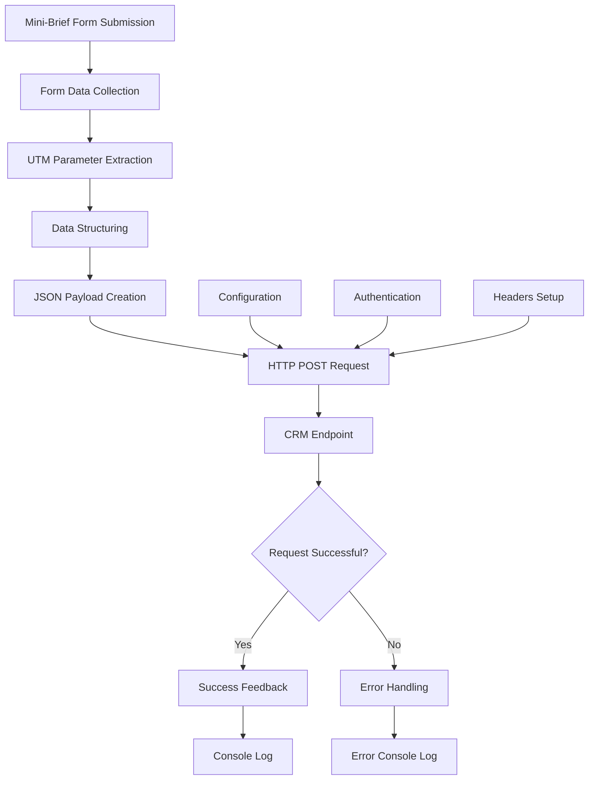
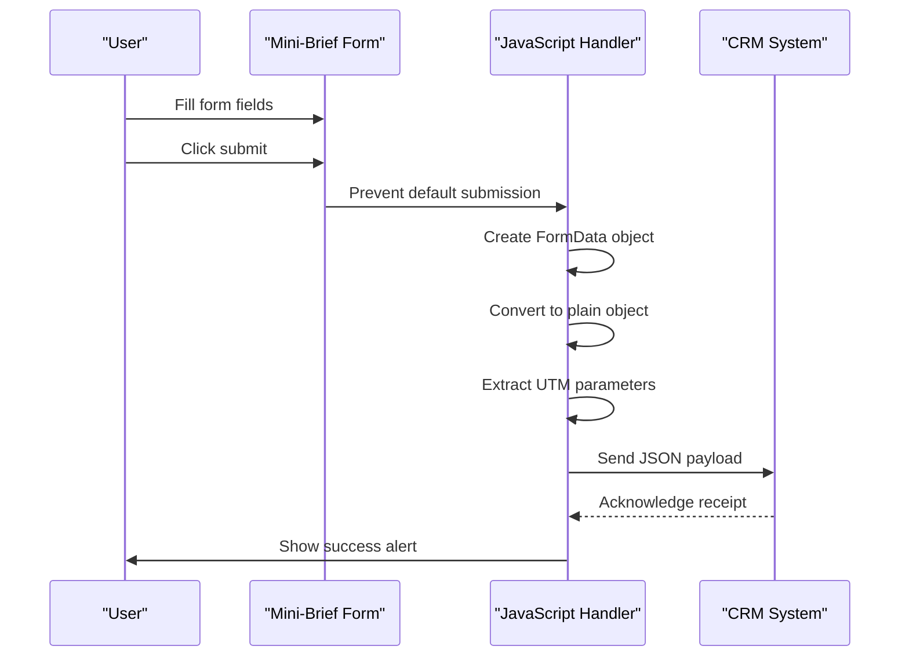
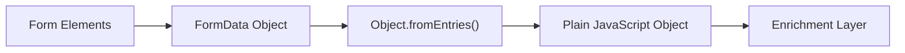
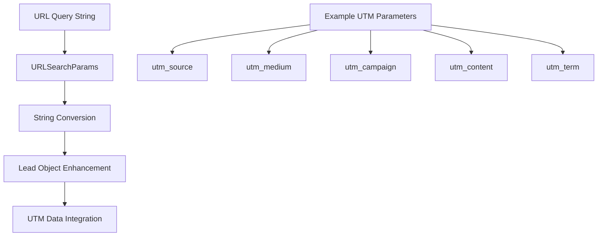
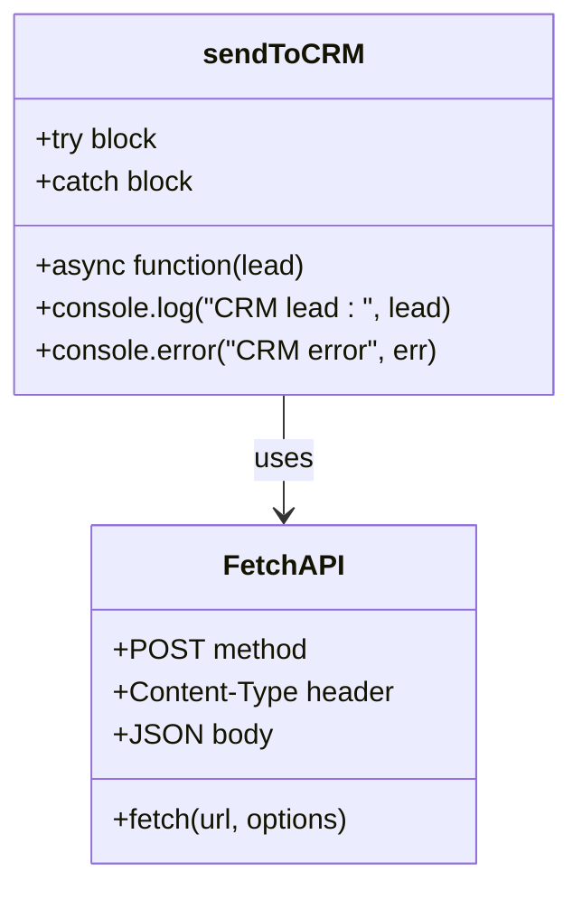
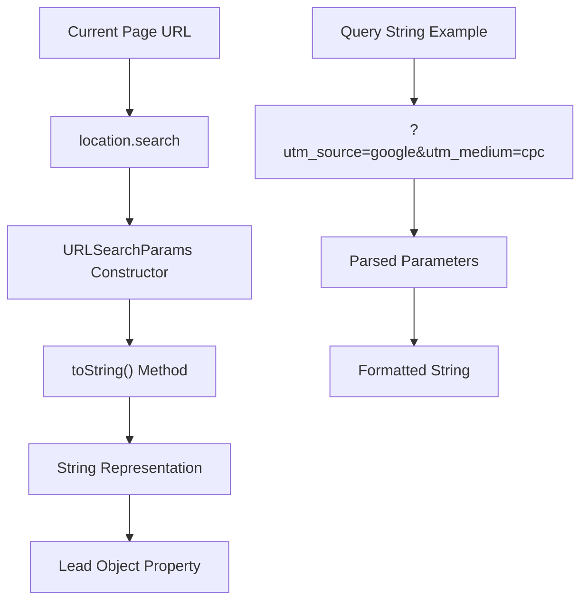
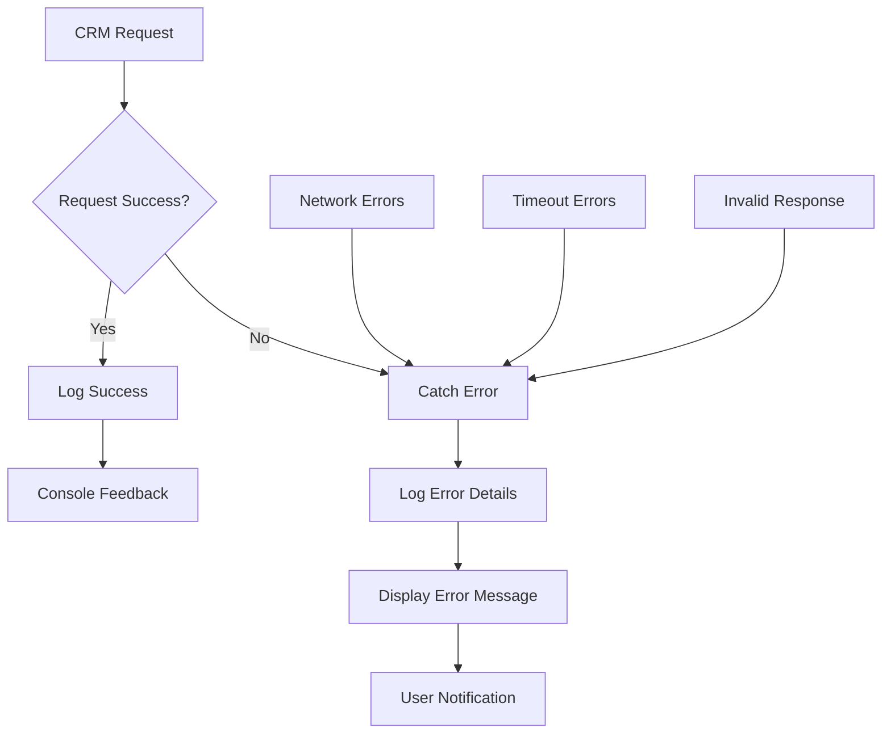
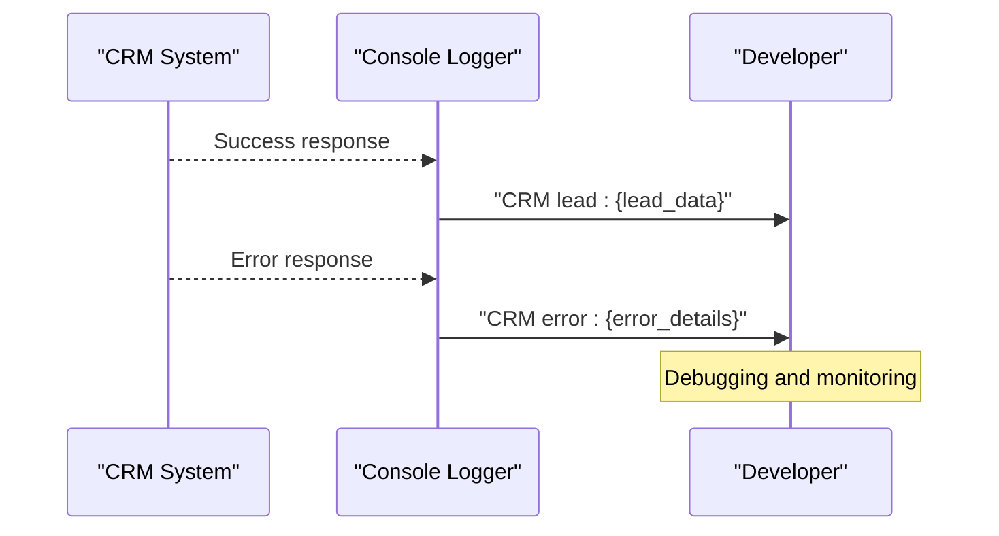
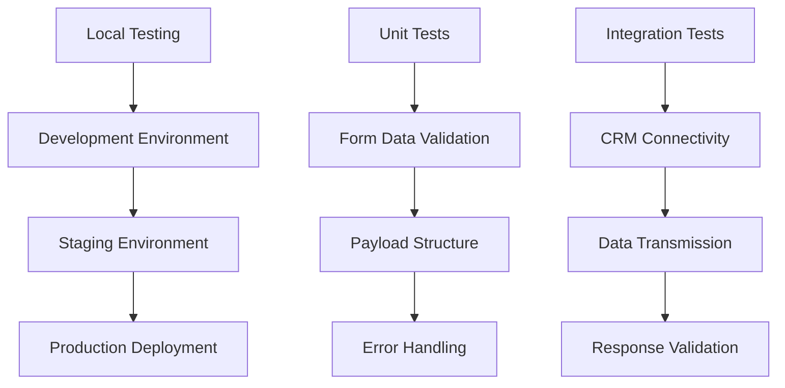

# CRM Integration

<cite>
**Referenced Files in This Document**
- [assets/main.js](file://assets/main.js)
- [index.html](file://index.html)
- [contact.html](file://contact.html)
- [portfolio.html](file://portfolio.html)
- [README.md](file://README.md)
</cite>

## Table of Contents
1. [Introduction](#introduction)
2. [System Architecture](#system-architecture)
3. [Lead Data Collection](#lead-data-collection)
4. [Data Processing Pipeline](#data-processing-pipeline)
5. [CRM Integration Implementation](#crm-integration-implementation)
6. [UTM Parameter Capture](#utm-parameter-capture)
7. [Error Handling and Security](#error-handling-and-security)
8. [Configuration Guide](#configuration-guide)
9. [Extension Examples](#extension-examples)
10. [Best Practices](#best-practices)

## Introduction

The CRM integration system in the Knyazev PRO landing page serves as a critical component for capturing and transmitting lead data from potential clients. Built around the `sendToCRM` function in the main JavaScript file, this system facilitates seamless communication between the website and external Customer Relationship Management platforms such as AmoCRM, Bitrix24, or other CRM systems.

The integration operates through a multi-stage process: collecting lead data from the mini-brief modal form, structuring the data with UTM parameters, preparing it as a JSON payload, and transmitting it via HTTP POST requests. This implementation provides a robust foundation for marketing automation while maintaining flexibility for various CRM platforms.

## System Architecture

The CRM integration follows a modular architecture designed for scalability and maintainability:



**Diagram sources**
- [assets/main.js](file://assets/main.js#L400-L417)
- [assets/main.js](file://assets/main.js#L335-L342)

The system consists of several key architectural components:

- **Form Integration Layer**: Handles user input collection from the mini-brief modal
- **Data Transformation Engine**: Processes raw form data and enriches it with contextual information
- **Communication Protocol**: Manages HTTP requests with proper headers and authentication
- **Error Management System**: Provides comprehensive logging and feedback mechanisms

**Section sources**
- [assets/main.js](file://assets/main.js#L400-L417)
- [assets/main.js](file://assets/main.js#L335-L342)

## Lead Data Collection

The lead data collection process begins with the mini-brief modal form, which captures essential information from potential clients. This form presents five targeted questions designed to quickly assess client needs:

### Form Structure and Data Fields

The mini-brief form collects the following structured data:

| Field Name | Type | Purpose | Validation |
|------------|------|---------|------------|
| `goal` | String | Business objective (Tender, Investors, Sales, PR) | Required dropdown selection |
| `timeline` | String | Project implementation timeline | Required text input |
| `budget` | String | Budget range or estimate | Required text input |
| `refs` | URL | Reference materials or examples | Optional URL field |
| `contacts` | String | Contact information (name + phone/email) | Required text input |

### Data Collection Mechanism

The form data collection utilizes modern JavaScript APIs to ensure reliable data extraction:



**Diagram sources**
- [assets/main.js](file://assets/main.js#L400-L417)

**Section sources**
- [assets/main.js](file://assets/main.js#L400-L417)
- [index.html](file://index.html#L200-L220)

## Data Processing Pipeline

The data processing pipeline transforms raw form submissions into structured CRM-ready payloads through a series of well-defined stages:

### Stage 1: Form Data Extraction

The system employs the FormData API to collect all form inputs efficiently:



**Diagram sources**
- [assets/main.js](file://assets/main.js#L402-L404)

### Stage 2: UTM Parameter Enrichment

The most sophisticated aspect of the data processing pipeline involves extracting and incorporating UTM parameters from the URL query string. This enrichment provides valuable contextual information about the lead's acquisition channel:



**Diagram sources**
- [assets/main.js](file://assets/main.js#L405)

### Stage 3: JSON Payload Preparation

The processed data undergoes JSON serialization to prepare it for transmission:

| Processing Step | Implementation | Purpose |
|----------------|----------------|---------|
| Data Normalization | `Object.fromEntries(formData.entries())` | Convert FormData to plain object |
| UTM Integration | `(new URLSearchParams(location.search)).toString()` | Add contextual tracking data |
| JSON Serialization | `JSON.stringify(lead)` | Prepare for HTTP transmission |
| Header Configuration | `{ 'Content-Type': 'application/json' }` | Specify payload format |

**Section sources**
- [assets/main.js](file://assets/main.js#L402-L405)

## CRM Integration Implementation

The core CRM integration is implemented through the `sendToCRM` function, which currently serves as a stub with placeholder functionality. This design allows for easy extension to support various CRM platforms:

### Current Implementation Structure

The existing implementation demonstrates a clean, asynchronous approach to CRM communication:



**Diagram sources**
- [assets/main.js](file://assets/main.js#L335-L342)

### HTTP Communication Protocol

The system utilizes the modern Fetch API for HTTP communication, providing several advantages:

| Feature | Implementation | Benefit |
|---------|----------------|---------|
| Asynchronous Operation | `async/await` pattern | Non-blocking execution |
| Promise-Based | Native browser API | Standardized error handling |
| Flexible Headers | Configurable Content-Type | Supports various payload formats |
| Cross-Origin Support | CORS-compliant requests | Works with external CRM systems |

### Placeholder Configuration

The current implementation includes commented-out production code that demonstrates the intended functionality:

```javascript
// await fetch('https://your-crm-webhook', {
//   method: 'POST',
//   headers: {
//     'Content-Type': 'application/json'
//   },
//   body: JSON.stringify(lead)
// });
```

**Section sources**
- [assets/main.js](file://assets/main.js#L335-L342)

## UTM Parameter Capture

UTM (Urchin Tracking Module) parameter capture represents a sophisticated feature that enhances lead tracking capabilities. This system automatically extracts and incorporates UTM parameters from the URL query string, providing valuable insights into lead acquisition channels.

### UTM Parameter Structure

The system captures the standard set of UTM parameters commonly used in digital marketing:

| Parameter | Description | Example Value |
|-----------|-------------|---------------|
| `utm_source` | Source of traffic (e.g., Google, Facebook) | `"google"` |
| `utm_medium` | Marketing medium (e.g., cpc, banner, email) | `"cpc"` |
| `utm_campaign` | Campaign identifier | `"spring_sale"` |
| `utm_content` | Ad content variation | `"banner_ad_1"` |
| `utm_term` | Paid search terms | `"video_production"` |

### Implementation Details

The UTM parameter extraction utilizes the native URLSearchParams API for robust parsing:



**Diagram sources**
- [assets/main.js](file://assets/main.js#L405)

### Data Enrichment Benefits

The inclusion of UTM parameters provides several strategic advantages:

- **Channel Attribution**: Accurate identification of marketing channel effectiveness
- **Campaign Tracking**: Monitoring specific campaign performance metrics
- **Conversion Analysis**: Understanding which sources drive qualified leads
- **ROI Calculation**: Precise return on investment analysis for marketing spend

**Section sources**
- [assets/main.js](file://assets/main.js#L405)

## Error Handling and Security

The CRM integration implements comprehensive error handling and security measures to ensure reliable operation and protect sensitive client data.

### Error Handling Strategy

The system employs a multi-layered error handling approach:



**Diagram sources**
- [assets/main.js](file://assets/main.js#L337-L341)

### Security Considerations

Several security measures are implemented to protect client data during transmission:

| Security Measure | Implementation | Purpose |
|------------------|----------------|---------|
| HTTPS Protocol | Secure connections only | Encrypt data in transit |
| Content-Type Headers | `application/json` specification | Validate payload format |
| Input Sanitization | Form validation and sanitization | Prevent injection attacks |
| CORS Compliance | Cross-origin request handling | Control external access |

### Console Logging Strategy

The system provides comprehensive logging for debugging and monitoring:



**Diagram sources**
- [assets/main.js](file://assets/main.js#L337-L341)

### Success Feedback Mechanisms

The system provides immediate feedback to users upon successful lead submission:

- **Alert Notifications**: Browser alert confirming successful submission
- **Console Logging**: Detailed lead data logged for developer review
- **Analytics Integration**: Event tracking for conversion monitoring

**Section sources**
- [assets/main.js](file://assets/main.js#L337-L341)
- [assets/main.js](file://assets/main.js#L415-L417)

## Configuration Guide

Configuring the CRM integration requires careful attention to several key areas to ensure proper functionality with your chosen CRM platform.

### Basic Configuration Steps

1. **Enable the Production Code**: Uncomment the fetch request in the `sendToCRM` function
2. **Set CRM Webhook URL**: Replace the placeholder URL with your actual CRM webhook endpoint
3. **Configure Authentication**: Add appropriate authentication headers if required
4. **Test Connectivity**: Verify the connection works before going live

### Platform-Specific Configuration

#### AmoCRM Configuration

For AmoCRM integration, configure the webhook URL and authentication:

```javascript
// Example AmoCRM configuration
const amocrmConfig = {
  url: 'https://yourdomain.amocrm.ru/api/v4/leads',
  headers: {
    'Authorization': 'Bearer YOUR_ACCESS_TOKEN',
    'Content-Type': 'application/json'
  }
};
```

#### Bitrix24 Configuration

For Bitrix24 integration, use the REST API endpoint:

```javascript
// Example Bitrix24 configuration
const bitrix24Config = {
  url: 'https://yourcompany.bitrix24.ru/rest/1/your_token/lead.add.json',
  headers: {
    'Content-Type': 'application/json'
  }
};
```

### CORS Configuration Requirements

Cross-Origin Resource Sharing (CORS) configuration is crucial for successful CRM integration:

| Requirement | Description | Implementation |
|-------------|-------------|----------------|
| Origin Whitelist | Allowlist your domain in CRM CORS settings | CRM admin panel configuration |
| Preflight Requests | Handle OPTIONS preflight checks | Server-side CORS middleware |
| Credentials Support | Enable credential passing if needed | CORS configuration flag |

### Testing and Validation

Implement comprehensive testing procedures:



**Section sources**
- [assets/main.js](file://assets/main.js#L335-L342)

## Extension Examples

The CRM integration system is designed for extensibility, allowing for various enhancements to meet specific business requirements.

### Authentication Token Implementation

Add OAuth2 or API key authentication to secure CRM communications:

```javascript
// Enhanced authentication example
async function sendToCRM(lead) {
  try {
    const authToken = await getAuthToken(); // Custom auth function
    const response = await fetch('https://crm-api.example.com/webhook', {
      method: 'POST',
      headers: {
        'Content-Type': 'application/json',
        'Authorization': `Bearer ${authToken}`
      },
      body: JSON.stringify(lead)
    });
    
    if (!response.ok) {
      throw new Error(`HTTP error! status: ${response.status}`);
    }
    
    console.log('CRM lead submitted successfully:', lead);
  } catch (err) {
    console.error('CRM submission failed:', err);
  }
}
```

### Additional Metadata Enrichment

Enhance lead data with additional contextual information:

```javascript
// Extended lead data example
function prepareLeadData(formData) {
  const lead = Object.fromEntries(formData.entries());
  
  // Add UTM parameters
  lead.source = (new URLSearchParams(location.search)).toString();
  
  // Add device information
  lead.device = detectDevice();
  lead.userAgent = navigator.userAgent;
  
  // Add geographic information
  lead.ipAddress = await getUserIP(); // Async function
  
  // Add timestamp
  lead.submittedAt = new Date().toISOString();
  
  return lead;
}
```

### Multi-CRM Support

Implement support for multiple CRM platforms:

```javascript
// Multi-CRM routing example
async function sendToCRM(lead, crmPlatform = 'amocrm') {
  const configs = {
    amocrm: {
      url: 'https://yourdomain.amocrm.ru/api/v4/leads',
      transform: amocrmTransformer
    },
    bitrix24: {
      url: 'https://yourcompany.bitrix24.ru/rest/1/token/lead.add.json',
      transform: bitrix24Transformer
    }
  };
  
  const config = configs[crmPlatform];
  if (!config) {
    throw new Error(`Unsupported CRM platform: ${crmPlatform}`);
  }
  
  const transformedLead = config.transform(lead);
  return fetch(config.url, {
    method: 'POST',
    headers: {'Content-Type': 'application/json'},
    body: JSON.stringify(transformedLead)
  });
}
```

### Advanced Error Recovery

Implement retry logic and fallback mechanisms:

```javascript
// Robust error handling example
async function sendToCRMWithRetry(lead, maxRetries = 3) {
  for (let attempt = 1; attempt <= maxRetries; attempt++) {
    try {
      const response = await fetch('https://crm-api.example.com/webhook', {
        method: 'POST',
        headers: {'Content-Type': 'application/json'},
        body: JSON.stringify(lead)
      });
      
      if (response.ok) {
        return true;
      } else {
        throw new Error(`HTTP ${response.status}: ${response.statusText}`);
      }
    } catch (error) {
      console.warn(`CRM submission attempt ${attempt} failed:`, error);
      
      if (attempt === maxRetries) {
        // Fallback to local storage for later retry
        localStorage.setItem('failedCRMLead', JSON.stringify(lead));
        return false;
      }
      
      // Exponential backoff
      await new Promise(resolve => 
        setTimeout(resolve, Math.pow(2, attempt) * 1000));
    }
  }
}
```

**Section sources**
- [assets/main.js](file://assets/main.js#L335-L342)

## Best Practices

Implementing effective CRM integration requires adherence to established best practices that ensure reliability, security, and optimal performance.

### Performance Optimization

- **Async Operations**: Use asynchronous patterns to prevent blocking the main thread
- **Request Debouncing**: Implement debouncing for rapid form submissions
- **Connection Pooling**: Reuse HTTP connections when possible
- **Payload Minimization**: Send only essential data to reduce bandwidth usage

### Security Guidelines

- **HTTPS Only**: Always use encrypted connections for CRM communications
- **Input Validation**: Validate all form inputs server-side
- **Rate Limiting**: Implement rate limiting to prevent abuse
- **Audit Logging**: Maintain comprehensive logs for security monitoring

### Monitoring and Maintenance

- **Health Checks**: Implement periodic health checks for CRM connectivity
- **Metrics Collection**: Track key performance indicators (response time, success rate)
- **Alert Systems**: Set up alerts for integration failures
- **Documentation**: Maintain up-to-date documentation for troubleshooting

### User Experience Considerations

- **Loading States**: Provide feedback during form submission
- **Error Messages**: Display user-friendly error messages
- **Success Confirmation**: Confirm successful submissions clearly
- **Graceful Degradation**: Handle integration failures gracefully

### Compliance and Legal Requirements

- **GDPR Compliance**: Ensure data processing complies with privacy regulations
- **Data Retention**: Implement appropriate data retention policies
- **Consent Management**: Obtain proper consent for data processing
- **Security Audits**: Regularly audit security measures

The CRM integration system in the Knyazev PRO landing page represents a well-architected solution for lead capture and management. Its modular design, comprehensive error handling, and extensible architecture provide a solid foundation for integrating with various CRM platforms while maintaining security and performance standards.