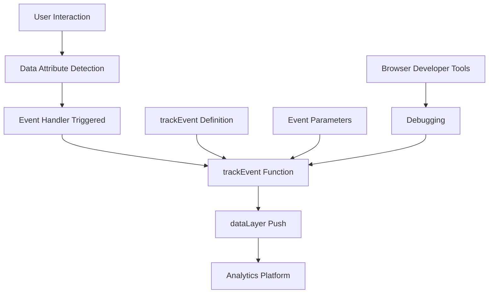
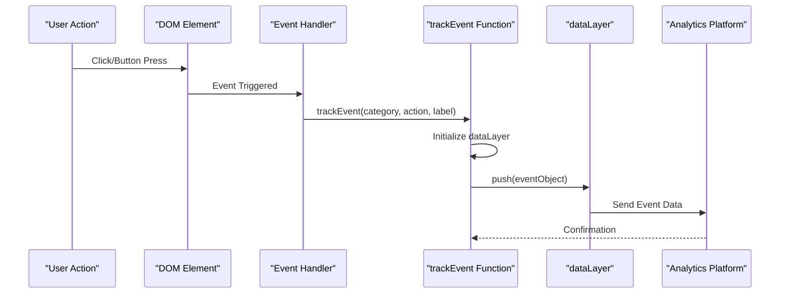
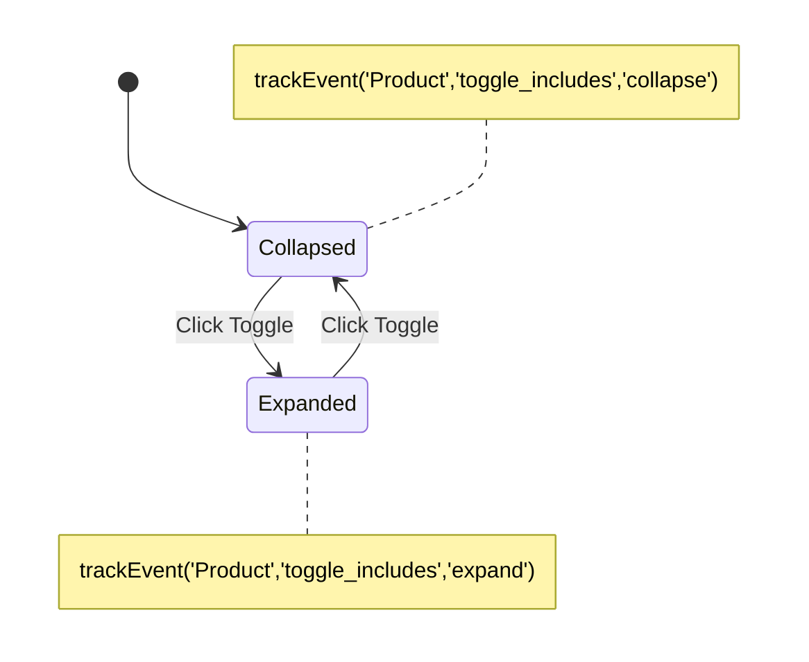
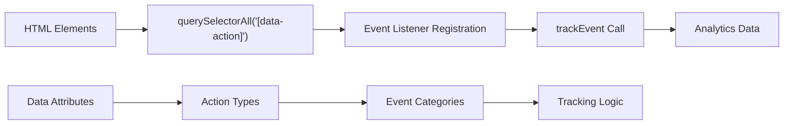

# Event Tracking Implementation Documentation

<cite>
**Referenced Files in This Document**
- [assets/main.js](file://assets/main.js)
- [index.html](file://index.html)
- [portfolio.html](file://portfolio.html)
- [price.html](file://price.html)
- [contact.html](file://contact.html)
- [assets/styles.css](file://assets/styles.css)
- [README.md](file://README.md)
</cite>

## Table of Contents
1. [Introduction](#introduction)
2. [Event Tracking Architecture](#event-tracking-architecture)
3. [trackEvent Function Implementation](#trackevent-function-implementation)
4. [Tracked Interactions](#tracked-interactions)
5. [Data Attribute System](#data-attribute-system)
6. [Event Parameter Structure](#event-parameter-structure)
7. [Debugging Strategies](#debugging-strategies)
8. [Best Practices](#best-practices)
9. [Performance Considerations](#performance-considerations)
10. [Integration with Analytics Platforms](#integration-with-analytics-platforms)

## Introduction

The Knyazev Pro landing site implements a sophisticated event tracking system built around the `trackEvent` function in main.js. This implementation provides comprehensive analytics capabilities for monitoring user interactions across multiple pages, enabling data-driven decision making and conversion optimization.

The tracking system is designed with a modular approach, utilizing data attributes to trigger events and maintaining clean separation between tracking logic and business functionality. This architecture ensures scalability while minimizing performance impact on the user experience.

## Event Tracking Architecture

The event tracking system follows a centralized architecture pattern where all tracking activities funnel through the `trackEvent` function. This design provides several advantages:



**Diagram sources**
- [assets/main.js](file://assets/main.js#L390-L400)

The architecture consists of four primary layers:

1. **Event Triggers**: User interactions that activate tracking
2. **Event Handlers**: JavaScript listeners bound to interactive elements
3. **Track Function**: Centralized event processing logic
4. **Analytics Integration**: Platform-specific implementations

**Section sources**
- [assets/main.js](file://assets/main.js#L390-L400)

## trackEvent Function Implementation

The core tracking mechanism is implemented through the `trackEvent` function, which serves as the central hub for all analytics events:



**Diagram sources**
- [assets/main.js](file://assets/main.js#L390-L400)

### Function Signature and Implementation

The `trackEvent` function accepts three parameters and integrates with Google Analytics 4 through the dataLayer:

| Parameter | Type | Description | Example |
|-----------|------|-------------|---------|
| `category` | String | Event category grouping | `'CTA'`, `'Product'`, `'Cases'` |
| `action` | String | Specific user action | `'open_mini_brief'`, `'toggle_includes'`, `'filter'` |
| `label` | String | Additional context or identifier | `'button_click'`, `'expand'`, `'industry'` |

### Data Layer Integration

The function maintains compatibility with Google Analytics 4 by pushing standardized event objects to the dataLayer:

```javascript
window.dataLayer = window.dataLayer || [];
window.dataLayer.push({
    event: 'custom_event',
    category: category,
    action: action,
    label: label
});
```

**Section sources**
- [assets/main.js](file://assets/main.js#L390-L400)

## Tracked Interactions

The implementation tracks a comprehensive set of user interactions across all pages, categorized into distinct interaction types:

### Button Click Events

Button click tracking captures user engagement with call-to-action elements:

| Button Type | Category | Action | Label | Purpose |
|-------------|----------|--------|-------|---------|
| Mini Brief | `CTA` | `open_mini_brief` | `button_click` | Lead generation form initiation |
| Open Portfolio | `CTA` | `open_portfolio` | `button_click` | Navigation tracking |
| Scroll to Consultation | `CTA` | `scroll_to_consultation` | `button_click` | Engagement measurement |
| Price Page CTA | `CTA` | `mini_brief` | `button_click` | Cross-page conversion tracking |

### Accordion Toggle Events

Interactive content expansion tracking monitors user engagement with detailed information:



**Diagram sources**
- [assets/main.js](file://assets/main.js#L370-L390)

### Portfolio Filtering Events

Dynamic content filtering tracking enables analysis of user preferences:

| Filter Category | Event Label | Tracking Purpose |
|-----------------|-------------|------------------|
| `industry` | Industry projects | Content preference analysis |
| `brand` | Brand films | Service interest identification |
| `events` | Event videos | Engagement pattern recognition |
| `travel` | Travel content | Niche audience targeting |
| `sport` | Sports cars | Automotive segment interest |
| `pr` | PR videos | Marketing service popularity |
| `all` | All projects | Comprehensive portfolio access |

**Section sources**
- [assets/main.js](file://assets/main.js#L100-L110)
- [assets/main.js](file://assets/main.js#L370-L390)

## Data Attribute System

The event tracking system utilizes a declarative approach through data attributes, allowing non-technical team members to configure tracking without code modifications:

### Data Attribute Pattern

Elements triggering events are identified using the `data-action` attribute pattern:

```html
<button data-action="mini-brief">Заполнить мини‑бриф</button>
<button data-action="open-portfolio">Смотреть портфолио</button>
<button data-action="scroll-to-consultation">Получить расчет</button>
```

### Attribute-Based Event Binding

The JavaScript implementation automatically binds event listeners to elements with data attributes:



**Diagram sources**
- [assets/main.js](file://assets/main.js#L60-L80)

### Dynamic Event Registration

The system employs dynamic event registration to handle both existing and future interactive elements:

**Section sources**
- [assets/main.js](file://assets/main.js#L60-L80)
- [assets/main.js](file://assets/main.js#L100-L110)

## Event Parameter Structure

The event tracking system implements a standardized parameter structure that ensures consistency across all tracked interactions:

### Standard Event Object

Each tracked event follows a consistent object structure:

| Field | Purpose | Implementation |
|-------|---------|----------------|
| `event` | Event identifier | `'custom_event'` |
| `category` | Grouping dimension | `'CTA'`, `'Product'`, `'Cases'` |
| `action` | Specific action | `'open_mini_brief'`, `'toggle_includes'`, `'filter'` |
| `label` | Contextual information | `'button_click'`, `'expand'`, `'industry'` |

### Parameter Construction Patterns

Different interaction types utilize specific parameter construction patterns:

#### CTA Events
```javascript
trackEvent('CTA', 'action_type', 'button_click');
```

#### Product Interactions
```javascript
trackEvent('Product', 'interaction_type', expanded_state);
```

#### Portfolio Interactions
```javascript
trackEvent('Cases', 'filter_action', selected_category);
```

**Section sources**
- [assets/main.js](file://assets/main.js#L390-L400)

## Debugging Strategies

Effective debugging of the event tracking system requires familiarity with browser developer tools and analytics platform interfaces:

### Browser Developer Tools Inspection

#### Console Monitoring
Monitor the browser console for tracking-related messages and errors:

```javascript
// Check dataLayer initialization
console.log('dataLayer:', window.dataLayer);

// Verify event push
window.dataLayer.push = function(event) {
    console.log('Event pushed:', event);
    // Original implementation
    return originalPush.apply(this, arguments);
};
```

#### Network Request Analysis
Inspect network requests to ensure dataLayer pushes are reaching analytics platforms:

1. Open Developer Tools (F12)
2. Navigate to Network tab
3. Filter by XHR/Fetch requests
4. Look for Google Analytics endpoints

### Analytics Platform Verification

#### Google Tag Manager Debugging
Enable Google Tag Manager's debug mode for real-time event verification:

1. Install Google Tag Assistant browser extension
2. Enable debug mode in GTM interface
3. Monitor tag firing in real-time

#### GA4 Event Validation
Verify event delivery to Google Analytics 4:

```javascript
// Add to trackEvent function for debugging
console.log('Tracking event:', {category, action, label});
```

### Common Debugging Scenarios

| Issue | Symptoms | Debugging Steps |
|-------|----------|-----------------|
| Events not firing | No console logs | Check data attributes, verify JavaScript loading |
| Incorrect parameters | Wrong category/action | Inspect event object structure |
| Missing analytics | No network requests | Verify GTM/GA4 implementation |
| Performance impact | Slow page loading | Profile event handler execution time |

**Section sources**
- [assets/main.js](file://assets/main.js#L390-L400)

## Best Practices

Implementing effective event tracking requires adherence to established best practices that ensure reliable data collection and maintain system performance:

### Naming Conventions

#### Event Category Structure
Organize events into logical categories that reflect business objectives:

- **CTA**: Call-to-action elements and conversions
- **Product**: Service and product information interactions
- **Cases**: Portfolio and project exploration
- **Navigation**: Site navigation and page transitions

#### Action Naming Standards
Use consistent, descriptive action names:

```javascript
// Good practice
trackEvent('CTA', 'open_mini_brief', 'button_click');
trackEvent('Product', 'toggle_includes', 'expand');
trackEvent('Cases', 'filter', 'industry');

// Avoid
trackEvent('Click', 'brief', 'open');
trackEvent('Expand', 'includes', 'true');
trackEvent('Filter', 'cat', 'ind');
```

### Event Granularity

#### Level of Detail
Balance event specificity with data quality:

- **Too Broad**: `trackEvent('click', 'button', 'general')`
- **Optimal**: `trackEvent('CTA', 'open_form', 'contact_button')`
- **Too Specific**: `trackEvent('CTA', 'click', 'contact_button_123')`

#### Context Preservation
Maintain contextual information for meaningful analysis:

```javascript
// Include relevant context
trackEvent('Product', 'view_details', 'premium_package');
trackEvent('Cases', 'view_project', 'brand_film_001');
```

### Privacy and Compliance

#### GDPR Considerations
Ensure compliance with privacy regulations:

- Obtain user consent before tracking
- Implement opt-out mechanisms
- Minimize personal data collection
- Provide data deletion capabilities

#### Data Retention
Establish appropriate data retention policies:

- Define event data storage periods
- Implement automatic data cleanup
- Maintain audit trails for compliance

**Section sources**
- [assets/main.js](file://assets/main.js#L390-L400)

## Performance Considerations

High-frequency event tracking must balance data collection with user experience performance:

### Event Throttling

#### Rate Limiting
Implement throttling for high-frequency interactions:

```javascript
// Debounce rapid events
let lastEventTime = 0;
const debounceDelay = 1000; // 1 second

function trackEventWithThrottle(category, action, label) {
    const currentTime = Date.now();
    if (currentTime - lastEventTime > debounceDelay) {
        trackEvent(category, action, label);
        lastEventTime = currentTime;
    }
}
```

#### Batch Processing
Group related events for efficient transmission:

```javascript
// Batch multiple events
const eventQueue = [];
const batchSize = 10;
const batchDelay = 5000;

function queueEvent(category, action, label) {
    eventQueue.push({category, action, label});
    
    if (eventQueue.length >= batchSize) {
        flushEvents();
    } else if (eventQueue.length === 1) {
        setTimeout(flushEvents, batchDelay);
    }
}

function flushEvents() {
    const events = [...eventQueue];
    eventQueue.length = 0;
    // Process all queued events
}
```

### Memory Management

#### Event Listener Cleanup
Properly manage event listener lifecycle:

```javascript
// Remove listeners when elements are destroyed
const observer = new MutationObserver((mutations) => {
    mutations.forEach(mutation => {
        mutation.removedNodes.forEach(node => {
            // Clean up event listeners for removed nodes
        });
    });
});
```

#### Data Structure Optimization
Use efficient data structures for event storage:

```javascript
// Use WeakMap for temporary event data
const eventContext = new WeakMap();

// Store minimal context information
eventContext.set(element, {timestamp: Date.now(), count: 0});
```

### Resource Impact Mitigation

#### Network Efficiency
Minimize network overhead:

- Compress event data
- Use connection pooling
- Implement retry logic with exponential backoff

#### CPU Usage Optimization
Reduce computational impact:

- Use requestAnimationFrame for visual events
- Implement lazy loading for tracking scripts
- Optimize event handler execution time

**Section sources**
- [assets/main.js](file://assets/main.js#L390-L400)

## Integration with Analytics Platforms

The event tracking system is designed for seamless integration with multiple analytics platforms, with Google Analytics 4 as the primary implementation:

### Google Analytics 4 Integration

#### Standard Event Configuration
Configure GA4 to recognize custom events:

```javascript
// GA4 event configuration
gtag('event', 'custom_event', {
    'category': 'CTA',
    'action': 'open_mini_brief',
    'label': 'button_click'
});
```

#### Enhanced Measurement
Enable enhanced measurement for automatic event tracking:

```javascript
// Configure enhanced measurement
gtag('set', {'send_page_view': false});
```

### Multi-Platform Support

#### Yandex.Metrika Integration
Extend tracking to Yandex.Metrika:

```javascript
// Yandex.Metrika integration
function trackEvent(category, action, label) {
    window.dataLayer = window.dataLayer || [];
    window.dataLayer.push({event: 'custom_event', category, action, label});
    
    // Yandex.Metrika support
    if (window.ym) {
        ym(YOUR_COUNTER_ID, 'reachGoal', action, {category, label});
    }
}
```

#### Custom Analytics Solutions
Support proprietary analytics systems:

```javascript
// Custom analytics integration
function trackEvent(category, action, label) {
    // Standard implementation
    window.dataLayer.push({event: 'custom_event', category, action, label});
    
    // Custom analytics endpoint
    fetch('/analytics/event', {
        method: 'POST',
        body: JSON.stringify({category, action, label}),
        headers: {'Content-Type': 'application/json'}
    });
}
```

### Data Quality Assurance

#### Event Validation
Implement client-side validation:

```javascript
function trackEvent(category, action, label) {
    // Validate parameters
    if (!category || !action) {
        console.warn('Invalid event parameters:', {category, action, label});
        return;
    }
    
    // Log to dataLayer
    window.dataLayer.push({event: 'custom_event', category, action, label});
}
```

#### Error Handling
Implement robust error handling:

```javascript
function trackEvent(category, action, label) {
    try {
        // Track event logic
        window.dataLayer.push({event: 'custom_event', category, action, label});
    } catch (error) {
        console.error('Event tracking failed:', error);
        // Fallback logging
        if (navigator.sendBeacon) {
            navigator.sendBeacon('/analytics/error', JSON.stringify({
                error: error.message,
                stack: error.stack
            }));
        }
    }
}
```

**Section sources**
- [assets/main.js](file://assets/main.js#L390-L400)