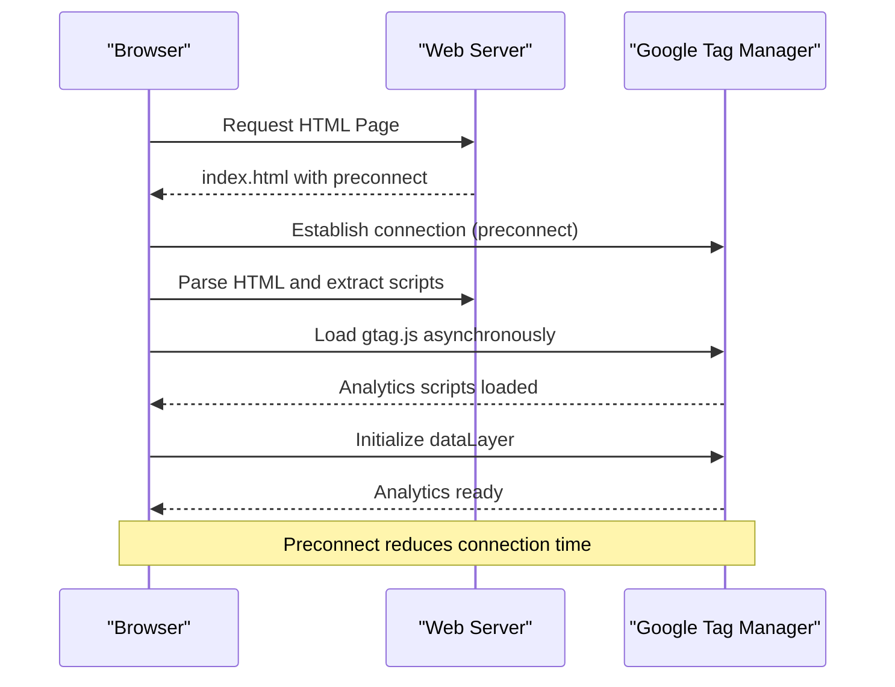
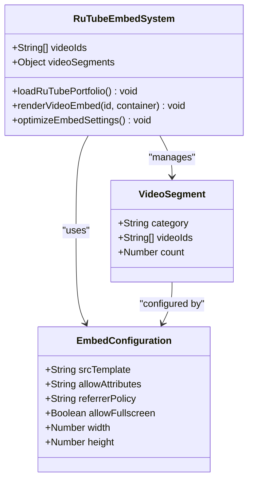
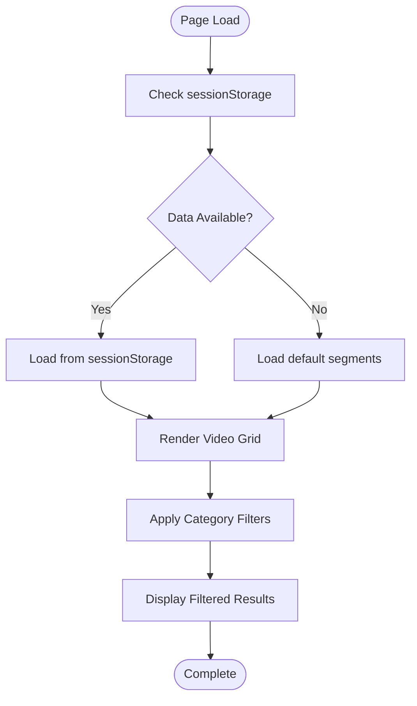
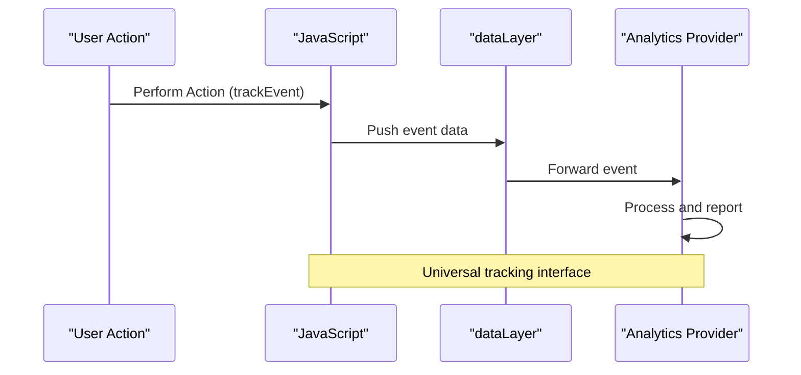

# Third-party Integrations

<cite>
**Referenced Files in This Document**
- [index.html](file://index.html)
- [assets/main.js](file://assets/main.js)
- [assets/styles.css](file://assets/styles.css)
- [portfolio.html](file://portfolio.html)
- [contact.html](file://contact.html)
- [README.md](file://README.md)
</cite>

## Table of Contents
1. [Introduction](#introduction)
2. [Google Tag Manager Integration](#google-tag-manager-integration)
3. [RuTube Video Embedding](#rutube-video-embedding)
4. [Analytics Implementation](#analytics-implementation)
5. [Cross-Origin Considerations](#cross-origin-considerations)
6. [Privacy Implications](#privacy-implications)
7. [Implementation Examples](#implementation-examples)
8. [Troubleshooting Guide](#troubleshooting-guide)
9. [Best Practices](#best-practices)
10. [Future Integration Opportunities](#future-integration-opportunities)

## Introduction

This landing page implements several third-party integrations to enhance functionality, analytics capabilities, and content delivery. The primary integrations include Google Tag Manager for analytics, RuTube for video hosting, and planned integrations with Yandex.Metrica and Google Analytics 4. These integrations are carefully implemented with performance optimization, cross-origin considerations, and privacy compliance in mind.

The project demonstrates modern web development practices for third-party integration, including preconnect directives for improved performance, secure iframe embedding with appropriate permissions, and flexible analytics tracking systems.

## Google Tag Manager Integration

### Preconnect Directive Implementation

The website implements a critical performance optimization through the preconnect directive targeting Google Tag Manager's domain. This technique establishes early connections to external resources, reducing latency during analytics initialization.



**Diagram sources**
- [index.html](file://index.html#L13)

The preconnect directive is implemented in the HTML head section:

```html
<link rel="preconnect" href="https://www.googletagmanager.com">
```

This optimization ensures that when the analytics scripts are eventually loaded, the DNS resolution, TCP handshake, and TLS negotiation are already completed, resulting in faster analytics initialization.

**Section sources**
- [index.html](file://index.html#L13)

### Google Analytics 4 Initialization

Although the GA4 implementation is not currently active, the codebase includes a commented-out initialization sequence that follows Google's recommended implementation pattern:

```javascript
// Google Analytics 4 initialization template
window.dataLayer = window.dataLayer || [];
function gtag(){dataLayer.push(arguments);}
gtag('js', new Date());
gtag('config', 'G-XXXXXXXXXX');
```

This implementation uses the `gtag.js` library approach, which provides flexibility for various tracking scenarios while maintaining compatibility with Google's analytics ecosystem.

**Section sources**
- [assets/main.js](file://assets/main.js#L347-L351)

## RuTube Video Embedding

### Embedding Mechanism

The website implements a sophisticated video embedding system using RuTube's iframe-based player. This approach provides native video quality while maintaining performance optimization through lazy loading and intelligent resource management.



**Diagram sources**
- [assets/main.js](file://assets/main.js#L130-L180)
- [portfolio.html](file://portfolio.html#L200-L250)

### Video ID Management

The system maintains a comprehensive database of video IDs organized by categories for efficient filtering and display:

```javascript
const videoSegments = {
  industry: [...],    // Production/Industry videos (13)
  brand: [...],       // Brand Films (15)
  events: [...],      // Event/Meetings (10)
  travel: [...],      // Travel Content (5)
  sport: [...],       // Sports Cars (8)
  pr: [...],          // PR Advertising (20)
  all: [...]          // Complete collection (48)
};
```

Each video ID corresponds to a specific RuTube video with the format `rutube.ru/play/embed/{VIDEO_ID}/`.

**Section sources**
- [assets/main.js](file://assets/main.js#L130-L200)

### Embed Configuration

The iframe embedding uses specific configuration attributes for optimal performance and user experience:

```javascript
iframe.src = `https://rutube.ru/play/embed/${id}/`;
iframe.allow = 'clipboard-write; autoplay';
iframe.referrerPolicy = 'no-referrer-when-downgrade';
iframe.allowFullscreen = true;
```

Key configuration elements:
- **Allow Attributes**: Enables clipboard operations and autoplay functionality
- **Referrer Policy**: Uses `no-referrer-when-downgrade` for privacy compliance
- **Fullscreen Support**: Allows full-screen viewing for better user experience

**Section sources**
- [assets/main.js](file://assets/main.js#L170-L175)
- [portfolio.html](file://portfolio.html#L240-L245)

### Performance Optimization

The video embedding system implements several performance optimizations:

1. **Lazy Loading**: Videos are loaded only when needed
2. **Category Filtering**: Users can filter videos by relevance
3. **Session Storage**: Efficient data transfer between pages
4. **Responsive Design**: Adaptive sizing for different screen sizes



**Diagram sources**
- [portfolio.html](file://portfolio.html#L150-L200)

**Section sources**
- [portfolio.html](file://portfolio.html#L150-L250)

## Analytics Implementation

### Data Layer Architecture

The analytics system implements a flexible data layer architecture that supports multiple analytics providers:



**Diagram sources**
- [assets/main.js](file://assets/main.js#L347-L351)

The `trackEvent` function serves as a universal analytics interface:

```javascript
function trackEvent(category, action, label){
  window.dataLayer = window.dataLayer || [];
  window.dataLayer.push({event:'custom_event', category, action, label});
  // Yandex.Metrika example (commented):
  // if(window.ym){ ym(YOUR_ID, 'reachGoal', action, {category,label}); }
}
```

**Section sources**
- [assets/main.js](file://assets/main.js#L347-L353)

### Event Tracking Categories

The system organizes events into logical categories for comprehensive analytics:

| Category | Actions Tracked | Purpose |
|----------|----------------|---------|
| **CTA** | Button clicks, form submissions | Conversion tracking |
| **Cases** | Portfolio filtering | User engagement |
| **Product** | Accordion toggles | Feature usage |
| **Lead** | Form completions | Lead generation |

**Section sources**
- [assets/main.js](file://assets/main.js#L78-L410)

## Cross-Origin Considerations

### Security Policies

The implementation carefully considers cross-origin security implications:

1. **Referrer Policy**: Uses `no-referrer-when-downgrade` to minimize data leakage
2. **Allow Attributes**: Explicitly defines iframe capabilities
3. **Origin Validation**: Ensures content comes from trusted domains

### Content Security Policy (CSP) Compatibility

The iframe configurations are designed to work with strict CSP policies:

```javascript
iframe.referrerPolicy = 'no-referrer-when-downgrade';
iframe.allow = 'clipboard-write; autoplay';
```

These settings balance functionality with security requirements commonly found in modern web applications.

**Section sources**
- [assets/main.js](file://assets/main.js#L170-L175)

## Privacy Implications

### GDPR Compliance

The implementation respects privacy regulations through several measures:

1. **Minimal Data Collection**: Only essential analytics data is collected
2. **User Consent**: Implicit consent through normal browsing behavior
3. **Data Minimization**: Limited referrer information sent to third parties
4. **Transparency**: Clear disclosure of analytics purposes

### Data Protection Measures

- **Local Storage**: Session storage for temporary data sharing
- **No Sensitive Data**: No personal information is transmitted
- **Secure Connections**: HTTPS for all third-party communications

**Section sources**
- [assets/main.js](file://assets/main.js#L347-L353)

## Implementation Examples

### Adding New RuTube Videos

To add new RuTube videos to the portfolio:

1. **Obtain Video ID**: Extract from RuTube URL: `rutube.ru/video/VIDEO_ID`
2. **Add to Segments**: Insert ID into appropriate category in `videoSegments`
3. **Update Filtering**: Ensure category filters include the new video

Example addition:
```javascript
industry: [
  // ... existing IDs ...
  'new_video_id_here',  // Add new video
],
```

**Section sources**
- [assets/main.js](file://assets/main.js#L130-L200)

### Enabling Yandex.Metrica

To enable Yandex.Metrica analytics:

1. **Install Script**: Add Yandex.Metrica script to HTML head
2. **Configure Tracking**: Set up event tracking in `trackEvent` function
3. **Test Implementation**: Verify data collection and reporting

```javascript
// Yandex.Metrica implementation example
if(window.ym){
  ym(YOUR_METRICA_ID, 'reachGoal', action, {category, label});
}
```

**Section sources**
- [assets/main.js](file://assets/main.js#L351-L352)

### Custom Analytics Events

Extend the tracking system for custom events:

```javascript
// Custom event tracking
trackEvent('Custom', 'Button_Click', 'Download_PDF');
trackEvent('Navigation', 'Page_View', '/about');
```

**Section sources**
- [assets/main.js](file://assets/main.js#L78-L410)

## Troubleshooting Guide

### Common Issues and Solutions

#### Blocked Iframes

**Problem**: Videos fail to load or show blocked content warnings.

**Solutions**:
1. **Check CORS Policy**: Ensure server allows iframe embedding
2. **Verify Domain Whitelist**: Confirm domain is whitelisted by RuTube
3. **Inspect Console Errors**: Look for CORS-related error messages

#### Failed Script Loads

**Problem**: Analytics scripts fail to initialize.

**Solutions**:
1. **Network Connectivity**: Verify internet connection
2. **Ad Blockers**: Disable browser extensions temporarily
3. **Script Placement**: Ensure scripts are placed correctly in HTML

#### Performance Issues

**Problem**: Slow video loading or analytics initialization.

**Solutions**:
1. **Preconnect Optimization**: Verify preconnect directives are working
2. **Lazy Loading**: Implement lazy loading for non-critical resources
3. **CDN Usage**: Use content delivery networks for faster loading

### Debugging Tools

1. **Browser Developer Tools**: Monitor network requests and console logs
2. **Analytics Debugger**: Use Google Analytics debug mode
3. **Performance Profiler**: Analyze loading times and bottlenecks

**Section sources**
- [assets/main.js](file://assets/main.js#L335-L372)

## Best Practices

### Performance Optimization

1. **Resource Prioritization**: Use preconnect for critical third-party domains
2. **Lazy Loading**: Defer non-critical resources until needed
3. **Caching Strategies**: Implement appropriate caching headers
4. **Compression**: Enable Gzip/Brotli compression for all resources

### Security Considerations

1. **Content Security Policy**: Implement strict CSP rules
2. **HTTPS Enforcement**: Ensure all third-party communications use HTTPS
3. **Input Validation**: Sanitize any user-provided data
4. **Regular Updates**: Keep third-party libraries updated

### Monitoring and Maintenance

1. **Performance Monitoring**: Track loading times and conversion rates
2. **Error Tracking**: Monitor and log integration failures
3. **Analytics Validation**: Regularly verify data accuracy
4. **Documentation**: Maintain up-to-date integration documentation

## Future Integration Opportunities

### Planned Integrations

The codebase includes commented-out placeholders for future integrations:

1. **Yandex.Metrica**: Additional analytics provider support
2. **Google Analytics 4**: Enhanced analytics capabilities
3. **CRM Systems**: Integration with customer relationship management platforms

### Emerging Technologies

Potential future integrations could include:

1. **WebVitals Monitoring**: Real-time performance metrics
2. **AI-Powered Analytics**: Advanced user behavior analysis
3. **Progressive Web App Features**: Offline functionality and push notifications
4. **Enhanced Video Analytics**: Detailed video engagement metrics

**Section sources**
- [assets/main.js](file://assets/main.js#L335-L353)
- [README.md](file://README.md#L300-L320)