# Component Architecture

<cite>
**Referenced Files in This Document**
- [index.html](file://index.html)
- [portfolio.html](file://portfolio.html)
- [price.html](file://price.html)
- [contact.html](file://contact.html)
- [founder.html](file://founder.html)
- [assets/styles.css](file://assets/styles.css)
- [assets/main.js](file://assets/main.js)
- [README.md](file://README.md)
</cite>

## Table of Contents
1. [Introduction](#introduction)
2. [Project Structure](#project-structure)
3. [Core Components](#core-components)
4. [Navigation System](#navigation-system)
5. [Interactive Elements](#interactive-elements)
6. [Layout Patterns](#layout-patterns)
7. [Accessibility Implementation](#accessibility-implementation)
8. [Responsive Design](#responsive-design)
9. [Component Instantiation](#component-instantiation)
10. [Best Practices](#best-practices)

## Introduction

The Knyazev Pro landing page implements a sophisticated component architecture built around five main pages: Home (index.html), Portfolio, Pricing, Contact, and Founder. The design system emphasizes reusability, consistency, and accessibility while providing rich interactive experiences through semantic HTML, CSS custom properties, and vanilla JavaScript.

The architecture follows modern web development principles with a mobile-first approach, ensuring optimal performance across all devices including iOS and Android platforms. Each component is designed to be self-contained yet interoperable, allowing for easy maintenance and extension.

## Project Structure

The project maintains a clean separation of concerns with a centralized asset management system:

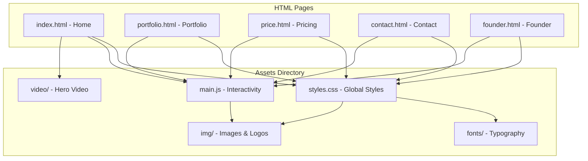

**Diagram sources**
- [index.html](file://index.html#L1-L249)
- [portfolio.html](file://portfolio.html#L1-L388)
- [price.html](file://price.html#L1-L437)
- [contact.html](file://contact.html#L1-L127)
- [founder.html](file://founder.html#L1-L71)

**Section sources**
- [README.md](file://README.md#L150-L200)

## Core Components

### Navigation Header

The navigation system consists of a responsive header with consistent branding across all pages:

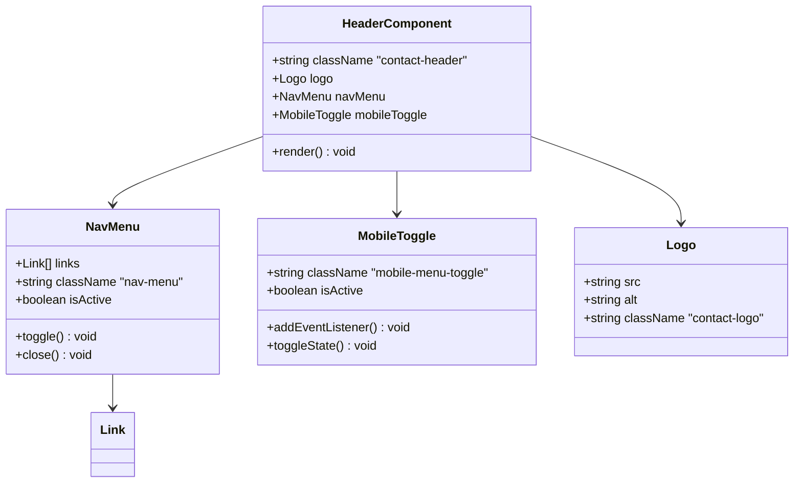

**Diagram sources**
- [index.html](file://index.html#L15-L40)
- [portfolio.html](file://portfolio.html#L15-L35)
- [assets/main.js](file://assets/main.js#L30-L50)

### Hero Section

The hero section serves as the primary content area with video background and CTA buttons:

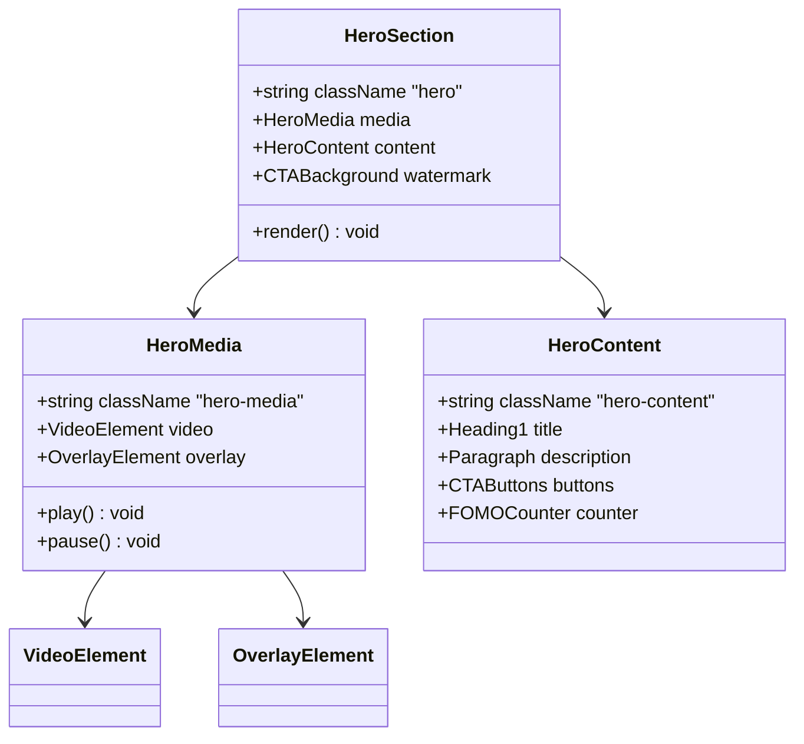

**Diagram sources**
- [index.html](file://index.html#L10-L80)
- [assets/main.js](file://assets/main.js#L1-L20)

### Service Cards

Consistent service presentation across different sections:

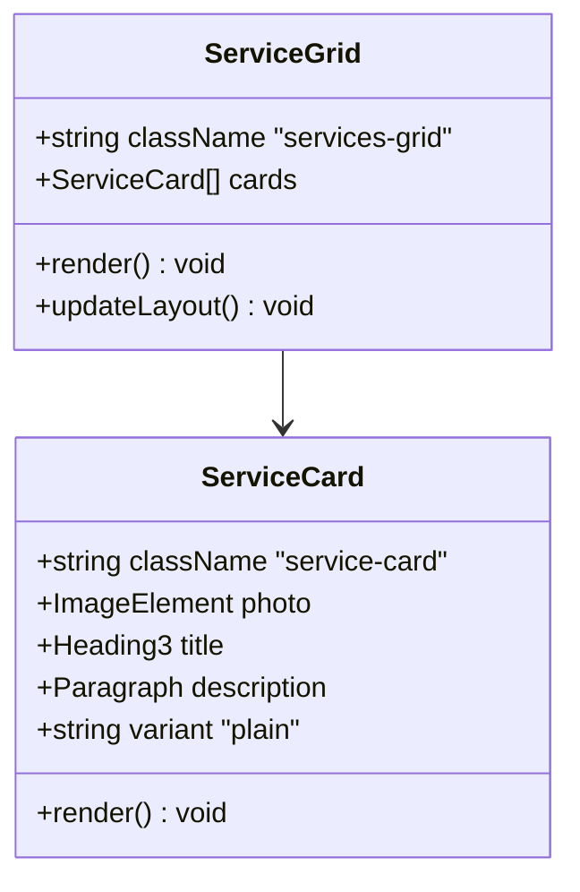

**Diagram sources**
- [index.html](file://index.html#L85-L120)
- [assets/styles.css](file://assets/styles.css#L120-L140)

**Section sources**
- [index.html](file://index.html#L85-L120)
- [assets/styles.css](file://assets/styles.css#L120-L140)

## Navigation System

### Mobile Menu Implementation

The navigation system adapts seamlessly between desktop and mobile views:

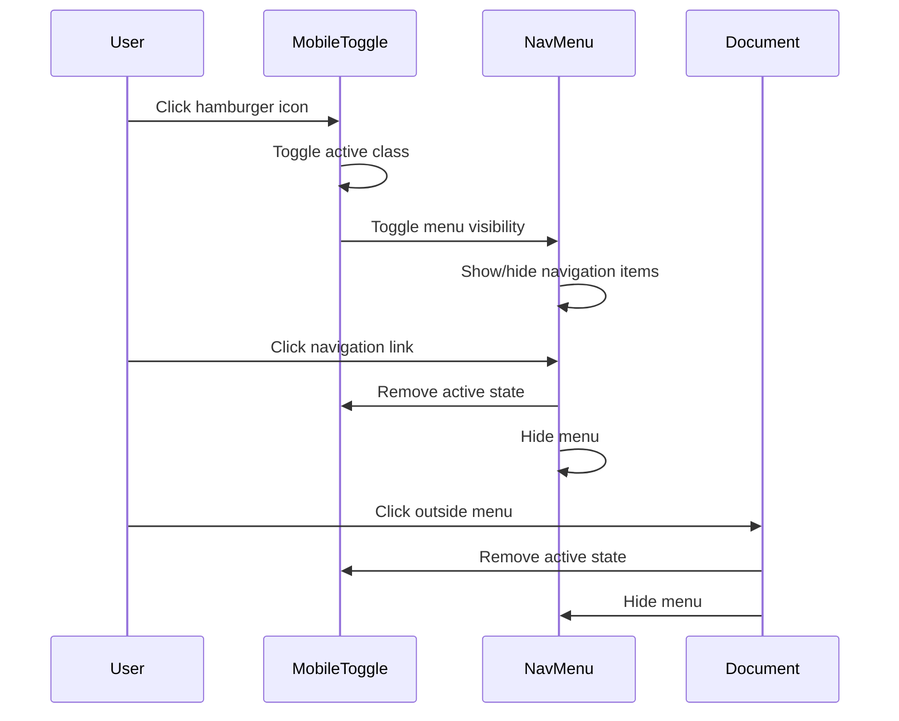

**Diagram sources**
- [assets/main.js](file://assets/main.js#L30-L50)

### Navigation Links

Each page maintains consistent navigation structure with active state management:

| Page | Navigation Items | Active State |
|------|------------------|--------------|
| Home | Главное, Портфолио, Цены, Алексей Князев, Контакты | Current page highlighted |
| Portfolio | Главное, Портфолио, Цены, Алексей Князев, Контакты | Current page highlighted |
| Pricing | Главное, Портфолио, Цены, Алексей Князев, Контакты | Current page highlighted |
| Contact | Главное, Портфолио, Цены, Алексей Князев, Контакты | Current page highlighted |
| Founder | Главное, Портфолио, Цены, Алексей Князев, Контакты | Current page highlighted |

**Section sources**
- [index.html](file://index.html#L25-L35)
- [portfolio.html](file://portfolio.html#L25-L35)
- [assets/main.js](file://assets/main.js#L30-L50)

## Interactive Elements

### Modal System

The modal implementation uses native HTML dialog with custom styling:

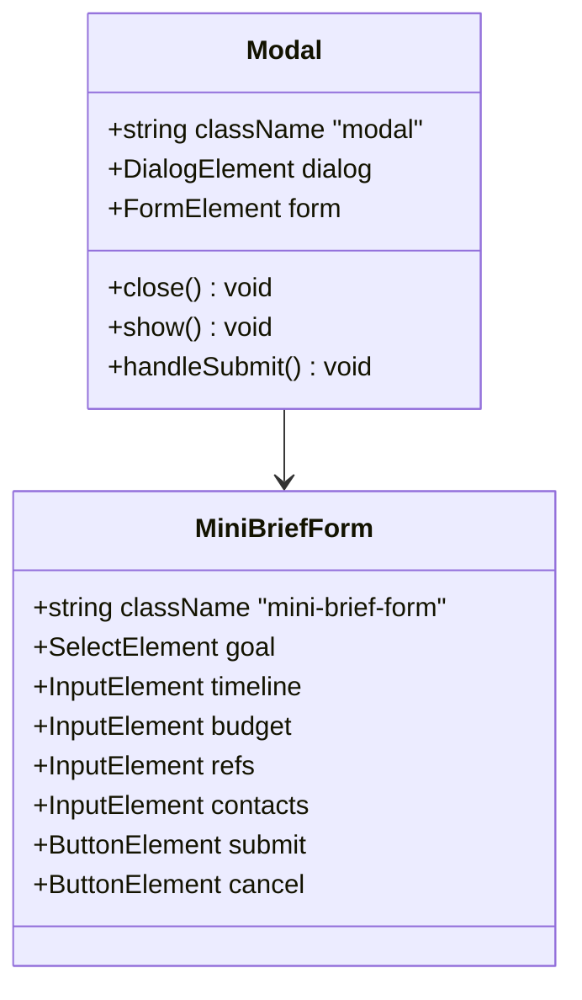

**Diagram sources**
- [index.html](file://index.html#L220-L250)
- [assets/main.js](file://assets/main.js#L60-L80)

### Accordion Components

Product details use expandable accordion panels:

```mermaid
flowchart TD
A[Accordion Button] --> B{Is Expanded?}
B --> |Yes| C[Collapse Panel]
B --> |No| D[Expand Panel]
C --> E[Set aria-expanded="false"]
D --> F[Set aria-expanded="true"]
E --> G[Remove expanded class]
F --> H[Add expanded class]
G --> I[Rotate icon -90°]
H --> J[Rotate icon +90°]
```

**Diagram sources**
- [assets/main.js](file://assets/main.js#L350-L380)

### Filter System

Portfolio filtering demonstrates dynamic content manipulation:

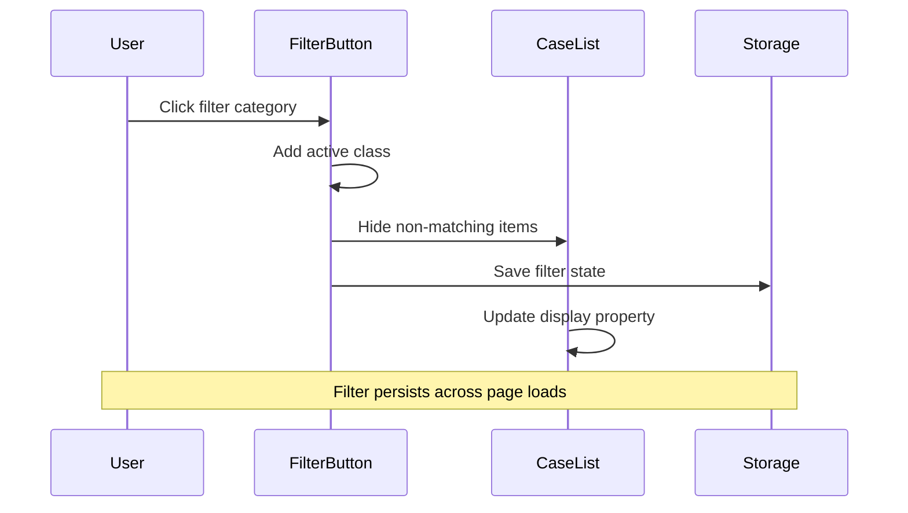

**Diagram sources**
- [assets/main.js](file://assets/main.js#L120-L150)
- [portfolio.html](file://portfolio.html#L40-L80)

**Section sources**
- [index.html](file://index.html#L220-L250)
- [assets/main.js](file://assets/main.js#L60-L80)
- [assets/main.js](file://assets/main.js#L350-L380)
- [assets/main.js](file://assets/main.js#L120-L150)

## Layout Patterns

### Grid Systems

The design employs CSS Grid for flexible layouts:

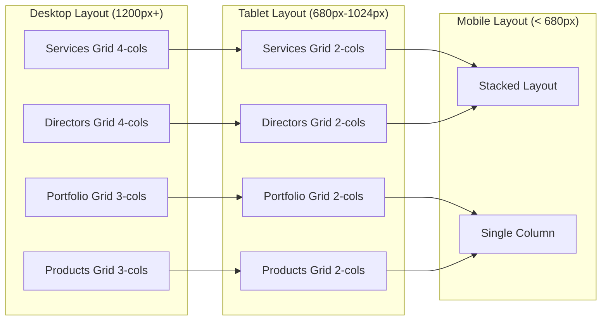

**Diagram sources**
- [assets/styles.css](file://assets/styles.css#L120-L180)

### Two-Column Layout

Consistent content pairing pattern:

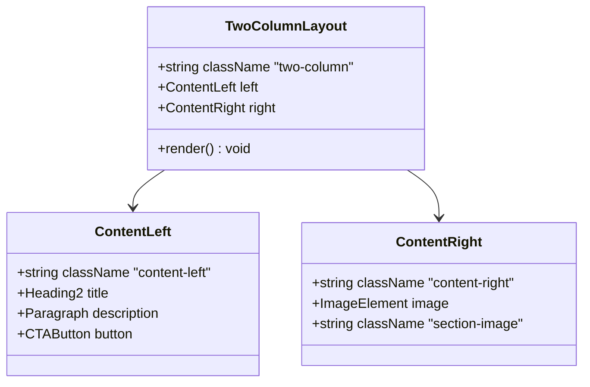

**Diagram sources**
- [index.html](file://index.html#L130-L160)
- [assets/styles.css](file://assets/styles.css#L80-L100)

**Section sources**
- [assets/styles.css](file://assets/styles.css#L120-L180)
- [index.html](file://index.html#L130-L160)

## Accessibility Implementation

### ARIA Attributes

Comprehensive ARIA support ensures accessibility compliance:

| Component | ARIA Attributes | Purpose |
|-----------|----------------|---------|
| Mobile Menu | `aria-label="Меню"` | Screen reader identification |
| Accordions | `aria-expanded` | State indication |
| Forms | `aria-describedby` | Error message association |
| Modals | `role="dialog"` | Dialog role recognition |
| Navigation | `aria-current="page"` | Current page indication |

### Keyboard Navigation

All interactive elements support keyboard navigation:

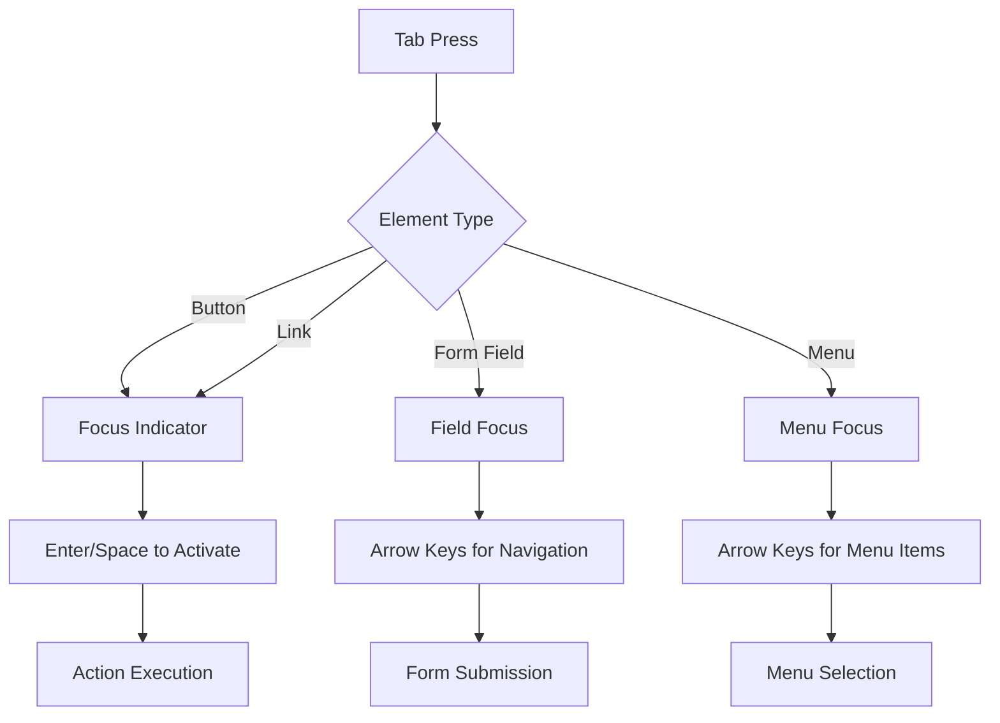

**Diagram sources**
- [assets/main.js](file://assets/main.js#L30-L50)

### Semantic HTML Structure

Each page follows semantic markup principles:

```html
<header class="contact-header">
  <nav class="contact-nav">
    <div class="contact-brand">
      <a href="index.html">
        
      </a>
    </div>
    <button class="mobile-menu-toggle" aria-label="Меню">
      <span></span>
      <span></span>
      <span></span>
    </button>
    <ul class="nav-menu" id="navMenu">
      <li><a href="index.html">Главное</a></li>
      <!-- ... -->
    </ul>
  </nav>
</header>
```

**Section sources**
- [index.html](file://index.html#L15-L40)
- [assets/main.js](file://assets/main.js#L30-L50)

## Responsive Design

### Breakpoint Strategy

The responsive system uses strategic breakpoints for optimal viewing:

| Breakpoint | Max Width | Layout Pattern | Components Affected |
|------------|-----------|----------------|-------------------|
| Desktop | 1024px+ | Full grid | All components |
| Tablet | 680px-1024px | Reduced grid | Services, Portfolio, Products |
| Mobile | < 680px | Stacked | All components |

### Mobile Optimizations

Specific optimizations for mobile devices:

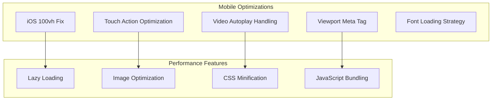

**Diagram sources**
- [assets/styles.css](file://assets/styles.css#L15-L25)
- [assets/main.js](file://assets/main.js#L1-L20)

**Section sources**
- [assets/styles.css](file://assets/styles.css#L15-L25)
- [assets/main.js](file://assets/main.js#L1-L20)

## Component Instantiation

### JavaScript Component Initialization

Components are initialized through modular JavaScript:

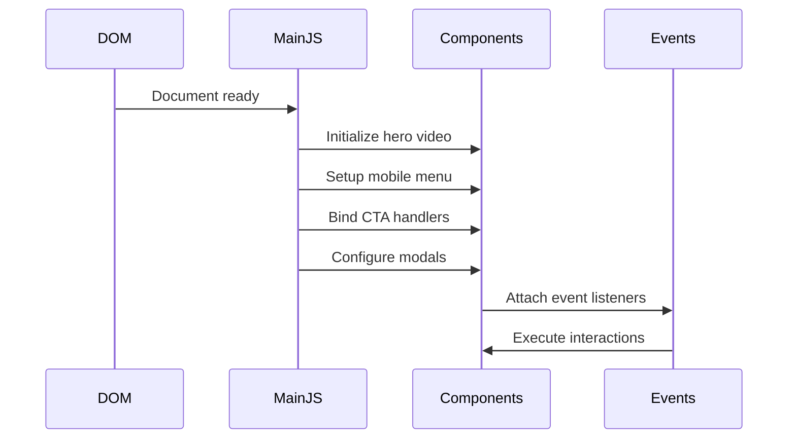

**Diagram sources**
- [assets/main.js](file://assets/main.js#L1-L50)

### CSS Custom Properties

Shared styling system using CSS custom properties:

```css
:root {
  --bg: #0A0A0A;
  --bg-2: #181818;
  --text: #E0E0E0;
  --brand: #B09B7E;
  --line: #4F4F4F;
  --muted: #8F8F8F;
}
```

**Section sources**
- [assets/main.js](file://assets/main.js#L1-L50)
- [assets/styles.css](file://assets/styles.css#L1-L10)

## Best Practices

### Component Reusability

Each component follows the principle of minimal coupling:

- **Self-contained**: Components manage their own state and behavior
- **Prop-driven**: Configuration through data attributes and classes
- **Event-driven**: Communication through DOM events
- **Testable**: Clear separation of concerns enables testing

### Performance Optimization

Key performance strategies:

- **Critical CSS**: Inline essential styles for above-the-fold content
- **Lazy Loading**: Deferred script loading and conditional resource loading
- **Asset Optimization**: Compressed images and minified CSS/JS
- **Efficient Selectors**: Specificity-aware CSS selector patterns

### Maintenance Guidelines

- **Consistent Naming**: BEM-like class naming convention
- **Modular Structure**: Separate concerns into logical modules
- **Documentation**: Inline comments for complex interactions
- **Version Control**: Atomic commits with clear descriptions

**Section sources**
- [assets/styles.css](file://assets/styles.css#L1-L50)
- [assets/main.js](file://assets/main.js#L1-L50)