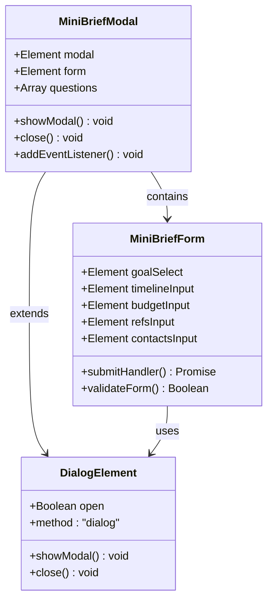
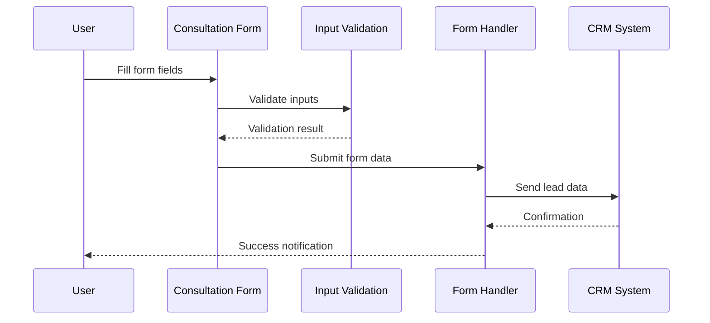
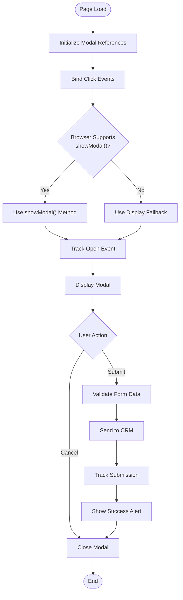
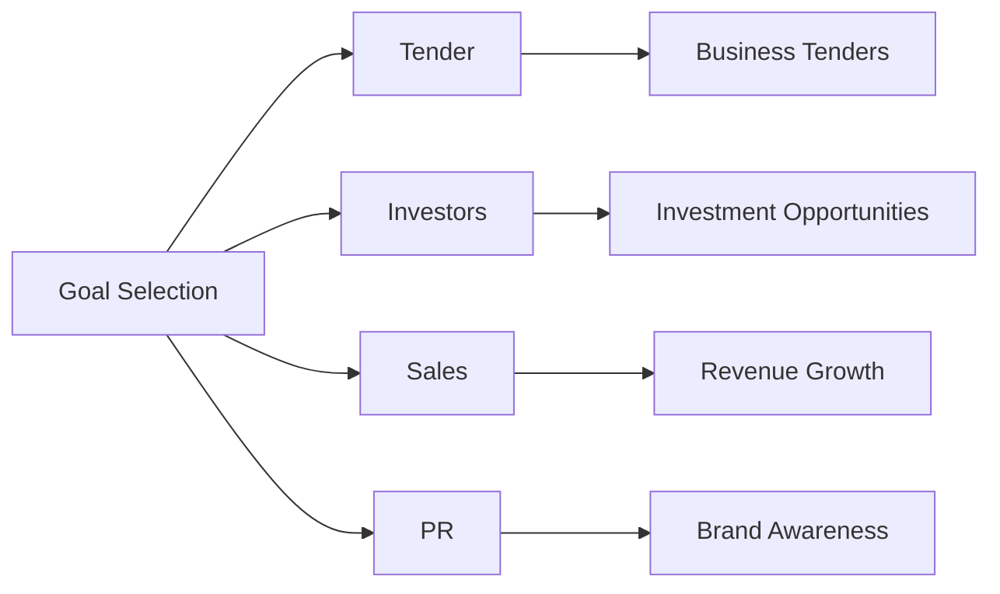
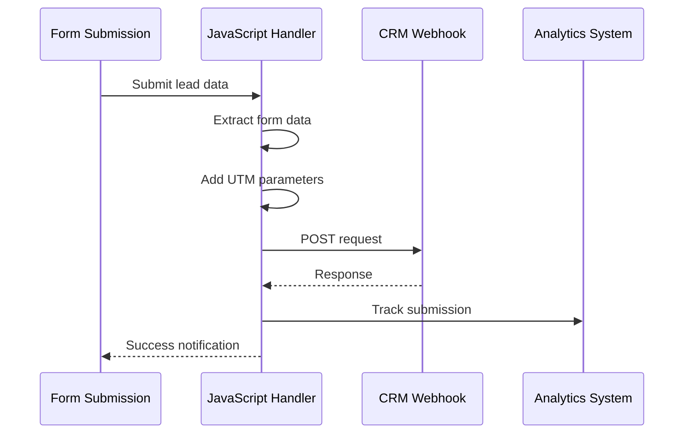

# Form Components

<cite>
**Referenced Files in This Document**
- [index.html](file://index.html)
- [assets/main.js](file://assets/main.js)
- [assets/styles.css](file://assets/styles.css)
- [contact.html](file://contact.html)
</cite>

## Table of Contents
1. [Introduction](#introduction)
2. [Mini-Brief Modal Dialog System](#mini-brief-modal-dialog-system)
3. [Consultation Form Implementation](#consultation-form-implementation)
4. [JavaScript Functionality](#javascript-functionality)
5. [Accessibility Features](#accessibility-features)
6. [Form Field Customization](#form-field-customization)
7. [CRM Integration](#crm-integration)
8. [Mobile Responsiveness](#mobile-responsiveness)
9. [Troubleshooting Guide](#troubleshooting-guide)
10. [Best Practices](#best-practices)

## Introduction

The form component system in this landing page implementation consists of two primary form interfaces designed for lead generation and consultation requests. The system features a modern mini-brief modal dialog for quick lead capture and a comprehensive consultation form for detailed project inquiries. Both forms incorporate responsive design principles, accessibility features, and seamless CRM integration.

The implementation demonstrates best practices in form design, including proper labeling, validation, error handling, and user experience optimization. The system is built with progressive enhancement, ensuring functionality across different browsers and devices while providing enhanced experiences for modern browsers.

## Mini-Brief Modal Dialog System

### HTML Structure and Implementation

The mini-brief modal dialog is implemented using the native HTML `<dialog>` element, providing semantic markup and improved accessibility. The modal contains five essential form fields designed to quickly capture lead information for video production projects.

**Diagram sources**
- [index.html](file://index.html#L200-L220)
- [assets/main.js](file://assets/main.js#L60-L80)

### Form Control Types

The mini-brief form utilizes five distinct input types, each serving a specific purpose in lead qualification:

| Field Type | Purpose | Validation | Accessibility Features |
|------------|---------|------------|----------------------|
| Select Dropdown | Goal identification | Required | Screen reader support |
| Text Input | Timeline specification | Required | Placeholder guidance |
| Text Input | Budget estimation | Required | Input hints |
| URL Input | Reference materials | Optional | URL validation |
| Text Input | Contact information | Required | Format assistance |

### Dialog Element Implementation

The modal uses the native HTML dialog element with graceful degradation for older browsers. The implementation includes both modern showModal() method and fallback display manipulation for compatibility.

**Section sources**
- [index.html](file://index.html#L200-L220)
- [assets/main.js](file://assets/main.js#L60-L85)

## Consultation Form Implementation

### Home Page Form Structure

The consultation form on the homepage provides a comprehensive interface for detailed project inquiries. Unlike the mini-brief form, it captures extensive information about client needs and project specifics.

**Diagram sources**
- [index.html](file://index.html#L180-L190)
- [assets/main.js](file://assets/main.js#L400-L418)

### Input Field Specifications

The consultation form includes six input fields with varying validation requirements:

| Field | Type | Required | Purpose | Validation Rules |
|-------|------|----------|---------|------------------|
| Name | Text | Yes | Personal identification | Non-empty string |
| Email | Email | Yes | Communication channel | Valid email format |
| Company | Text | No | Business identification | Optional text |
| Phone | Tel | Yes | Direct contact | Required field |
| Message | Textarea | No | Additional details | Optional content |
| Submit Button | Button | N/A | Form submission | Trigger validation |

**Section sources**
- [index.html](file://index.html#L180-L190)

## JavaScript Functionality

### Modal Management System

The JavaScript implementation provides comprehensive modal management with event handling, fallback support, and analytics tracking. The system handles both modern dialog elements and legacy browser compatibility.

**Diagram sources**
- [assets/main.js](file://assets/main.js#L60-L85)
- [assets/main.js](file://assets/main.js#L400-L418)

### Form Submission Handling

The form submission process includes data collection, validation, CRM integration, and user feedback. The implementation uses FormData API for efficient data extraction and structured object creation.

### Event Tracking System

The system implements comprehensive event tracking for analytics purposes, capturing user interactions with forms and modals. The tracking system supports multiple analytics platforms and provides detailed conversion metrics.

**Section sources**
- [assets/main.js](file://assets/main.js#L336-L418)

## Accessibility Features

### Semantic Markup and Labeling

The form components utilize semantic HTML elements and proper labeling for accessibility compliance:

- **Dialog Element**: Native dialog with appropriate role and aria attributes
- **Form Labels**: Explicit label associations with form controls
- **Required Fields**: Clear indication of mandatory inputs
- **Error Handling**: Accessible error messages and focus management

### Focus Management

The implementation includes sophisticated focus management for keyboard navigation and screen reader users:

- **Initial Focus**: Automatic focus placement in first form field
- **Focus Trapping**: Modal focus containment during interaction
- **Exit Strategy**: Escape key support for modal closure
- **Tab Navigation**: Logical tab order through form controls

### Screen Reader Support

Accessibility features include comprehensive screen reader support:

- **ARIA Attributes**: Proper ARIA roles and states
- **Descriptive Labels**: Meaningful form field descriptions
- **Status Announcements**: Dynamic content updates
- **Keyboard Navigation**: Full keyboard accessibility

**Section sources**
- [assets/main.js](file://assets/main.js#L60-L85)
- [assets/styles.css](file://assets/styles.css#L173-L179)

## Form Field Customization

### Select Input Configuration

The select input for goal identification provides predefined options optimized for video production lead qualification:

**Diagram sources**
- [index.html](file://index.html#L208-L212)

### Text Field Customization

Text fields are configured with appropriate placeholders and input patterns:

- **Timeline Input**: Flexible text input with placeholder guidance
- **Budget Input**: Numeric estimation with range indicators
- **Contacts Input**: Personal identification with contact format

### URL Input Implementation

The URL input field accepts reference materials and provides basic validation for web links.

**Section sources**
- [index.html](file://index.html#L208-L220)

## CRM Integration

### sendToCRM Function

The CRM integration system provides a flexible webhook mechanism for lead submission. The function accepts structured lead data and supports various CRM platforms.

**Diagram sources**
- [assets/main.js](file://assets/main.js#L336-L345)

### Data Structure

The lead data structure includes essential fields for CRM processing:

| Field | Type | Description | Example |
|-------|------|-------------|---------|
| goal | String | Project objective | "Tender" |
| timeline | String | Desired completion date | "до 20 ноября" |
| budget | String | Financial constraints | "Диапазон или ориентир" |
| refs | String | Reference materials | "https://example.com" |
| contacts | String | Contact information | "Имя и телефон/почта" |
| source | String | UTM parameters | "utm_source=website" |

### Error Handling

The CRM integration includes comprehensive error handling for network failures and API errors, ensuring graceful degradation of functionality.

**Section sources**
- [assets/main.js](file://assets/main.js#L336-L345)

## Mobile Responsiveness

### Responsive Design Implementation

The form components adapt seamlessly to mobile devices with responsive design principles:

- **Flexible Layouts**: Grid-based layouts with fluid widths
- **Touch-Friendly Controls**: Adequate touch targets and spacing
- **Orientation Support**: Adaptation to portrait and landscape modes
- **Performance Optimization**: Efficient rendering and minimal resource usage

### Mobile-Specific Features

- **Keyboard Optimization**: Auto-correction and predictive text support
- **Gesture Support**: Swipe and tap interactions
- **Device Compatibility**: Cross-platform browser support
- **Performance Monitoring**: Mobile-specific optimization techniques

**Section sources**
- [assets/styles.css](file://assets/styles.css#L173-L179)
- [assets/main.js](file://assets/main.js#L10-L25)

## Troubleshooting Guide

### Common Issues and Solutions

#### Modal Not Opening
- **Cause**: JavaScript not loading or DOM not ready
- **Solution**: Verify script inclusion and DOM readiness
- **Code Reference**: [assets/main.js](file://assets/main.js#L60-L85)

#### Form Validation Failures
- **Cause**: Missing required fields or invalid input formats
- **Solution**: Implement client-side validation and user feedback
- **Code Reference**: [assets/main.js](file://assets/main.js#L400-L418)

#### CRM Integration Problems
- **Cause**: Network issues or webhook configuration
- **Solution**: Implement retry mechanisms and error logging
- **Code Reference**: [assets/main.js](file://assets/main.js#L336-L345)

### Browser Compatibility

The system maintains compatibility across modern browsers while providing graceful degradation for older browsers. Testing should include:

- **Modern Browsers**: Chrome, Firefox, Safari, Edge
- **Legacy Support**: Internet Explorer fallbacks
- **Mobile Browsers**: iOS Safari, Android Chrome
- **Accessibility Tools**: Screen readers and assistive technologies

**Section sources**
- [assets/main.js](file://assets/main.js#L60-L85)
- [assets/main.js](file://assets/main.js#L336-L345)

## Best Practices

### Form Design Principles

1. **Progressive Disclosure**: Show essential fields first, reveal advanced options as needed
2. **Clear Labeling**: Use descriptive labels and provide helpful hints
3. **Validation Feedback**: Offer immediate, actionable validation feedback
4. **Mobile Optimization**: Ensure touch-friendly design and responsive layouts

### Performance Optimization

1. **Lazy Loading**: Load form scripts only when needed
2. **Minification**: Optimize JavaScript and CSS files
3. **Caching**: Implement appropriate caching strategies
4. **Compression**: Use gzip compression for assets

### Security Considerations

1. **Input Sanitization**: Validate and sanitize all user inputs
2. **CSRF Protection**: Implement anti-CSRF tokens for form submissions
3. **HTTPS Enforcement**: Use secure connections for all form submissions
4. **Data Encryption**: Encrypt sensitive data in transit and at rest

### Analytics and Monitoring

1. **Event Tracking**: Implement comprehensive event tracking for user interactions
2. **Conversion Metrics**: Monitor form completion rates and conversion paths
3. **Performance Monitoring**: Track form load times and submission success rates
4. **User Experience Analytics**: Analyze user behavior and drop-off points

The form component system demonstrates modern web development practices with emphasis on accessibility, performance, and user experience. The implementation provides a robust foundation for lead generation while maintaining flexibility for future enhancements and integrations.