# Navigation Components

<cite>
**Referenced Files in This Document**
- [index.html](file://index.html)
- [contact.html](file://contact.html)
- [portfolio.html](file://portfolio.html)
- [price.html](file://price.html)
- [founder.html](file://founder.html)
- [assets/main.js](file://assets/main.js)
- [assets/styles.css](file://assets/styles.css)
</cite>

## Table of Contents
1. [Introduction](#introduction)
2. [Navigation Architecture Overview](#navigation-architecture-overview)
3. [HTML Structure and Semantic Elements](#html-structure-and-semantic-elements)
4. [Responsive Header Implementation](#responsive-header-implementation)
5. [JavaScript Functionality](#javascript-functionality)
6. [CSS Styling and Theming](#css-styling-and-theming)
7. [Accessibility Features](#accessibility-features)
8. [Dual-Header Pattern](#dual-header-pattern)
9. [Mobile Menu Implementation](#mobile-menu-implementation)
10. [Cross-Page Consistency](#cross-page-consistency)
11. [Performance Considerations](#performance-considerations)
12. [Troubleshooting Guide](#troubleshooting-guide)

## Introduction

The navigation component system serves as the primary user interface for the Knyazev PRO landing page, providing seamless navigation across all pages while maintaining consistent branding and responsive design. The system implements a sophisticated dual-header pattern with mobile-first design principles, semantic HTML structure, and comprehensive accessibility features.

The navigation system consists of two distinct header patterns: the hero navigation for the main landing page and the contact navigation for all other pages. Both patterns share common structural elements while adapting to their specific contexts and responsive breakpoints.

## Navigation Architecture Overview

The navigation system follows a modular architecture with clear separation of concerns between HTML structure, CSS styling, and JavaScript functionality. The system is built around semantic HTML elements and implements progressive enhancement for optimal performance across different devices and browsers.

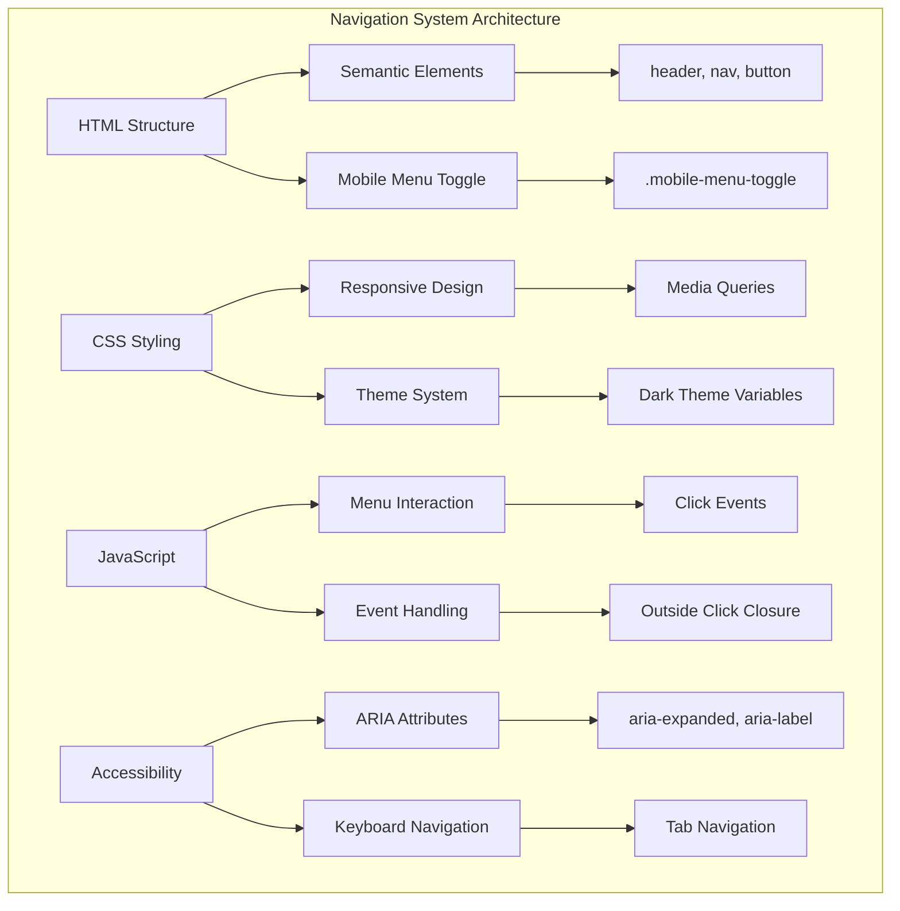

**Diagram sources**
- [index.html](file://index.html#L15-L35)
- [assets/styles.css](file://assets/styles.css#L1-L50)
- [assets/main.js](file://assets/main.js#L25-L50)

## HTML Structure and Semantic Elements

The navigation system utilizes semantic HTML elements to ensure proper structure and accessibility. Each navigation instance follows the standard pattern of header, nav, and button elements with appropriate ARIA attributes.

### Core Navigation Structure

The navigation follows a consistent structure across all pages:

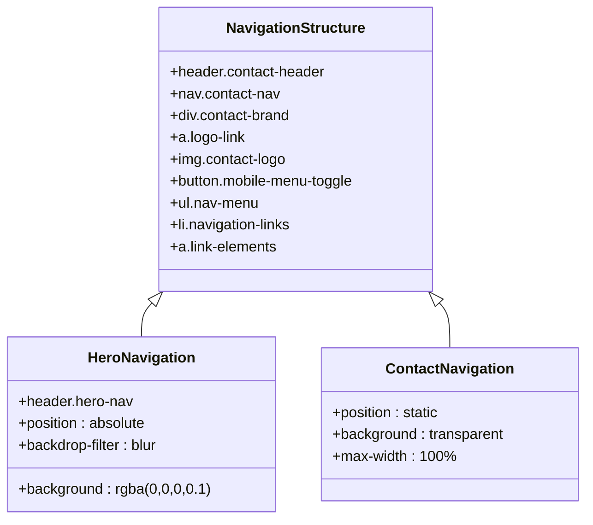

**Diagram sources**
- [index.html](file://index.html#L15-L35)
- [contact.html](file://contact.html#L13-L25)

### Semantic Element Implementation

Each navigation instance uses semantic HTML elements with proper nesting and structure:

- **header**: Contains the navigation container with role="navigation"
- **nav**: Wraps the navigation menu with aria-label="Main Navigation"
- **button**: Implements the mobile menu toggle with aria-expanded="false"
- **ul/li**: Creates the navigation menu structure with proper list semantics
- **a**: Provides navigation links with descriptive text and href attributes

**Section sources**
- [index.html](file://index.html#L15-L35)
- [contact.html](file://contact.html#L13-L25)
- [portfolio.html](file://portfolio.html#L13-L25)
- [price.html](file://price.html#L13-L25)
- [founder.html](file://founder.html#L13-L25)

## Responsive Header Implementation

The responsive header system adapts seamlessly between desktop and mobile views, implementing breakpoint-driven design patterns that optimize user experience across different screen sizes.

### Desktop Navigation (1024px+)

Desktop navigation features horizontal layout with spaced-out links and hover effects:

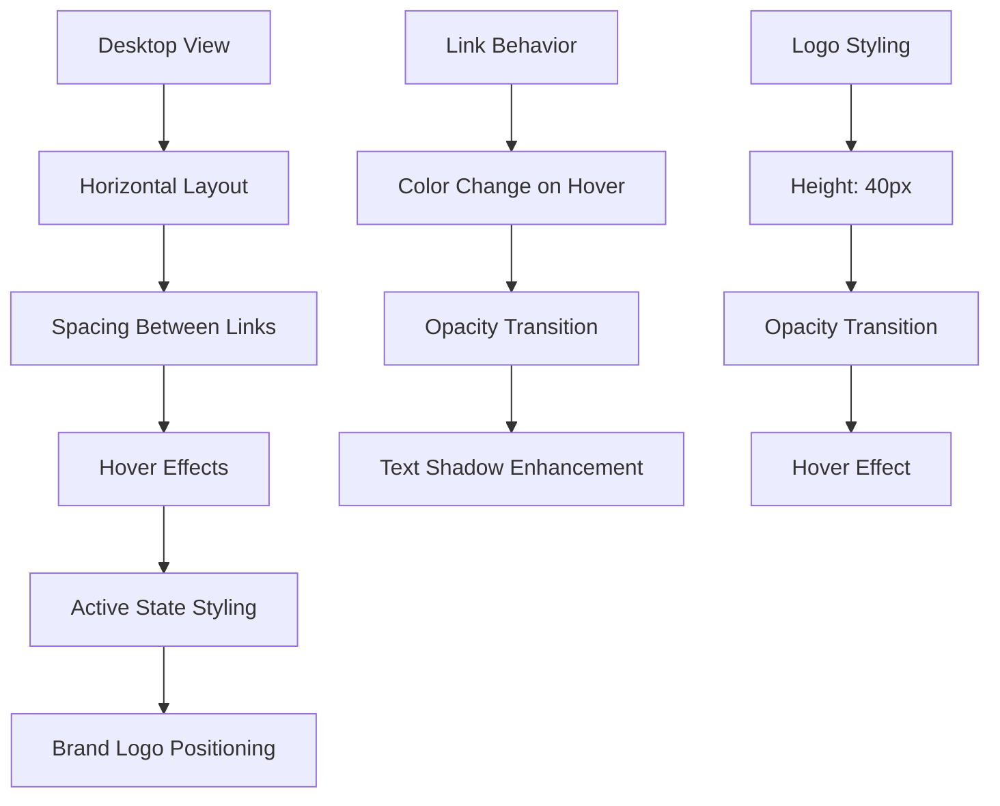

**Diagram sources**
- [assets/styles.css](file://assets/styles.css#L400-L450)

### Mobile Navigation (680px and below)

Mobile navigation transforms into a vertical slide-out menu with hamburger icon:

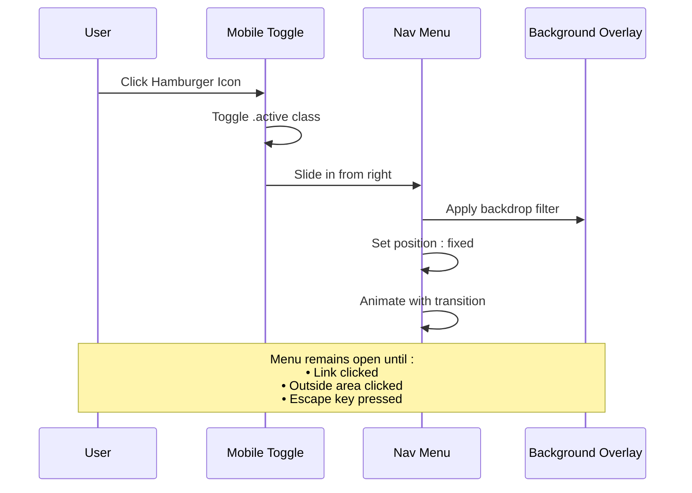

**Diagram sources**
- [assets/main.js](file://assets/main.js#L25-L50)
- [assets/styles.css](file://assets/styles.css#L250-L350)

**Section sources**
- [assets/styles.css](file://assets/styles.css#L250-L400)

## JavaScript Functionality

The JavaScript implementation provides comprehensive menu interaction handling, including mobile menu toggle, click outside closure, and link navigation behavior.

### Menu Toggle Implementation

The mobile menu toggle functionality is implemented through event listeners that manage the active state of both the toggle button and the navigation menu:

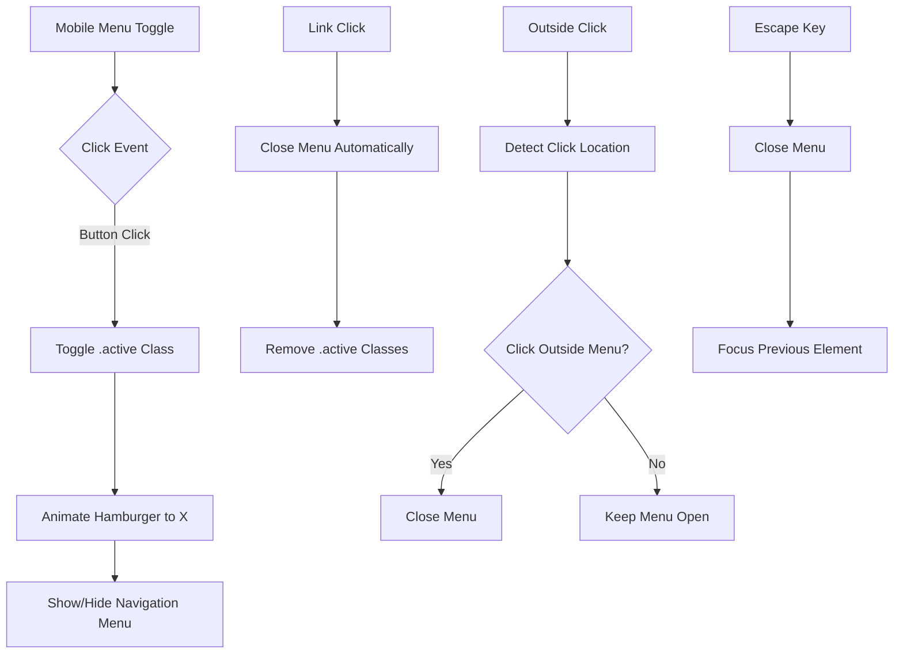

**Diagram sources**
- [assets/main.js](file://assets/main.js#L25-L50)

### Event Handling System

The JavaScript system implements multiple event handlers for comprehensive menu control:

| Event Type | Purpose | Implementation |
|------------|---------|----------------|
| `click` | Menu toggle and link navigation | Toggles active classes and closes menu on link click |
| `click` | Outside click detection | Closes menu when clicking outside navigation area |
| `keydown` | Keyboard navigation | Handles escape key and tab navigation |
| `touchstart` | Mobile interaction | Ensures touch-friendly menu behavior |

### Auto-play Video Integration

The JavaScript system also manages video autoplay behavior with fallback mechanisms for mobile devices:

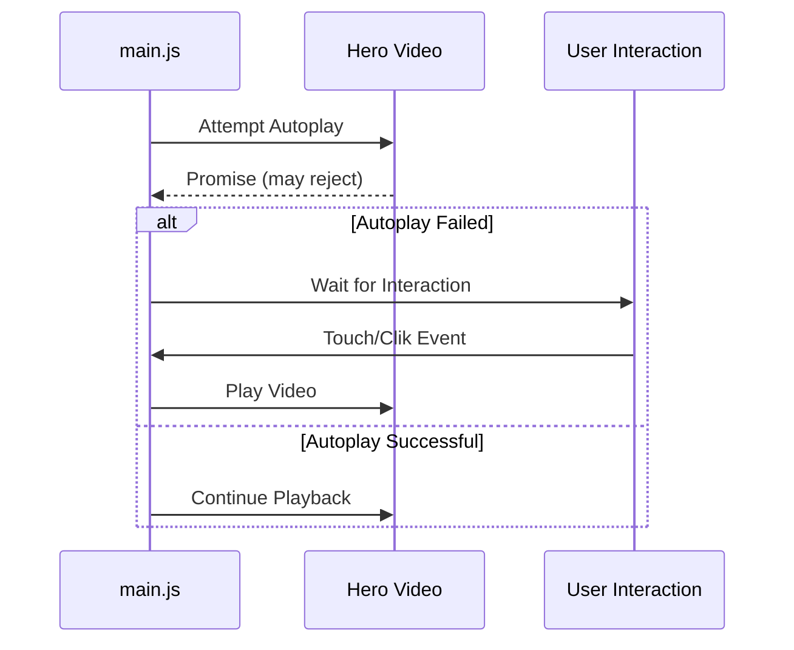

**Diagram sources**
- [assets/main.js](file://assets/main.js#L1-L25)

**Section sources**
- [assets/main.js](file://assets/main.js#L1-L418)

## CSS Styling and Theming

The CSS system implements a comprehensive theming approach with dark mode support, responsive design, and consistent visual hierarchy across all navigation elements.

### Color System and Variables

The navigation system utilizes a carefully designed color palette with CSS custom properties for theme consistency:

| Variable | Value | Usage |
|----------|-------|-------|
| `--bg` | `#0A0A0A` | Primary dark background |
| `--bg-2` | `#181818` | Secondary background/card |
| `--text` | `#E0E0E0` | Primary text color |
| `--brand` | `#B09B7E` | Brand accent color |
| `--line` | `#4F4F4F` | Border/divider color |

### Responsive Design Patterns

The CSS implements breakpoint-driven design with specific media queries for different screen sizes:

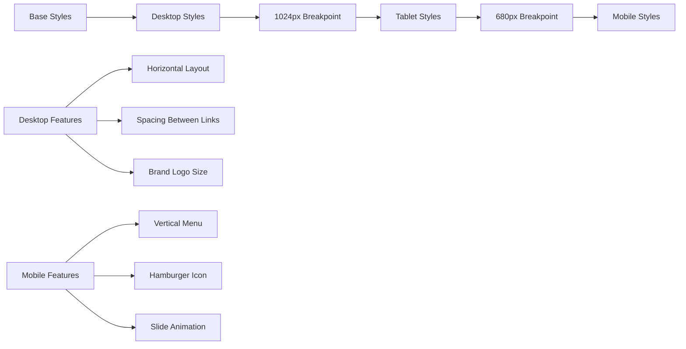

**Diagram sources**
- [assets/styles.css](file://assets/styles.css#L1-L50)

### Typography and Spacing

Navigation typography follows a consistent hierarchy with specific font weights and sizes:

- **Desktop**: Montserrat font family with variable weights
- **Mobile**: Reduced font sizes with increased line heights
- **Brand Text**: Custom logo styling with drop shadow effects
- **Link Text**: Opacity transitions and hover effects

**Section sources**
- [assets/styles.css](file://assets/styles.css#L1-L450)

## Accessibility Features

The navigation system implements comprehensive accessibility features to ensure usability for all users, including those using assistive technologies.

### ARIA Attributes and Roles

Each navigation instance includes essential ARIA attributes for screen reader compatibility:

| Element | ARIA Attribute | Purpose |
|---------|---------------|---------|
| Button | `aria-label="Меню"` | Describes button function |
| Button | `aria-expanded="false"` | Indicates menu state |
| Nav | `aria-label="Main Navigation"` | Identifies navigation region |
| Links | `aria-label` | Provides context for screen readers |

### Keyboard Navigation Support

The navigation system supports full keyboard navigation with proper focus management:

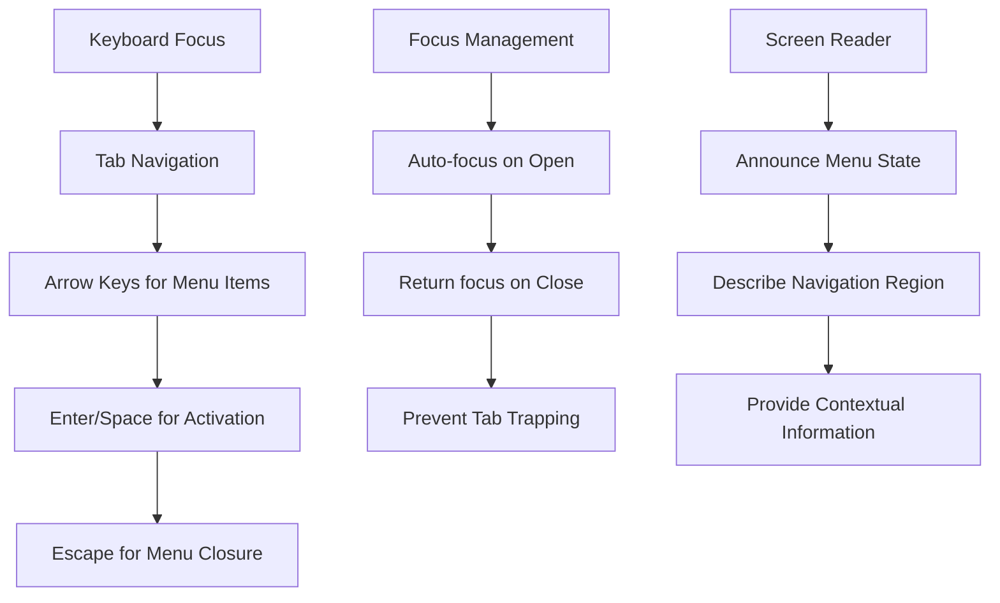

### Screen Reader Optimization

The system includes screen reader optimized markup with descriptive text and logical structure:

- **Skip Links**: Direct navigation to main content
- **Landmark Roles**: Proper HTML5 landmark elements
- **Contextual Announcements**: Dynamic state updates for screen readers
- **Descriptive Labels**: Clear labeling for interactive elements

**Section sources**
- [assets/main.js](file://assets/main.js#L25-L50)
- [assets/styles.css](file://assets/styles.css#L400-L450)

## Dual-Header Pattern

The navigation system implements a sophisticated dual-header pattern that adapts to different page contexts while maintaining visual consistency and functional coherence.

### Hero Navigation (Index Page)

The hero navigation serves as a transparent overlay on the main landing page with dynamic backdrop filtering:

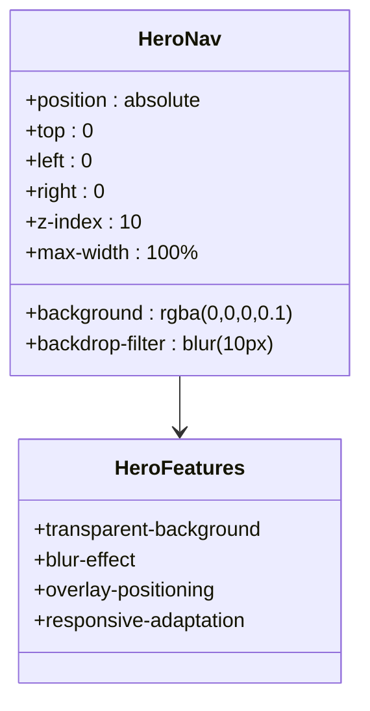

**Diagram sources**
- [index.html](file://index.html#L15-L35)
- [assets/styles.css](file://assets/styles.css#L350-L400)

### Contact Navigation (All Other Pages)

Contact navigation provides consistent branding across all informational pages:

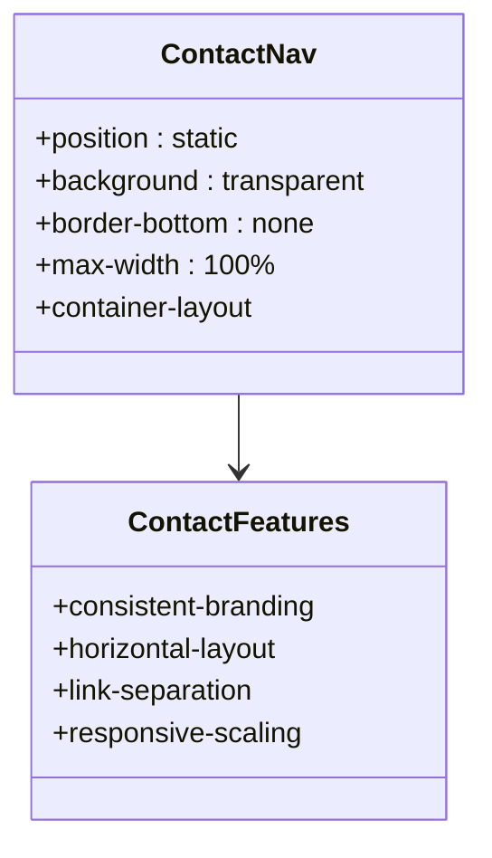

**Diagram sources**
- [contact.html](file://contact.html#L13-L25)
- [portfolio.html](file://portfolio.html#L13-L25)

### Pattern Consistency

Both navigation patterns maintain visual and functional consistency:

- **Branding**: Same logo placement and styling
- **Links**: Identical navigation structure
- **Mobile Behavior**: Consistent hamburger menu interaction
- **Styling**: Shared CSS classes and responsive breakpoints

**Section sources**
- [index.html](file://index.html#L15-L35)
- [contact.html](file://contact.html#L13-L25)
- [portfolio.html](file://portfolio.html#L13-L25)
- [price.html](file://price.html#L13-L25)
- [founder.html](file://founder.html#L13-L25)

## Mobile Menu Implementation

The mobile menu system provides intuitive touch-friendly navigation with smooth animations and comprehensive interaction handling.

### Hamburger Icon Animation

The hamburger menu toggle implements a smooth transformation animation:

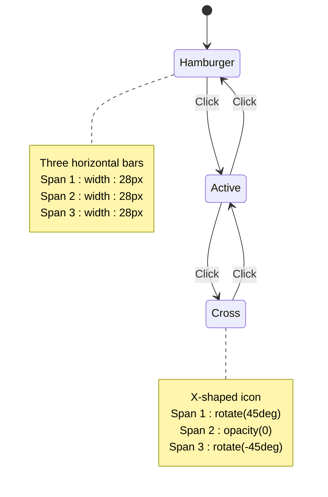

**Diagram sources**
- [assets/styles.css](file://assets/styles.css#L420-L440)

### Menu Positioning and Animation

The mobile menu implements sophisticated positioning and animation:

| Property | Desktop | Mobile |
|----------|---------|--------|
| Position | Static | Fixed |
| Width | Auto | 280px (100% mobile) |
| Height | Auto | 100vh |
| Background | Transparent | Semi-transparent overlay |
| Animation | None | Slide from right |
| Z-index | 10 | 15 |

### Click Outside Closure

The menu system includes intelligent outside-click detection:

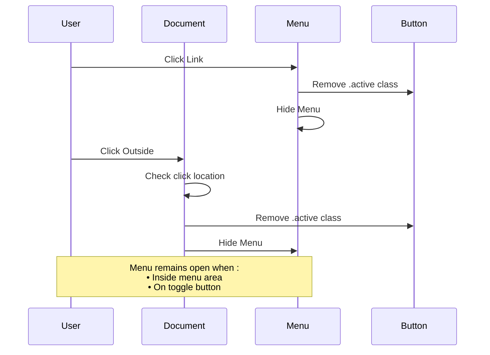

**Diagram sources**
- [assets/main.js](file://assets/main.js#L40-L50)

**Section sources**
- [assets/main.js](file://assets/main.js#L25-L50)
- [assets/styles.css](file://assets/styles.css#L250-L350)

## Cross-Page Consistency

The navigation system maintains consistent behavior and appearance across all pages through shared CSS classes and JavaScript event handling patterns.

### Shared CSS Classes

All navigation instances utilize identical CSS class names for consistent styling:

| Class | Purpose | Usage |
|-------|---------|-------|
| `.contact-header` | Navigation container | All pages |
| `.contact-nav` | Navigation wrapper | All pages |
| `.contact-brand` | Brand logo container | All pages |
| `.contact-logo` | Brand logo image | All pages |
| `.mobile-menu-toggle` | Hamburger button | All pages |
| `.nav-menu` | Navigation links | All pages |

### JavaScript Event Handling

Consistent JavaScript behavior across all pages ensures predictable user experience:

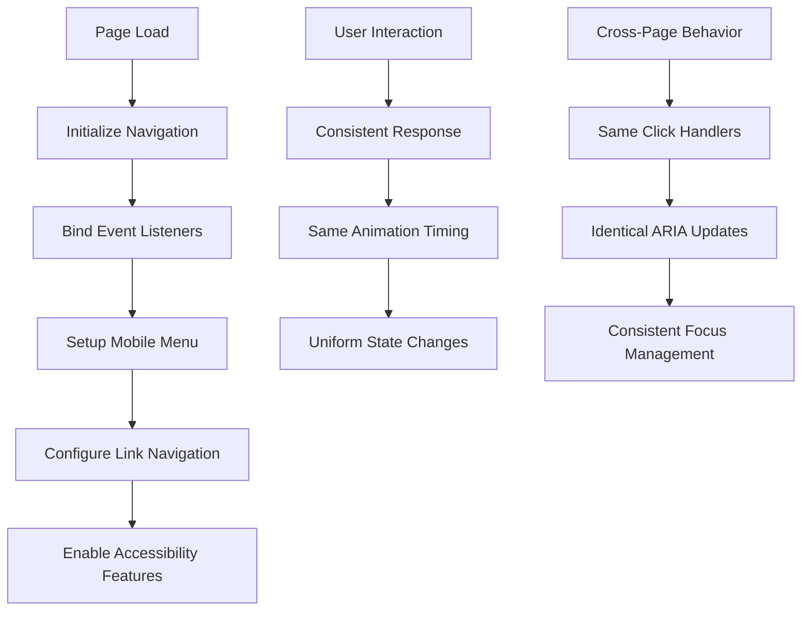

**Diagram sources**
- [assets/main.js](file://assets/main.js#L1-L50)

### Responsive Behavior Consistency

The responsive behavior pattern is maintained consistently:

- **Breakpoints**: Same media query values across pages
- **Animations**: Identical timing and easing functions
- **Visual States**: Consistent hover and active states
- **Touch Interactions**: Uniform touch event handling

**Section sources**
- [assets/main.js](file://assets/main.js#L1-L418)
- [assets/styles.css](file://assets/styles.css#L1-L450)

## Performance Considerations

The navigation system is optimized for performance with efficient resource loading, minimal DOM manipulation, and optimized CSS transitions.

### Resource Optimization

- **CSS**: Single stylesheet with critical navigation styles
- **JavaScript**: Modular script loading with defer attribute
- **Images**: Optimized logo images with appropriate formats
- **Fonts**: Efficient font loading with display swap

### DOM Manipulation Efficiency

The JavaScript system minimizes DOM operations:

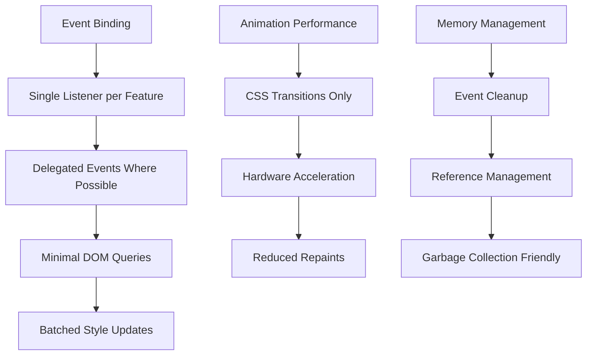

### Mobile Performance

Specific optimizations for mobile devices:

- **Touch Events**: Optimized touch interaction handling
- **Viewport Meta**: Proper viewport configuration
- **Hardware Acceleration**: CSS transform usage for animations
- **Battery Optimization**: Reduced CPU usage during idle states

## Troubleshooting Guide

Common issues and solutions for the navigation system implementation.

### Mobile Menu Not Working

**Symptoms**: Hamburger menu doesn't toggle or animations are broken

**Solutions**:
1. Verify JavaScript is loaded and executed
2. Check for CSS conflicts in mobile breakpoints
3. Ensure proper event listener binding
4. Validate ARIA attribute implementation

### Accessibility Issues

**Symptoms**: Screen reader problems or keyboard navigation failures

**Solutions**:
1. Test with screen readers (VoiceOver, NVDA, JAWS)
2. Verify ARIA attributes are present and correct
3. Check keyboard focus management
4. Validate semantic HTML structure

### Responsive Design Problems

**Symptoms**: Navigation appears broken on specific devices

**Solutions**:
1. Test across different viewport sizes
2. Verify media query breakpoints
3. Check CSS specificity conflicts
4. Validate touch interaction areas

### Performance Issues

**Symptoms**: Slow menu animations or laggy interactions

**Solutions**:
1. Profile JavaScript execution time
2. Optimize CSS transitions
3. Reduce DOM complexity
4. Minimize reflows and repaints

**Section sources**
- [assets/main.js](file://assets/main.js#L1-L418)
- [assets/styles.css](file://assets/styles.css#L1-L450)