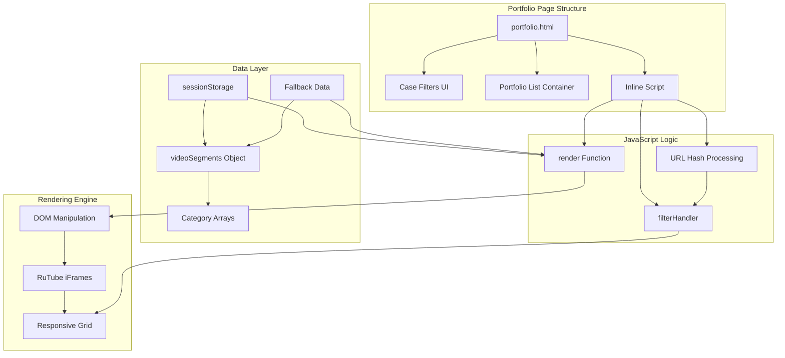
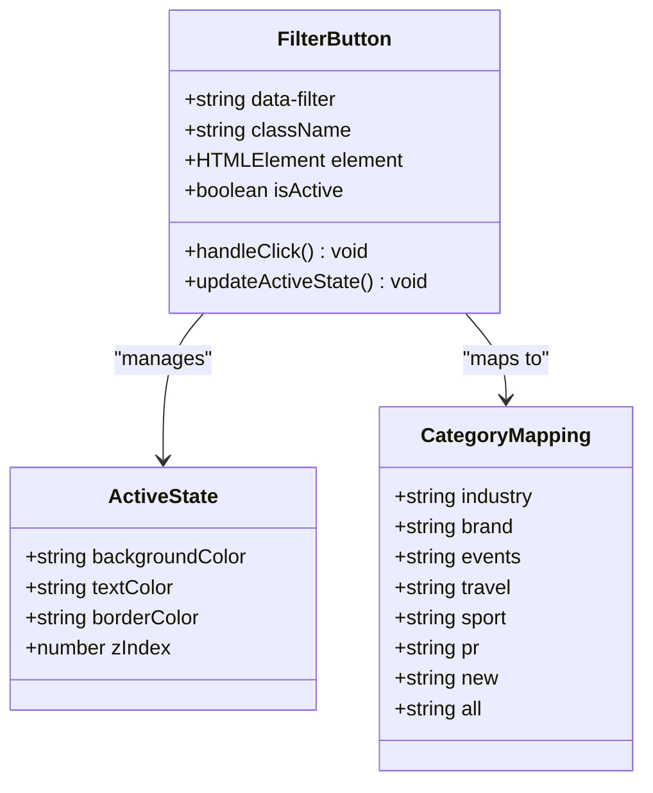
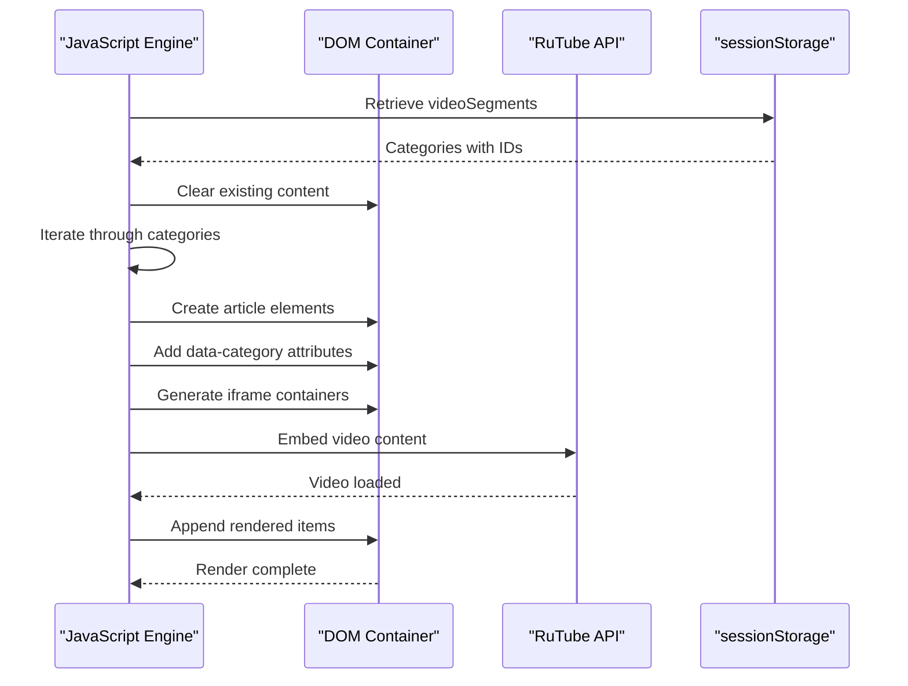
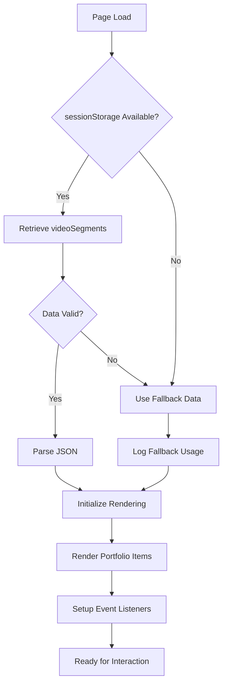
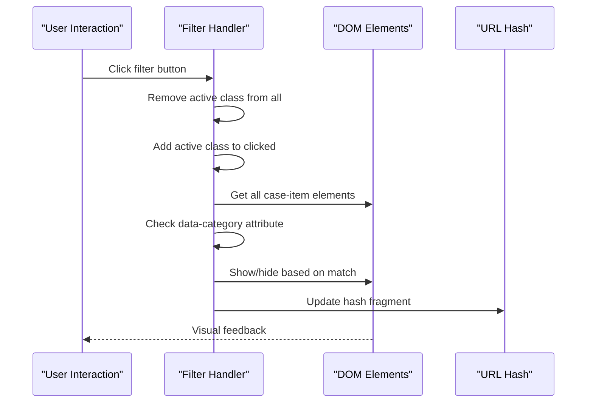
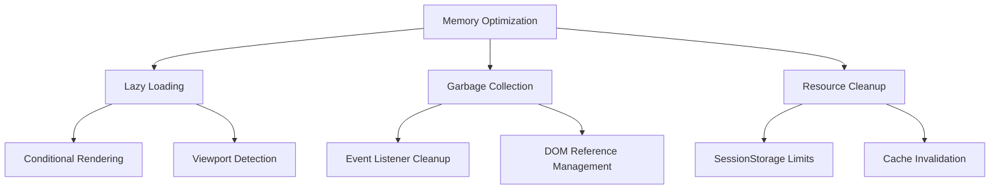
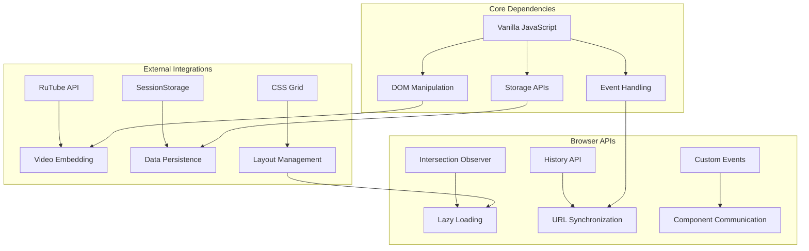

# Portfolio Components

<cite>
**Referenced Files in This Document**
- [portfolio.html](file://portfolio.html)
- [assets/main.js](file://assets/main.js)
- [assets/styles.css](file://assets/styles.css)
- [README.md](file://README.md)
</cite>

## Table of Contents
1. [Introduction](#introduction)
2. [System Architecture](#system-architecture)
3. [Case-Filters Button Group](#case-filters-button-group)
4. [Dynamic Video Rendering](#dynamic-video-rendering)
5. [Data Flow and Storage](#data-flow-and-storage)
6. [Responsive Grid Layout](#responsive-grid-layout)
7. [Filtering Logic](#filtering-logic)
8. [Performance Considerations](#performance-considerations)
9. [Troubleshooting Guide](#troubleshooting-guide)
10. [Implementation Details](#implementation-details)

## Introduction

The portfolio component system is a sophisticated video showcase and filtering solution designed for Knyazev Pro's corporate video production website. This system enables visitors to browse through 48 professionally curated video projects organized into seven distinct categories, with real-time filtering capabilities and responsive design optimization.

The system combines HTML5 semantic markup, vanilla JavaScript for interactivity, and CSS Grid layouts to create an engaging user experience that showcases the studio's diverse video production expertise across industries including industrial productions, brand films, events, travel content, automotive projects, PR campaigns, and new projects.

## System Architecture

The portfolio system follows a modular architecture with clear separation of concerns between presentation, logic, and data management:



**Diagram sources**
- [portfolio.html](file://portfolio.html#L38-L70)
- [assets/main.js](file://assets/main.js#L200-L250)

**Section sources**
- [portfolio.html](file://portfolio.html#L1-L388)
- [assets/main.js](file://assets/main.js#L1-L418)

## Case-Filters Button Group

The case-filters system provides intuitive category-based navigation through seven distinct video categories. Each filter button utilizes the `data-filter` attribute pattern for seamless integration with the filtering logic.

### Button Structure and Attributes

Each filter button follows a standardized structure with semantic HTML attributes:



**Diagram sources**
- [portfolio.html](file://portfolio.html#L39-L67)
- [assets/styles.css](file://assets/styles.css#L140-L152)

### Active State Management

The system implements sophisticated active state management with visual feedback and accessibility features:

| State Property | Active State | Default State | Visual Indicator |
|----------------|--------------|---------------|------------------|
| Background Color | Brand accent (#B09B7E) | Card background | Solid fill |
| Text Color | Dark gray (#111) | Light text | Bright contrast |
| Border Color | Brand accent | Line color | Subtle outline |
| Icon Opacity | 1.0 (bright) | 0.8 (faded) | Smooth transition |

**Section sources**
- [portfolio.html](file://portfolio.html#L333-L361)
- [assets/styles.css](file://assets/styles.css#L140-L152)

## Dynamic Video Rendering

The system employs a sophisticated JavaScript-driven rendering engine that dynamically creates video showcase elements using RuTube iframe embeds. This approach ensures optimal performance while maintaining flexibility for content updates.

### Rendering Pipeline



**Diagram sources**
- [portfolio.html](file://portfolio.html#L282-L320)
- [assets/main.js](file://assets/main.js#L200-L250)

### Video Element Structure

Each video item follows a consistent DOM structure optimized for responsive design and accessibility:

| Element | Purpose | Attributes | Styling |
|---------|---------|------------|---------|
| `article` | Container wrapper | `class="case-item"` | Grid positioning |
| `data-category` | Filtering identifier | Category name | Hidden from display |
| `div.case-video` | Video container | Height: 200px | Black background |
| `iframe` | Video embed | `allow="autoplay"` | Full dimensions |
| `div.case-content` | Metadata display | Conditional visibility | Typography styling |

**Section sources**
- [portfolio.html](file://portfolio.html#L282-L320)
- [assets/styles.css](file://assets/styles.css#L145-L152)

## Data Flow and Storage

The portfolio system implements a robust data management strategy utilizing sessionStorage for cross-page data persistence and intelligent fallback mechanisms for reliability.

### Data Architecture



**Diagram sources**
- [portfolio.html](file://portfolio.html#L78-L95)
- [assets/main.js](file://assets/main.js#L350-L380)

### Storage Strategy

The system maintains two primary data storage mechanisms:

| Storage Type | Capacity | Persistence | Access Method |
|--------------|----------|-------------|---------------|
| sessionStorage | 5-10MB | Session-based | `getItem()` / `setItem()` |
| Inline Fallback | Static | Page-based | Conditional initialization |
| Global Variables | Memory | Runtime | Direct assignment |

### Category Data Organization

The videoSegments object organizes content into seven distinct categories with specific ID arrays:

| Category | Item Count | Purpose | Optimization Strategy |
|----------|------------|---------|----------------------|
| `industry` | 13 videos | Industrial productions | Primary default |
| `brand` | 15 videos | Company presentations | Secondary selection |
| `events` | 10 videos | Event coverage | Balanced distribution |
| `travel` | 5 videos | Travel content | Niche specialization |
| `sport` | 8 videos | Automotive projects | High-quality focus |
| `pr` | 20 videos | PR campaigns | Maximum exposure |
| `all` | 48 videos | Complete collection | Performance optimization |

**Section sources**
- [portfolio.html](file://portfolio.html#L83-L277)
- [assets/main.js](file://assets/main.js#L200-L250)

## Responsive Grid Layout

The portfolio system implements a sophisticated CSS Grid-based layout that adapts seamlessly across multiple device breakpoints while maintaining visual consistency and optimal user experience.

### Grid Configuration

```mermaid
graph LR
subgraph "Desktop Layout (≥1024px)"
A[3-column grid<br/>Gap: 2px<br/>Width: calc(100% + 48px)]
end
subgraph "Tablet Layout (680px-1024px)"
B[2-column grid<br/>Gap: 2px<br/>Responsive scaling]
end
subgraph "Mobile Layout (<680px)"
C[1-column grid<br/>Full width<br/>Stacked content]
end
A --> B
B --> C
```

**Diagram sources**
- [assets/styles.css](file://assets/styles.css#L145-L152)

### Responsive Breakpoints

The system defines three primary layout modes with specific adaptations:

| Breakpoint Range | Column Configuration | Gap Size | Width Calculation |
|------------------|---------------------|----------|-------------------|
| ≥1024px | 3 columns | 2px | `calc(100% + 48px)` |
| 680px-1024px | 2 columns | 2px | Responsive scaling |
| <680px | 1 column | 2px | Full width |

### Video Aspect Ratio Management

The system maintains consistent visual proportions across all breakpoints:

| Device Type | Video Height | Container Behavior | Overflow Handling |
|-------------|--------------|-------------------|-------------------|
| Desktop | 200px fixed | Horizontal scrolling | Hidden overflow |
| Tablet | 200px fixed | Responsive scaling | Hidden overflow |
| Mobile | 200px fixed | Full width | Hidden overflow |

**Section sources**
- [assets/styles.css](file://assets/styles.css#L145-L152)

## Filtering Logic

The filtering system implements real-time category-based content discovery with instant visual feedback and URL synchronization capabilities.

### Filter Implementation Architecture



**Diagram sources**
- [portfolio.html](file://portfolio.html#L352-L361)

### Filter Matching Algorithm

The system employs a sophisticated matching algorithm for category filtering:

| Filter Type | Matching Logic | Display Condition | Performance Impact |
|-------------|----------------|-------------------|-------------------|
| Specific Category | Exact match (`cat === filter`) | Show matched items | O(n) iteration |
| All Category | Universal match (`filter === 'all'`) | Show all items | Minimal overhead |
| Mixed Selection | Combined condition | Match or universal | Efficient caching |

### URL Synchronization

The system automatically synchronizes filter states with URL hash fragments for bookmarking and deep linking:

| URL Pattern | Filter State | Initial Load Behavior |
|-------------|--------------|----------------------|
| `#industry` | Industry filter active | Auto-select industry |
| `#brand` | Brand filter active | Auto-select brand |
| `#all` | All filter active | Show complete portfolio |
| No hash | Default to industry | Standard initialization |

**Section sources**
- [portfolio.html](file://portfolio.html#L333-L361)
- [assets/main.js](file://assets/main.js#L180-L190)

## Performance Considerations

The portfolio system implements several performance optimization strategies to ensure fast loading times and smooth user interactions across various device capabilities.

### Memory Management Strategies



### Optimization Techniques

| Technique | Implementation | Performance Benefit | Trade-off |
|-----------|----------------|-------------------|-----------|
| Selective Rendering | Show 13 videos initially | Faster initial load | Requires filtering |
| SessionStorage Caching | Persistent data transfer | Reduced server requests | Storage limitations |
| Event Delegation | Single listener per container | Lower memory usage | Slightly increased latency |
| CSS Grid Layout | Hardware acceleration | Smooth animations | Browser compatibility |

### Storage Capacity Management

The system carefully manages sessionStorage capacity to prevent browser limitations:

| Storage Metric | Current Usage | Limit Threshold | Fallback Strategy |
|----------------|---------------|-----------------|-------------------|
| Total Data Size | ~2KB | 5-10MB limit | Immediate fallback |
| Category Arrays | ~1.5KB | Optimized structure | Compressed storage |
| Video IDs | ~0.5KB | Minimal footprint | Efficient serialization |

**Section sources**
- [portfolio.html](file://portfolio.html#L78-L95)
- [assets/main.js](file://assets/main.js#L350-L380)

## Troubleshooting Guide

This section provides comprehensive solutions for common issues encountered in the portfolio component system.

### Common Issues and Solutions

#### Missing Videos or Broken Embeds

**Symptoms:**
- Empty video containers
- Console errors for iframe loading
- Missing video thumbnails

**Root Causes:**
- Incorrect RuTube video IDs
- Network connectivity issues
- CORS policy restrictions

**Solutions:**
1. Verify video ID format in `videoSegments` object
2. Test network connectivity to RuTube service
3. Ensure proper CORS headers for iframe embedding
4. Check browser console for specific error messages

#### Filter Not Working

**Symptoms:**
- Clicking filters has no visual effect
- All videos remain visible
- Filter buttons appear inactive

**Root Causes:**
- JavaScript execution failure
- DOM element selection issues
- Event listener attachment problems

**Solutions:**
1. Verify JavaScript console for errors
2. Check DOM element existence with `console.log()`
3. Ensure event listeners are properly attached
4. Test with simplified filter logic

#### Performance Issues

**Symptoms:**
- Slow page loading
- Stuttering during filtering
- High memory usage

**Root Causes:**
- Excessive DOM manipulation
- Large video payload
- Inefficient event handling

**Solutions:**
1. Implement virtual scrolling for large datasets
2. Optimize iframe loading strategies
3. Use requestAnimationFrame for smooth animations
4. Monitor memory usage with browser developer tools

### Debugging Tools and Techniques

| Tool | Purpose | Usage Example |
|------|---------|---------------|
| Browser Console | Error tracking | `console.log('Debug message')` |
| Network Tab | Resource monitoring | Check iframe loading status |
| Performance Tab | Timing analysis | Profile filter operations |
| Memory Tab | Heap analysis | Monitor garbage collection |

**Section sources**
- [portfolio.html](file://portfolio.html#L280-L285)
- [assets/main.js](file://assets/main.js#L180-L190)

## Implementation Details

### Code Structure and Dependencies

The portfolio system maintains minimal external dependencies while leveraging modern web standards:



### Accessibility Features

The system incorporates comprehensive accessibility support:

| Feature | Implementation | Standards Compliance |
|---------|----------------|---------------------|
| Keyboard Navigation | Tab order management | WCAG Level A |
| Screen Reader Support | Semantic HTML structure | WCAG Level AA |
| Focus Management | Visible focus indicators | WCAG Level AA |
| Alternative Text | Descriptive image captions | WCAG Level AA |

### Browser Compatibility

The system maintains compatibility across modern browsers with graceful degradation:

| Browser | Minimum Version | Features Supported | Known Issues |
|---------|----------------|-------------------|--------------|
| Chrome | 90+ | Full functionality | None |
| Firefox | 88+ | Full functionality | None |
| Safari | 14+ | Full functionality | iOS 1.1 fixes |
| Edge | 90+ | Full functionality | None |

**Section sources**
- [portfolio.html](file://portfolio.html#L1-L388)
- [assets/main.js](file://assets/main.js#L1-L418)
- [README.md](file://README.md#L100-L150)