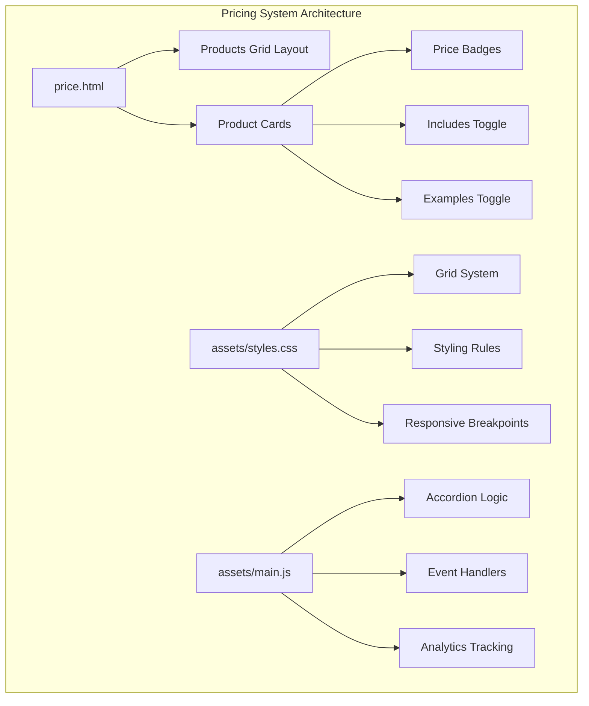
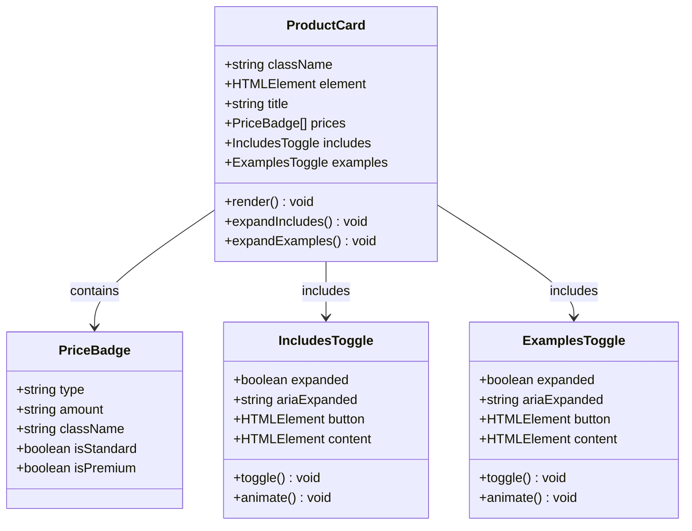
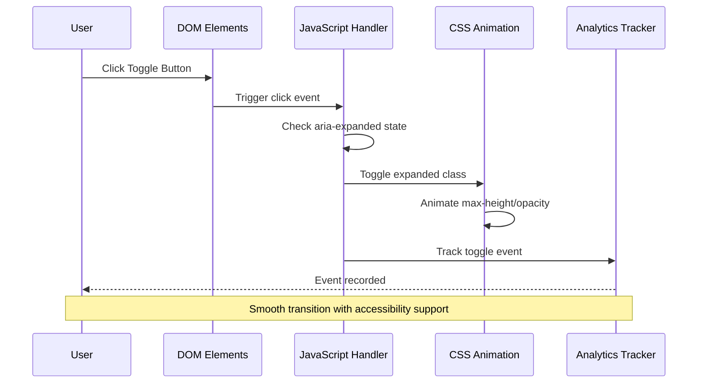
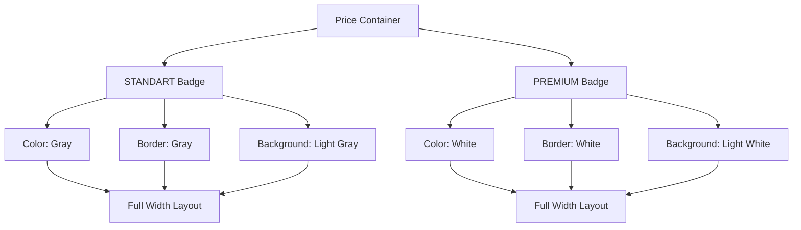

# Pricing Components

<cite>
**Referenced Files in This Document**
- [price.html](file://price.html)
- [assets/styles.css](file://assets/styles.css)
- [assets/main.js](file://assets/main.js)
- [README.md](file://README.md)
</cite>

## Table of Contents
1. [Introduction](#introduction)
2. [Project Structure](#project-structure)
3. [Core Components](#core-components)
4. [Architecture Overview](#architecture-overview)
5. [Detailed Component Analysis](#detailed-component-analysis)
6. [Visual Design System](#visual-design-system)
7. [Accessibility Implementation](#accessibility-implementation)
8. [Responsive Behavior](#responsive-behavior)
9. [Interactive Features](#interactive-features)
10. [Adding New Product Cards](#adding-new-product-cards)
11. [Performance Considerations](#performance-considerations)
12. [Troubleshooting Guide](#troubleshooting-guide)
13. [Conclusion](#conclusion)

## Introduction

The pricing component system is a sophisticated implementation of service package displays designed for a corporate videoproduction studio. This system showcases six distinct service tiers (STANDART/PREMIUM) with expandable content areas that reveal detailed service inclusions and portfolio examples. Built with semantic HTML, modern CSS Grid layouts, and vanilla JavaScript, the system prioritizes accessibility, responsive design, and user experience across all devices.

The implementation demonstrates advanced web development practices including accordion functionality, dynamic content expansion, and comprehensive accessibility features. Each product card follows a consistent pattern of tiered pricing presentation with interactive toggle buttons that manage content visibility through smooth animations.

## Project Structure

The pricing system is organized within a dedicated HTML page that serves as the primary interface for showcasing service packages. The system integrates seamlessly with the broader website architecture while maintaining independence for pricing-related functionality.

**Diagram sources**
- [price.html](file://price.html#L40-L436)
- [assets/styles.css](file://assets/styles.css#L385-L415)
- [assets/main.js](file://assets/main.js#L355-L414)

**Section sources**
- [price.html](file://price.html#L1-L437)
- [assets/styles.css](file://assets/styles.css#L385-L415)

## Core Components

### Product Card Structure

Each service package is encapsulated within a product card that maintains visual consistency while accommodating different service types. The product card serves as the fundamental building block for the pricing system, containing hierarchical content organization.

**Diagram sources**
- [price.html](file://price.html#L40-L150)
- [assets/main.js](file://assets/main.js#L355-L414)

### Grid Layout System

The pricing system utilizes CSS Grid for responsive layout management, ensuring optimal content presentation across different screen sizes. The grid adapts dynamically based on available space and content requirements.

**Section sources**
- [price.html](file://price.html#L40-L150)
- [assets/styles.css](file://assets/styles.css#L385-L398)

## Architecture Overview

The pricing component system follows a modular architecture that separates concerns between presentation, behavior, and data management. This separation enables maintainability and extensibility while preserving performance and accessibility standards.

**Diagram sources**
- [assets/main.js](file://assets/main.js#L355-L414)

## Detailed Component Analysis

### Product Card Implementation

Each product card represents a distinct service offering with standardized structure and visual hierarchy. The implementation ensures consistent spacing, typography, and interaction patterns across all service types.

#### HTML Structure Pattern

The product card follows a semantic HTML structure that enhances accessibility and SEO performance. Each card contains hierarchical headings, descriptive lists, and interactive elements with appropriate ARIA attributes.

#### Price Badge System

Price badges utilize a dual-tier approach displaying both STANDART and PREMIUM pricing options. The badges employ CSS custom properties for consistent styling and brand alignment.

**Diagram sources**
- [assets/styles.css](file://assets/styles.css#L390-L395)

**Section sources**
- [price.html](file://price.html#L40-L150)
- [assets/styles.css](file://assets/styles.css#L390-L395)

### Accordion Toggle System

The accordion functionality provides expandable content areas for service inclusions and portfolio examples. This system implements smooth transitions with proper state management and accessibility compliance.

#### Includes Toggle Implementation

The includes toggle reveals detailed service offerings through animated expansion. The implementation manages content height calculations and opacity transitions for seamless user experience.

#### Examples Toggle Implementation

The examples toggle presents portfolio samples with controlled animation timing. The system handles varying content heights while maintaining visual consistency across different service categories.

**Section sources**
- [assets/main.js](file://assets/main.js#L355-L414)
- [assets/styles.css](file://assets/styles.css#L400-L415)

## Visual Design System

### Color Palette and Typography

The pricing system employs a carefully curated color palette that aligns with the brand identity while ensuring sufficient contrast for accessibility. Typography scales appropriately across breakpoints with consistent weight hierarchy.

#### Brand Color Application

Brand colors are applied consistently across pricing badges, interactive elements, and visual accents. The implementation uses CSS custom properties for easy theme customization.

#### Typography Hierarchy

Typography follows established hierarchy with clear visual distinction between headings, subheadings, and body content. Font weights and sizes adapt responsively across device classes.

**Section sources**
- [assets/styles.css](file://assets/styles.css#L1-L10)
- [assets/styles.css](file://assets/styles.css#L385-L415)

### Spacing and Layout Guidelines

Consistent spacing guidelines ensure visual harmony across all product cards. Margins, padding, and gutters maintain proportional relationships that enhance readability and focus.

## Accessibility Implementation

### ARIA Attributes and Screen Reader Support

The pricing system incorporates comprehensive ARIA attributes to ensure full accessibility for screen reader users. Each toggle button includes appropriate aria-expanded states and descriptive labels.

#### Keyboard Navigation Support

Keyboard navigation is fully supported with focus indicators, tab order management, and keyboard event handlers. Users can navigate and interact with all components using standard keyboard shortcuts.

#### Focus Management

Focus management ensures logical navigation flow through interactive elements. Focus indicators provide visual feedback for keyboard users and screen reader navigation.

**Section sources**
- [assets/main.js](file://assets/main.js#L355-L414)
- [assets/styles.css](file://assets/styles.css#L400-L410)

## Responsive Behavior

### Breakpoint Strategy

The pricing system implements a mobile-first responsive strategy with progressive enhancement for larger screens. Breakpoints ensure optimal content presentation across desktop, tablet, and mobile devices.

#### Grid Adaptation

CSS Grid adapts dynamically based on available screen real estate. Columns reflow appropriately while maintaining content legibility and interaction usability.

#### Touch Interaction Optimization

Touch interactions are optimized for mobile devices with appropriate tap targets, gesture support, and responsive feedback mechanisms.

**Section sources**
- [assets/styles.css](file://assets/styles.css#L420-L447)

## Interactive Features

### Smooth Transitions and Animations

The system employs CSS transitions for smooth content expansion and collapse animations. These transitions enhance user experience while maintaining performance standards.

#### Event Handling Architecture

JavaScript event handlers manage user interactions with precise state management and analytics integration. The implementation prevents race conditions and ensures reliable functionality.

**Section sources**
- [assets/main.js](file://assets/main.js#L355-L414)
- [assets/styles.css](file://assets/styles.css#L405-L415)

## Adding New Product Cards

### Implementation Guidelines

Adding new product cards requires adherence to established patterns and conventions. The process involves HTML structure maintenance, CSS styling consistency, and JavaScript event handler registration.

#### Template Structure

New product cards should follow the established template structure with proper semantic markup and accessibility attributes. Consistency ensures predictable user experience across all service offerings.

#### Styling Requirements

CSS styling requirements include brand color application, consistent spacing, and responsive behavior. New cards must integrate seamlessly with existing design patterns.

#### JavaScript Integration

JavaScript integration requires event handler registration and analytics tracking setup. The implementation supports automatic integration for new product cards.

**Section sources**
- [price.html](file://price.html#L40-L150)
- [assets/main.js](file://assets/main.js#L355-L414)

## Performance Considerations

### Loading Optimization

The pricing system implements lazy loading strategies for portfolio content and optimizes resource utilization for fast initial rendering. Performance metrics demonstrate efficient resource management.

#### Memory Management

Memory management practices prevent accumulation of event listeners and DOM references. The implementation includes cleanup procedures for dynamic content removal.

#### Animation Performance

Animation performance is optimized through CSS hardware acceleration and efficient transition timing. The system maintains smooth interactions across various device capabilities.

## Troubleshooting Guide

### Common Issues and Solutions

#### Toggle Functionality Problems

Toggle functionality issues typically stem from JavaScript event handler conflicts or CSS transition timing problems. Solutions involve proper event delegation and transition property verification.

#### Responsive Layout Issues

Responsive layout problems often result from CSS Grid configuration or viewport meta tag settings. Resolution involves breakpoint adjustment and container sizing verification.

#### Accessibility Concerns

Accessibility issues may arise from missing ARIA attributes or improper focus management. Solutions include comprehensive accessibility testing and assistive technology validation.

**Section sources**
- [assets/main.js](file://assets/main.js#L355-L414)
- [assets/styles.css](file://assets/styles.css#L400-L415)

## Conclusion

The pricing component system represents a comprehensive implementation of modern web development practices focused on accessibility, performance, and user experience. The system successfully demonstrates advanced techniques in responsive design, interactive content management, and semantic HTML implementation.

The modular architecture enables easy maintenance and extension while preserving performance and accessibility standards. The implementation serves as a model for similar pricing systems requiring expandable content and interactive functionality.

Future enhancements could include dynamic content loading, enhanced analytics integration, and additional accessibility features. The foundation provided ensures that such improvements can be implemented without disrupting existing functionality.