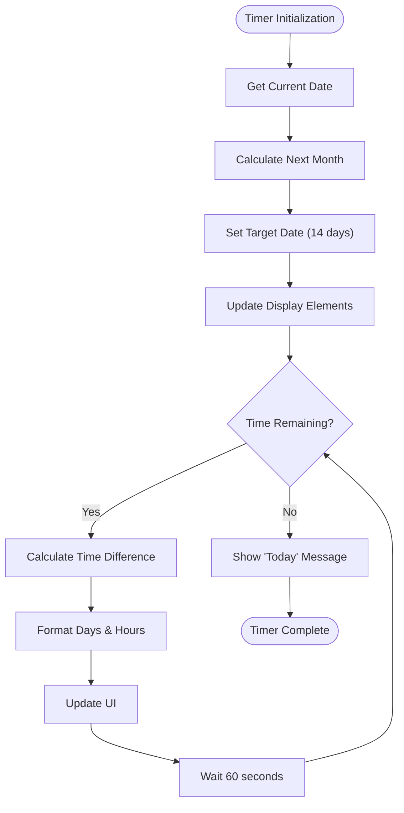
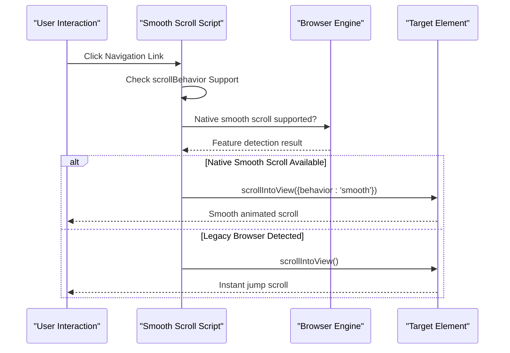
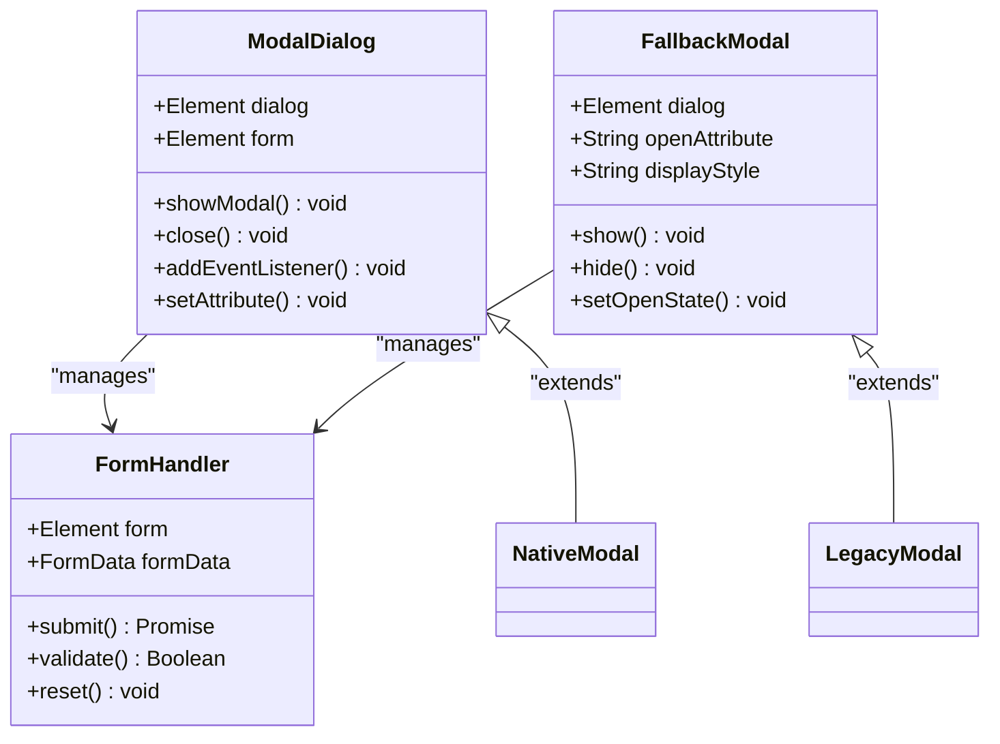
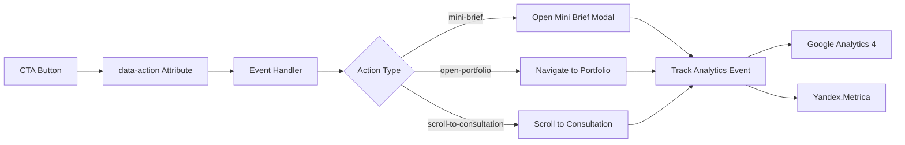
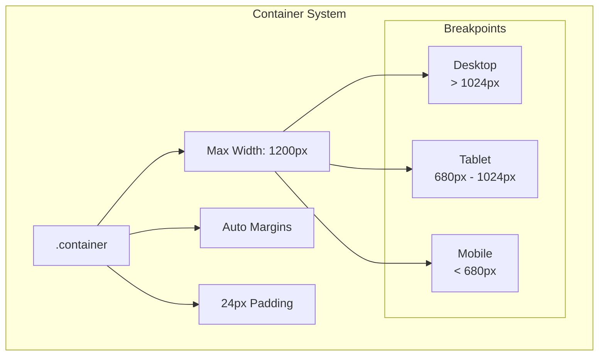
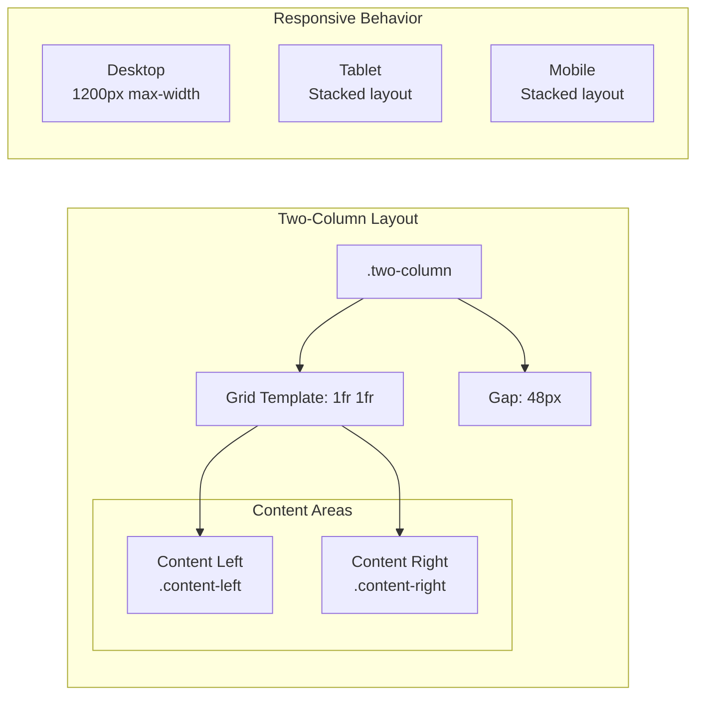

# Utility Components

<cite>
**Referenced Files in This Document**
- [assets/main.js](file://assets/main.js)
- [assets/styles.css](file://assets/styles.css)
- [index.html](file://index.html)
- [contact.html](file://contact.html)
- [README.md](file://README.md)
</cite>

## Table of Contents
1. [Introduction](#introduction)
2. [FOMO Countdown Timer Implementation](#fomo-countdown-timer-implementation)
3. [Smooth Scrolling with Browser Compatibility](#smooth-scrolling-with-browser-compatibility)
4. [Modal Dialog System](#modal-dialog-system)
5. [CTA Button System](#cta-button-system)
6. [Responsive Container System](#responsive-container-system)
7. [Two-Column Layout Implementation](#two-column-layout-implementation)
8. [Performance and Accessibility Standards](#performance-and-accessibility-standards)
9. [Implementation Guidelines](#implementation-guidelines)
10. [Troubleshooting Guide](#troubleshooting-guide)

## Introduction

The utility components in this landing page project provide essential interactive features that enhance user experience across the site. These components demonstrate modern web development practices including progressive enhancement, graceful degradation, and accessibility compliance. The implementation focuses on performance optimization while maintaining cross-browser compatibility and responsive design principles.

## FOMO Countdown Timer Implementation

The Fear of Missing Out (FOMO) countdown timer creates urgency by displaying dynamic countdown information to users. This component demonstrates sophisticated date calculation and real-time updates with fallback mechanisms for older browsers.

### Core Implementation Features

The countdown timer calculates remaining time until the next month's deadline using precise mathematical calculations:

**Diagram sources**
- [assets/main.js](file://assets/main.js#L100-L120)

### Dynamic Date Calculation

The timer performs complex date arithmetic to determine the next month and calculate remaining time:

- **Next Month Calculation**: Uses JavaScript Date API to increment current month
- **Target Date Setting**: Sets target to 14 days from current date
- **Time Difference Calculation**: Computes milliseconds difference between current and target time
- **Unit Conversion**: Converts milliseconds to days and hours with proper rounding

### Display Management

The timer updates multiple DOM elements simultaneously:

- **Countdown Element**: Shows remaining time in "X д Y ч" format
- **Next Month Element**: Displays the target month name in Russian
- **Real-time Updates**: Updates every minute using setInterval

### Browser Compatibility

The implementation includes robust fallback mechanisms:

- **Modern Browsers**: Utilizes native Date APIs and string formatting
- **Legacy Support**: Provides graceful degradation for older browsers
- **Localization**: Supports Russian month names with proper encoding

**Section sources**
- [assets/main.js](file://assets/main.js#L100-L120)
- [index.html](file://index.html#L45-L47)

## Smooth Scrolling with Browser Compatibility

The smooth scrolling implementation provides enhanced navigation experiences while maintaining compatibility across different browser engines and device types.

### Progressive Enhancement Approach

The scrolling system employs progressive enhancement to provide optimal experiences:

**Diagram sources**
- [assets/main.js](file://assets/main.js#L75-L85)

### Cross-Browser Detection

The implementation uses feature detection to determine browser capabilities:

- **Modern Browsers**: Support CSS scroll-behavior property
- **Legacy Detection**: Checks document.documentElement.style.scrollBehavior
- **Fallback Strategy**: Degrades to instant scrolling when smooth scrolling unavailable

### Touch Device Optimization

Special handling for touch devices ensures optimal performance:

- **Mobile Safari**: Optimized for iOS touch interactions
- **Android Chrome**: Enhanced for Android touch scrolling
- **Desktop Browsers**: Maintains smooth transitions for mouse interactions

### Event Integration

Smooth scrolling integrates with various user interactions:

- **Navigation Links**: Automatic scrolling to target sections
- **CTA Buttons**: Programmatic scrolling triggers
- **Anchor Tags**: Built-in smooth scrolling support

**Section sources**
- [assets/main.js](file://assets/main.js#L75-L85)

## Modal Dialog System

The modal dialog system provides a modern, accessible solution for displaying forms and important content. It utilizes the native HTML dialog element with comprehensive fallback support for legacy browsers.

### Native Dialog Implementation

The modal system leverages the HTML5 dialog element for modern browsers:

**Diagram sources**
- [assets/main.js](file://assets/main.js#L50-L70)
- [index.html](file://index.html#L220-L248)

### Accessibility Features

The modal system implements comprehensive accessibility standards:

- **ARIA Attributes**: Proper role, aria-modal, and aria-labelledby attributes
- **Focus Management**: Automatic focus trapping and restoration
- **Keyboard Navigation**: Full keyboard accessibility with Escape key support
- **Screen Reader Support**: Semantic markup and live regions

### Event Delegation Pattern

The implementation uses efficient event delegation for optimal performance:

- **Single Event Listener**: Binds click handlers to parent containers
- **Dynamic Content Support**: Handles dynamically added elements
- **Memory Efficiency**: Reduces memory footprint compared to individual listeners

### Form Submission Handling

The modal includes robust form processing:

- **Validation**: Client-side form validation
- **AJAX Submission**: Asynchronous form submission
- **Error Handling**: Comprehensive error catching and user feedback
- **Success Feedback**: Confirmation messages and state management

**Section sources**
- [assets/main.js](file://assets/main.js#L50-L70)
- [index.html](file://index.html#L220-L248)

## CTA Button System

The Call-to-Action (CTA) button system provides consistent styling and behavior across the site while supporting various interaction patterns and analytics tracking.

### Button Class System

The CTA system uses a comprehensive class naming convention:

| Button Type | Class | Purpose | Styling |
|-------------|-------|---------|---------|
| **Primary** | `.btn-primary` | Main actions | Brand-colored background |
| **Secondary** | `.btn-secondary` | Supporting actions | Transparent with border |
| **Large** | `.btn-large` | Emphasized actions | Increased padding and size |
| **Urgent** | `.urgent-cta` | FOMO-driven actions | Pulse animation |

### Data-Action Triggers

The system implements a flexible trigger mechanism:

**Diagram sources**
- [assets/main.js](file://assets/main.js#L60-L80)
- [index.html](file://index.html#L40-L45)

### Analytics Integration

Each CTA button automatically tracks user interactions:

- **Event Tracking**: Custom events with category, action, and label parameters
- **Multi-Platform Support**: Compatible with Google Analytics 4 and Yandex.Metrica
- **Performance Monitoring**: Tracks conversion rates and user behavior
- **Segmentation**: Differentiates between button types and destinations

### Responsive Behavior

CTA buttons adapt to various screen sizes:

- **Mobile Optimization**: Larger touch targets and increased spacing
- **Breakpoint Adjustments**: Responsive typography and padding
- **Visual Hierarchy**: Maintains clear importance through sizing and styling

**Section sources**
- [assets/main.js](file://assets/main.js#L60-L80)
- [assets/styles.css](file://assets/styles.css#L80-L100)
- [index.html](file://index.html#L40-L45)

## Responsive Container System

The responsive container system provides consistent layout foundations across different screen sizes and device orientations.

### Container Architecture

The container system establishes a flexible grid foundation:

**Diagram sources**
- [assets/styles.css](file://assets/styles.css#L30-L35)

### Adaptive Padding Strategy

The system implements intelligent padding adjustments:

- **Desktop**: Standard 24px padding for ample whitespace
- **Tablet**: Reduced padding for better content density
- **Mobile**: Minimal padding to maximize content area

### Grid Integration

Containers seamlessly integrate with CSS Grid layouts:

- **Grid Alignment**: Perfect alignment with grid systems
- **Flexible Sizing**: Responsive width calculations
- **Content Boundaries**: Consistent content boundaries across breakpoints

**Section sources**
- [assets/styles.css](file://assets/styles.css#L30-L35)

## Two-Column Layout Implementation

The two-column layout system provides flexible content arrangement for improved readability and visual hierarchy.

### Grid-Based Implementation

The two-column system uses CSS Grid for modern browsers:

**Diagram sources**
- [assets/styles.css](file://assets/styles.css#L120-L125)
- [index.html](file://index.html#L100-L115)

### Content Distribution

The layout optimizes content placement:

- **Text Content**: Left-aligned for reading flow
- **Visual Content**: Right-aligned for emphasis
- **Interactive Elements**: Strategic positioning for user engagement

### Responsive Adaptation

The system adapts gracefully across devices:

- **Desktop**: Maintains dual-column structure with ample spacing
- **Tablet**: Switches to single-column with reduced gap
- **Mobile**: Stacks content vertically for optimal reading

**Section sources**
- [assets/styles.css](file://assets/styles.css#L120-L125)
- [index.html](file://index.html#L100-L115)

## Performance and Accessibility Standards

The utility components maintain high performance and accessibility standards through careful implementation practices.

### Performance Optimization

Key performance strategies include:

- **Lazy Loading**: Deferred script execution with defer attribute
- **Event Delegation**: Single listeners for multiple elements
- **CSS Custom Properties**: Efficient theme management
- **Minimal Dependencies**: Vanilla JavaScript implementation

### Accessibility Compliance

Comprehensive accessibility features ensure inclusivity:

- **Semantic HTML**: Proper element selection and labeling
- **ARIA Support**: Comprehensive ARIA attributes for dynamic content
- **Keyboard Navigation**: Full keyboard accessibility
- **Screen Reader Support**: Proper landmark and role definitions

### Graceful Degradation

The system provides fallbacks for unsupported features:

- **Old Browser Support**: Polyfills and feature detection
- **JavaScript Disabled**: Functional alternatives
- **CSS Disabled**: Semantic HTML remains usable
- **Network Issues**: Offline-first design principles

**Section sources**
- [assets/main.js](file://assets/main.js#L1-L50)
- [assets/styles.css](file://assets/styles.css#L1-L50)

## Implementation Guidelines

When implementing new utility features, follow these established patterns and standards.

### New Component Creation

For adding new utility components:

1. **Follow Naming Conventions**: Use kebab-case for classes and data attributes
2. **Implement Accessibility**: Add appropriate ARIA attributes and keyboard support
3. **Ensure Responsiveness**: Test across all breakpoint ranges
4. **Optimize Performance**: Use event delegation and lazy loading where appropriate
5. **Add Analytics**: Integrate with existing tracking systems

### Code Organization

Maintain consistent code structure:

- **Modular Functions**: Separate concerns into focused functions
- **Clear Comments**: Document complex logic and browser-specific code
- **Consistent Formatting**: Follow established indentation and style guidelines
- **Error Handling**: Implement comprehensive error catching and user feedback

### Testing Strategy

Implement comprehensive testing:

- **Cross-Browser Testing**: Verify functionality across target browsers
- **Device Testing**: Test on various screen sizes and orientations
- **Accessibility Testing**: Use automated tools and manual verification
- **Performance Testing**: Monitor load times and resource usage

## Troubleshooting Guide

Common issues and solutions for utility components.

### FOMO Timer Issues

**Problem**: Timer not updating or showing incorrect values
**Solution**: 
- Verify DOM element IDs match JavaScript selectors
- Check browser console for JavaScript errors
- Ensure proper timezone handling for date calculations

### Smooth Scrolling Problems

**Problem**: Scroll animations not working on certain browsers
**Solution**:
- Confirm scrollBehavior property support
- Test with different browser engines
- Verify target element visibility and accessibility

### Modal Dialog Failures

**Problem**: Modal not opening or closing properly
**Solution**:
- Check dialog element existence in DOM
- Verify event listener binding
- Test fallback mechanisms for legacy browsers

### CTA Button Malfunctions

**Problem**: Buttons not triggering expected actions
**Solution**:
- Verify data-action attribute values
- Check event listener registration
- Test analytics integration and tracking

**Section sources**
- [assets/main.js](file://assets/main.js#L100-L120)
- [assets/main.js](file://assets/main.js#L75-L85)
- [assets/main.js](file://assets/main.js#L50-L70)