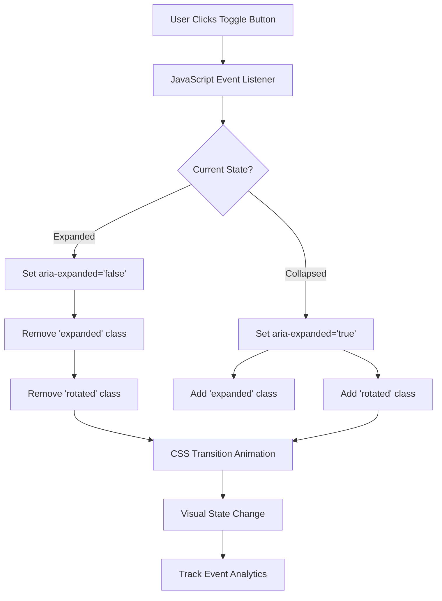
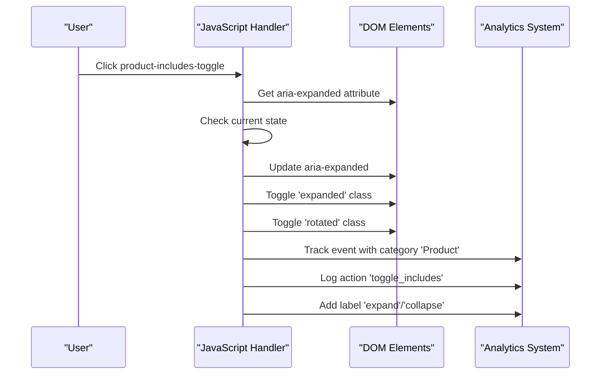
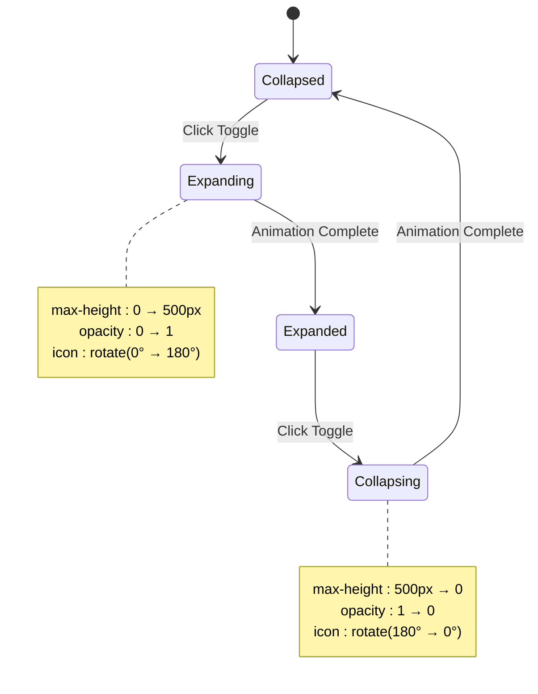

# Accordion Toggles

<cite>
**Referenced Files in This Document**
- [assets/main.js](file://assets/main.js)
- [assets/styles.css](file://assets/styles.css)
- [price.html](file://price.html)
- [index.html](file://index.html)
</cite>

## Table of Contents
1. [Introduction](#introduction)
2. [Implementation Overview](#implementation-overview)
3. [JavaScript Event Listeners](#javascript-event-listeners)
4. [CSS Transitions and Animations](#css-transitions-and-animations)
5. [HTML Structure](#html-structure)
6. [Accessibility Features](#accessibility-features)
7. [Analytics Integration](#analytics-integration)
8. [Styling and Visual Feedback](#styling-and-visual-feedback)
9. [Troubleshooting Guide](#troubleshooting-guide)
10. [Best Practices](#best-practices)

## Introduction

The accordion toggle functionality is a core interactive component used throughout the Knyazev PRO website to display product details and examples in a space-efficient manner. This system provides users with expandable/collapsible content sections that enhance usability while maintaining clean visual presentation.

The implementation consists of two primary toggle types: **product-includes-toggle** for detailed service descriptions and **product-examples-toggle** for showcasing sample projects. Both use consistent JavaScript event handling, CSS transitions, and accessibility features to deliver a seamless user experience.

## Implementation Overview

The accordion system operates through a coordinated relationship between JavaScript event listeners, CSS transitions, and HTML structure. The core functionality manages the expanded/collapsed state using ARIA attributes and dynamically applies CSS classes for visual feedback.



**Diagram sources**
- [assets/main.js](file://assets/main.js#L358-L372)
- [assets/main.js](file://assets/main.js#L374-L392)

**Section sources**
- [assets/main.js](file://assets/main.js#L358-L392)
- [assets/styles.css](file://assets/styles.css#L398-L415)

## JavaScript Event Listeners

The accordion functionality is implemented through two distinct JavaScript event handlers that process clicks on different toggle elements. Each handler follows the same state management pattern but targets specific DOM elements.

### Product Includes Toggle Handler

The product includes toggle manages detailed service descriptions and technical specifications. The handler processes clicks on elements with the `.product-includes-toggle` class, managing the expansion of associated content sections.



**Diagram sources**
- [assets/main.js](file://assets/main.js#L358-L372)

### Product Examples Toggle Handler

The product examples toggle controls the visibility of sample project links and demonstrations. This handler manages the expansion of content containing video examples and portfolio links.

Both handlers share identical logic patterns but operate on different content structures. They utilize the same tracking mechanism to monitor user interactions for analytics purposes.

**Section sources**
- [assets/main.js](file://assets/main.js#L358-L392)

## CSS Transitions and Animations

The visual feedback system employs sophisticated CSS transitions to create smooth, engaging animations during state changes. The implementation uses multiple transition properties for optimal visual effect.

### Max-Height Transitions

The primary animation mechanism uses `max-height` property transitions to create fluid opening and closing effects. Different maximum heights are defined for various content types to accommodate varying amounts of information.

| Content Type | Max Height | Transition Duration |
|--------------|------------|-------------------|
| Product Includes | 500px | 0.3s ease |
| Product Examples | 300px | 0.3s ease |

### Opacity Transitions

Complementing the height transitions, opacity changes provide additional visual cues during state transitions. The opacity starts at 0 and transitions to 1 for expanded states, creating a fade-in effect.

### Icon Rotation Animation

The toggle icon uses a transform-based rotation animation that smoothly rotates 180 degrees when the content expands. The rotation centers around the icon's axis, providing clear visual feedback.



**Diagram sources**
- [assets/styles.css](file://assets/styles.css#L405-L415)

**Section sources**
- [assets/styles.css](file://assets/styles.css#L405-L415)

## HTML Structure

The accordion toggle system requires specific HTML markup patterns to function correctly. Each toggle consists of a button element followed by a content section, with proper ARIA attributes for accessibility.

### Basic Toggle Structure

Each accordion toggle follows a consistent HTML pattern:

```html
<button class="product-includes-toggle" aria-expanded="false">
  <h4>ПОДРОБНЕЕ</h4>
  <span class="toggle-icon">▼</span>
</button>
<div class="product-includes-content">
  <!-- Content goes here -->
</div>
```

### Content Organization

The content sections contain structured information appropriate to their purpose:

- **Product Includes**: Lists of services, features, and technical specifications
- **Product Examples**: Links to sample projects, videos, and portfolio items

### Accessibility Markup

Critical accessibility attributes ensure proper screen reader support and keyboard navigation:

- `aria-expanded`: Indicates current expanded state
- `aria-label`: Provides descriptive labels for assistive technologies
- Proper heading hierarchy maintains logical content structure

**Section sources**
- [price.html](file://price.html#L40-L120)

## Accessibility Features

The accordion implementation incorporates comprehensive accessibility features to ensure usability for all users, including those using screen readers and keyboard navigation.

### ARIA Attributes

The system uses essential ARIA attributes to communicate state and functionality:

- **aria-expanded**: Boolean attribute indicating whether the content is currently visible
- **aria-controls**: References the content element being controlled (implied through DOM structure)
- **aria-label**: Descriptive labels for screen readers

### Keyboard Navigation

Full keyboard accessibility is provided through standard keyboard interaction patterns:

- **Space/Enter**: Activate toggle buttons
- **Tab**: Navigate between interactive elements
- **Escape**: Close expanded content (when applicable)

### Screen Reader Support

Screen readers receive appropriate announcements when content expands or collapses:

- State change announcements
- Content availability notifications
- Structural hierarchy information

### Focus Management

Proper focus management ensures keyboard users can navigate effectively:

- Focus indicators remain visible during keyboard interaction
- Focus returns appropriately after state changes
- Logical tab order maintained throughout interface

**Section sources**
- [assets/main.js](file://assets/main.js#L358-L392)
- [assets/styles.css](file://assets/styles.css#L398-L405)

## Analytics Integration

The accordion system integrates with Google Analytics through the `trackEvent` function, providing valuable insights into user behavior and interaction patterns.

### Event Tracking Structure

Each toggle interaction generates a custom event with specific parameters:

```javascript
trackEvent('Product', 'toggle_includes', isExpanded ? 'collapse' : 'expand');
```

### Event Categories and Actions

| Category | Action | Purpose |
|----------|--------|---------|
| Product | toggle_includes | Tracks service detail expansions |
| Product | toggle_examples | Tracks example gallery interactions |

### Data Collection Benefits

The analytics integration provides several benefits:

- **User Behavior Insights**: Understanding which content users engage with most
- **Performance Metrics**: Measuring accordion effectiveness and engagement rates
- **Optimization Opportunities**: Identifying areas for content improvement

**Section sources**
- [assets/main.js](file://assets/main.js#L348-L356)
- [assets/main.js](file://assets/main.js#L372-L392)

## Styling and Visual Feedback

The visual design system provides clear, intuitive feedback through multiple styling approaches that enhance user experience and maintain design consistency.

### Hover States

Interactive elements respond to hover states with subtle visual changes:

- **Color Changes**: Text color shifts to brand accent color
- **Cursor Changes**: Pointer cursor indicates interactivity
- **Background Effects**: Subtle background changes on hover

### Focus Indicators

Keyboard navigation receives clear visual feedback through focus styling:

- **Outline Styles**: Solid outline with brand color
- **Offset Properties**: 2px offset for improved visibility
- **Border Radius**: Consistent rounded corners for focus states

### Icon Styling

Toggle icons use a consistent design approach:

- **Font-Based Icons**: Vector-based icons for scalability
- **Transition Properties**: Smooth rotation animations
- **Color Consistency**: Brand color with appropriate opacity

### Responsive Design

The styling adapts to various screen sizes while maintaining functionality:

- **Mobile Optimization**: Touch-friendly sizing and spacing
- **Breakpoint Adjustments**: Responsive typography and layout
- **Touch Target Sizing**: Minimum 44px touch targets

**Section sources**
- [assets/styles.css](file://assets/styles.css#L398-L415)

## Troubleshooting Guide

Common issues with accordion functionality can be resolved through systematic troubleshooting approaches.

### Transition Timing Issues

**Problem**: Content appears to jump or flash during state changes
**Solution**: Verify CSS transition properties are properly defined and compatible with browser rendering engines.

**Problem**: Transitions appear choppy or inconsistent
**Solution**: Check for conflicting CSS properties and ensure hardware acceleration is enabled.

### Content Overflow Problems

**Problem**: Content extends beyond visible boundaries when expanded
**Solution**: Review max-height values and ensure content fits within defined limits.

**Problem**: Scrollbars appear unexpectedly
**Solution**: Verify overflow properties and content dimensions.

### Accessibility Concerns

**Problem**: Screen readers don't announce state changes
**Solution**: Confirm ARIA attributes are properly set and updated during state changes.

**Problem**: Keyboard navigation is interrupted
**Solution**: Verify focus management and tab order consistency.

### JavaScript Execution Issues

**Problem**: Toggle buttons don't respond to clicks
**Solution**: Check JavaScript loading order and ensure DOM elements are available.

**Problem**: Events fire multiple times
**Solution**: Verify event listener attachment and cleanup procedures.

**Section sources**
- [assets/main.js](file://assets/main.js#L358-L392)
- [assets/styles.css](file://assets/styles.css#L405-L415)

## Best Practices

### Performance Optimization

- **Efficient Selectors**: Use specific class selectors for optimal performance
- **Event Delegation**: Consider event delegation for dynamic content
- **CSS Hardware Acceleration**: Leverage GPU acceleration for smooth animations

### Code Maintainability

- **Consistent Patterns**: Maintain uniform coding patterns across implementations
- **Modular Structure**: Separate concerns between JavaScript, CSS, and HTML
- **Documentation**: Document custom implementations and extensions

### User Experience Guidelines

- **Clear Visual Feedback**: Ensure state changes are immediately apparent
- **Responsive Design**: Test across various devices and screen sizes
- **Accessibility Compliance**: Regularly audit for WCAG compliance

### Testing Strategies

- **Cross-Browser Compatibility**: Test across major browsers and versions
- **Device Testing**: Verify functionality on mobile and desktop devices
- **Accessibility Testing**: Use screen readers and keyboard-only navigation