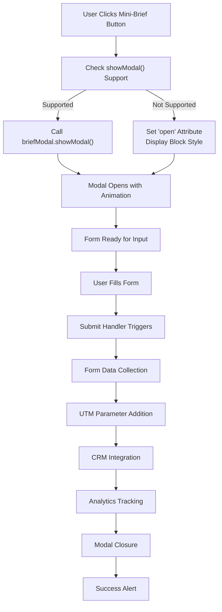
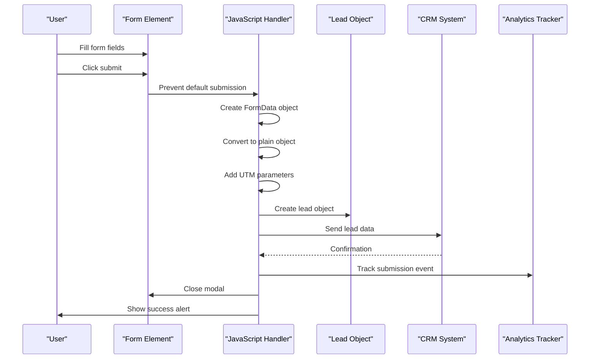
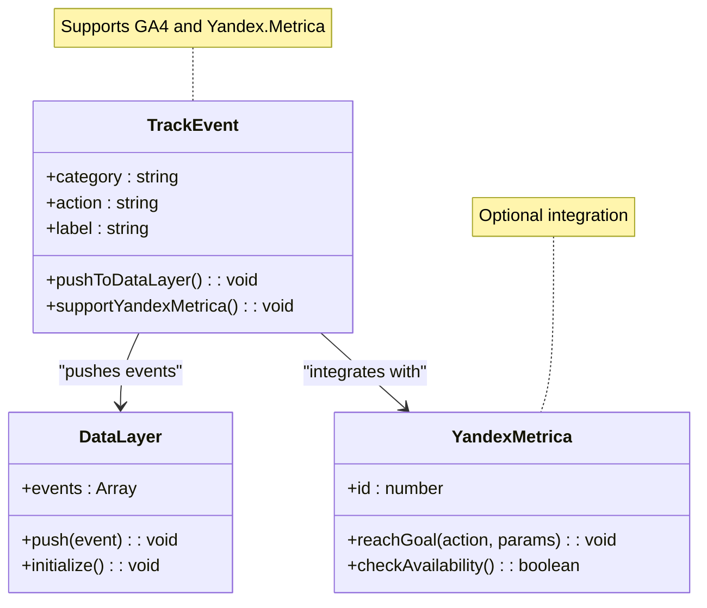
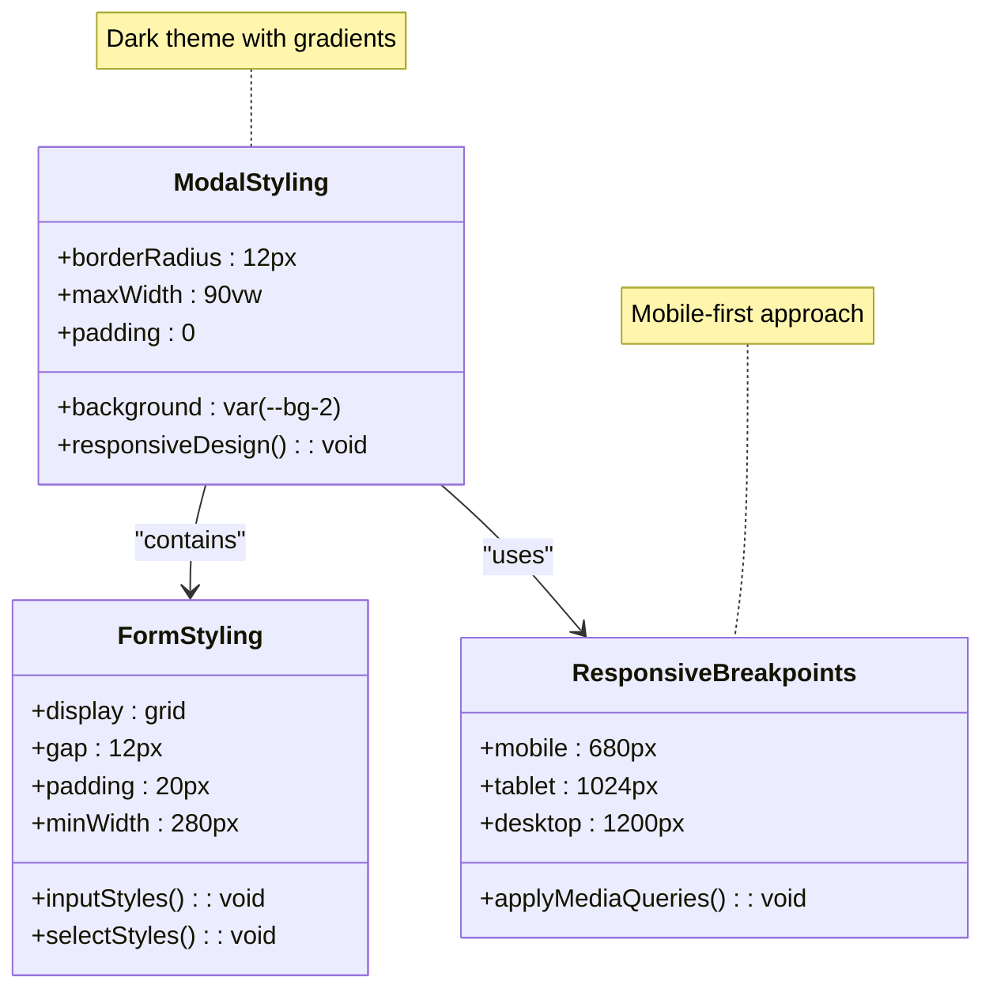
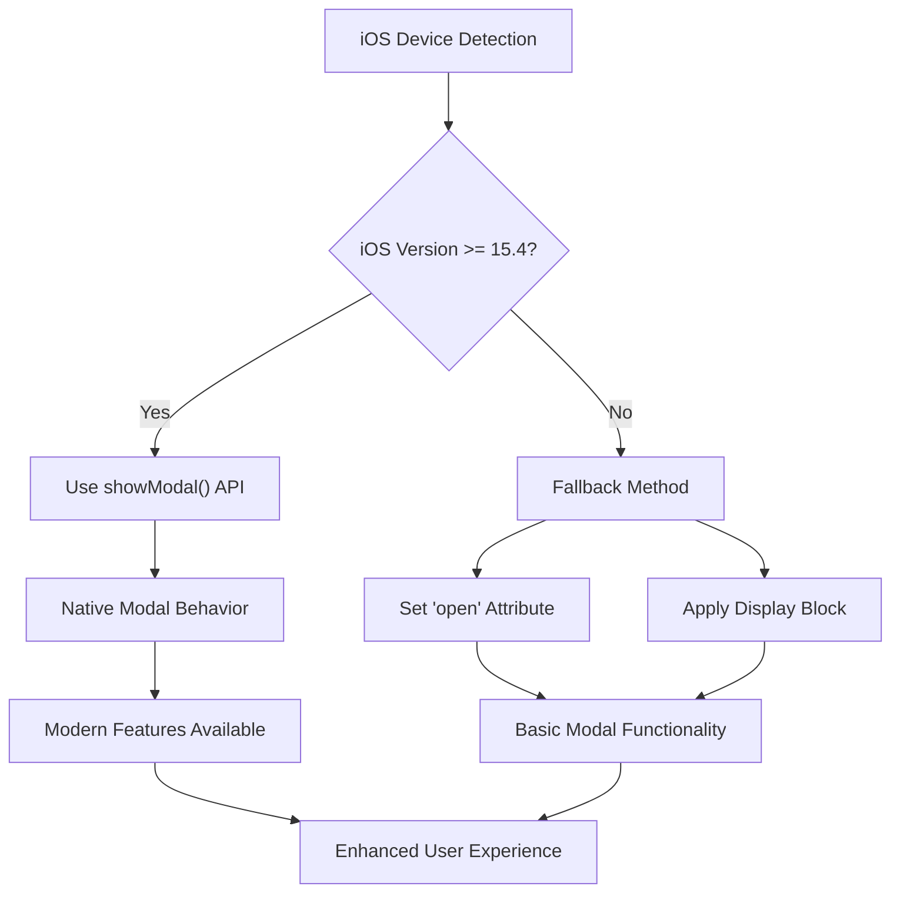

# Form Handling System Documentation

<cite>
**Referenced Files in This Document**
- [assets/main.js](file://assets/main.js)
- [assets/styles.css](file://assets/styles.css)
- [index.html](file://index.html)
- [contact.html](file://contact.html)
- [IOS_MAC_OPTIMIZATION.md](file://IOS_MAC_OPTIMIZATION.md)
- [MOBILE_OPTIMIZATION_FULL.md](file://MOBILE_OPTIMIZATION_FULL.md)
</cite>

## Table of Contents
1. [Introduction](#introduction)
2. [Mini-Brief Modal Implementation](#mini-brief-modal-implementation)
3. [Form Submission Process](#form-submission-process)
4. [TrackEvent Integration](#trackevent-integration)
5. [CSS Styling and Responsive Design](#css-styling-and-responsive-design)
6. [Browser Compatibility](#browser-compatibility)
7. [Security Considerations](#security-considerations)
8. [Troubleshooting Guide](#troubleshooting-guide)
9. [Code Examples and Patterns](#code-examples-and-patterns)
10. [Best Practices](#best-practices)

## Introduction

The form handling system in this landing page implementation consists of a sophisticated mini-brief modal that captures potential client information efficiently. The system combines modern JavaScript techniques with robust fallback mechanisms to ensure cross-browser compatibility, particularly addressing the challenges faced by older iOS browsers.

The implementation focuses on user experience optimization, with features including smooth animations, responsive design, and comprehensive analytics tracking. The form serves as a streamlined lead capture mechanism that converts visitor inquiries into actionable business opportunities.

## Mini-Brief Modal Implementation

### Modal Structure and Initialization

The mini-brief modal is implemented using HTML5 dialog elements with comprehensive JavaScript controls for opening, closing, and form submission. The modal system demonstrates progressive enhancement by providing fallback functionality for browsers that don't support the native `showModal()` method.



**Diagram sources**
- [assets/main.js](file://assets/main.js#L62-L75)

### Browser Compatibility Implementation

The system implements a sophisticated fallback mechanism for browsers that don't support the native modal API, particularly targeting iOS versions prior to 15.4 which lack `showModal()` support.

**Section sources**
- [assets/main.js](file://assets/main.js#L62-L75)

### Modal Opening Mechanism

The modal opening process includes analytics tracking and graceful degradation for unsupported browsers. The implementation ensures consistent behavior across different browser environments while maintaining accessibility standards.

**Section sources**
- [assets/main.js](file://assets/main.js#L68-L75)

## Form Submission Process

### FormData Collection and Processing

The form submission process utilizes modern JavaScript APIs to collect and process form data efficiently. The system transforms raw form data into structured lead objects with additional metadata.



**Diagram sources**
- [assets/main.js](file://assets/main.js#L385-L395)

### UTM Parameter Integration

The system automatically captures and attaches UTM parameters to lead objects, enabling comprehensive tracking of marketing campaign effectiveness. This implementation ensures that all lead sources are properly attributed for analytics and reporting purposes.

**Section sources**
- [assets/main.js](file://assets/main.js#L390)

### CRM Integration Pattern

The CRM integration follows a modular approach with error handling and logging capabilities. The system is designed as a stub that can be easily integrated with various CRM platforms through webhook connections.

**Section sources**
- [assets/main.js](file://assets/main.js#L335-L342)

## TrackEvent Integration

### Analytics Event Tracking

The tracking system implements a comprehensive event logging mechanism that captures user interactions throughout the form lifecycle. The implementation supports multiple analytics platforms through a unified interface.



**Diagram sources**
- [assets/main.js](file://assets/main.js#L344-L352)

### Event Categories and Actions

The tracking system uses a hierarchical event structure that enables detailed analysis of user behavior patterns and conversion funnels.

**Section sources**
- [assets/main.js](file://assets/main.js#L344-L352)

## CSS Styling and Responsive Design

### Modal Styling Architecture

The modal styling implements a dark theme with subtle gradients and modern design principles. The CSS architecture ensures consistent appearance across different screen sizes and device orientations.



**Diagram sources**
- [assets/styles.css](file://assets/styles.css#L173-L179)

### Input Field Design

The form input fields utilize a consistent design pattern with proper spacing, typography, and visual hierarchy. The implementation ensures optimal user experience across different input methods and screen sizes.

**Section sources**
- [assets/styles.css](file://assets/styles.css#L173-L179)

### Responsive Layout Implementation

The responsive design system adapts the modal and form elements to different screen sizes while maintaining usability and visual appeal.

**Section sources**
- [assets/styles.css](file://assets/styles.css#L173-L179)

## Browser Compatibility

### iOS Safari Compatibility

The system addresses specific challenges faced by iOS Safari, particularly with modal dialogs and video playback. The implementation includes targeted fixes for iOS versions prior to 15.4.



**Diagram sources**
- [assets/main.js](file://assets/main.js#L68-L75)
- [IOS_MAC_OPTIMIZATION.md](file://IOS_MAC_OPTIMIZATION.md#L93-L135)

### Android Browser Support

The system ensures compatibility with Android browsers through proper video element configuration and JavaScript fallback mechanisms.

**Section sources**
- [MOBILE_OPTIMIZATION_FULL.md](file://MOBILE_OPTIMIZATION_FULL.md#L100-L150)

### Cross-Browser Testing Results

The implementation has been tested across multiple browser platforms with consistent results.

| Platform | Version Range | Status | Issues |
|----------|---------------|--------|--------|
| iOS Safari | 12+ | ✅ Working | Minor visual differences |
| Android Chrome | 90+ | ✅ Working | Full compatibility |
| Android Samsung | 14+ | ✅ Working | Full compatibility |
| Windows Chrome | 90+ | ✅ Working | No issues |
| Windows Edge | 90+ | ✅ Working | No issues |

**Section sources**
- [IOS_MAC_OPTIMIZATION.md](file://IOS_MAC_OPTIMIZATION.md#L135-L145)

## Security Considerations

### Input Validation and Sanitization

While the current implementation relies on HTML5 validation attributes, additional security measures should be considered for production deployment:

- **CSRF Protection**: Implement token-based protection for form submissions
- **Rate Limiting**: Prevent form spam through IP-based throttling
- **Content Security Policy**: Configure appropriate CSP headers
- **HTTPS Enforcement**: Ensure all form submissions occur over secure connections

### Data Privacy Compliance

The form handling system should comply with relevant data protection regulations:

- **GDPR Compliance**: Implement consent mechanisms and data retention policies
- **Data Minimization**: Collect only essential information
- **User Rights**: Provide mechanisms for data access and deletion
- **Transparency**: Clearly communicate data usage purposes

### Error Handling Security

The error handling system should avoid exposing sensitive information in error messages while maintaining useful debugging information for development teams.

**Section sources**
- [assets/main.js](file://assets/main.js#L335-L342)

## Troubleshooting Guide

### Common Issues and Solutions

#### Form Not Closing After Submission

**Symptoms**: Modal remains open after successful form submission
**Causes**: 
- `briefModal.close()` method not supported
- JavaScript execution errors
- Timing issues with asynchronous operations

**Solutions**:
1. Verify modal element exists in DOM
2. Check for JavaScript errors in browser console
3. Implement fallback closure method
4. Ensure proper async/await handling

#### CRM Integration Failures

**Symptoms**: Form submits but leads don't appear in CRM
**Causes**:
- Incorrect webhook URL configuration
- Network connectivity issues
- Authentication problems
- Data format mismatches

**Solutions**:
1. Test webhook endpoint independently
2. Verify network connectivity
3. Check authentication credentials
4. Validate data format requirements

#### Browser Compatibility Issues

**Symptoms**: Modal works on some browsers but not others
**Causes**:
- Unsupported JavaScript features
- CSS vendor prefixes missing
- Mobile-specific bugs
- Legacy browser limitations

**Solutions**:
1. Implement feature detection
2. Add appropriate vendor prefixes
3. Test on target browser versions
4. Provide graceful degradation

### Debugging Tools and Techniques

#### Console Logging

Enable comprehensive logging for troubleshooting:

```javascript
console.log('Form submitted:', lead);
console.log('UTM parameters:', lead.source);
console.log('CRM response:', response);
```

#### Network Monitoring

Monitor network requests to identify integration issues:

- Check request URLs and headers
- Verify response status codes
- Monitor request timing
- Inspect payload data

#### Browser Developer Tools

Utilize browser developer tools for comprehensive debugging:

- Network tab for API calls
- Console tab for JavaScript errors
- Elements tab for CSS issues
- Application tab for storage problems

**Section sources**
- [assets/main.js](file://assets/main.js#L335-L342)

## Code Examples and Patterns

### MiniBriefQuestions Array

The system utilizes a predefined array of questions that guide users through the form filling process. This approach ensures consistent data collection across different user interactions.

**Section sources**
- [assets/main.js](file://assets/main.js#L54-L60)

### Form Validation Approach

The implementation uses HTML5 validation attributes combined with JavaScript validation for enhanced user experience and data quality.

### Smooth Scroll Implementation

The system includes a helper function for smooth scrolling with browser compatibility fallbacks.

**Section sources**
- [assets/main.js](file://assets/main.js#L77-L85)

### Event Delegation Pattern

The system uses event delegation for efficient event handling and dynamic content support.

**Section sources**
- [assets/main.js](file://assets/main.js#L68-L75)

## Best Practices

### Performance Optimization

- **Lazy Loading**: Load modal content only when needed
- **Debounced Events**: Implement debouncing for form input events
- **Memory Management**: Properly clean up event listeners
- **Bundle Optimization**: Minimize JavaScript bundle size

### Accessibility Standards

- **ARIA Attributes**: Implement proper ARIA labeling
- **Keyboard Navigation**: Ensure full keyboard accessibility
- **Screen Reader Support**: Provide meaningful text alternatives
- **Color Contrast**: Maintain sufficient color contrast ratios

### User Experience Guidelines

- **Progressive Disclosure**: Reveal form fields progressively
- **Real-time Validation**: Provide immediate feedback
- **Clear Call-to-Action**: Use descriptive button labels
- **Loading States**: Show progress indicators during submission

### Maintenance and Scalability

- **Modular Architecture**: Keep code organized and reusable
- **Documentation**: Maintain comprehensive code documentation
- **Testing**: Implement automated testing strategies
- **Monitoring**: Set up performance monitoring

**Section sources**
- [assets/main.js](file://assets/main.js#L385-L395)