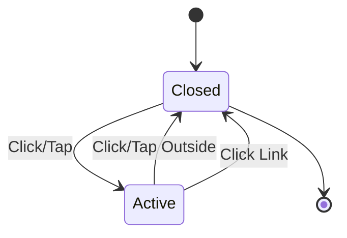
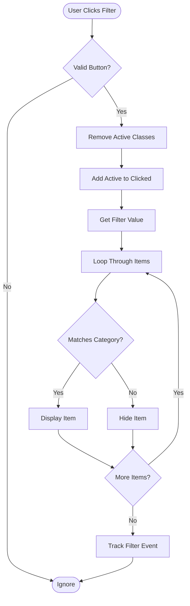
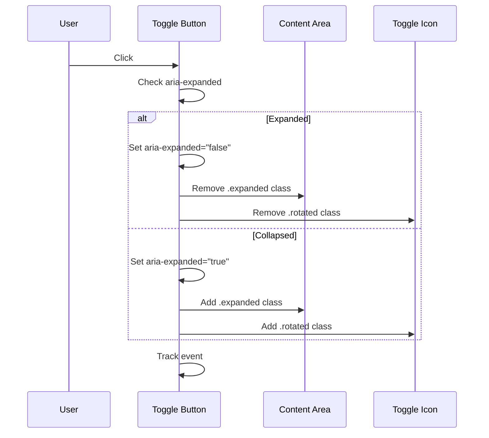
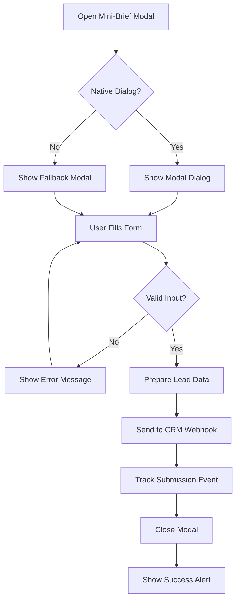

# Interactive Features

<cite>
**Referenced Files in This Document**
- [assets/main.js](file://assets/main.js)
- [assets/styles.css](file://assets/styles.css)
- [index.html](file://index.html)
- [portfolio.html](file://portfolio.html)
- [MOBILE_OPTIMIZATION_FULL.md](file://MOBILE_OPTIMIZATION_FULL.md)
- [README.md](file://README.md)
</cite>

## Table of Contents
1. [Introduction](#introduction)
2. [Mobile Navigation System](#mobile-navigation-system)
3. [Portfolio Filtering Mechanism](#portfolio-filtering-mechanism)
4. [Accordion Toggles](#accordion-toggles)
5. [Form Handling System](#form-handling-system)
6. [Smooth Scrolling Implementation](#smooth-scrolling-implementation)
7. [Video Autoplay Management](#video-autoplay-management)
8. [Responsive Design Patterns](#responsive-design-patterns)
9. [Troubleshooting Guide](#troubleshooting-guide)
10. [Performance Optimizations](#performance-optimizations)

## Introduction

The interactive features of this Knyazev Pro landing site represent a sophisticated blend of modern web technologies designed to create seamless user experiences across all devices. Built with vanilla JavaScript and CSS, the system emphasizes accessibility, performance, and cross-platform compatibility while maintaining a professional corporate aesthetic.

The interactive elements focus on driving user engagement through intuitive navigation, dynamic content filtering, and streamlined conversion processes. Each feature is carefully crafted to handle the complexities of mobile device interactions while providing desktop users with rich, responsive experiences.

## Mobile Navigation System

The mobile navigation system serves as the primary interface for accessing site content on smaller screens, featuring a hamburger menu toggle with sophisticated state management and accessibility compliance.

### Hamburger Menu Toggle Implementation

The navigation toggle utilizes a clean, minimalist design with CSS transforms for smooth animations and ARIA state management for screen reader compatibility.

**Diagram sources**
- [assets/main.js](file://assets/main.js#L25-L40)
- [assets/styles.css](file://assets/styles.css#L420-L430)

The implementation features:
- **CSS Transform Animation**: Three-bar hamburger icon transforms into an X shape using CSS transitions
- **State Management**: Active class toggles on both menu button and navigation container
- **Accessibility**: Proper ARIA labels and roles for screen readers
- **Touch Optimization**: `touch-action: manipulation` prevents unwanted browser gestures

### Menu Closing Behavior

The navigation system implements intelligent closing mechanisms to prevent user frustration and ensure predictable behavior.

**Section sources**
- [assets/main.js](file://assets/main.js#L25-L50)
- [index.html](file://index.html#L15-L35)

### Outside Click Detection

The system employs event delegation to detect clicks outside the navigation area, providing a natural way to close the menu when users interact with the main content area.

**Section sources**
- [assets/main.js](file://assets/main.js#L40-L50)

### Mobile-Specific Styling

The navigation adapts seamlessly to various screen sizes with responsive breakpoints and optimized touch targets.

**Section sources**
- [assets/styles.css](file://assets/styles.css#L350-L420)

## Portfolio Filtering Mechanism

The portfolio filtering system enables users to discover relevant video content through dynamic category selection with immediate visual feedback and smooth transitions.

### Filter Button Architecture

Each filter button contains both visual and functional elements, including category icons and text labels, all managed through a unified event handling system.

**Diagram sources**
- [assets/main.js](file://assets/main.js#L120-L130)
- [portfolio.html](file://portfolio.html#L25-L50)

### Dynamic Video Visibility Control

The filtering system operates on a category-based visibility model, allowing precise control over which videos appear in the portfolio grid.

**Section sources**
- [assets/main.js](file://assets/main.js#L120-L130)
- [portfolio.html](file://portfolio.html#L350-L380)

### Visual Feedback System

Active filters receive immediate visual feedback through CSS class management, ensuring users understand their current selection state.

**Section sources**
- [assets/styles.css](file://assets/styles.css#L200-L220)

### Category Data Management

The system maintains comprehensive video categorization through a centralized JavaScript object containing all video IDs organized by thematic categories.

**Section sources**
- [assets/main.js](file://assets/main.js#L130-L200)

## Accordion Toggles

The accordion system provides expandable content sections for service details and product examples, featuring smooth animations and proper ARIA state management for accessibility compliance.

### Toggle State Management

Each accordion toggle maintains its expanded/collapsed state through ARIA attributes and CSS classes, ensuring consistent behavior across different interaction methods.

**Diagram sources**
- [assets/main.js](file://assets/main.js#L380-L410)

### Accessibility Implementation

The accordion system includes comprehensive ARIA support for screen readers and keyboard navigation, ensuring accessibility compliance across all interactive elements.

**Section sources**
- [assets/main.js](file://assets/main.js#L380-L410)

### Smooth Transition Effects

CSS transitions provide smooth visual feedback during expansion and collapse operations, enhancing the user experience without sacrificing performance.

**Section sources**
- [assets/styles.css](file://assets/styles.css#L440-L450)

## Form Handling System

The form handling system manages the mini-brief submission process, including input validation, CRM webhook integration, and user feedback mechanisms.

### Mini-Brief Modal Implementation

The mini-brief form utilizes the native HTML dialog API with graceful degradation for older browsers, providing a modern user experience while maintaining compatibility.

**Diagram sources**
- [assets/main.js](file://assets/main.js#L50-L80)
- [index.html](file://index.html#L220-L248)

### Input Validation and Processing

The form system validates user input and prepares data for CRM submission through a structured processing pipeline.

**Section sources**
- [assets/main.js](file://assets/main.js#L390-L410)
- [index.html](file://index.html#L220-L248)

### CRM Webhook Integration

The system includes a stubbed CRM webhook function that can be easily integrated with popular CRM platforms for lead management and analytics tracking.

**Section sources**
- [assets/main.js](file://assets/main.js#L370-L380)

### Confirmation Feedback

Users receive immediate feedback upon successful form submission through native alerts and analytics tracking.

**Section sources**
- [assets/main.js](file://assets/main.js#L390-L410)

## Smooth Scrolling Implementation

The smooth scrolling system provides enhanced navigation experiences across different platforms, with intelligent fallback mechanisms for older browsers.

### Cross-Platform Scroll Behavior

The implementation detects browser capabilities and applies appropriate scrolling methods for optimal performance and user experience.

**Section sources**
- [assets/main.js](file://assets/main.js#L70-L85)

### Platform-Specific Optimizations

Different scrolling approaches are employed based on browser capabilities, ensuring consistent behavior across desktop and mobile platforms.

**Section sources**
- [assets/main.js](file://assets/main.js#L70-L85)

## Video Autoplay Management

The video autoplay system handles the complex requirements of video playback across different mobile platforms and browsers, with comprehensive fallback mechanisms.

### Mobile Video Optimization

The system addresses platform-specific video playback issues through targeted optimizations for iOS and Android devices.

**Section sources**
- [assets/main.js](file://assets/main.js#L1-L25)

### Autoplay Fallback Strategy

When automatic video playback is blocked, the system provides seamless fallback mechanisms to ensure content availability.

**Section sources**
- [assets/main.js](file://assets/main.js#L15-L25)

## Responsive Design Patterns

The interactive features incorporate responsive design principles that adapt to various screen sizes and device capabilities while maintaining consistent functionality.

### Breakpoint Management

The system uses strategic breakpoints to optimize user interfaces for different device categories, ensuring optimal usability across the mobile-to-desktop spectrum.

**Section sources**
- [assets/styles.css](file://assets/styles.css#L350-L420)

### Touch Target Optimization

Interactive elements are sized appropriately for touch interaction, with minimum dimensions and spacing guidelines to prevent accidental taps and improve accessibility.

**Section sources**
- [assets/styles.css](file://assets/styles.css#L420-L430)

## Troubleshooting Guide

Common issues with interactive features and their solutions are documented here to assist with maintenance and debugging.

### iOS Viewport Issues

iOS-specific viewport problems are addressed through dedicated CSS fixes and JavaScript detection mechanisms.

**Section sources**
- [MOBILE_OPTIMIZATION_FULL.md](file://MOBILE_OPTIMIZATION_FULL.md#L50-L80)

### Mobile Video Loading Failures

Video playback issues on mobile devices are resolved through platform-specific optimizations and fallback strategies.

**Section sources**
- [assets/main.js](file://assets/main.js#L1-L25)

### Modal Display Problems

Modal-related issues are typically caused by CSS conflicts or JavaScript initialization timing and can be resolved through careful debugging and testing.

**Section sources**
- [assets/main.js](file://assets/main.js#L50-L80)

### Performance Optimization Issues

Performance problems often stem from excessive DOM manipulation or inefficient event handling and can be addressed through code optimization and resource management.

## Performance Optimizations

The interactive features are optimized for maximum performance across all supported platforms, with particular attention to mobile device limitations.

### Event Delegation Strategies

Efficient event handling reduces memory usage and improves responsiveness through strategic use of event delegation and minimal listener counts.

**Section sources**
- [assets/main.js](file://assets/main.js#L25-L50)
- [assets/main.js](file://assets/main.js#L120-L130)

### CSS Transition Optimization

Smooth animations are achieved through hardware-accelerated CSS properties and efficient animation timing to minimize performance impact.

**Section sources**
- [assets/styles.css](file://assets/styles.css#L440-L450)

### Memory Management

The system implements proper cleanup procedures for event listeners and DOM references to prevent memory leaks in long-running sessions.