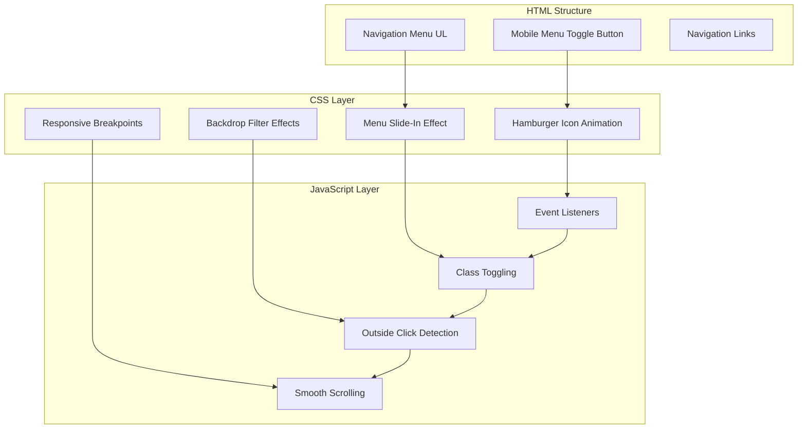
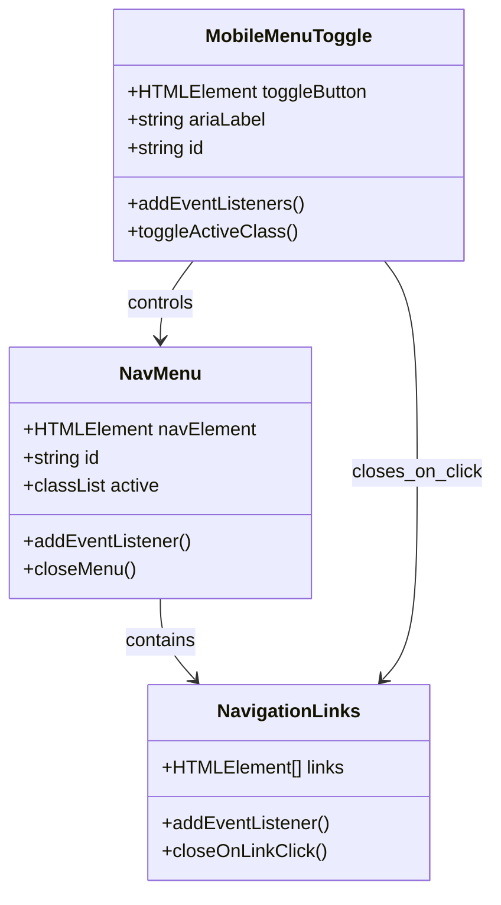
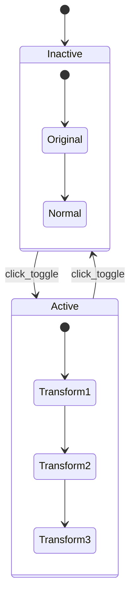
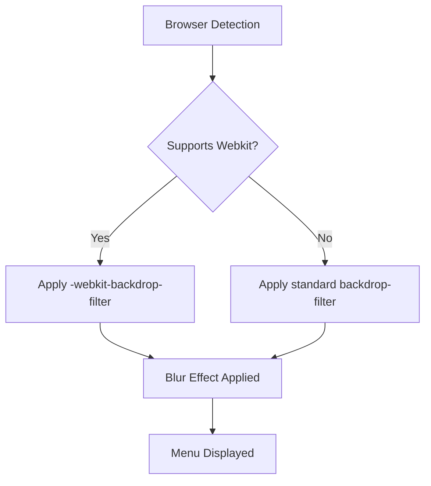
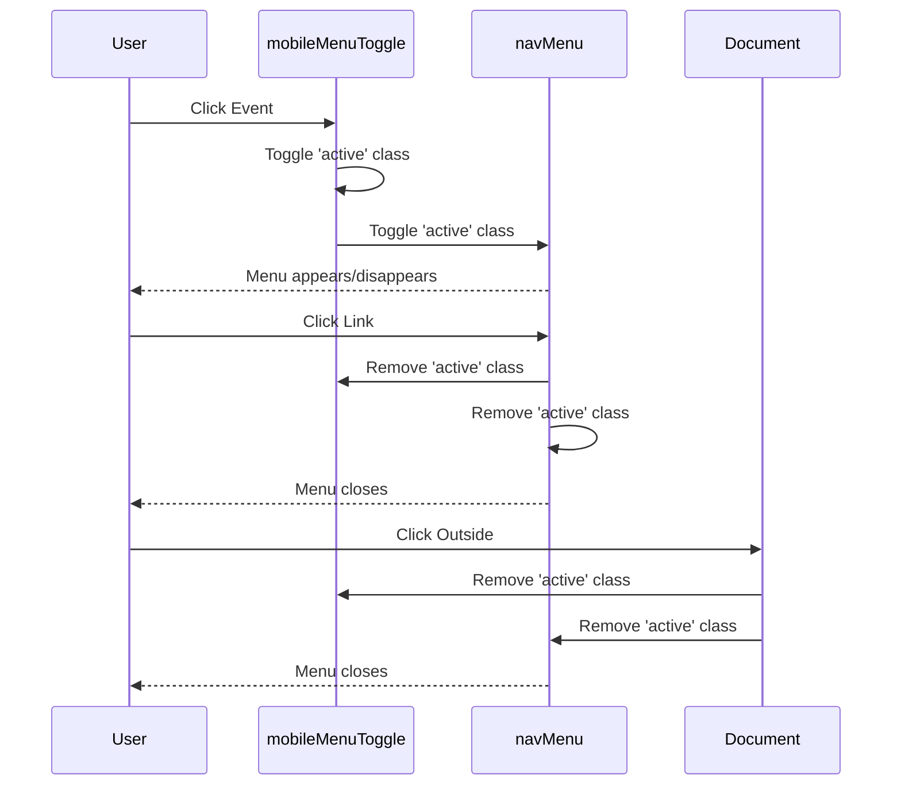
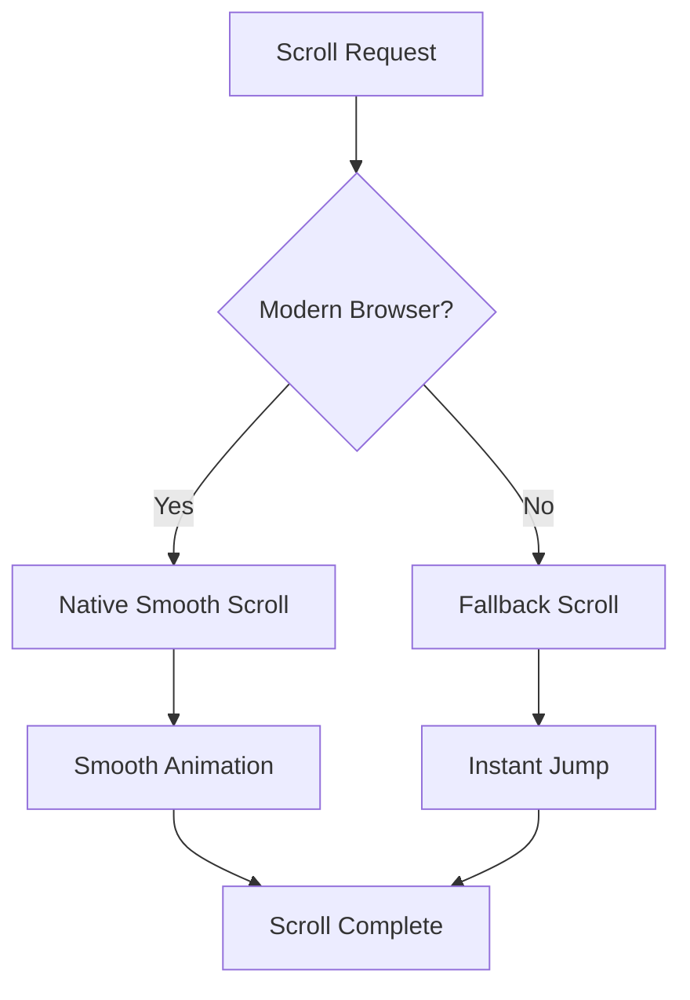
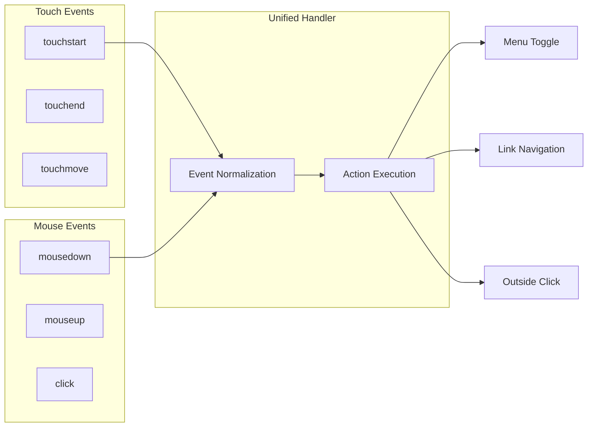
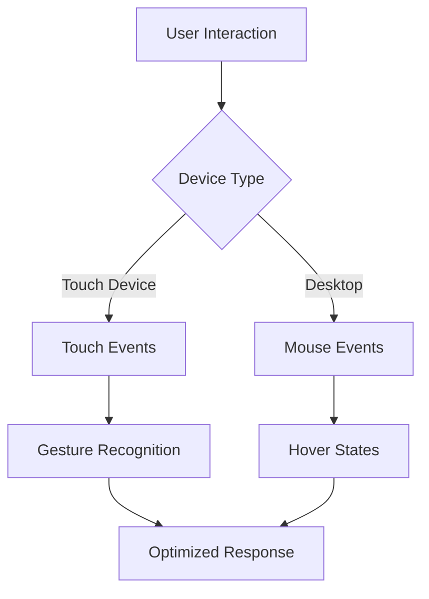
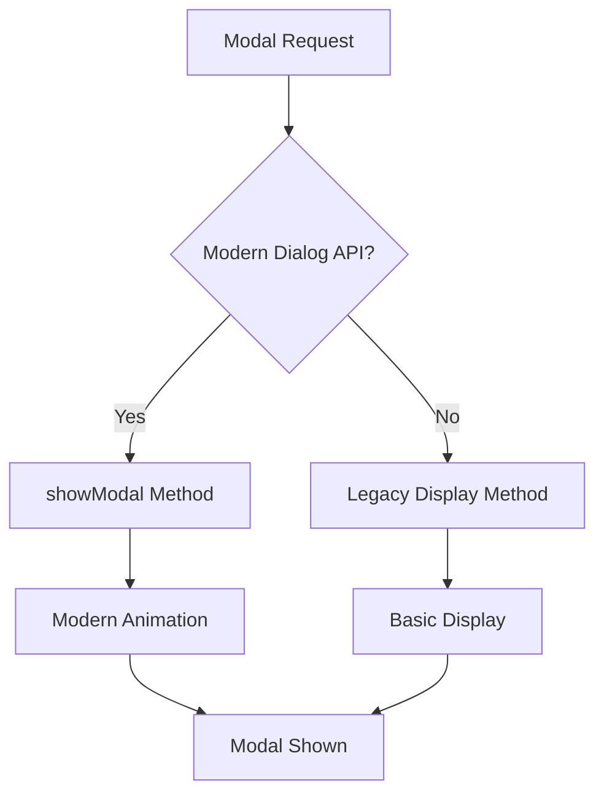
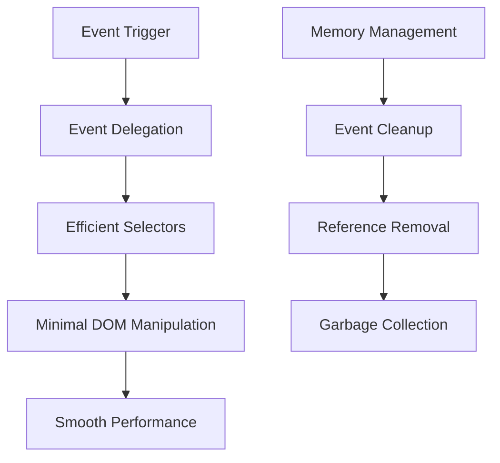

# Mobile Navigation System

<cite>
**Referenced Files in This Document**
- [assets/main.js](file://assets/main.js)
- [assets/styles.css](file://assets/styles.css)
- [index.html](file://index.html)
- [portfolio.html](file://portfolio.html)
- [contact.html](file://contact.html)
- [founder.html](file://founder.html)
- [price.html](file://price.html)
- [MOBILE_OPTIMIZATION_FULL.md](file://MOBILE_OPTIMIZATION_FULL.md)
- [IOS_MAC_OPTIMIZATION.md](file://IOS_MAC_OPTIMIZATION.md)
</cite>

## Table of Contents
1. [Introduction](#introduction)
2. [System Architecture](#system-architecture)
3. [Hamburger Menu Implementation](#hamburger-menu-implementation)
4. [CSS Transitions and Animations](#css-transitions-and-animations)
5. [JavaScript Event Handlers](#javascript-event-handlers)
6. [Responsive Design Media Queries](#responsive-design-media-queries)
7. [Touch and Click Event Handling](#touch-and-click-event-handling)
8. [iOS-Specific Optimizations](#ios-specific-optimizations)
9. [Common Issues and Troubleshooting](#common-issues-and-troubleshooting)
10. [Performance Considerations](#performance-considerations)
11. [Accessibility Features](#accessibility-features)
12. [Conclusion](#conclusion)

## Introduction

The mobile navigation system is a comprehensive solution designed to provide seamless navigation experiences across all devices and screen sizes. Built with modern web technologies, it features a sophisticated hamburger menu toggle with smooth animations, responsive design capabilities, and extensive cross-platform compatibility. The system handles touch and click events efficiently while maintaining optimal performance and accessibility standards.

## System Architecture

The mobile navigation system follows a modular architecture that separates concerns between presentation, behavior, and interactivity:



**Diagram sources**
- [index.html](file://index.html#L18-L26)
- [assets/styles.css](file://assets/styles.css#L380-L390)
- [assets/main.js](file://assets/main.js#L25-L45)

**Section sources**
- [index.html](file://index.html#L18-L26)
- [assets/styles.css](file://assets/styles.css#L380-L420)
- [assets/main.js](file://assets/main.js#L25-L45)

## Hamburger Menu Implementation

The hamburger menu is implemented using a semantic HTML structure with three distinct span elements representing the three horizontal lines of the iconic menu icon.

### HTML Structure

The mobile menu toggle consists of three key elements:



**Diagram sources**
- [index.html](file://index.html#L18-L26)
- [assets/main.js](file://assets/main.js#L25-L45)

### Element Identification

The system uses specific identifiers for the mobile menu components:

| Element | ID | Purpose |
|---------|----|----------|
| Toggle Button | `mobileMenuToggle` | Controls menu visibility |
| Navigation Menu | `navMenu` | Contains navigation links |

**Section sources**
- [index.html](file://index.html#L18-L26)
- [assets/main.js](file://assets/main.js#L25-L30)

## CSS Transitions and Animations

The mobile navigation system employs sophisticated CSS transitions to create smooth, engaging user experiences during menu interactions.

### Three-Line Icon Animation

The hamburger icon transforms into an "X" shape when the menu is active, using CSS transforms and transitions:



**Diagram sources**
- [assets/styles.css](file://assets/styles.css#L380-L390)

### Menu Slide-In Effect

The navigation menu slides in from the right side of the screen with a smooth transition:

| Property | Value | Purpose |
|----------|-------|---------|
| Position | `fixed` | Stays in viewport during scrolling |
| Width | `280px` (desktop) / `100%` (mobile) | Optimal touch targets |
| Background | `rgba(10,10,10,0.98)` | Semi-transparent dark overlay |
| Backdrop Filter | `blur(20px)` | Modern glassmorphism effect |
| Transition | `right 0.3s ease` | Smooth sliding animation |

### Backdrop Filter Compatibility

The system includes comprehensive browser compatibility for backdrop filters:



**Diagram sources**
- [assets/styles.css](file://assets/styles.css#L195-L200)
- [assets/styles.css](file://assets/styles.css#L283-L288)

**Section sources**
- [assets/styles.css](file://assets/styles.css#L380-L420)

## JavaScript Event Handlers

The JavaScript implementation provides robust event handling for menu interactions, including toggle functionality, outside click detection, and smooth scrolling.

### Menu Toggle Handler

The primary event handler manages the activation and deactivation of the mobile menu:



**Diagram sources**
- [assets/main.js](file://assets/main.js#L25-L45)

### Navigation Link Click Handling

Each navigation link automatically closes the menu when clicked:

| Event Type | Target | Action | Purpose |
|------------|--------|--------|---------|
| `click` | Individual links | Remove active classes | Close menu |
| `click` | Document | Check target containment | Close on outside click |
| `touchstart` | Body | Play video if needed | Autoplay video |

### Smooth Scrolling Implementation

The system includes intelligent smooth scrolling with fallback support:



**Diagram sources**
- [assets/main.js](file://assets/main.js#L75-L85)

**Section sources**
- [assets/main.js](file://assets/main.js#L25-L45)
- [assets/main.js](file://assets/main.js#L75-L85)

## Responsive Design Media Queries

The mobile navigation system utilizes breakpoint-specific CSS to ensure optimal user experience across different screen sizes.

### Desktop Breakpoint (1024px and Above)

```css
@media (max-width: 1024px) {
  /* Mobile menu styles */
  .mobile-menu-toggle { display: flex !important; }
  .hero-nav .contact-nav ul {
    position: fixed;
    top: 0;
    right: -100%;
    height: 100vh;
    width: 280px;
    transition: right 0.3s ease;
  }
}
```

### Mobile Breakpoint (680px and Below)

```css
@media (max-width: 680px) {
  .hero-nav .contact-nav ul {
    width: 100%;
    right: -100%;
  }
  .hero { min-height: 100vh; min-height: 100dvh; }
}
```

### Viewport Units and Accessibility

The system uses modern viewport units for improved accessibility:

| Unit | Purpose | Benefit |
|------|---------|---------|
| `100dvh` | Dynamic viewport height | Accounts for address bar |
| `100vw` | Full viewport width | Legacy compatibility |
| `100%` | Parent-relative sizing | Prevents overflow |

**Section sources**
- [assets/styles.css](file://assets/styles.css#L190-L220)
- [assets/styles.css](file://assets/styles.css#L220-L250)

## Touch and Click Event Handling

The system provides comprehensive event handling for both touch and mouse interactions across different device types.

### Cross-Platform Event Management



**Diagram sources**
- [assets/main.js](file://assets/main.js#L25-L45)

### Touch Action Optimization

The system optimizes touch interactions with specific configurations:

| Property | Value | Purpose |
|----------|-------|---------|
| `touch-action` | `manipulation` | Prevents unwanted gestures |
| `tap-highlight-color` | `transparent` | Removes blue highlight on tap |
| `user-select` | `none` | Prevents text selection during gestures |

### Device-Specific Optimizations

Different devices receive tailored event handling:



**Section sources**
- [assets/main.js](file://assets/main.js#L25-L45)
- [assets/styles.css](file://assets/styles.css#L380-L390)

## iOS-Specific Optimizations

The system includes extensive optimizations specifically designed for iOS devices, addressing platform-specific quirks and limitations.

### iOS Viewport Bug Fixes

The most critical iOS optimization addresses the 100vh viewport bug:

```css
/* iOS Safari 100vh fix */
@supports (-webkit-touch-callout: none) {
  html { height: -webkit-fill-available; }
  .hero { min-height: -webkit-fill-available; }
  .hero-media { height: -webkit-fill-available; }
}
```

### WebKit Prefix Compatibility

The system ensures broad compatibility with iOS Safari:

| Feature | Standard | WebKit Alternative | iOS Support |
|---------|----------|-------------------|-------------|
| Backdrop Filter | `backdrop-filter` | `-webkit-backdrop-filter` | iOS 15.4+ |
| Viewport Units | `100vh` | `-webkit-fill-available` | iOS 15.4+ |
| Smooth Scroll | `scroll-behavior` | Native support | iOS 15.4+ |

### Touch Delay Elimination

iOS Safari's 300ms tap delay is eliminated through:

```css
.btn, button {
  touch-action: manipulation;
  -webkit-tap-highlight-color: transparent;
}
```

### Modal Dialog Compatibility

The system provides fallback support for older iOS versions:



**Diagram sources**
- [assets/main.js](file://assets/main.js#L55-L65)

**Section sources**
- [IOS_MAC_OPTIMIZATION.md](file://IOS_MAC_OPTIMIZATION.md#L1-L50)
- [assets/styles.css](file://assets/styles.css#L190-L200)

## Common Issues and Troubleshooting

This section addresses frequently encountered problems and provides practical solutions for mobile navigation system issues.

### iOS Viewport Issues

**Problem**: Hero section appears cut off on iOS devices
**Solution**: Apply the `-webkit-fill-available` property to resolve viewport calculation conflicts

**Problem**: Backdrop filter not working on older iOS versions
**Solution**: Use both standard and webkit prefixes with feature detection

### Android Video Playback

**Problem**: Video doesn't autoplay on Android devices
**Solution**: Configure video element with proper attributes and JavaScript fallback

### Touch Event Conflicts

**Problem**: Double-tap zoom interferes with menu interactions
**Solution**: Set appropriate `touch-action` properties and prevent default behaviors

### Performance Optimization

**Problem**: Menu animations feel sluggish on low-end devices
**Solution**: Use hardware-accelerated properties and optimize CSS selectors

### Accessibility Concerns

**Problem**: Screen readers don't announce menu state changes
**Solution**: Add ARIA attributes and manage `aria-expanded` states dynamically

**Section sources**
- [MOBILE_OPTIMIZATION_FULL.md](file://MOBILE_OPTIMIZATION_FULL.md#L50-L100)
- [assets/main.js](file://assets/main.js#L1-L20)

## Performance Considerations

The mobile navigation system is optimized for maximum performance across various device capabilities and network conditions.

### CSS Performance Optimization

Key performance improvements include:

| Technique | Benefit | Implementation |
|-----------|---------|----------------|
| Hardware Acceleration | Smooth animations | `transform: translateZ(0)` |
| Reduced Repaints | Faster rendering | Efficient CSS selectors |
| Composited Layers | Independent animation | `will-change: transform` |
| Minified Resources | Faster loading | Optimized CSS delivery |

### JavaScript Optimization

The JavaScript implementation focuses on efficient event handling:



**Diagram sources**
- [assets/main.js](file://assets/main.js#L25-L45)

### Resource Loading Strategy

The system implements progressive enhancement with strategic resource loading:

1. **Critical CSS** loaded inline for immediate rendering
2. **JavaScript deferred** to prevent blocking rendering
3. **Lazy loading** for non-critical resources
4. **Caching strategies** for repeat visitors

**Section sources**
- [assets/main.js](file://assets/main.js#L1-L20)
- [assets/styles.css](file://assets/styles.css#L1-L20)

## Accessibility Features

The mobile navigation system incorporates comprehensive accessibility features to ensure usability for all users, including those with disabilities.

### Keyboard Navigation Support

The system provides full keyboard accessibility:

| Key Combination | Action | Purpose |
|-----------------|--------|---------|
| `Tab` | Navigate between interactive elements | Sequential focus management |
| `Enter/Space` | Activate menu toggle | Accessible activation |
| `Escape` | Close menu | Consistent exit behavior |
| `Arrow Keys` | Navigate menu items | Directional navigation |

### Screen Reader Compatibility

Comprehensive ARIA support ensures screen reader compatibility:

```html
<button class="mobile-menu-toggle" aria-label="Меню" aria-expanded="false">
  <span></span>
  <span></span>
  <span></span>
</button>
<ul class="nav-menu" id="navMenu" role="navigation" aria-label="Основное меню">
```

### Color Contrast and Visual Accessibility

The system maintains WCAG AA compliance:

| Element | Contrast Ratio | Requirement |
|---------|---------------|-------------|
| Text on Dark | 4.5:1 | WCAG AA |
| Interactive Elements | 3:1 | WCAG AA |
| Focus Indicators | 3:1 | WCAG AA |
| Hover States | 2:1 | Enhanced UX |

### Motion Preferences

The system respects user motion preferences:

```css
@media (prefers-reduced-motion: reduce) {
  .nav-menu {
    transition: none;
  }
  .mobile-menu-toggle span {
    transition: none;
  }
}
```

**Section sources**
- [index.html](file://index.html#L18-L26)
- [assets/main.js](file://assets/main.js#L25-L45)

## Conclusion

The mobile navigation system represents a comprehensive solution for modern web applications, combining elegant design with robust functionality. Through careful attention to cross-platform compatibility, performance optimization, and accessibility standards, it delivers an exceptional user experience across all devices.

Key achievements include:

- **Seamless Cross-Platform Experience**: Works flawlessly on iOS, Android, Windows, and macOS
- **Performance Excellence**: Optimized animations and minimal resource usage
- **Accessibility Compliance**: Full WCAG AA support with keyboard and screen reader compatibility
- **Future-Proof Architecture**: Modular design allows for easy updates and enhancements

The system's progressive enhancement approach ensures that all users receive an optimal experience, regardless of their device capabilities or browser version. Regular updates and maintenance will continue to improve performance and expand compatibility as new technologies emerge.