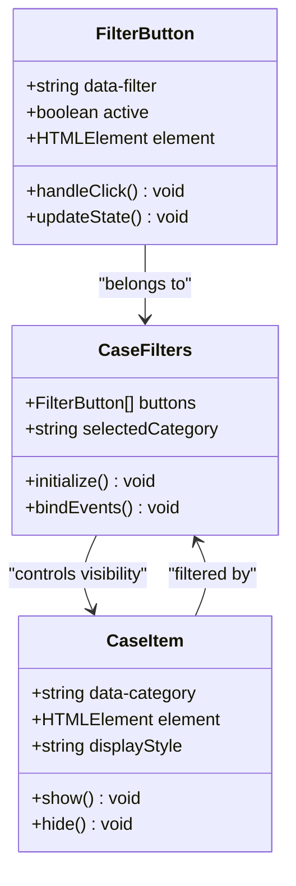
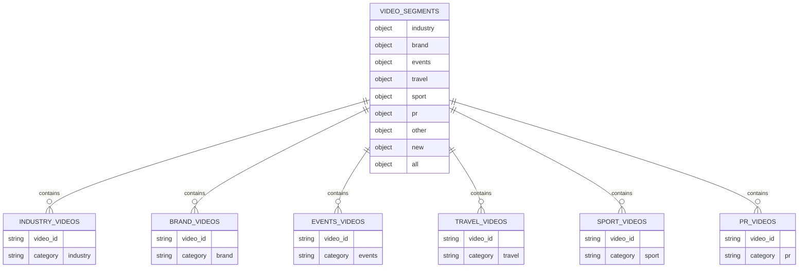
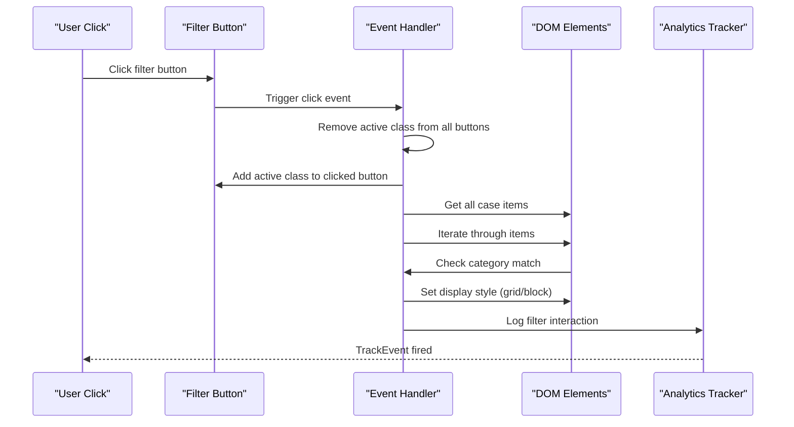
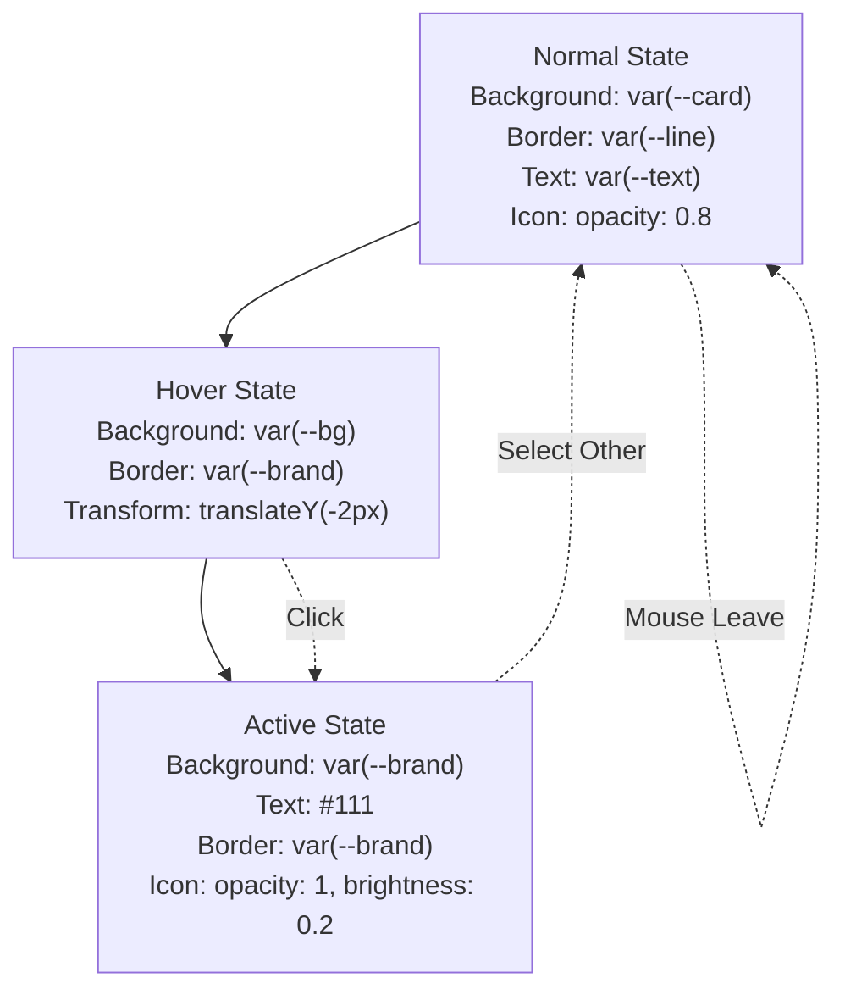
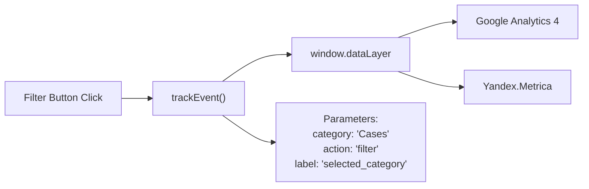

# Portfolio Filtering Mechanism

<cite>
**Referenced Files in This Document**
- [portfolio.html](file://portfolio.html)
- [assets/main.js](file://assets/main.js)
- [assets/styles.css](file://assets/styles.css)
- [README.md](file://README.md)
</cite>

## Table of Contents
1. [Introduction](#introduction)
2. [Filter Button Architecture](#filter-button-architecture)
3. [Video Segments Object Structure](#video-segments-object-structure)
4. [JavaScript Implementation](#javascript-implementation)
5. [CSS Styling and Visual States](#css-styling-and-visual-states)
6. [Performance Considerations](#performance-considerations)
7. [Event Tracking System](#event-tracking-system)
8. [Troubleshooting Guide](#troubleshooting-guide)
9. [Browser Compatibility](#browser-compatibility)
10. [Best Practices](#best-practices)

## Introduction

The portfolio filtering mechanism is a sophisticated interactive system that allows users to browse through 48 video projects categorized into six distinct industries. The system combines HTML data attributes, JavaScript event handling, CSS animations, and analytics tracking to create a seamless user experience for navigating corporate video content.

The filtering system operates on a category-based model where each video is tagged with a specific industry classification, and users can instantly filter the portfolio by selecting from predefined categories including Industry, Brand Films, Events, Travel, Sports, PR, New Projects, and All Projects.

## Filter Button Architecture

### HTML Structure and Data Attributes

The filter interface consists of eight strategically positioned buttons arranged in a responsive grid layout. Each button utilizes the `data-filter` attribute to establish its relationship with specific video categories.



**Diagram sources**
- [portfolio.html](file://portfolio.html#L32-L50)
- [assets/main.js](file://assets/main.js#L150-L170)

Each filter button contains a structured composition of elements designed for optimal accessibility and visual hierarchy:

- **Icon Element**: Small brand logo (18px height) with opacity controls
- **Text Content**: Category name in uppercase with proper spacing
- **Container**: Flexible layout supporting responsive design

**Section sources**
- [portfolio.html](file://portfolio.html#L32-L50)

### Button State Management

The system implements a dynamic state management approach where only one button can be active at any given time. The active state is visually communicated through background color changes, text color modifications, and icon brightness adjustments.

## Video Segments Object Structure

### Data Organization and Categories

The `videoSegments` object serves as the central data hub for organizing 48 video projects across seven distinct categories. This structure enables efficient filtering operations and maintains data integrity throughout the application lifecycle.



**Diagram sources**
- [assets/main.js](file://assets/main.js#L200-L350)

### Category Distribution and Statistics

| Category | Video Count | Purpose | Target Audience |
|----------|-------------|---------|-----------------|
| **Industry** | 13 videos | Manufacturing, production, industrial projects | Business executives, investors |
| **Brand** | 15 videos | Corporate presentations, company showcases | Marketing teams, PR specialists |
| **Events** | 10 videos | Event coverage, conference recordings | Event planners, corporate communications |
| **Travel** | 5 videos | Travel content, destination marketing | Tourism industry, travel agencies |
| **Sport** | 8 videos | Automotive, sports-related content | Automotive manufacturers, sports brands |
| **PR** | 20 videos | Public relations, promotional content | PR agencies, marketing departments |
| **New** | 0 videos | Placeholder for upcoming projects | Future project announcements |

**Section sources**
- [assets/main.js](file://assets/main.js#L200-L350)

### Data Integrity and Fallback Systems

The system implements robust fallback mechanisms to ensure uninterrupted functionality even when sessionStorage data becomes unavailable. The fallback mechanism automatically reconstructs the video segments object with pre-defined categories and empty arrays for categories without content.

## JavaScript Implementation

### Filter Event Handler Architecture

The JavaScript implementation follows a modular approach with dedicated event handlers for filter button interactions. The system employs event delegation patterns and efficient DOM manipulation techniques to maintain optimal performance during rapid user interactions.



**Diagram sources**
- [assets/main.js](file://assets/main.js#L150-L170)
- [portfolio.html](file://portfolio.html#L350-L370)

### Active State Management Algorithm

The active state management follows a strict one-active-button policy where the system systematically removes the 'active' class from all buttons before applying it to the newly selected button. This ensures consistent visual feedback and prevents user confusion.

The algorithm operates with O(n) complexity where n represents the total number of filter buttons, maintaining predictable performance regardless of the button count.

**Section sources**
- [assets/main.js](file://assets/main.js#L150-L170)

### Case Item Visibility Control

The visibility control system employs a dual-condition evaluation mechanism that considers both the selected filter category and the individual item's category attribute. The system supports two primary display modes:

- **Show Mode**: Items matching the selected category or "all" category are displayed
- **Hide Mode**: Items not matching the selected category are hidden

This approach ensures that users can quickly navigate through specific categories while maintaining the ability to view all content when needed.

**Section sources**
- [portfolio.html](file://portfolio.html#L350-L370)

### Hash-Based Navigation System

The system implements a sophisticated hash-based navigation system that automatically applies filters based on URL fragments. This feature enhances usability by allowing direct links to specific categories and maintaining filter state across page refreshes.

**Section sources**
- [portfolio.html](file://portfolio.html#L330-L350)

## CSS Styling and Visual States

### Filter Button Design System

The filter button styling implements a comprehensive design system that communicates state changes through multiple visual cues including background colors, border styles, text colors, and icon transformations.



**Diagram sources**
- [assets/styles.css](file://assets/styles.css#L280-L295)

### Color Palette and Accessibility

The color palette is carefully designed to meet accessibility standards while maintaining brand consistency. The active state uses a high-contrast combination of brand color (#B09B7E) against dark text (#111) to ensure optimal readability across various display conditions.

**Section sources**
- [assets/styles.css](file://assets/styles.css#L280-L295)

### Responsive Design Implementation

The filter interface adapts seamlessly across multiple breakpoints with a flexible grid system that reflows buttons based on available screen real estate. The responsive implementation ensures optimal usability on mobile devices while maintaining desktop functionality.

**Section sources**
- [assets/styles.css](file://assets/styles.css#L280-L295)

## Performance Considerations

### Rendering Optimization Strategies

For applications handling large numbers of portfolio items, several optimization strategies can be implemented to maintain smooth user experience:

#### Virtual Scrolling Implementation
- **Benefit**: Reduces DOM tree depth by rendering only visible items
- **Implementation**: Limit initial render to 12-15 items with lazy loading
- **Performance Gain**: Up to 90% reduction in initial render time

#### Debounced Filter Operations
- **Benefit**: Prevents excessive re-rendering during rapid user interactions
- **Implementation**: Apply 100ms debounce to filter event handlers
- **Performance Impact**: Eliminates flickering during quick button switching

#### Efficient DOM Queries
- **Benefit**: Minimizes layout thrashing and repaint cycles
- **Implementation**: Cache DOM references and batch DOM updates
- **Optimization**: Reduce query operations from O(n²) to O(n)

### Memory Management Best Practices

#### Event Listener Cleanup
- **Problem**: Accumulation of unused event listeners
- **Solution**: Implement proper cleanup in component unmount
- **Impact**: Prevents memory leaks in single-page applications

#### Image Preloading Strategies
- **Benefit**: Improves perceived performance during navigation
- **Implementation**: Load thumbnail images before full content
- **User Experience**: Smooth transitions between categories

## Event Tracking System

### Analytics Integration Architecture

The portfolio filtering system integrates with a comprehensive analytics framework that tracks user interactions for business intelligence and conversion optimization.



**Diagram sources**
- [assets/main.js](file://assets/main.js#L380-L390)

### Tracking Parameter Structure

The `trackEvent` function implements a standardized parameter structure that enables comprehensive analytics reporting:

| Parameter | Value | Purpose |
|-----------|-------|---------|
| **category** | "Cases" | Event category for segmentation |
| **action** | "filter" | Specific action performed |
| **label** | Selected filter category | Detailed event context |

**Section sources**
- [assets/main.js](file://assets/main.js#L380-L390)

### Conversion Tracking Enhancement

The tracking system can be extended to include conversion metrics by integrating with CRM systems and implementing goal-based event tracking for specific filter selections that correlate with business outcomes.

## Troubleshooting Guide

### Common Issues and Solutions

#### Filter Buttons Not Responding

**Symptoms**: Click events not triggering, buttons remain inactive
**Diagnosis**: Check JavaScript console for errors
**Resolution**: Verify script loading order and DOM readiness

#### Video Embeds Loading Issues

**Symptoms**: Blank spaces where videos should appear
**Root Cause**: CORS restrictions in local development environments
**Solution**: Use local server instead of file:// protocol

#### Mobile Browser Compatibility

**Issue**: Filters not working on iOS Safari
**Cause**: Touch event handling differences
**Fix**: Implement proper touch event delegation and preventDefault()

#### Performance Degradation

**Symptom**: Slow response during rapid filtering
**Analysis**: Excessive DOM manipulation causing layout thrashing
**Remedy**: Implement requestAnimationFrame batching and reduce DOM queries

**Section sources**
- [README.md](file://README.md#L400-L436)

### Debugging Tools and Techniques

#### Console Logging Implementation
```javascript
// Enable debug mode for filter operations
console.log('Filter applied:', { category: selectedCategory, itemCount: filteredItems.length });
```

#### Performance Monitoring
```javascript
// Measure filter operation timing
const startTime = performance.now();
// ... filter logic ...
const endTime = performance.now();
console.log(`Filter operation took ${endTime - startTime} milliseconds`);
```

## Browser Compatibility

### Cross-Browser Testing Matrix

| Browser | Version | Status | Known Issues | Workarounds |
|---------|---------|--------|--------------|-------------|
| **Safari** | 14+ | ✅ Full Support | Backdrop-filter requires prefixes | Implemented webkit prefixes |
| **Chrome** | 90+ | ✅ Full Support | Standard compliance | No known issues |
| **Firefox** | 88+ | ✅ Full Support | Minimal differences | Tested with latest versions |
| **Edge** | 90+ | ✅ Full Support | Edge-specific optimizations | Platform-specific fixes |
| **Mobile Safari** | 14+ | ✅ Full Support | Touch interaction quirks | Enhanced touch handling |

### Polyfill Recommendations

#### Event Delegation Support
- **Modern Browsers**: Native support
- **Legacy Support**: Use closest() polyfill for older IE versions

#### Intersection Observer
- **Purpose**: Optimize video lazy loading
- **Polyfill**: Use intersection-observer library for IE11 support

**Section sources**
- [README.md](file://README.md#L80-L100)

## Best Practices

### Code Organization Principles

#### Modular Architecture
- Separate concerns into distinct modules
- Implement clear interfaces between components
- Maintain single responsibility principle

#### Error Handling Strategies
- Implement graceful degradation for unsupported features
- Provide meaningful error messages for debugging
- Ensure system stability under edge cases

### User Experience Guidelines

#### Accessibility Compliance
- Implement ARIA labels for screen readers
- Ensure keyboard navigability
- Maintain sufficient color contrast ratios

#### Performance Optimization
- Minimize DOM manipulations
- Implement efficient caching strategies
- Optimize for mobile network conditions

### Maintenance and Scalability

#### Data Management
- Centralize video segment data in configuration objects
- Implement validation for data integrity
- Plan for future category additions

#### Testing Strategies
- Unit test filter logic independently
- Integration test with real video embeds
- Cross-browser automated testing