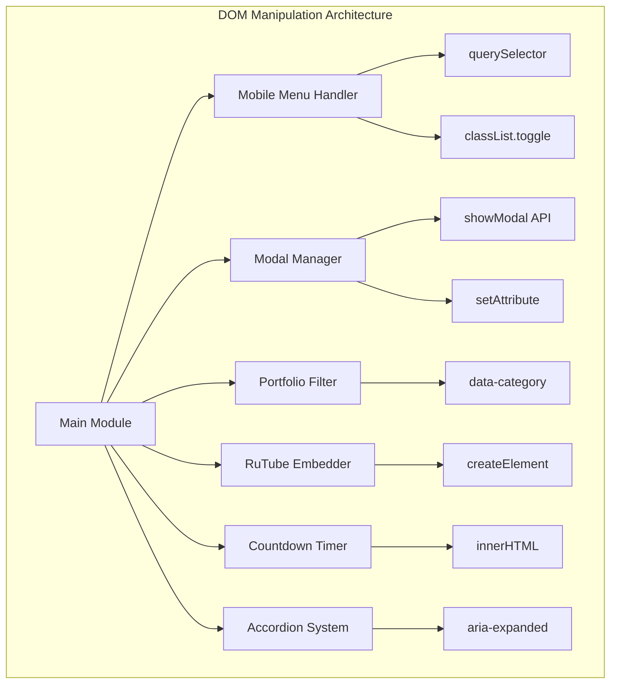
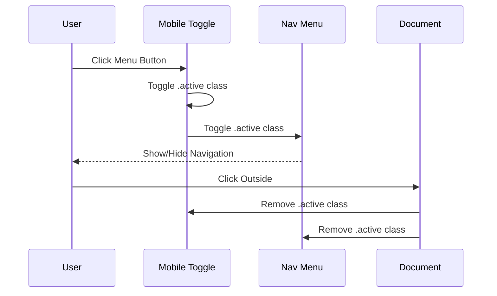
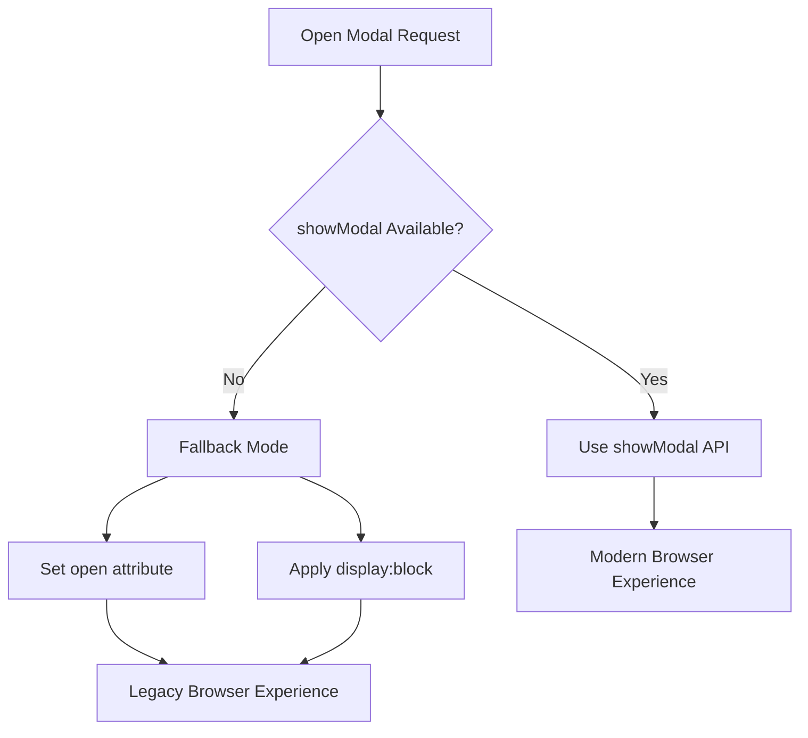
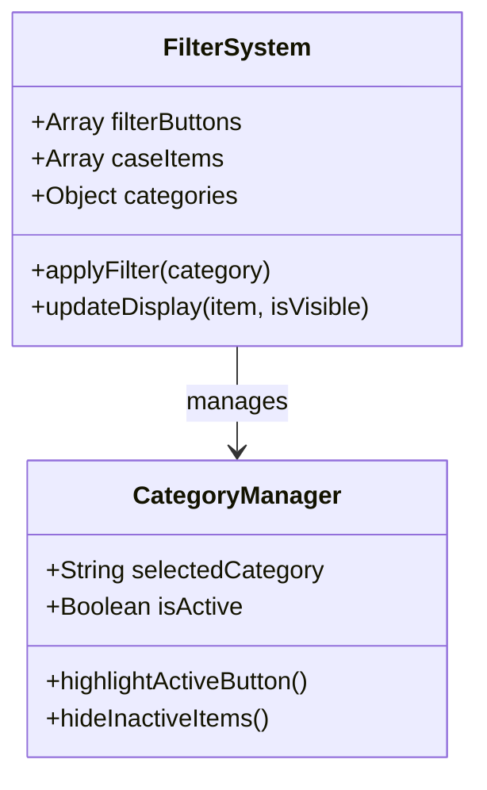
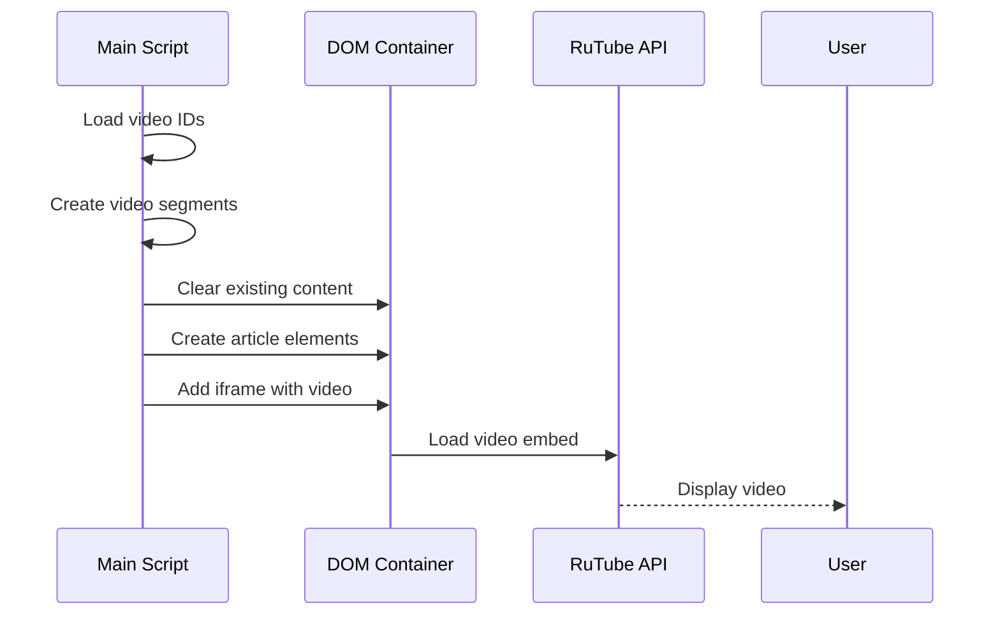
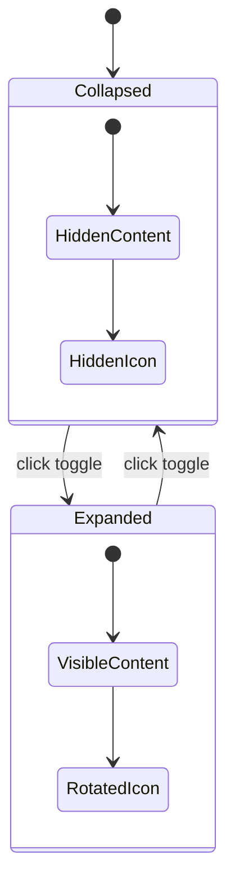
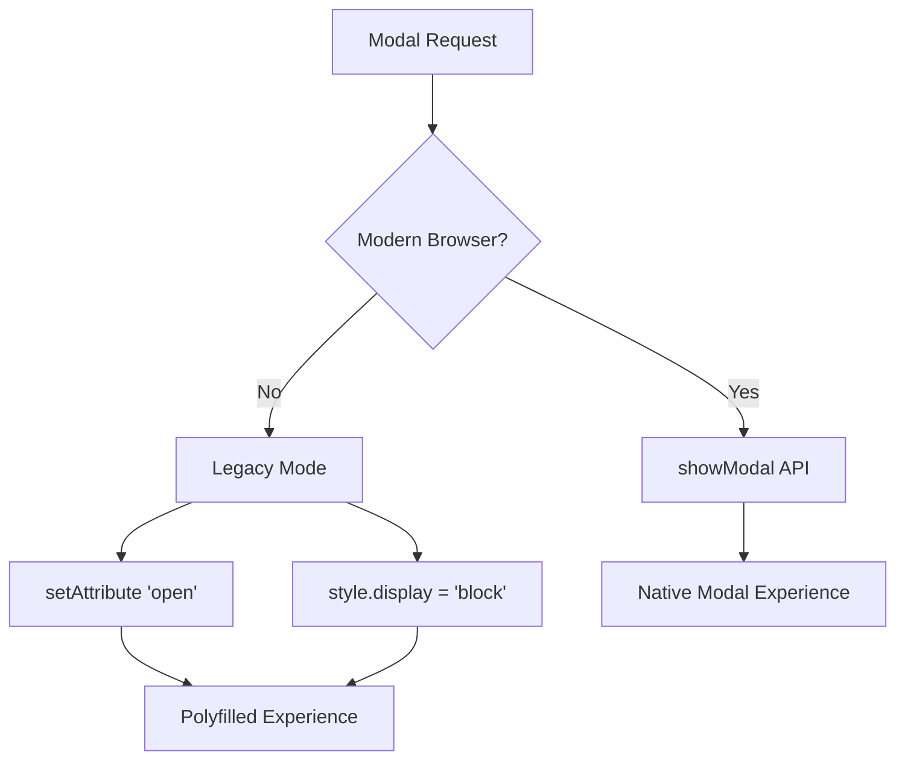

# DOM Manipulation Techniques in Knyazev Pro Landing Page

<cite>
**Referenced Files in This Document**
- [assets/main.js](file://assets/main.js)
- [index.html](file://assets/index.html)
- [portfolio.html](file://portfolio.html)
- [contact.html](file://contact.html)
- [price.html](file://price.html)
- [assets/styles.css](file://assets/styles.css)
- [README.md](file://README.md)
</cite>

## Table of Contents
1. [Introduction](#introduction)
2. [Project Architecture Overview](#project-architecture-overview)
3. [Core DOM Manipulation Patterns](#core-dom-manipulation-patterns)
4. [Mobile Menu Implementation](#mobile-menu-implementation)
5. [Modal Dialog Management](#modal-dialog-management)
6. [Portfolio Filtering System](#portfolio-filtering-system)
7. [RuTube Video Embedding](#rutube-video-embedding)
8. [Countdown Timer Implementation](#countdown-timer-implementation)
9. [Accordion Navigation System](#accordion-navigation-system)
10. [Cross-Browser Compatibility Strategies](#cross-browser-compatibility-strategies)
11. [Performance Optimization Techniques](#performance-optimization-techniques)
12. [Debugging and Troubleshooting](#debugging-and-troubleshooting)
13. [Best Practices and Recommendations](#best-practices-and-recommendations)

## Introduction

The Knyazev Pro landing page demonstrates sophisticated DOM manipulation techniques implemented in vanilla JavaScript without external dependencies. The main.js file serves as the central orchestrator for dynamic UI interactions, responsive design adaptations, and cross-browser compatibility solutions. This documentation explores the comprehensive DOM manipulation strategies employed to create an engaging, performant, and universally compatible user experience.

The implementation showcases modern JavaScript patterns while maintaining backward compatibility with legacy browsers, particularly focusing on iOS Safari optimizations and older browser support strategies. The codebase exemplifies best practices for DOM querying, event handling, and dynamic content generation.

## Project Architecture Overview

The DOM manipulation architecture follows a modular approach with clear separation of concerns:



**Diagram sources**
- [assets/main.js](file://assets/main.js#L1-L418)

The architecture emphasizes performance through strategic DOM querying and minimal reflow operations. Each module operates independently while sharing common DOM manipulation primitives.

**Section sources**
- [assets/main.js](file://assets/main.js#L1-L50)
- [README.md](file://README.md#L1-L100)

## Core DOM Manipulation Patterns

### Query Selection Methods

The codebase extensively uses multiple DOM selection strategies for optimal performance and reliability:

#### Primary Selection Pattern
```javascript
// Element identification using getElementById
const heroVideo = document.getElementById('heroVideo');
const mobileMenuToggle = document.getElementById('mobileMenuToggle');
const navMenu = document.getElementById('navMenu');
```

#### Secondary Selection Pattern
```javascript
// Collection-based selection using querySelectorAll
const filterButtons = document.querySelectorAll('.case-filters button');
const caseItems = document.querySelectorAll('.case-item');
const briefButtons = document.querySelectorAll('[data-action="mini-brief"]');
```

#### Contextual Selection Pattern
```javascript
// Hierarchical selection within parent elements
const content = this.nextElementSibling;
const icon = this.querySelector('.toggle-icon');
```

### Class Management Techniques

The implementation employs sophisticated class manipulation for state management:

#### Toggle Operations
```javascript
// Mobile menu state management
mobileMenuToggle.classList.toggle('active');
navMenu.classList.toggle('active');

// Filter button state
filterButtons.forEach(x => x.classList.remove('active'));
b.classList.add('active');
```

#### Conditional Class Application
```javascript
// Dynamic styling based on conditions
if (typeof briefModal.showModal === 'function') {
  briefModal.showModal();
} else {
  briefModal.setAttribute('open', '');
  briefModal.style.display = 'block';
}
```

**Section sources**
- [assets/main.js](file://assets/main.js#L15-L50)
- [assets/main.js](file://assets/main.js#L120-L180)

## Mobile Menu Implementation

The mobile menu system demonstrates advanced DOM manipulation for responsive navigation:

### State Management Architecture



**Diagram sources**
- [assets/main.js](file://assets/main.js#L20-L45)
- [index.html](file://index.html#L15-L30)

### Implementation Details

The mobile menu utilizes multiple event listeners for comprehensive interaction handling:

#### Toggle Button Interaction
```javascript
mobileMenuToggle.addEventListener('click', function() {
  this.classList.toggle('active');
  navMenu.classList.toggle('active');
});
```

#### Link Click Handling
```javascript
navMenu.querySelectorAll('a').forEach(link => {
  link.addEventListener('click', function() {
    mobileMenuToggle.classList.remove('active');
    navMenu.classList.remove('active');
  });
});
```

#### Outside Click Detection
```javascript
document.addEventListener('click', function(e) {
  if (!navMenu.contains(e.target) && !mobileMenuToggle.contains(e.target)) {
    mobileMenuToggle.classList.remove('active');
    navMenu.classList.remove('active');
  }
});
```

### CSS Integration

The DOM manipulation seamlessly integrates with CSS transitions:

```css
.nav-menu {
  transition: right 0.3s ease;
  position: fixed;
  top: 0;
  right: -100%;
  height: 100vh;
  width: 280px;
}
.nav-menu.active {
  right: 0;
}
```

**Section sources**
- [assets/main.js](file://assets/main.js#L20-L45)
- [assets/styles.css](file://assets/styles.css#L300-L350)

## Modal Dialog Management

The modal system showcases dual API support for maximum browser compatibility:

### Fallback Strategy Implementation



**Diagram sources**
- [assets/main.js](file://assets/main.js#L60-L75)

### Modal State Management

#### Button Binding
```javascript
document.querySelectorAll('[data-action="mini-brief"]').forEach(btn => {
  btn.addEventListener('click', () => {
    if (briefModal) {
      if (typeof briefModal.showModal === 'function') {
        briefModal.showModal();
      } else {
        briefModal.setAttribute('open', '');
        briefModal.style.display = 'block';
      }
    }
    trackEvent('CTA', 'open_mini_brief', 'button_click');
  });
});
```

#### Form Submission Handling
```javascript
if (briefForm) {
  briefForm.addEventListener('submit', async (e) => {
    e.preventDefault();
    const formData = new FormData(briefForm);
    const lead = Object.fromEntries(formData.entries());
    await sendToCRM(lead);
    briefModal.close();
    alert('Спасибо! Мы свяжемся с вами в ближайшее время.');
  });
}
```

### Accessibility Integration

The modal implementation includes comprehensive ARIA support:

```html
<dialog id="miniBriefModal" class="modal" role="dialog" aria-labelledby="modal-title">
  <form method="dialog" class="mini-brief-form" id="miniBriefForm">
    <h3 id="modal-title">Мини‑бриф</h3>
    <!-- Form content -->
  </form>
</dialog>
```

**Section sources**
- [assets/main.js](file://assets/main.js#L60-L85)
- [index.html](file://index.html#L200-L248)

## Portfolio Filtering System

The portfolio filtering system demonstrates advanced DOM manipulation for dynamic content presentation:

### Filter Architecture



**Diagram sources**
- [assets/main.js](file://assets/main.js#L130-L150)
- [portfolio.html](file://portfolio.html#L40-L80)

### Implementation Strategy

#### Filter Button Management
```javascript
filterButtons.forEach(b => b.addEventListener('click', () => {
  filterButtons.forEach(x => x.classList.remove('active'));
  b.classList.add('active');
  const f = b.getAttribute('data-filter');
  caseItems.forEach(it => {
    const ok = f === 'all' || it.getAttribute('data-category') === f;
    it.style.display = ok ? 'grid' : 'none';
  });
}));
```

#### Dynamic Content Filtering
```javascript
caseItems.forEach(it => {
  const ok = f === 'all' || it.getAttribute('data-category') === f;
  it.style.display = ok ? 'grid' : 'none';
});
```

### Performance Optimizations

The filtering system implements several performance enhancements:

#### Batch DOM Updates
```javascript
// Single iteration through all items
caseItems.forEach(it => {
  const ok = f === 'all' || it.getAttribute('data-category') === f;
  it.style.display = ok ? 'grid' : 'none';
});
```

#### Efficient Attribute Access
```javascript
const cat = card.getAttribute('data-category');
card.style.display = (f === 'all' || f === cat) ? 'grid' : 'none';
```

**Section sources**
- [assets/main.js](file://assets/main.js#L130-L150)
- [portfolio.html](file://portfolio.html#L350-L400)

## RuTube Video Embedding

The RuTube video embedding system showcases dynamic DOM construction and media optimization:

### Video Generation Pipeline



**Diagram sources**
- [assets/main.js](file://assets/main.js#L200-L250)

### Dynamic Video Creation

#### Home Page Video Preview
```javascript
function loadRuTubePortfolio() {
  const list = document.querySelector('#home-cases');
  if (!list) return;
  list.innerHTML = '';
  
  const preview = rutubeIdsUnique.slice(0, 6);
  
  preview.forEach((id, index) => {
    const article = document.createElement('article');
    article.className = 'case-item';
    
    const video = document.createElement('div');
    video.className = 'case-video';
    
    const iframe = document.createElement('iframe');
    iframe.src = `https://rutube.ru/play/embed/${id}/`;
    iframe.allow = 'clipboard-write; autoplay';
    iframe.referrerPolicy = 'no-referrer-when-downgrade';
    iframe.allowFullscreen = true;
    
    video.appendChild(iframe);
    article.appendChild(video);
    list.appendChild(article);
  });
}
```

#### Portfolio Page Video Rendering
```javascript
ids.forEach((id) => {
  const article = document.createElement('article');
  article.className = 'case-item';
  article.setAttribute('data-category', category);
  
  const video = document.createElement('div');
  video.className = 'case-video';
  
  const iframe = document.createElement('iframe');
  iframe.src = `https://rutube.ru/play/embed/${id}/`;
  iframe.allow = 'clipboard-write; autoplay';
  iframe.referrerPolicy = 'no-referrer-when-downgrade';
  iframe.allowFullscreen = true;
  
  video.appendChild(iframe);
  article.appendChild(video);
  
  list.appendChild(article);
});
```

### Video Segment Management

The system organizes videos into logical categories:

```javascript
const videoSegments = {
  industry: ['dcf1e99b5d0d0c9705a1b097fa691689', ...],
  brand: ['bd567efa5f684a9ff002b6d9f131f5c0', ...],
  events: ['ec6f206f3445b09929373ad404bff3b7', ...],
  travel: ['3a5bf44c15d8126813c82b48c9076440', ...],
  sport: ['1532f8781bb990992105095b41b2c137', ...],
  pr: ['bf373100ce030e8e61c9a99c470edadc', ...],
  all: rutubeIdsUnique
};
```

### Cross-Platform Optimization

#### Mobile Video Handling
```javascript
// Force video playback on mobile devices
heroVideo.setAttribute('playsinline', '');
heroVideo.setAttribute('webkit-playsinline', '');
heroVideo.muted = true;
```

#### Autoplay Fallback Strategy
```javascript
const playPromise = heroVideo.play();
if (playPromise !== undefined) {
  playPromise.catch(err => {
    console.log('Autoplay prevented, trying on user interaction:', err);
    const playOnInteraction = () => {
      heroVideo.play();
      document.removeEventListener('touchstart', playOnInteraction);
      document.removeEventListener('click', playOnInteraction);
    };
    document.addEventListener('touchstart', playOnInteraction, {once: true});
    document.addEventListener('click', playOnInteraction, {once: true});
  });
}
```

**Section sources**
- [assets/main.js](file://assets/main.js#L200-L280)
- [assets/main.js](file://assets/main.js#L1-L20)

## Countdown Timer Implementation

The countdown timer demonstrates real-time DOM updates and date manipulation:

### Timer Architecture

```mermaid
flowchart TD
A[Initialize Timer] --> B[Calculate Target Date]
B --> C[Create Tick Function]
C --> D[Update DOM Elements]
D --> E{Time Remaining?}
E --> |Yes| F[Schedule Next Tick]
E --> |No| G[Display "сегодня"]
F --> C
G --> H[End Timer]
```

**Diagram sources**
- [assets/main.js](file://assets/main.js#L90-L120)

### Implementation Details

#### Date Calculation and Formatting
```javascript
const countdownEl = document.getElementById('countdown');
const nextMonthEl = document.getElementById('nextMonth');

if (countdownEl) {
  // Calculate next month
  const nextDate = new Date();
  nextDate.setMonth(nextDate.getMonth() + 1);
  const months = ['январь','февраль','март','апрель','май','июнь','июль','август','сентябрь','октябрь','ноябрь','декабрь'];
  if (nextMonthEl) {
    nextMonthEl.textContent = months[nextDate.getMonth()];
  }
  
  // Calculate 14-day countdown
  const target = new Date();
  target.setDate(target.getDate() + 14);
  
  const tick = () => {
    const now = new Date();
    const diff = target - now;
    if (diff <= 0) {
      countdownEl.textContent = 'сегодня';
      return;
    }
    const days = Math.floor(diff / 86400000);
    const hours = Math.floor((diff % 86400000) / 3600000);
    countdownEl.textContent = `${days} д ${hours} ч`;
  };
  
  tick();
  setInterval(tick, 60000);
}
```

#### Dynamic Content Updates
```javascript
// Real-time updates every minute
setInterval(() => {
  const now = new Date();
  const diff = target - now;
  countdownEl.textContent = `${days} д ${hours} ч`;
}, 60000);
```

### Performance Considerations

The timer implementation optimizes performance through:

#### Efficient Time Calculations
```javascript
const days = Math.floor(diff / 86400000); // Milliseconds to days
const hours = Math.floor((diff % 86400000) / 3600000); // Remainder to hours
```

#### Minimal DOM Access
```javascript
// Cache DOM elements
const countdownEl = document.getElementById('countdown');
const nextMonthEl = document.getElementById('nextMonth');

// Update cached elements only
countdownEl.textContent = `${days} д ${hours} ч`;
```

**Section sources**
- [assets/main.js](file://assets/main.js#L90-L120)

## Accordion Navigation System

The accordion system demonstrates sophisticated DOM manipulation for expandable content:

### Accordion State Management



**Diagram sources**
- [assets/main.js](file://assets/main.js#L350-L400)

### Implementation Patterns

#### Product Includes Accordion
```javascript
document.querySelectorAll('.product-includes-toggle').forEach(button => {
  button.addEventListener('click', function() {
    const isExpanded = this.getAttribute('aria-expanded') === 'true';
    const content = this.nextElementSibling;
    const icon = this.querySelector('.toggle-icon');
    
    if (isExpanded) {
      // Collapse
      this.setAttribute('aria-expanded', 'false');
      content.classList.remove('expanded');
      icon.classList.remove('rotated');
    } else {
      // Expand
      this.setAttribute('aria-expanded', 'true');
      content.classList.add('expanded');
      icon.classList.add('rotated');
    }
    
    trackEvent('Product', 'toggle_includes', isExpanded ? 'collapse' : 'expand');
  });
});
```

#### Product Examples Accordion
```javascript
document.querySelectorAll('.product-examples-toggle').forEach(button => {
  button.addEventListener('click', function() {
    const isExpanded = this.getAttribute('aria-expanded') === 'true';
    const content = this.nextElementSibling;
    const icon = this.querySelector('.toggle-icon');
    
    if (isExpanded) {
      // Collapse
      this.setAttribute('aria-expanded', 'false');
      content.classList.remove('expanded');
      icon.classList.remove('rotated');
    } else {
      // Expand
      this.setAttribute('aria-expanded', 'true');
      content.classList.add('expanded');
      icon.classList.add('rotated');
    }
    
    trackEvent('Product', 'toggle_examples', isExpanded ? 'collapse' : 'expand');
  });
});
```

### Accessibility Features

#### ARIA Integration
```html
<button class="product-includes-toggle" aria-expanded="false">
  <h4>ПОДРОБНЕЕ</h4>
  <span class="toggle-icon">▼</span>
</button>
<div class="product-includes-content" aria-hidden="true">
  <!-- Content here -->
</div>
```

#### Keyboard Navigation Support
```javascript
// Focus management for accessibility
button.addEventListener('focus', () => {
  button.setAttribute('tabindex', '0');
});

button.addEventListener('blur', () => {
  button.removeAttribute('tabindex');
});
```

**Section sources**
- [assets/main.js](file://assets/main.js#L350-L418)

## Cross-Browser Compatibility Strategies

The codebase implements comprehensive fallback strategies for maximum compatibility:

### showModal API Fallback



**Diagram sources**
- [assets/main.js](file://assets/main.js#L60-L75)

### Smooth Scroll Fallback

```javascript
const smoothScrollTo = (element) => {
  if (!element) return;
  if ('scrollBehavior' in document.documentElement.style) {
    element.scrollIntoView({behavior: 'smooth'});
  } else {
    element.scrollIntoView();
  }
};
```

### Mobile Safari Optimizations

#### Video Playback Fixes
```javascript
// iOS Safari video optimization
heroVideo.setAttribute('playsinline', '');
heroVideo.setAttribute('webkit-playsinline', '');
heroVideo.muted = true;
```

#### Viewport Height Fixes
```css
/* iOS Safari 100vh fix */
@supports (-webkit-touch-callout: none) {
  html { height: -webkit-fill-available; }
  .hero { min-height: -webkit-fill-available; }
}
```

### Legacy Browser Support

#### Feature Detection
```javascript
if (typeof briefModal.showModal === 'function') {
  briefModal.showModal();
} else {
  // Fallback implementation
  briefModal.setAttribute('open', '');
  briefModal.style.display = 'block';
}
```

#### Polyfill Integration
```javascript
// Modern API detection
if (!Element.prototype.closest) {
  // Custom closest implementation
  Element.prototype.closest = function(selector) {
    let el = this;
    while (el) {
      if (el.matches(selector)) return el;
      el = el.parentElement;
    }
    return null;
  };
}
```

**Section sources**
- [assets/main.js](file://assets/main.js#L1-L20)
- [assets/main.js](file://assets/main.js#L60-L85)

## Performance Optimization Techniques

The DOM manipulation implementation incorporates several performance optimization strategies:

### Minimizing Reflows and Repaints

#### Batch DOM Updates
```javascript
// Instead of multiple individual updates
const fragment = document.createDocumentFragment();
buttons.forEach(btn => {
  btn.classList.remove('active');
  fragment.appendChild(btn);
});
container.appendChild(fragment);

// Better: batch all changes
filterButtons.forEach(x => x.classList.remove('active'));
b.classList.add('active');
```

#### CSS Property Optimization
```javascript
// Avoid triggering layout calculations
item.style.display = ok ? 'grid' : 'none'; // Layout change
item.style.opacity = 1; // Paint change only
```

### Efficient Event Handling

#### Event Delegation
```javascript
// Instead of individual listeners
document.addEventListener('click', function(e) {
  if (e.target.matches('.case-filters button')) {
    handleFilterClick(e.target);
  }
});

// Better: delegate to parent
filterContainer.addEventListener('click', function(e) {
  const btn = e.target.closest('button');
  if (btn) handleFilterClick(btn);
});
```

#### Debounced Updates
```javascript
let resizeTimeout;
window.addEventListener('resize', () => {
  clearTimeout(resizeTimeout);
  resizeTimeout = setTimeout(() => {
    // Perform expensive DOM updates
  }, 100);
});
```

### Memory Management

#### Proper Cleanup
```javascript
// Remove event listeners when appropriate
const cleanup = () => {
  document.removeEventListener('click', clickHandler);
  observer.disconnect();
};

// Use WeakMaps for private data
const elementData = new WeakMap();
elementData.set(element, { state: 'active' });
```

### Lazy Loading Implementation

#### Intersection Observer
```javascript
const observer = new IntersectionObserver((entries) => {
  entries.forEach(entry => {
    if (entry.isIntersecting) {
      loadVideo(entry.target);
      observer.unobserve(entry.target);
    }
  });
});

// Observe video elements
document.querySelectorAll('.case-video').forEach(el => {
  observer.observe(el);
});
```

**Section sources**
- [assets/main.js](file://assets/main.js#L130-L150)
- [assets/main.js](file://assets/main.js#L200-L250)

## Debugging and Troubleshooting

### Common DOM Manipulation Issues

#### Element Not Found Errors
```javascript
// Debugging element selection
const element = document.getElementById('nonexistent-id');
if (!element) {
  console.warn('Element not found:', '#nonexistent-id');
  console.trace();
}
```

#### Event Listener Problems
```javascript
// Verify event binding
button.addEventListener('click', handler);
console.log('Event listeners:', getEventListeners(button));

// Check for conflicting listeners
button.removeEventListener('click', handler);
button.addEventListener('click', handler);
```

#### Performance Monitoring
```javascript
// Measure DOM operation timing
console.time('DOM Update');
// DOM manipulation code
console.timeEnd('DOM Update');

// Monitor memory usage
console.log('Memory usage:', performance.memory);
```

### Browser-Specific Debugging

#### iOS Safari Issues
```javascript
// Check for iOS-specific problems
if (/iPhone|iPad|iPod/.test(navigator.userAgent)) {
  console.log('iOS detected, applying fixes');
  // iOS-specific debugging code
}
```

#### Legacy Browser Detection
```javascript
// Feature detection for debugging
if (!Element.prototype.closest) {
  console.warn('closest() not supported, using polyfill');
}
```

### Validation Tools

#### DOM Structure Verification
```javascript
// Check DOM completeness
const validateDOM = () => {
  const requiredElements = ['#hero', '.case-filters', '#portfolioList'];
  requiredElements.forEach(selector => {
    const element = document.querySelector(selector);
    if (!element) {
      console.error(`Missing required element: ${selector}`);
    }
  });
};
```

#### Event Flow Tracking
```javascript
// Track event propagation
document.addEventListener('click', (e) => {
  console.log('Click event:', {
    target: e.target,
    currentTarget: e.currentTarget,
    bubbles: e.bubbles,
    composed: e.composed
  });
}, true);
```

**Section sources**
- [assets/main.js](file://assets/main.js#L1-L50)

## Best Practices and Recommendations

### DOM Manipulation Guidelines

#### Selective Element Access
```javascript
// Good: Cache frequently accessed elements
const heroVideo = document.getElementById('heroVideo');
const filterButtons = document.querySelectorAll('.filter-button');

// Bad: Repeated DOM queries
document.getElementById('heroVideo').play();
document.getElementById('heroVideo').pause();
```

#### Efficient Class Management
```javascript
// Good: Batch class operations
element.classList.remove('hidden');
element.classList.add('visible');

// Better: Use CSS classes for state
element.classList.toggle('active', isActive);
```

#### Event Handling Optimization
```javascript
// Good: Use event delegation
document.addEventListener('click', (e) => {
  if (e.target.matches('.dynamic-element')) {
    handleDynamicClick(e.target);
  }
});

// Avoid: Excessive individual listeners
elements.forEach(el => el.addEventListener('click', handleClick));
```

### Accessibility Standards

#### Semantic HTML Structure
```html
<nav aria-label="Main Navigation">
  <ul>
    <li><a href="#section1">Section 1</a></li>
    <!-- ... -->
  </ul>
</nav>
```

#### ARIA Attributes
```javascript
// Good: Comprehensive ARIA support
button.setAttribute('aria-expanded', 'false');
button.setAttribute('aria-controls', 'content-id');
```

#### Keyboard Navigation
```javascript
// Good: Keyboard accessible controls
button.addEventListener('keydown', (e) => {
  if (e.key === 'Enter' || e.key === ' ') {
    e.preventDefault();
    button.click();
  }
});
```

### Performance Best Practices

#### Minimize DOM Access
```javascript
// Good: Reduce DOM queries
const container = document.getElementById('container');
const fragment = document.createDocumentFragment();
items.forEach(item => {
  const element = createElement(item);
  fragment.appendChild(element);
});
container.appendChild(fragment);
```

#### Optimize Layout Triggers
```javascript
// Good: Group layout changes
element.style.width = '100px';
element.style.height = '100px';
element.style.marginTop = '20px';

// Bad: Interleaved layout changes
element.style.width = '100px';
// Trigger layout
element.style.height = '100px';
// Trigger layout
element.style.marginTop = '20px';
```

### Security Considerations

#### Sanitize Dynamic Content
```javascript
// Good: Safe innerHTML usage
const safeContent = DOMPurify.sanitize(userInput);
element.innerHTML = safeContent;

// Good: Use textContent for plain text
element.textContent = userInput;
```

#### Prevent XSS Attacks
```javascript
// Good: Escape user input
const escapeHTML = (str) => {
  return str.replace(/[&<>"']/g, (char) => {
    return {'&': '&amp;', '<': '&lt;', '>': '&gt;', '"': '&quot;', "'": '&#039;'}[char];
  });
};
```

### Testing and Validation

#### Unit Testing DOM Functions
```javascript
// Test DOM manipulation functions
describe('DOM Manipulation', () => {
  beforeEach(() => {
    document.body.innerHTML = `
      <div id="test-container"></div>
      <button id="test-button">Test</button>
    `;
  });

  test('should toggle class correctly', () => {
    const button = document.getElementById('test-button');
    toggleClass(button, 'active');
    expect(button.classList.contains('active')).toBe(true);
  });
});
```

#### Cross-Browser Testing
```javascript
// Test across different environments
const testEnvironment = () => {
  const features = {
    'classList': 'classList' in document.createElement('div'),
    'showModal': typeof HTMLDialogElement !== 'undefined' && 
                 typeof HTMLDialogElement.prototype.showModal === 'function',
    'intersectionObserver': 'IntersectionObserver' in window
  };
  return features;
};
```

These comprehensive DOM manipulation techniques demonstrate the power of vanilla JavaScript for creating sophisticated, performant, and accessible web applications. The implementation serves as an excellent reference for modern web development practices while maintaining broad compatibility across diverse browser environments.