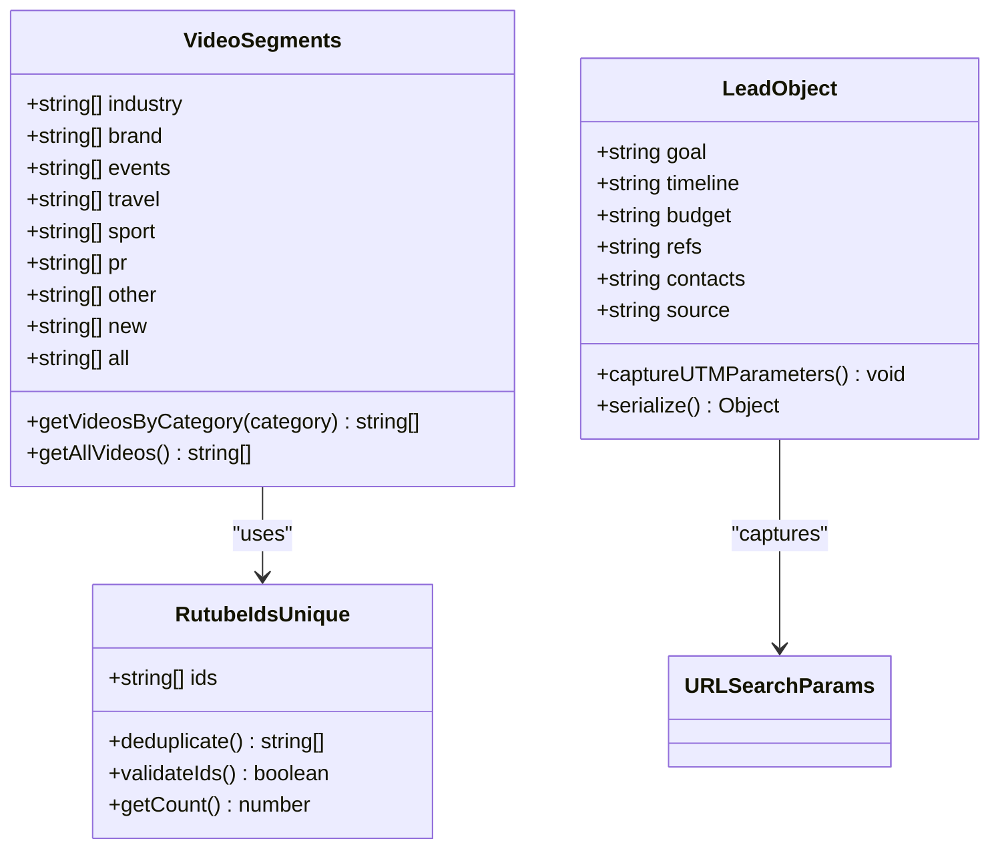
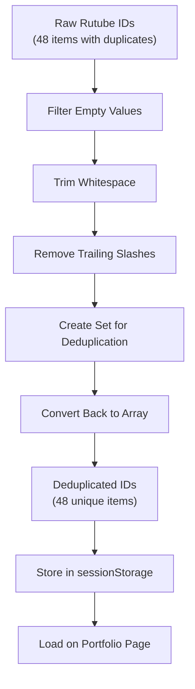
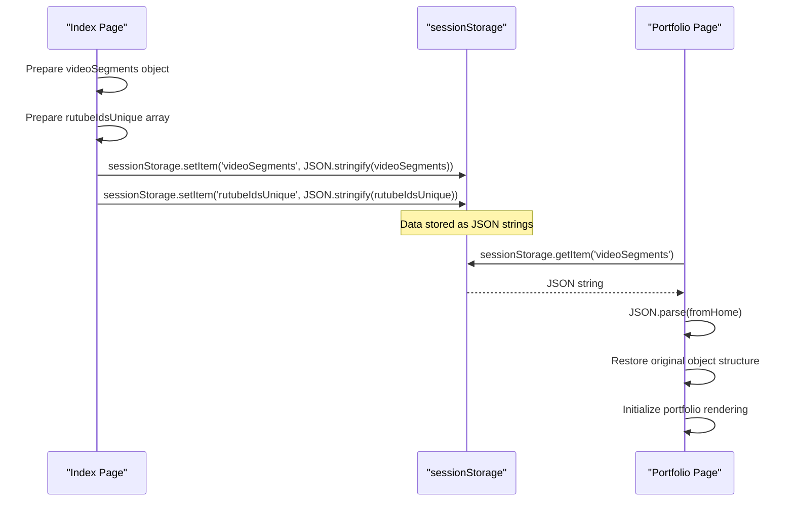
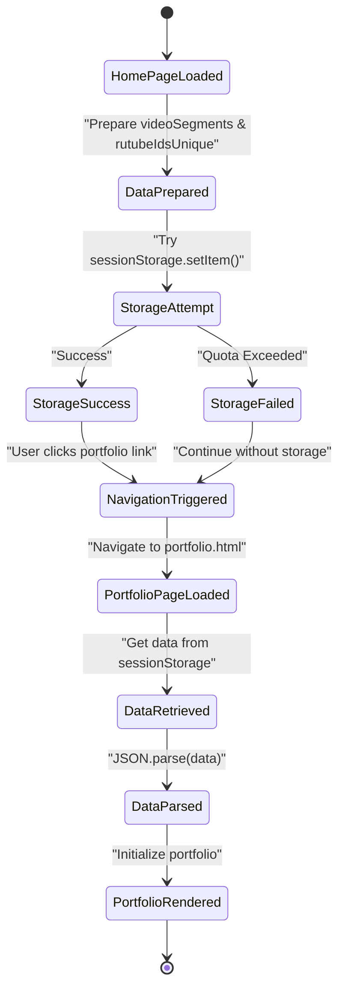
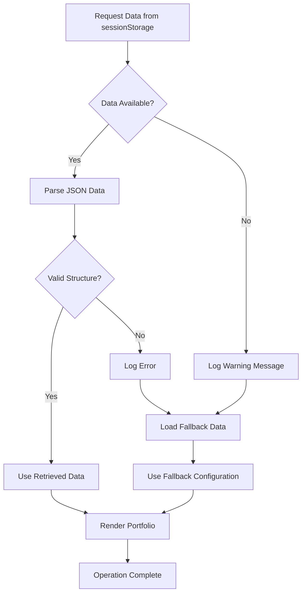
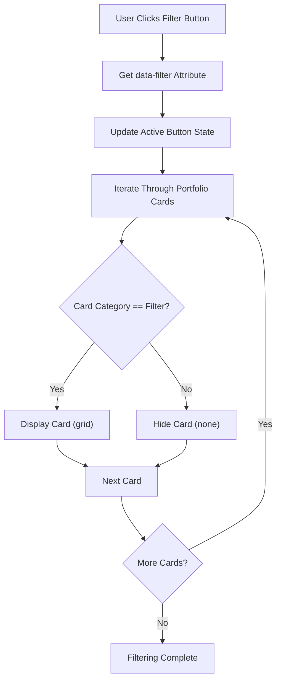
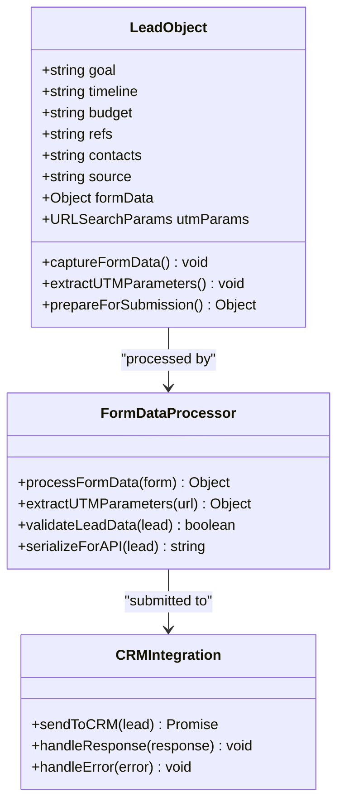
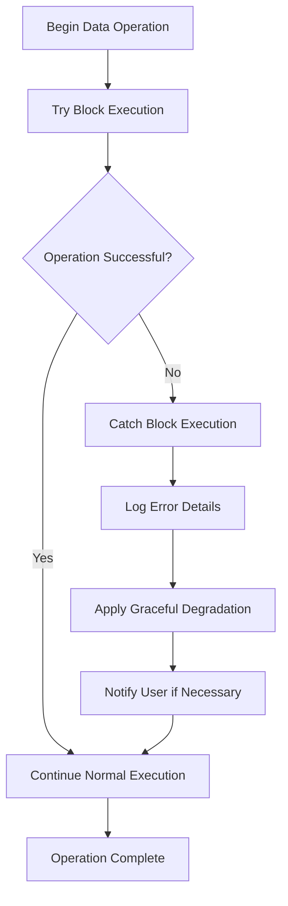

# Data Management

<cite>
**Referenced Files in This Document**
- [assets/main.js](file://assets/main.js)
- [portfolio.html](file://portfolio.html)
- [index.html](file://index.html)
- [contact.html](file://contact.html)
</cite>

## Table of Contents
1. [Introduction](#introduction)
2. [JavaScript Object Structures](#javascript-object-structures)
3. [SessionStorage Implementation](#sessionstorage-implementation)
4. [Data Persistence Patterns](#data-persistence-patterns)
5. [Category-Based Filtering System](#category-based-filtering-system)
6. [Form Data Management](#form-data-management)
7. [Error Handling and Security](#error-handling-and-security)
8. [Performance Considerations](#performance-considerations)
9. [Alternatives and Limitations](#alternatives-and-limitations)
10. [Best Practices](#best-practices)

## Introduction

This landing page application demonstrates sophisticated client-side data management using JavaScript objects and sessionStorage for state persistence. The system enables seamless navigation between pages while maintaining portfolio data, user preferences, and form submissions without requiring server-side sessions. The implementation showcases modern web development patterns for handling multimedia content, user interactions, and cross-page data transfer.

## JavaScript Object Structures

### Video Segments Organization

The application uses a hierarchical JavaScript object structure to organize portfolio video content by categories. This structure enables efficient filtering and display of multimedia content across different pages.

**Diagram sources**
- [assets/main.js](file://assets/main.js#L146-L220)
- [assets/main.js](file://assets/main.js#L395-L417)

The `videoSegments` object serves as the primary data structure for organizing portfolio content. Each category contains an array of Rutube video identifiers, enabling granular filtering and display capabilities. The structure includes specialized categories for different types of video content and maintains an `all` category for comprehensive browsing.

**Section sources**
- [assets/main.js](file://assets/main.js#L146-L220)

### Rutube IDs Deduplication

The `rutubeIdsUnique` array demonstrates advanced JavaScript array manipulation techniques for data cleaning and optimization. The implementation removes duplicates, trims whitespace, and normalizes video identifiers for consistent processing.

**Diagram sources**
- [assets/main.js](file://assets/main.js#L138-L144)

**Section sources**
- [assets/main.js](file://assets/main.js#L138-L144)

## SessionStorage Implementation

### Data Serialization Process

The application implements a robust data serialization strategy using `JSON.stringify()` for converting JavaScript objects into storable string format. This approach ensures data integrity during cross-page transfers while maintaining type safety and structure preservation.

**Diagram sources**
- [assets/main.js](file://assets/main.js#L326-L327)
- [portfolio.html](file://portfolio.html#L68-L72)

The serialization process handles complex nested objects containing arrays of video identifiers. The implementation ensures that all data types are preserved during the conversion process, maintaining the integrity of the portfolio structure.

**Section sources**
- [assets/main.js](file://assets/main.js#L326-L327)
- [portfolio.html](file://portfolio.html#L68-L72)

### Cross-Page Data Transfer

The application demonstrates sophisticated state management by transferring complete portfolio configurations between pages. This approach eliminates the need for server-side session management while providing seamless user experiences.

**Diagram sources**
- [assets/main.js](file://assets/main.js#L326-L327)
- [portfolio.html](file://portfolio.html#L68-L72)

**Section sources**
- [assets/main.js](file://assets/main.js#L326-L327)
- [portfolio.html](file://portfolio.html#L68-L72)

## Data Persistence Patterns

### Fallback Mechanisms

The application implements comprehensive fallback mechanisms to handle scenarios where sessionStorage operations fail or data becomes unavailable. These patterns ensure graceful degradation and maintain functionality across different browser environments.

**Diagram sources**
- [portfolio.html](file://portfolio.html#L74-L91)

The fallback system provides default video segment configurations when sessionStorage data is unavailable or corrupted. This ensures that users can still access portfolio content even if the primary data storage mechanism fails.

**Section sources**
- [portfolio.html](file://portfolio.html#L74-L91)

### Data Validation and Type Checking

The implementation includes robust validation mechanisms to ensure data integrity and prevent runtime errors. Type checking and structure validation occur at multiple points in the data lifecycle.

**Section sources**
- [portfolio.html](file://portfolio.html#L278-L280)

## Category-Based Filtering System

### Dynamic Content Rendering

The filtering system demonstrates advanced DOM manipulation techniques for dynamic content rendering based on user interactions. The implementation supports real-time filtering with smooth transitions and maintains state consistency across page loads.

**Diagram sources**
- [assets/main.js](file://assets/main.js#L125-L137)
- [portfolio.html](file://portfolio.html#L310-L325)

The filtering system operates on the principle of CSS display property manipulation, allowing for efficient visibility toggling without requiring DOM reconstruction. This approach provides smooth user experiences with minimal performance impact.

**Section sources**
- [assets/main.js](file://assets/main.js#L125-L137)
- [portfolio.html](file://portfolio.html#L310-L325)

### URL Hash Integration

The application integrates URL hash navigation with the filtering system, enabling direct linking to specific portfolio categories and bookmarking functionality.

**Section sources**
- [portfolio.html](file://portfolio.html#L282-L290)

## Form Data Management

### Lead Object Structure

The form submission system demonstrates comprehensive data capture and processing using JavaScript objects. The `lead` object structure captures all form field data along with contextual information from the URL.

**Diagram sources**
- [assets/main.js](file://assets/main.js#L395-L417)

The lead object structure captures comprehensive information about potential clients, including their goals, timelines, budgets, and referral sources. The inclusion of UTM parameters enables marketing analytics and campaign tracking.

**Section sources**
- [assets/main.js](file://assets/main.js#L395-L417)

### UTM Parameter Capture

The form submission process automatically captures UTM parameters from the URL search string, enabling attribution tracking and marketing analytics integration.

**Section sources**
- [assets/main.js](file://assets/main.js#L408)

## Error Handling and Security

### Try-Catch Pattern Implementation

The application implements comprehensive error handling using try-catch blocks to manage potential failures in data operations, particularly around sessionStorage usage and JSON parsing.

**Diagram sources**
- [assets/main.js](file://assets/main.js#L326-L327)
- [assets/main.js](file://assets/main.js#L335-L372)

The error handling strategy focuses on preventing application crashes while maintaining functionality. When sessionStorage operations fail, the system continues operation using fallback data rather than terminating.

**Section sources**
- [assets/main.js](file://assets/main.js#L326-L327)
- [assets/main.js](file://assets/main.js#L335-L372)

### Quota Management

The implementation acknowledges the limitations of sessionStorage quota (typically 5-10MB depending on browser) and provides graceful handling for quota exceeded scenarios. While the current implementation doesn't explicitly check quota limits, the try-catch pattern ensures that operations continue even when storage capacity is reached.

**Section sources**
- [assets/main.js](file://assets/main.js#L326-L327)

## Performance Considerations

### Memory Management

The application demonstrates efficient memory management by loading only necessary data for each page and avoiding unnecessary data duplication. The use of sessionStorage for cross-page data transfer reduces server requests while maintaining responsive user experiences.

### Data Size Optimization

The video segment data structure is optimized for size efficiency, using compact array formats and avoiding redundant information. The deduplication process ensures that the same video identifiers aren't stored multiple times across different categories.

**Section sources**
- [assets/main.js](file://assets/main.js#L138-L144)

### Lazy Loading Strategy

The portfolio rendering system implements lazy loading principles by initially loading only a subset of videos and dynamically creating additional content as needed. This approach reduces initial page load times and improves overall performance.

**Section sources**
- [assets/main.js](file://assets/main.js#L222-L240)

## Alternatives and Limitations

### Current Limitations

1. **Storage Capacity**: sessionStorage has limited capacity (typically 5-10MB), which may become restrictive for applications with extensive multimedia content.
2. **Browser Compatibility**: While modern browsers support sessionStorage comprehensively, older browsers may have reduced capacity or different behavior.
3. **Data Persistence**: sessionStorage data is cleared when the browser tab is closed, requiring reinitialization on subsequent visits.
4. **Security Concerns**: Sensitive data should not be stored in sessionStorage due to potential XSS vulnerabilities.

### Alternative Solutions

#### LocalStorage
- **Advantages**: Larger storage capacity (typically 5-10MB), data persists until explicitly cleared
- **Disadvantages**: Still subject to XSS vulnerabilities, larger data sets may impact performance

#### IndexedDB
- **Advantages**: Large storage capacity, structured data support, asynchronous operations
- **Disadvantages**: More complex API, requires learning curve, browser support varies

#### Server-Side Sessions
- **Advantages**: Secure, scalable, persistent across browser sessions
- **Disadvantages**: Requires server infrastructure, increased latency, state management complexity

#### Web Workers
- **Advantages**: Offloads processing to background threads, prevents UI blocking
- **Disadvantages**: Limited access to DOM, communication overhead, browser support

### Scalability Considerations

For applications requiring larger datasets or enhanced security, the current sessionStorage-based approach may need enhancement. Consider implementing hybrid approaches combining client-side caching with server-side synchronization for optimal performance and reliability.

## Best Practices

### Data Structure Design
- Use hierarchical object structures for related data
- Implement comprehensive validation for data integrity
- Provide fallback mechanisms for data recovery
- Maintain consistent data formats across the application

### Storage Strategy
- Implement try-catch blocks for all storage operations
- Use JSON.stringify() for complex object serialization
- Provide graceful degradation when storage operations fail
- Monitor storage usage to prevent quota exceeded scenarios

### Security Considerations
- Avoid storing sensitive information in sessionStorage
- Implement input validation for all user-submitted data
- Use HTTPS to protect data in transit
- Consider implementing CSRF protection for form submissions

### Performance Optimization
- Load only necessary data for each page
- Implement lazy loading for dynamic content
- Minimize data duplication across storage locations
- Use efficient data structures for frequently accessed information

### User Experience
- Provide clear feedback for data operations
- Implement smooth transitions for dynamic content updates
- Maintain state consistency across page navigations
- Offer offline functionality where appropriate

The data management system in this application demonstrates sophisticated client-side architecture that balances functionality, performance, and user experience. By leveraging JavaScript objects and sessionStorage effectively, the application achieves seamless cross-page state management without relying on server-side sessions, providing a modern web development pattern that can be adapted for various use cases.