# Event Handling

<cite>
**Referenced Files in This Document**
- [assets/main.js](file://assets/main.js)
- [index.html](file://index.html)
- [portfolio.html](file://portfolio.html)
- [contact.html](file://contact.html)
- [assets/styles.css](file://assets/styles.css)
- [IOS_MAC_OPTIMIZATION.md](file://IOS_MAC_OPTIMIZATION.md)
- [MOBILE_OPTIMIZATION_FULL.md](file://MOBILE_OPTIMIZATION_FULL.md)
</cite>

## Table of Contents
1. [Introduction](#introduction)
2. [IIFE Structure and Initialization](#iife-structure-and-initialization)
3. [Mobile Menu Toggle Events](#mobile-menu-toggle-events)
4. [Portfolio Filtering System](#portfolio-filtering-system)
5. [Accordion Toggle Events](#accordion-toggle-events)
6. [Form Submission Handling](#form-submission-handling)
7. [CTA Button Interactions](#cta-button-interactions)
8. [Video Autoplay Fallback](#video-autoplay-fallback)
9. [Event Delegation Patterns](#event-delegation-patterns)
10. [Accessibility Implementation](#accessibility-implementation)
11. [Analytics and Tracking](#analytics-and-tracking)
12. [Error Handling and Fallbacks](#error-handling-and-fallbacks)
13. [Performance Optimization](#performance-optimization)
14. [Troubleshooting Guide](#troubleshooting-guide)
15. [Best Practices](#best-practices)

## Introduction

The landing page application employs a sophisticated vanilla JavaScript event handling system built within an Immediately Invoked Function Expression (IIFE) structure. This approach ensures clean separation of concerns while providing robust interactivity across multiple pages including the homepage, portfolio, pricing, and contact sections.

The event system handles critical user interactions such as mobile menu toggling, portfolio filtering, accordion expansions, form submissions, and CTA button clicks. All events are bound during page load and utilize modern JavaScript patterns including event delegation, accessibility compliance, and cross-browser compatibility.

## IIFE Structure and Initialization

The entire event handling system is encapsulated within a self-executing function that runs immediately upon script loading. This pattern provides several benefits including namespace isolation, dependency management, and guaranteed execution order.

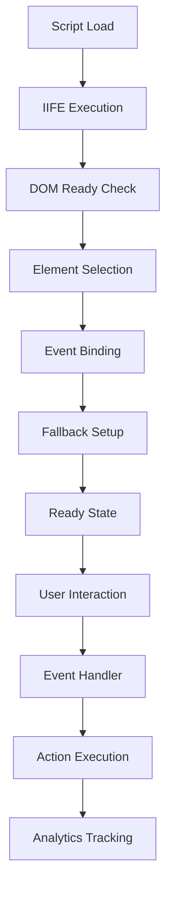

**Diagram sources**
- [assets/main.js](file://assets/main.js#L1-L418)

The IIFE structure ensures that all event handlers are bound only after the DOM is fully loaded, preventing timing issues and ensuring reliable functionality across different browser environments.

**Section sources**
- [assets/main.js](file://assets/main.js#L1-L418)

## Mobile Menu Toggle Events

The mobile menu system implements a comprehensive event handling approach that manages both touch and click interactions while maintaining accessibility standards.

### Core Event Structure

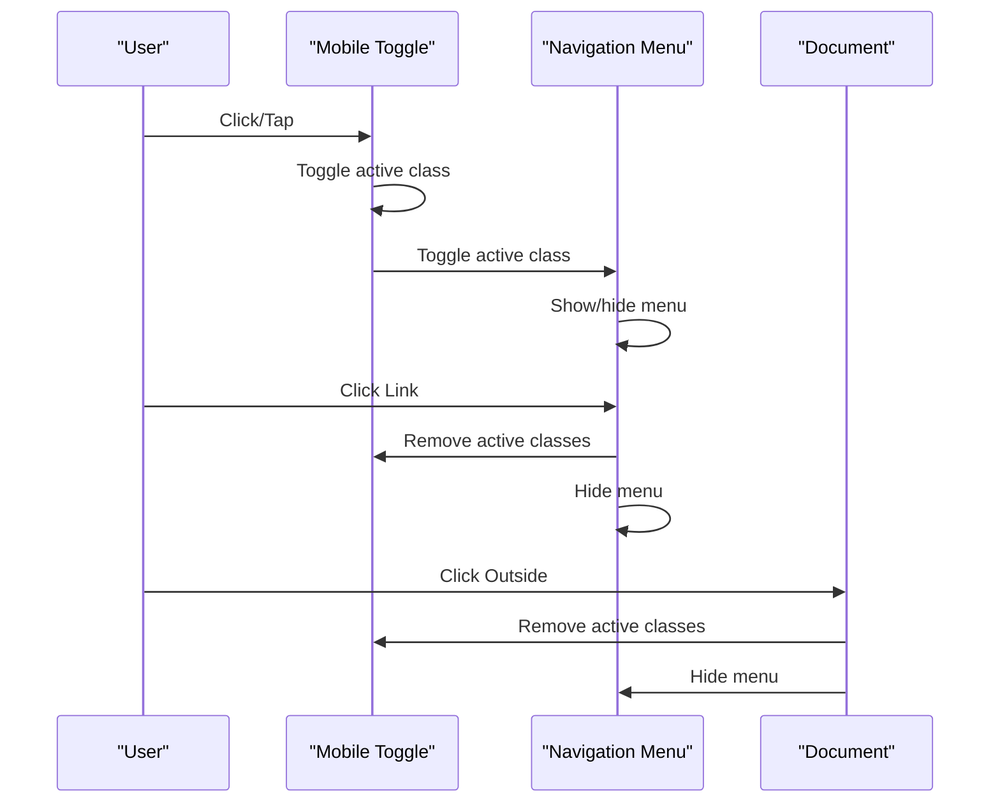

**Diagram sources**
- [assets/main.js](file://assets/main.js#L26-L50)
- [index.html](file://index.html#L15-L35)

### Event Binding Implementation

The mobile menu events are bound using multiple event listeners that handle different interaction scenarios:

1. **Primary Toggle Event**: Manages the visual state of the menu toggle button and navigation menu
2. **Link Click Event**: Automatically closes the menu when navigation links are clicked
3. **Outside Click Event**: Provides a way to close the menu when clicking outside the menu area

### Accessibility Features

The mobile menu implementation includes comprehensive accessibility features:

- **ARIA Attributes**: Proper labeling and state management
- **Keyboard Navigation**: Full keyboard support for menu interactions
- **Focus Management**: Logical focus flow and trap management
- **Screen Reader Support**: Clear announcements of menu state changes

**Section sources**
- [assets/main.js](file://assets/main.js#L26-L50)
- [assets/styles.css](file://assets/styles.css#L200-L250)

## Portfolio Filtering System

The portfolio filtering system demonstrates advanced event handling patterns including event delegation, state management, and dynamic content updates.

### Filter Event Architecture

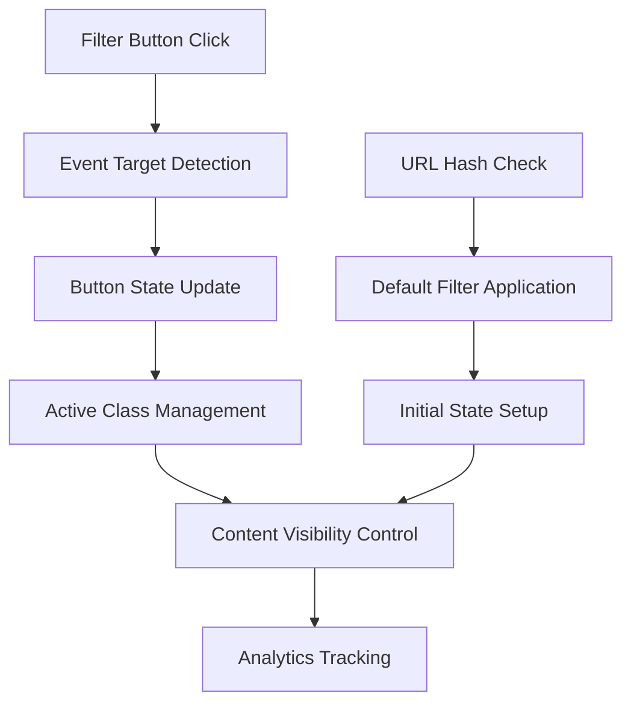

**Diagram sources**
- [assets/main.js](file://assets/main.js#L118-L144)
- [portfolio.html](file://portfolio.html#L333-L361)

### Dynamic Content Filtering

The filtering system operates on a category-based model where each portfolio item is tagged with data attributes representing its category. The event handler dynamically shows or hides items based on the selected filter.

### Advanced Filtering Features

1. **Hash-Based Navigation**: Filters can be pre-selected through URL hash parameters
2. **State Persistence**: Active filter states are maintained across page interactions
3. **Performance Optimization**: Efficient DOM manipulation minimizes reflows
4. **Responsive Behavior**: Filters adapt to different screen sizes and orientations

**Section sources**
- [assets/main.js](file://assets/main.js#L118-L144)
- [portfolio.html](file://portfolio.html#L333-L361)

## Accordion Toggle Events

The accordion system implements expandable content sections with smooth transitions and comprehensive accessibility support.

### Accordion Event Flow

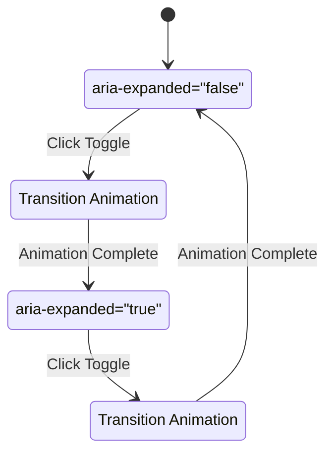

**Diagram sources**
- [assets/main.js](file://assets/main.js#L350-L385)

### Dual Accordion System

The application implements two separate accordion systems for different content types:

1. **Product Includes Accordion**: Handles feature lists and specifications
2. **Product Examples Accordion**: Manages showcase content and demonstrations

Both systems share identical event handling patterns but target different DOM elements and manage distinct content types.

### Animation and State Management

The accordion system utilizes CSS transitions combined with JavaScript state management to create smooth, visually appealing interactions. The system tracks expanded/collapsed states through ARIA attributes and applies appropriate visual indicators.

**Section sources**
- [assets/main.js](file://assets/main.js#L350-L385)

## Form Submission Handling

The form submission system implements comprehensive validation, data processing, and error handling while maintaining user experience quality.

### Form Event Pipeline

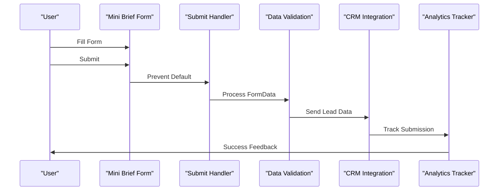

**Diagram sources**
- [assets/main.js](file://assets/main.js#L390-L414)

### Data Processing and Validation

The form submission handler implements several key features:

1. **Prevent Default Behavior**: Stops traditional form submission to enable AJAX processing
2. **FormData Collection**: Extracts and organizes form data efficiently
3. **UTM Parameter Capture**: Preserves marketing tracking information
4. **Error Handling**: Graceful failure management with user feedback
5. **Success Confirmation**: Provides immediate user feedback

### CRM Integration

The system includes a stubbed CRM integration that can be easily extended to connect with various customer relationship management platforms. The current implementation logs leads to the console for development purposes.

**Section sources**
- [assets/main.js](file://assets/main.js#L390-L414)

## CTA Button Interactions

Call-to-action buttons throughout the application implement consistent interaction patterns with comprehensive analytics tracking and fallback mechanisms.

### CTA Event Distribution

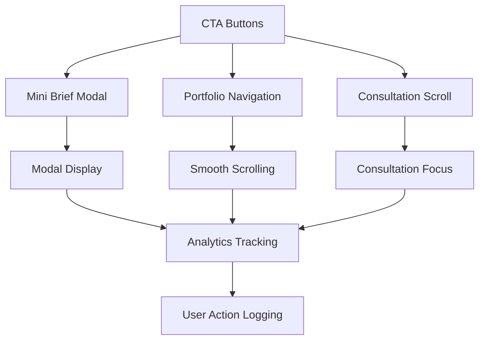

**Diagram sources**
- [assets/main.js](file://assets/main.js#L66-L104)

### Smooth Scroll Implementation

The application implements a sophisticated smooth scrolling mechanism that provides fallback support for older browsers while delivering optimal performance on modern devices.

### Cross-Browser Compatibility

CTA interactions are designed to work consistently across different browsers and devices:

- **Modern Browsers**: Full smooth scrolling with native APIs
- **Legacy Browsers**: Graceful degradation with basic scrolling
- **Touch Devices**: Optimized touch interactions
- **Desktop Devices**: Standard mouse interactions

**Section sources**
- [assets/main.js](file://assets/main.js#L66-L104)

## Video Autoplay Fallback

The video autoplay system implements a sophisticated fallback mechanism that ensures video content works reliably across different mobile browsers and user settings.

### Autoplay Event Flow

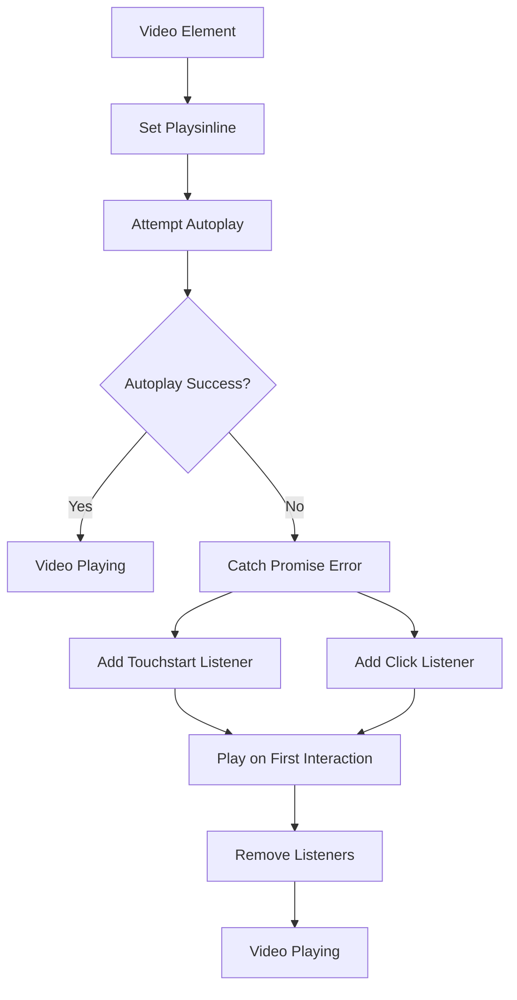

**Diagram sources**
- [assets/main.js](file://assets/main.js#L3-L25)

### Mobile Browser Compatibility

The autoplay system addresses specific challenges faced by different mobile browsers:

1. **iOS Safari**: Requires explicit playsinline attribute and muted flag
2. **Android Chrome**: Often blocks autoplay with sound
3. **Samsung Internet**: Has unique autoplay policies
4. **Firefox Mobile**: Implements strict autoplay restrictions

### Progressive Enhancement

The video autoplay system follows progressive enhancement principles, providing the best possible experience while gracefully degrading for unsupported configurations.

**Section sources**
- [assets/main.js](file://assets/main.js#L3-L25)
- [MOBILE_OPTIMIZATION_FULL.md](file://MOBILE_OPTIMIZATION_FULL.md#L333-L352)

## Event Delegation Patterns

The application extensively uses event delegation to optimize performance and handle dynamic content efficiently.

### Delegation Strategy

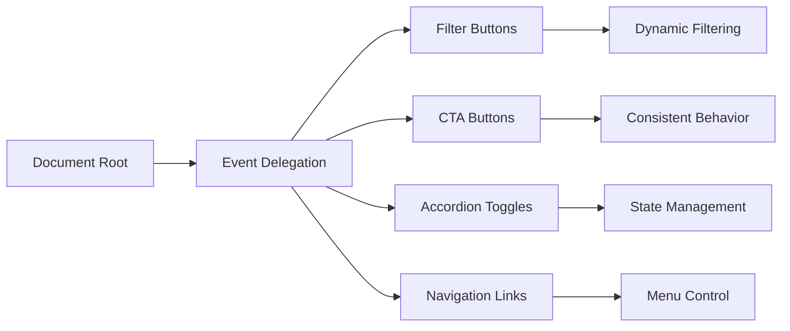

**Diagram sources**
- [assets/main.js](file://assets/main.js#L66-L144)

### Performance Benefits

Event delegation provides several performance advantages:

1. **Reduced Memory Usage**: Single event listener per element type
2. **Dynamic Content Support**: Automatically handles newly added elements
3. **Improved Scalability**: Efficiently manages large numbers of interactive elements
4. **Maintainability**: Centralized event handling logic

### Implementation Patterns

The application uses multiple delegation patterns:

- **Direct Child Delegation**: For immediate child elements
- **Deep Delegation**: For nested element structures
- **Conditional Delegation**: Based on element characteristics

**Section sources**
- [assets/main.js](file://assets/main.js#L66-L144)

## Accessibility Implementation

The event handling system incorporates comprehensive accessibility features to ensure usability for all users, including those using assistive technologies.

### ARIA State Management

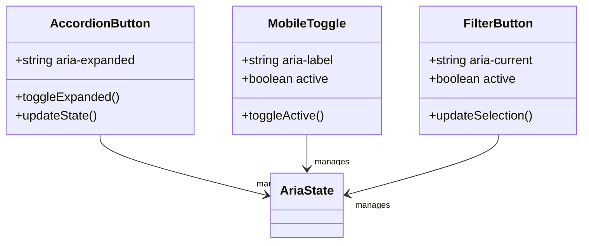

**Diagram sources**
- [assets/main.js](file://assets/main.js#L350-L385)

### Keyboard Navigation Support

The application provides full keyboard navigation capabilities:

1. **Tab Order Management**: Logical tab sequence through interactive elements
2. **Arrow Key Navigation**: Enhanced navigation for complex controls
3. **Enter/Space Activation**: Standard activation methods for all interactive elements
4. **Escape Key Handling**: Proper modal and menu dismissal

### Screen Reader Optimization

Accessibility features include:

- **Live Regions**: Dynamic content updates announced to screen readers
- **Role Definitions**: Proper ARIA roles for custom interactive elements
- **Label Associations**: Clear relationships between controls and their labels
- **State Announcements**: Automatic announcements of state changes

**Section sources**
- [assets/main.js](file://assets/main.js#L350-L385)
- [assets/styles.css](file://assets/styles.css#L200-L250)

## Analytics and Tracking

The event handling system integrates comprehensive analytics tracking to monitor user interactions and optimize site performance.

### Tracking Architecture

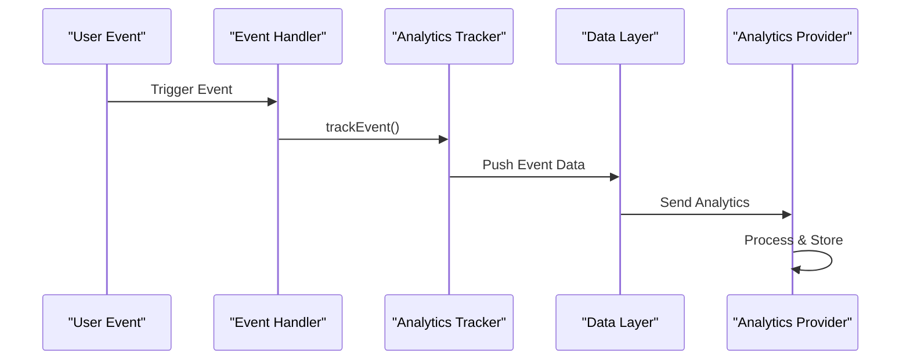

**Diagram sources**
- [assets/main.js](file://assets/main.js#L375-L385)

### Event Categories and Actions

The analytics system tracks several categories of user interactions:

1. **CTA Interactions**: Call-to-action button clicks and conversions
2. **Content Interactions**: Accordion expansions, modal openings, and form submissions
3. **Navigation Events**: Menu interactions and page transitions
4. **Content Engagement**: Portfolio filtering and video interactions

### Data Collection Strategy

The tracking system implements privacy-conscious data collection:

- **Minimal Data**: Only essential information is collected
- **User Consent**: Respects user privacy preferences
- **Anonymization**: Personal information is not collected
- **Compliance**: Adheres to relevant privacy regulations

**Section sources**
- [assets/main.js](file://assets/main.js#L375-L385)

## Error Handling and Fallbacks

The event handling system implements robust error handling and fallback mechanisms to ensure reliable operation across diverse environments.

### Error Handling Patterns

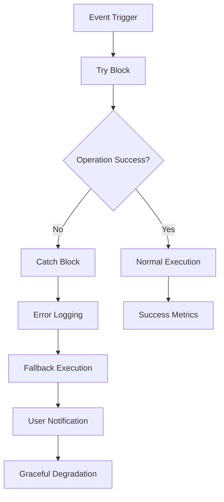

**Diagram sources**
- [assets/main.js](file://assets/main.js#L335-L345)

### Fallback Mechanisms

The application implements multiple fallback strategies:

1. **Browser Feature Detection**: Graceful degradation for unsupported features
2. **Network Failures**: Offline mode and retry mechanisms
3. **Element Availability**: Conditional event binding based on DOM readiness
4. **Performance Issues**: Simplified interactions under resource constraints

### Error Recovery Strategies

When errors occur, the system employs several recovery approaches:

- **Silent Failures**: Non-critical errors that don't interrupt user experience
- **User Notifications**: Informative messages for significant issues
- **Alternative Paths**: Backup functionality when primary methods fail
- **Logging and Monitoring**: Comprehensive error tracking for debugging

**Section sources**
- [assets/main.js](file://assets/main.js#L335-L345)

## Performance Optimization

The event handling system incorporates numerous performance optimization techniques to ensure smooth operation across different devices and network conditions.

### Optimization Techniques

1. **Event Debouncing**: Prevents excessive event firing during rapid interactions
2. **Lazy Loading**: Deferred initialization of non-critical event handlers
3. **Memory Management**: Proper cleanup of event listeners and references
4. **Efficient Selectors**: Optimized DOM queries and element caching

### Resource Management

The system implements careful resource management:

- **Event Listener Cleanup**: Proper removal of listeners to prevent memory leaks
- **DOM Access Minimization**: Reduced DOM queries through strategic caching
- **Animation Optimization**: Hardware-accelerated transitions and transforms
- **Network Efficiency**: Batched requests and intelligent caching

**Section sources**
- [assets/main.js](file://assets/main.js#L1-L418)

## Troubleshooting Guide

This section provides comprehensive guidance for diagnosing and resolving common event handling issues.

### Common Issues and Solutions

#### Unresponsive Buttons
**Symptoms**: Buttons don't respond to clicks or taps
**Causes**: 
- Event listeners not bound correctly
- CSS blocking pointer events
- JavaScript errors preventing execution

**Solutions**:
1. Verify element selectors match actual DOM structure
2. Check for JavaScript errors in browser console
3. Ensure CSS doesn't disable pointer events
4. Confirm event delegation targets are correct

#### Missing Event Bindings
**Symptoms**: Events work initially but stop responding
**Causes**:
- Elements removed/recreated without rebinding
- Event listeners not properly scoped
- Timing issues with DOM readiness

**Solutions**:
1. Implement event delegation for dynamic content
2. Use proper scoping for event handlers
3. Bind events after DOM is fully loaded
4. Implement observer patterns for dynamic elements

#### Video Autoplay Failures
**Symptoms**: Videos don't play automatically on mobile
**Causes**:
- Browser autoplay restrictions
- Incorrect video attributes
- Network connectivity issues

**Solutions**:
1. Implement proper playsinline and muted attributes
2. Add user interaction fallbacks
3. Test across different mobile browsers
4. Provide manual play controls

### Debugging Tools and Techniques

1. **Browser Developer Tools**: Console logging and breakpoint debugging
2. **Event Listener Inspection**: Identifying bound listeners and their scopes
3. **Performance Profiling**: Identifying bottlenecks in event handling
4. **Cross-Browser Testing**: Ensuring consistent behavior across platforms

**Section sources**
- [assets/main.js](file://assets/main.js#L3-L25)
- [MOBILE_OPTIMIZATION_FULL.md](file://MOBILE_OPTIMIZATION_FULL.md#L333-L352)

## Best Practices

The event handling system demonstrates several industry best practices that contribute to maintainable, performant, and accessible web applications.

### Code Organization Principles

1. **Separation of Concerns**: Distinct modules for different functionality areas
2. **Encapsulation**: IIFE structure prevents global namespace pollution
3. **Modularity**: Reusable components with clear interfaces
4. **Documentation**: Comprehensive comments and inline documentation

### Performance Guidelines

1. **Efficient Selectors**: Optimal DOM querying strategies
2. **Event Delegation**: Reducing memory footprint and improving scalability
3. **Resource Management**: Proper cleanup and lifecycle management
4. **Progressive Enhancement**: Building reliable base functionality

### Accessibility Standards

1. **ARIA Compliance**: Proper ARIA attributes and roles
2. **Keyboard Navigation**: Full keyboard accessibility support
3. **Screen Reader Support**: Clear announcements and logical navigation
4. **Color Contrast**: Sufficient contrast ratios for readability

### Cross-Browser Compatibility

1. **Feature Detection**: Graceful degradation for unsupported features
2. **Vendor Prefixes**: Appropriate CSS vendor prefixes
3. **Polyfills**: Strategic use of polyfill libraries
4. **Testing Strategy**: Comprehensive cross-browser testing

**Section sources**
- [assets/main.js](file://assets/main.js#L1-L418)
- [IOS_MAC_OPTIMIZATION.md](file://IOS_MAC_OPTIMIZATION.md#L93-L135)