# JavaScript Functionality

<cite>
**Referenced Files in This Document**
- [main.js](file://assets/main.js)
- [index.html](file://index.html)
- [portfolio.html](file://portfolio.html)
- [contact.html](file://contact.html)
- [styles.css](file://assets/styles.css)
</cite>

## Table of Contents
1. [Introduction](#introduction)
2. [Code Structure and Architecture](#code-structure-and-architecture)
3. [Mobile Menu Functionality](#mobile-menu-functionality)
4. [Portfolio Filtering System](#portfolio-filtering-system)
5. [Video Embedding and Management](#video-embedding-and-management)
6. [Form Submission and CRM Integration](#form-submission-and-crm-integration)
7. [Analytics and Tracking](#analytics-and-tracking)
8. [Accessibility Features](#accessibility-features)
9. [Cross-Page Data Sharing](#cross-page-data-sharing)
10. [Fallback Implementations](#fallback-implementations)
11. [Performance Optimizations](#performance-optimizations)
12. [Troubleshooting Guide](#troubleshooting-guide)

## Introduction

The JavaScript functionality in this landing page project is implemented as a self-contained IIFE (Immediately Invoked Function Expression) that provides comprehensive client-side interactivity. The codebase demonstrates modern JavaScript practices with procedural programming patterns, focusing on separation of concerns across DOM manipulation, event handling, and utility functions.

The implementation covers essential interactive features including mobile navigation, portfolio filtering, video content management, form submissions, and analytics tracking, all while maintaining accessibility standards and cross-browser compatibility.

## Code Structure and Architecture

The JavaScript code follows a procedural IIFE pattern that encapsulates all functionality within a single execution context. This approach provides several benefits:

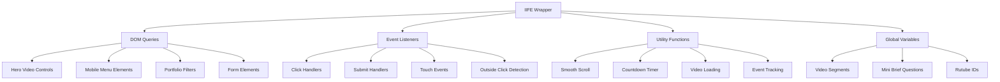

**Diagram sources**
- [main.js](file://assets/main.js#L1-L418)

The code is organized into distinct functional blocks that handle specific aspects of the application:

- **Hero Video Management**: Handles video autoplay, mobile compatibility, and fallback mechanisms
- **Navigation System**: Manages mobile menu toggle and navigation behavior
- **Portfolio System**: Implements filtering, video loading, and cross-page data sharing
- **Form Processing**: Handles mini-brief submissions and CRM integration
- **Analytics Tracking**: Provides event tracking infrastructure
- **Utility Functions**: Smooth scrolling, countdown timers, and helper functions

**Section sources**
- [main.js](file://assets/main.js#L1-L418)

## Mobile Menu Functionality

The mobile menu system provides responsive navigation with sophisticated interaction patterns including click handling, outside click detection, and automatic closing behavior.

### Core Implementation

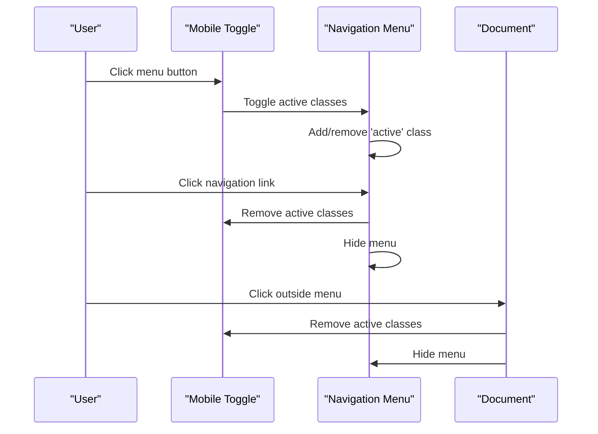

**Diagram sources**
- [main.js](file://assets/main.js#L26-L50)

### Interaction Patterns

The mobile menu implements three key interaction patterns:

1. **Toggle Button**: Toggles menu visibility with visual feedback
2. **Link Navigation**: Automatically closes menu when navigation links are clicked
3. **Outside Click Detection**: Closes menu when clicking outside the menu area

### Accessibility Features

The implementation includes accessibility enhancements:

- **ARIA Attributes**: Uses `aria-label` for screen reader support
- **Visual Feedback**: Active state indication through CSS classes
- **Keyboard Navigation**: Maintains focus management during interactions

**Section sources**
- [main.js](file://assets/main.js#L26-L50)
- [index.html](file://index.html#L18-L35)

## Portfolio Filtering System

The portfolio filtering system enables dynamic content display based on category selection, with sophisticated video loading and cross-page data management.

### Filter Architecture

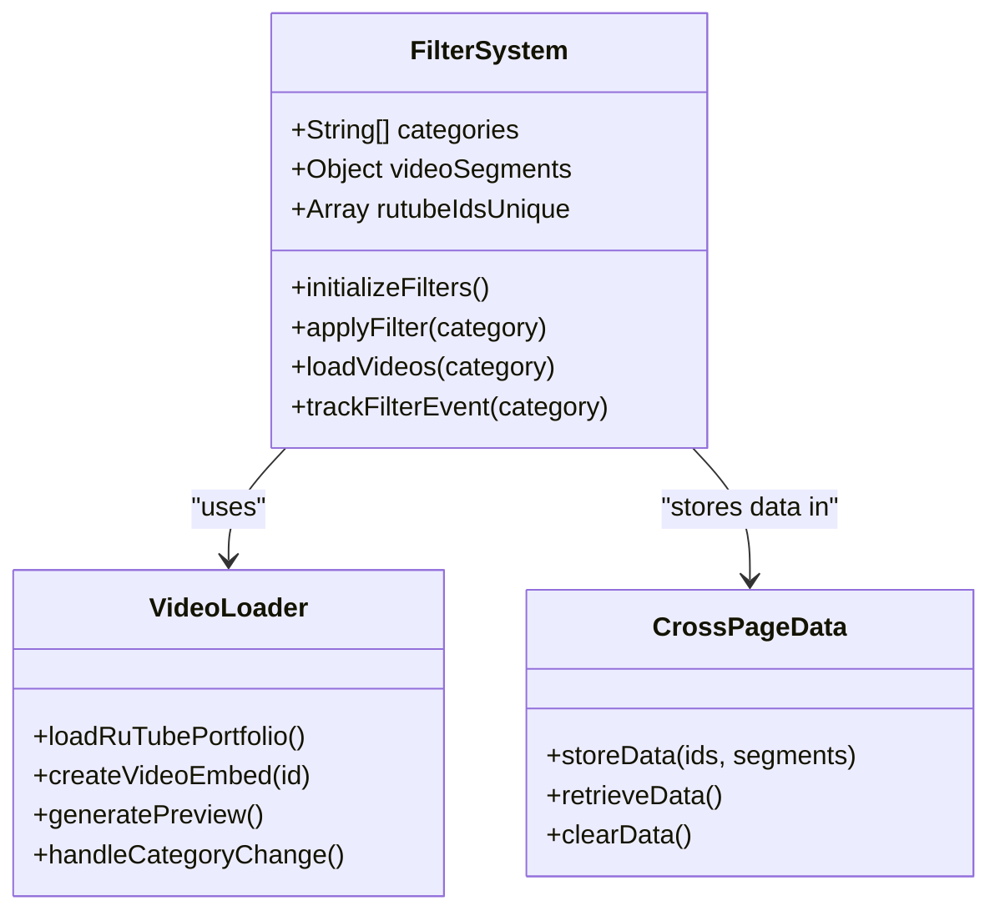

**Diagram sources**
- [main.js](file://assets/main.js#L146-L200)
- [portfolio.html](file://portfolio.html#L1-L388)

### Category-Based Video Loading

The system maintains a comprehensive video segmentation structure:

| Category | Description | Video Count | Use Case |
|----------|-------------|-------------|----------|
| `industry` | Production/Manufacturing projects | 13 videos | Corporate presentations |
| `brand` | Company branding films | 15 videos | Brand identity content |
| `events` | Event coverage videos | 10 videos | Live event recordings |
| `travel` | Travel and lifestyle content | 5 videos | Destination marketing |
| `sport` | Automotive and sports content | 8 videos | Product showcases |
| `pr` | Public relations videos | 20 videos | Media campaigns |
| `all` | Complete video library | 48 videos | Full portfolio access |

### Dynamic Content Loading

The portfolio system implements lazy loading with category-based filtering:

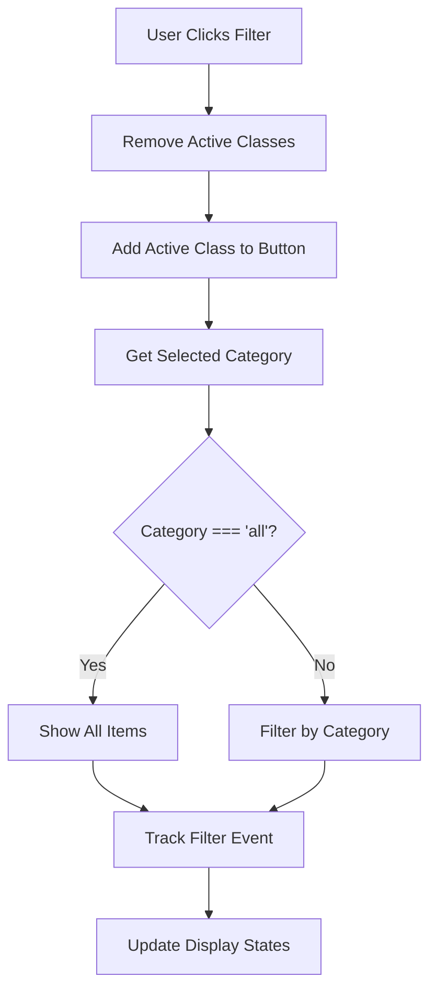

**Diagram sources**
- [main.js](file://assets/main.js#L130-L144)

**Section sources**
- [main.js](file://assets/main.js#L146-L200)
- [portfolio.html](file://portfolio.html#L1-L388)

## Video Embedding and Management

The video system handles multiple video platforms and implements sophisticated loading strategies with fallback mechanisms.

### Rutube Video Integration

The system manages a comprehensive collection of Rutube videos with intelligent loading:

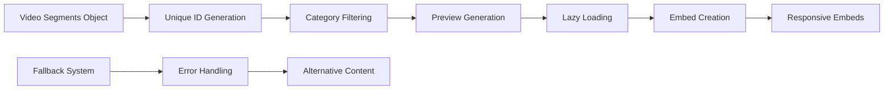

**Diagram sources**
- [main.js](file://assets/main.js#L146-L200)

### Video Loading Strategies

The implementation employs multiple video loading approaches:

1. **Pre-loading**: Videos loaded on page initialization
2. **Lazy Loading**: Category-specific video loading
3. **Responsive Embeds**: Adaptive video sizing for different devices
4. **Error Recovery**: Fallback mechanisms for failed loads

### Cross-Page Video Management

The system maintains video data across page transitions using `sessionStorage`:

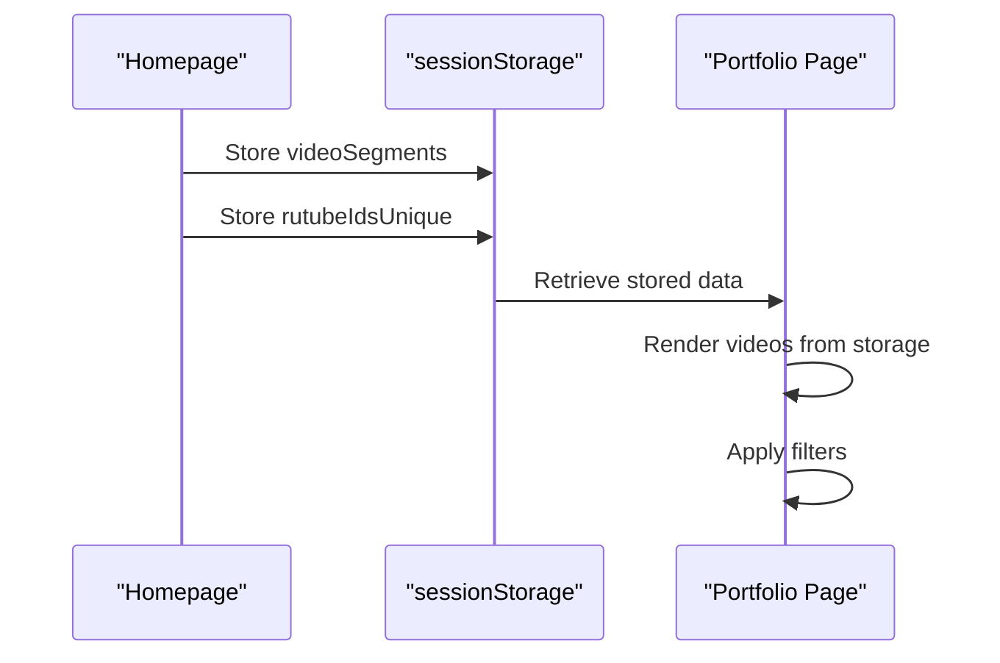

**Diagram sources**
- [main.js](file://assets/main.js#L201-L210)
- [portfolio.html](file://portfolio.html#L1-L50)

**Section sources**
- [main.js](file://assets/main.js#L146-L210)
- [portfolio.html](file://portfolio.html#L1-L388)

## Form Submission and CRM Integration

The form system implements a mini-brief submission process with CRM integration and comprehensive validation.

### Form Processing Pipeline

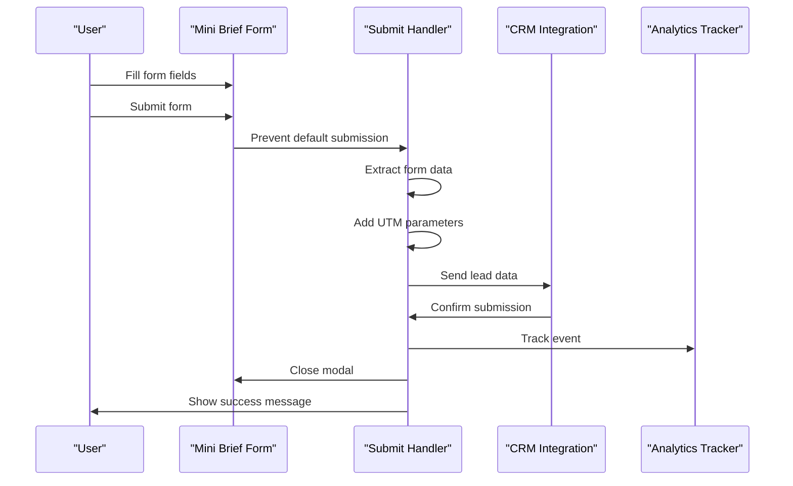

**Diagram sources**
- [main.js](file://assets/main.js#L380-L390)

### CRM Integration Stub

The system provides a flexible CRM integration framework:

```javascript
// CRM webhook stub implementation
async function sendToCRM(lead) {
    try {
        // Production implementation would use:
        // await fetch('https://your-crm-webhook', {
        //     method: 'POST',
        //     headers: {'Content-Type': 'application/json'},
        //     body: JSON.stringify(lead)
        // });
        console.log('CRM lead:', lead);
    } catch (err) {
        console.error('CRM error', err);
    }
}
```

### Form Validation and Data Processing

The form processing includes comprehensive data extraction and enhancement:

- **Field Extraction**: Converts form data to structured object
- **UTM Parameter Capture**: Tracks referral sources from URL parameters
- **Error Handling**: Graceful error management with user feedback
- **Success Confirmation**: User-friendly success messages

**Section sources**
- [main.js](file://assets/main.js#L335-L390)
- [index.html](file://index.html#L200-L240)

## Analytics and Tracking

The analytics system provides comprehensive event tracking with extensible architecture for multiple tracking platforms.

### Event Tracking Architecture

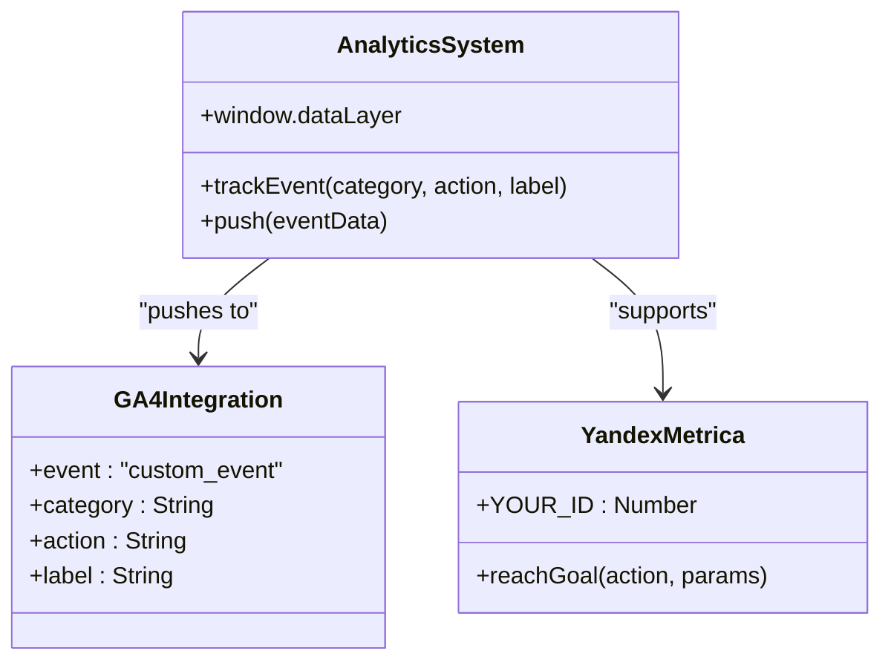

**Diagram sources**
- [main.js](file://assets/main.js#L372-L380)

### Tracking Categories and Events

The system implements granular tracking for different interaction types:

| Category | Actions | Purpose |
|----------|---------|---------|
| `CTA` | `open_mini_brief`, `open_portfolio`, `scroll_to_consultation` | Call-to-action tracking |
| `Cases` | `filter` | Portfolio interaction tracking |
| `Product` | `toggle_includes`, `toggle_examples` | Content expansion tracking |
| `Lead` | `mini_brief_submit` | Form conversion tracking |

### Data Layer Implementation

The tracking system integrates with Google Tag Manager through the data layer:

```javascript
function trackEvent(category, action, label) {
    window.dataLayer = window.dataLayer || [];
    window.dataLayer.push({
        event: 'custom_event',
        category,
        action,
        label
    });
}
```

**Section sources**
- [main.js](file://assets/main.js#L372-L380)

## Accessibility Features

The JavaScript implementation incorporates comprehensive accessibility features following WCAG guidelines.

### ARIA Attribute Management

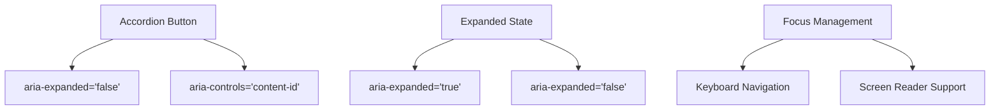

**Diagram sources**
- [main.js](file://assets/main.js#L350-L370)

### Keyboard Navigation Support

The implementation ensures full keyboard accessibility:

- **Tab Navigation**: Logical tab order through interactive elements
- **Space/Enter Keys**: Activation of buttons and interactive elements
- **Escape Key**: Modal dismissal and menu closure
- **Focus Management**: Proper focus handling during state changes

### Screen Reader Compatibility

Accessibility features include:

- **ARIA Labels**: Descriptive labels for interactive elements
- **State Announcements**: Dynamic state changes announced to screen readers
- **Role Definitions**: Proper ARIA roles for complex components
- **Live Regions**: Dynamic content updates announced appropriately

**Section sources**
- [main.js](file://assets/main.js#L350-L390)

## Cross-Page Data Sharing

The system implements sophisticated data sharing between pages using `sessionStorage` with fallback mechanisms.

### Data Persistence Strategy

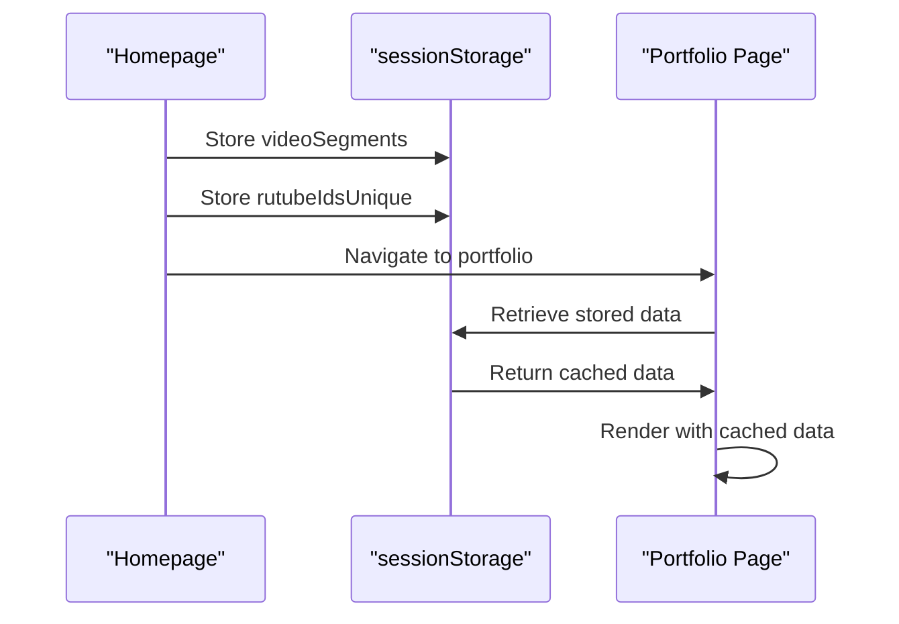

**Diagram sources**
- [main.js](file://assets/main.js#L201-L210)
- [portfolio.html](file://portfolio.html#L1-L50)

### Data Structure and Organization

The cross-page data system maintains:

1. **Video Segment Definitions**: Categorized video collections
2. **Unique Video Identifiers**: Deduplicated video ID lists
3. **Category Mappings**: Relationship between videos and categories
4. **Fallback Data**: Default data for offline scenarios

### Error Handling and Fallbacks

The system implements robust error handling:

```javascript
try {
    sessionStorage.setItem('rutubeIdsUnique', JSON.stringify(rutubeIdsUnique));
    sessionStorage.setItem('videoSegments', JSON.stringify(videoSegments));
} catch (e) {
    // Storage quota exceeded - graceful degradation
}
```

**Section sources**
- [main.js](file://assets/main.js#L201-L210)
- [portfolio.html](file://portfolio.html#L1-L50)

## Fallback Implementations

The JavaScript code includes comprehensive fallback mechanisms for older browsers and degraded functionality scenarios.

### Browser Compatibility Features

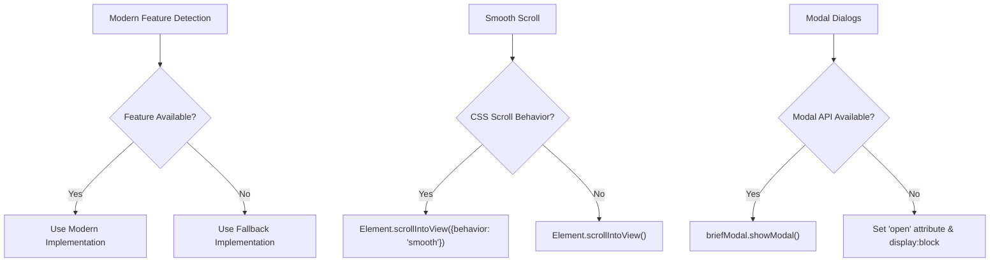

**Diagram sources**
- [main.js](file://assets/main.js#L70-L85)
- [main.js](file://assets/main.js#L60-L70)

### Feature Detection and Graceful Degradation

The implementation includes several fallback strategies:

1. **Smooth Scroll Fallback**: Detects CSS scroll behavior support
2. **Modal Dialog Fallback**: Falls back to basic modal implementation
3. **Video Autoplay Fallback**: Handles autoplay restrictions gracefully
4. **Storage Fallback**: Graceful degradation when sessionStorage is unavailable

### Mobile Browser Compatibility

Special considerations for mobile browser compatibility:

- **iOS Safari**: Specific video autoplay handling and viewport adjustments
- **Android Browsers**: Playsinline attribute for mobile video playback
- **Touch Events**: Comprehensive touch event handling with fallbacks
- **Viewport Scaling**: Mobile-specific viewport configurations

**Section sources**
- [main.js](file://assets/main.js#L1-L85)
- [main.js](file://assets/main.js#L60-L85)

## Performance Optimizations

The JavaScript implementation includes several performance optimization strategies.

### Lazy Loading and Resource Management

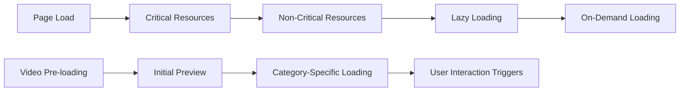

**Diagram sources**
- [main.js](file://assets/main.js#L146-L200)

### Optimization Techniques

The implementation employs several performance optimization strategies:

1. **Selective Loading**: Only load necessary resources based on user interaction
2. **Debounced Events**: Throttle rapid user interactions
3. **Efficient Selectors**: Use of efficient DOM querying methods
4. **Memory Management**: Proper cleanup of event listeners and references
5. **Caching Strategies**: Intelligent caching of frequently accessed data

### Resource Loading Patterns

The system implements smart resource loading:

- **Progressive Enhancement**: Basic functionality works without JavaScript
- **Conditional Loading**: Load features based on browser capabilities
- **Batch Operations**: Group DOM manipulations for efficiency
- **Event Delegation**: Efficient event handling for dynamic content

**Section sources**
- [main.js](file://assets/main.js#L146-L210)

## Troubleshooting Guide

Common issues and their solutions when working with the JavaScript functionality.

### Mobile Menu Issues

**Problem**: Mobile menu doesn't close when clicking outside
**Solution**: Verify that the click event listener is properly attached to the document and that the containment checks are functioning correctly.

**Problem**: Menu toggle doesn't work on touch devices
**Solution**: Check that touch event handlers are properly configured and that CSS pointer-events are not interfering with touch interactions.

### Video Loading Problems

**Problem**: Videos don't load or show blank areas
**Solution**: Verify that Rutube embed URLs are correctly formatted and that the iframe attributes include required permissions.

**Problem**: Video autoplay fails on mobile
**Solution**: Ensure playsinline attributes are set and check for browser autoplay policy restrictions.

### Form Submission Failures

**Problem**: Form submissions don't trigger CRM integration
**Solution**: Check that the sendToCRM function is properly defined and that network requests are not being blocked by browser security policies.

**Problem**: Form validation errors not displaying
**Solution**: Verify that form field validation is properly implemented and that error messages are correctly displayed.

### Analytics Tracking Issues

**Problem**: Events not appearing in analytics dashboard
**Solution**: Check that the dataLayer is properly initialized and that tracking events are correctly formatted according to the analytics platform specifications.

**Problem**: Tracking events firing multiple times
**Solution**: Review event listener attachment to ensure handlers aren't being duplicated.

### Cross-Page Data Issues

**Problem**: Portfolio data not loading between pages
**Solution**: Verify that sessionStorage operations are successful and that data is properly serialized/deserialized.

**Problem**: Data inconsistencies between pages
**Solution**: Check for proper data synchronization and ensure that fallback data is correctly implemented.

**Section sources**
- [main.js](file://assets/main.js#L1-L418)
- [portfolio.html](file://portfolio.html#L1-L388)