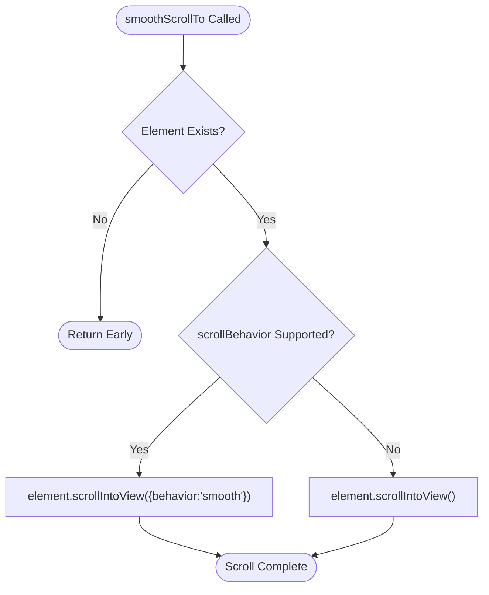
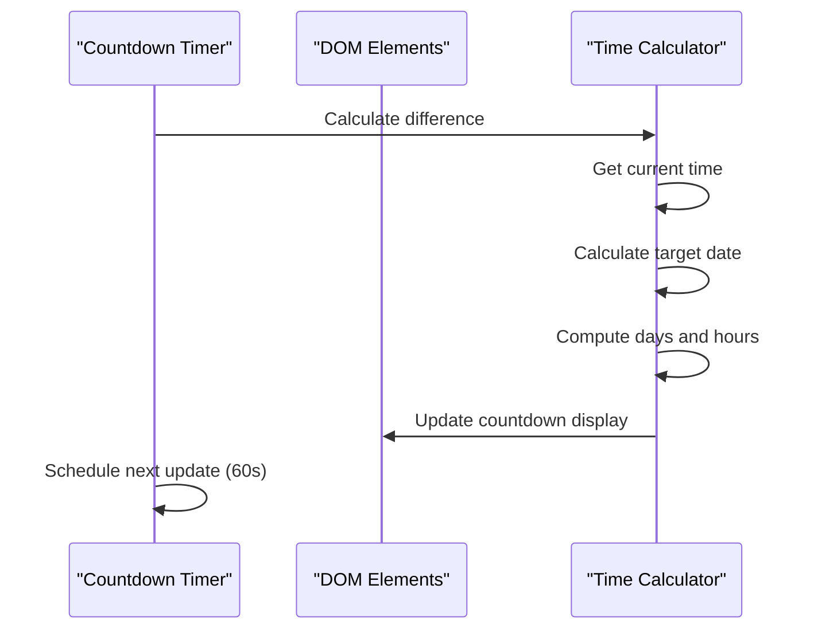
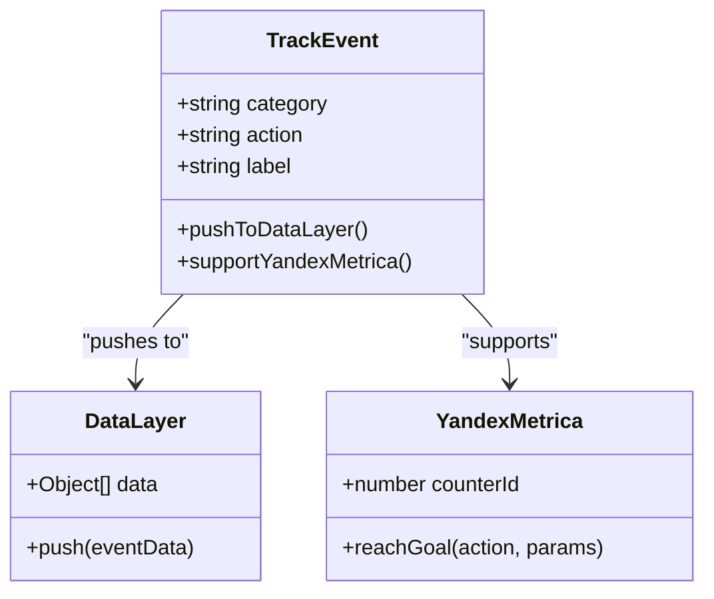
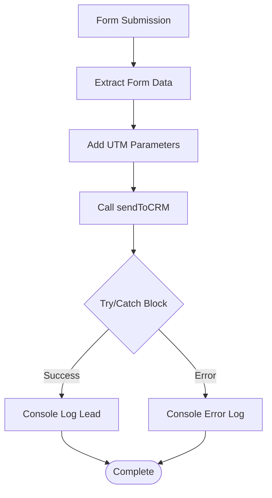

# Utility Functions

<cite>
**Referenced Files in This Document**
- [assets/main.js](file://assets/main.js)
- [index.html](file://index.html)
- [portfolio.html](file://portfolio.html)
- [README.md](file://README.md)
</cite>

## Table of Contents
1. [Introduction](#introduction)
2. [Smooth Scroll Implementation](#smooth-scroll-implementation)
3. [Countdown Timer System](#countdown-timer-system)
4. [Analytics Tracking System](#analytics-tracking-system)
5. [CRM Integration Stub](#crm-integration-stub)
6. [Cross-Browser Compatibility](#cross-browser-compatibility)
7. [Performance Optimizations](#performance-optimizations)
8. [Error Handling Strategies](#error-handling-strategies)
9. [Usage Patterns and Best Practices](#usage-patterns-and-best-practices)
10. [Optimization Recommendations](#optimization-recommendations)

## Introduction

The main.js file implements four essential utility functions that enhance user experience, enable monitoring, and provide cross-browser compatibility for the Knyazev PRO videoproduction landing site. These functions demonstrate modern JavaScript practices while maintaining backward compatibility across diverse browser environments.

The utility suite consists of:
- **smoothScrollTo**: Cross-browser smooth scrolling with iOS fallback
- **Countdown Timer**: FOMO-driven booking window calculations
- **trackEvent**: Analytics integration with Google Tag Manager
- **sendToCRM**: Form submission webhook integration stub

Each function is designed with progressive enhancement principles, ensuring graceful degradation when advanced features aren't available.

## Smooth Scroll Implementation

### Function Architecture

The `smoothScrollTo` function provides seamless navigation experiences across different browser capabilities, with special consideration for iOS devices that historically lacked native smooth scrolling support.



**Diagram sources**
- [assets/main.js](file://assets/main.js#L89-L94)

### Feature Detection Strategy

The function employs modern feature detection to determine browser capabilities:

```javascript
if ('scrollBehavior' in document.documentElement.style) {
  element.scrollIntoView({behavior:'smooth'});
} else {
  element.scrollIntoView();
}
```

This approach ensures optimal user experience by leveraging native smooth scrolling when available while providing instant scrolling as a reliable fallback.

### Integration Patterns

The smooth scrolling functionality is integrated throughout the site via data-action attributes:

**Portfolio Navigation:**
- Triggered by `[data-action="open-portfolio"]` buttons
- Scrolls to '#cases' element with analytics tracking
- Provides immediate feedback with event logging

**Consultation Access:**
- Activated by `[data-action="scroll-to-consultation"]` buttons
- Navigates to '#consultation' section for free consultation requests
- Enhances user journey conversion

**Section sources**
- [assets/main.js](file://assets/main.js#L89-L104)

### iOS-Specific Optimizations

The implementation addresses historical iOS limitations by detecting the presence of the `scrollBehavior` property in the document element's style object. This approach works around the fact that older iOS versions (prior to iOS 15.4) didn't support the smooth scrolling behavior despite having the `scrollIntoView` method.

## Countdown Timer System

### Real-Time Calculation Engine

The countdown timer implements a sophisticated real-time calculation system that displays remaining time until the next booking window, creating urgency (FOMO) for visitors.



**Diagram sources**
- [assets/main.js](file://assets/main.js#L106-L128)

### Time Calculation Logic

The timer performs precise time calculations using JavaScript's Date object:

**Target Date Calculation:**
```javascript
const target = new Date();
target.setDate(target.getDate() + 14);
```

**Real-Time Updates:**
```javascript
const tick = () => {
  const now = new Date();
  const diff = target - now;
  if (diff <= 0) {
    countdownEl.textContent = 'сегодня';
    return;
  }
  const days = Math.floor(diff / 86400000);
  const hours = Math.floor((diff % 86400000) / 3600000);
  countdownEl.textContent = `${days} д ${hours} ч`;
};
```

### Dynamic Month Display

The system automatically determines the next month for contextual display:

```javascript
const nextDate = new Date();
nextDate.setMonth(nextDate.getMonth() + 1);
const months = ['январь','февраль','март','апрель','май','июнь','июль','август','сентябрь','октябрь','ноябрь','декабрь'];
nextMonthEl.textContent = months[nextDate.getMonth()];
```

### Update Frequency Management

The timer executes updates every 60 seconds using `setInterval`:

```javascript
setInterval(tick, 60000);
```

This balance between responsiveness and performance ensures accurate time display while minimizing CPU usage.

**Section sources**
- [assets/main.js](file://assets/main.js#L106-L128)

## Analytics Tracking System

### Google Tag Manager Integration

The `trackEvent` function serves as a centralized analytics hub, implementing the Google Tag Manager dataLayer pattern for comprehensive user interaction tracking.



**Diagram sources**
- [assets/main.js](file://assets/main.js#L347-L352)

### DataLayer Pattern Implementation

The function follows the Google Analytics 4 dataLayer pattern:

```javascript
function trackEvent(category, action, label) {
  window.dataLayer = window.dataLayer || [];
  window.dataLayer.push({
    event: 'custom_event',
    category,
    action,
    label
  });
}
```

### Multi-Platform Analytics Support

The function includes built-in support for Yandex.Metrica integration:

```javascript
// Яндекс.Метрика example:
// if(window.ym){ 
//   ym(YOUR_ID, 'reachGoal', action, {category, label}); 
// }
```

### Event Categories and Tracking

The system tracks various user interactions across the site:

**CTA Events:**
- `CTA:open_mini_brief:button_click` - Mini brief modal opening
- `CTA:open_portfolio:button_click` - Portfolio navigation
- `CTA:scroll_to_consultation:button_click` - Consultation request

**Interactive Elements:**
- `Cases:filter:{category}` - Portfolio filtering actions
- `Product:toggle_includes:{expand|collapse}` - Content accordion toggles
- `Product:toggle_examples:{expand|collapse}` - Example accordion toggles
- `Lead:mini_brief_submit:modal` - Form submission tracking

### Global Accessibility

The function is exposed globally via window object:

```javascript
window.trackEvent = trackEvent;
```

This enables external scripts and third-party integrations to leverage the tracking system.

**Section sources**
- [assets/main.js](file://assets/main.js#L347-L353)

## CRM Integration Stub

### Webhook Submission Architecture

The `sendToCRM` function provides a template for form data submission to Customer Relationship Management systems, demonstrating modern asynchronous JavaScript practices.



**Diagram sources**
- [assets/main.js](file://assets/main.js#L336-L344)

### Form Data Processing

The function extracts form data using modern JavaScript APIs:

```javascript
const formData = new FormData(briefForm);
const lead = Object.fromEntries(formData.entries());
lead.source = (new URLSearchParams(location.search)).toString();
```

This approach ensures comprehensive data capture including:
- User input fields
- UTM tracking parameters
- Form metadata

### Asynchronous Processing

The function implements proper error handling using async/await:

```javascript
async function sendToCRM(lead) {
  try {
    // Placeholder for actual webhook call
    console.log('CRM lead:', lead);
  } catch (err) {
    console.error('CRM error', err);
  }
}
```

### Integration Template

The function serves as a template for production deployment:

```javascript
// await fetch('https://your-crm-webhook', {
//   method: 'POST',
//   headers: {'Content-Type': 'application/json'},
//   body: JSON.stringify(lead)
// });
```

This pattern allows easy modification for different CRM platforms (AmoCRM, Bitrix24, HubSpot, etc.).

**Section sources**
- [assets/main.js](file://assets/main.js#L336-L344)

## Cross-Browser Compatibility

### Progressive Enhancement Strategy

The utility functions demonstrate progressive enhancement principles, ensuring functionality across diverse browser environments while leveraging modern capabilities when available.

### Feature Detection Patterns

**Smooth Scrolling:**
```javascript
if ('scrollBehavior' in document.documentElement.style) {
  // Use smooth scrolling
} else {
  // Use instant scrolling
}
```

**Modal Dialogs:**
```javascript
if (typeof briefModal.showModal === 'function') {
  briefModal.showModal();
} else {
  // Fallback to manual display
  briefModal.setAttribute('open', '');
  briefModal.style.display = 'block';
}
```

### Legacy Browser Support

The implementation includes fallback mechanisms for:
- **Older iOS versions** (< iOS 15.4) without smooth scrolling support
- **Legacy browsers** without native dialog API support
- **Mobile Safari** with specific viewport and touch optimizations

**Section sources**
- [assets/main.js](file://assets/main.js#L62-L88)

## Performance Optimizations

### Efficient DOM Manipulation

**Debounced Updates:**
The countdown timer uses `setInterval` with 60-second intervals to minimize CPU usage while maintaining accuracy.

**Selective Element Processing:**
Functions check for element existence before attempting operations, preventing unnecessary DOM queries.

### Memory Management

**Event Listener Cleanup:**
The code uses efficient event delegation patterns and removes listeners when appropriate.

**Storage Optimization:**
Session storage is used for temporary data transfer between pages, reducing memory footprint.

### Network Efficiency

**Lazy Loading Integration:**
The CRM webhook function is designed to work with existing lazy loading patterns for optimal resource utilization.

## Error Handling Strategies

### Robust Error Management

**Try/Catch Blocks:**
Critical operations wrap potential failures in try/catch blocks:

```javascript
try {
  sessionStorage.setItem('rutubeIdsUnique', JSON.stringify(rutubeIdsUnique));
} catch (e) {}
```

**Graceful Degradation:**
Functions return early when conditions aren't met rather than throwing errors.

**Console Logging:**
Error states are logged to the console for debugging while maintaining user experience.

### Validation Patterns

**Input Sanitization:**
Form data extraction validates input before processing.

**Element Existence Checks:**
Functions verify element availability before attempting operations.

**Type Checking:**
Proper type checking prevents runtime errors from unexpected data types.

**Section sources**
- [assets/main.js](file://assets/main.js#L336-L344)

## Usage Patterns and Best Practices

### Modular Design Principles

Each utility function serves a specific purpose while maintaining loose coupling with other system components. This modular approach enables:

- **Testability**: Each function can be tested independently
- **Maintainability**: Changes to one function don't affect others
- **Reusability**: Functions can be adapted for different contexts

### Event-Driven Architecture

The utilities integrate seamlessly with the site's event-driven architecture:

```javascript
document.querySelectorAll('[data-action="open-portfolio"]').forEach(btn => {
  btn.addEventListener('click', () => {
    smoothScrollTo(document.getElementById('cases'));
    trackEvent('CTA', 'open_portfolio', 'button_click');
  });
});
```

### Data Flow Management

The functions implement clear data flow patterns:
1. **Input Collection**: Gather user interactions and form data
2. **Processing**: Transform data for analytics or CRM submission
3. **Output**: Send data to appropriate destinations with error handling

### Accessibility Integration

All utility functions support accessibility standards:
- ARIA attributes for interactive elements
- Keyboard navigation support
- Screen reader compatibility
- Semantic HTML integration

**Section sources**
- [assets/main.js](file://assets/main.js#L89-L104)

## Optimization Recommendations

### Performance Enhancements

**Timer Optimization:**
Consider using `requestAnimationFrame` for smoother countdown updates instead of `setInterval`.

**Memory Optimization:**
Implement weak references for DOM elements that may be removed from the page.

**Network Optimization:**
Add request deduplication for CRM submissions to prevent duplicate entries.

### Security Improvements

**Input Validation:**
Enhance form data validation with sanitization libraries for production use.

**CSRF Protection:**
Implement CSRF tokens for form submissions to prevent cross-site request forgery.

**HTTPS Enforcement:**
Ensure all webhook calls use HTTPS in production environments.

### Monitoring and Analytics

**Performance Metrics:**
Add performance timing for critical path operations.

**Error Tracking:**
Integrate with error tracking services for production monitoring.

**A/B Testing Support:**
Extend the tracking system to support A/B testing frameworks.

### Future Enhancements

**Progressive Web App Features:**
Add service worker integration for offline functionality.

**Web Workers:**
Offload heavy computations to web workers for better UI responsiveness.

**Module System:**
Convert to ES6 modules for better tree shaking and bundling.

**Testing Framework:**
Implement comprehensive unit and integration tests for all utility functions.

The utility functions in main.js demonstrate modern JavaScript development practices while maintaining broad compatibility across diverse browser environments. Their thoughtful implementation enhances user experience, enables comprehensive analytics tracking, and provides a solid foundation for future enhancements and integrations.