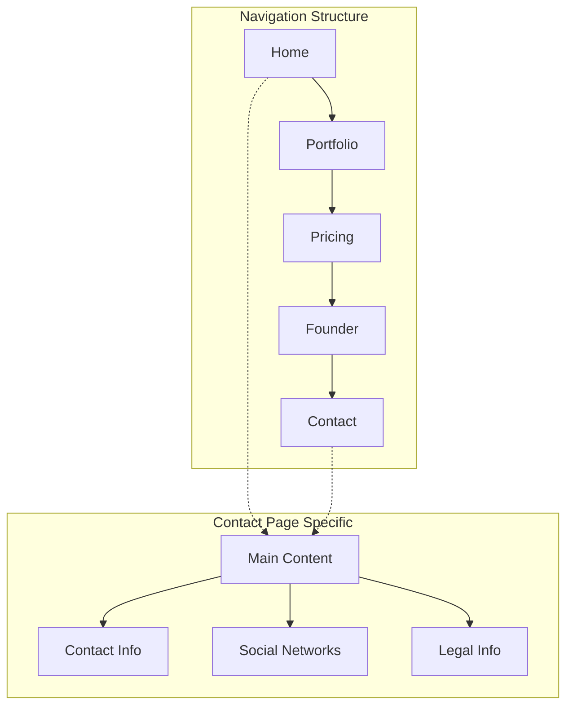
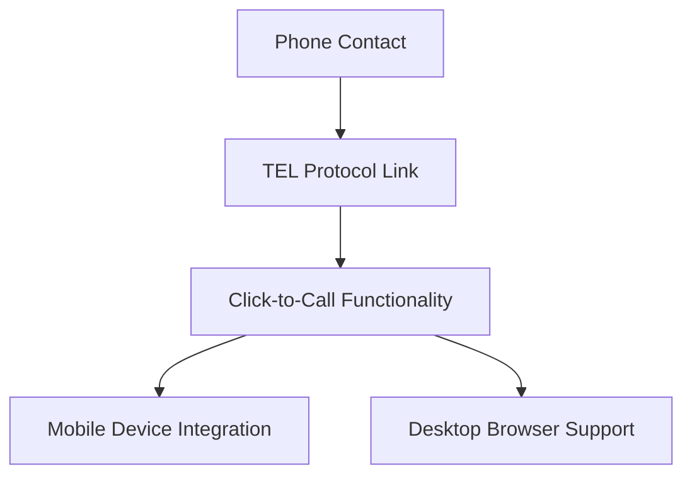
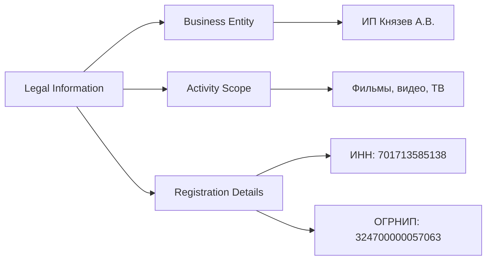
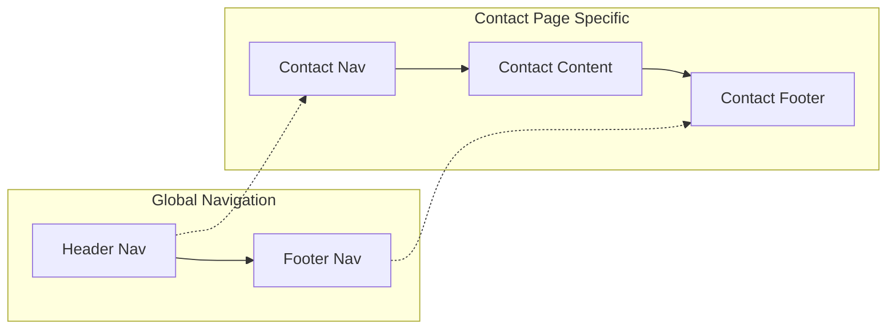

# Contact Page

<cite>
**Referenced Files in This Document**
- [contact.html](file://contact.html)
- [assets/styles.css](file://assets/styles.css)
- [assets/main.js](file://assets/main.js)
- [index.html](file://index.html)
- [portfolio.html](file://portfolio.html)
- [founder.html](file://founder.html)
- [price.html](file://price.html)
</cite>

## Table of Contents
1. [Introduction](#introduction)
2. [Page Structure and Navigation](#page-structure-and-navigation)
3. [Primary Contact Information Section](#primary-contact-information-section)
4. [Social Media Presence Section](#social-media-presence-section)
5. [Legal Information Section](#legal-information-section)
6. [Accessibility Features](#accessibility-features)
7. [Visual Design and Styling](#visual-design-and-styling)
8. [Navigation Relationship](#navigation-relationship)
9. [Security and Legal Compliance](#security-and-legal-compliance)
10. [Maintenance and Updates](#maintenance-and-updates)
11. [Troubleshooting Guide](#troubleshooting-guide)
12. [Conclusion](#conclusion)

## Introduction

The Contact Page serves as the primary gateway for visitors to connect with Князев ПРО, a professional video production studio. This comprehensive documentation covers the three main sections of the contact page: primary contact information, social media presence, and legal information. The page is designed with semantic HTML, accessibility considerations, and responsive design principles to ensure optimal user experience across all devices.

The contact page follows the established design patterns of the Князев ПРО website, maintaining consistency with the global navigation structure while providing specialized contact information tailored to the video production industry.

## Page Structure and Navigation

The contact page maintains a consistent navigation structure with the rest of the website, featuring a fixed header with the studio's logo and navigation menu. The navigation includes links to all main sections: Home, Portfolio, Pricing, Founder, and Contact.



**Diagram sources**
- [contact.html](file://contact.html#L1-L127)
- [index.html](file://index.html#L1-L249)

The page utilizes a grid-based layout system that organizes the three main sections vertically, with each section styled as a distinct card with consistent spacing and visual hierarchy.

**Section sources**
- [contact.html](file://contact.html#L1-L127)
- [assets/styles.css](file://assets/styles.css#L310-L333)

## Primary Contact Information Section

The primary contact information section provides essential communication channels for potential clients and partners. This section is structured as a grid layout containing three main contact items: phone number, email address, and Telegram handle.

### Phone Number Contact

The phone number is presented with a properly formatted international format using the `tel:` protocol, enabling click-to-call functionality on mobile devices. The phone number follows the standard Russian mobile format: `+7 913 840-43-43`.



**Diagram sources**
- [contact.html](file://contact.html#L48-L52)

### Email Contact

The email contact uses the `mailto:` protocol with the studio's official email address `knyazev_pro@bk.ru`. This enables users to initiate email composition directly from the website with pre-filled recipient information.

### Telegram Integration

The Telegram contact option provides a direct link to the studio's Telegram profile (`@aurmanow`) with external link targeting. This modern messaging platform integration supports instant communication and real-time project discussions.

### Semantic HTML Implementation

Each contact item is implemented using semantic HTML elements with appropriate labeling:

| Element Type | Implementation | Purpose |
|--------------|----------------|---------|
| `div` | Container with `contact-item` class | Logical grouping of contact information |
| `span` | Label with `contact-label` class | Descriptive text for contact type |
| `a` | Link with `contact-value` class | Interactive contact action |

**Section sources**
- [contact.html](file://contact.html#L44-L56)
- [assets/styles.css](file://assets/styles.css#L380-L395)

## Social Media Presence Section

The social media section showcases the studio's online presence across major Russian and international platforms. Each social network link includes visual indicators and proper external link handling.

### Platform Integration

The section includes five major social media platforms:

1. **VKontakte** (`https://vk.com/knyazev_videopro`)
2. **RuTube** (`https://rutube.ru/channel/68009475/`)
3. **Yandex.Dzen** (`https://dzen.ru/knyazev_pro`)
4. **TenChat** (`https://tenchat.ru/knyazev_pro`)
5. **Telegram Channel** (`https://t.me/knyazev_production`)

### Visual Design Elements

Each social network link features a consistent design pattern with:
- Platform name displayed prominently
- Right-pointing arrow indicator for external links
- Hover effects with subtle animation
- Consistent typography and spacing

```mermaid
sequenceDiagram
participant User as User
participant Link as Social Network Link
participant External as External Platform
User->>Link : Click Social Media Link
Link->>External : Open in New Tab
External-->>User : Display Platform Content
User->>Link : Hover Effect Activation
Link->>User : Visual Feedback (Arrow Appearance)
```

**Diagram sources**
- [contact.html](file://contact.html#L64-L82)
- [assets/styles.css](file://assets/styles.css#L396-L405)

### Accessibility Features

All social media links include proper accessibility attributes:
- `target="_blank"` for external link indication
- `aria-label` attributes for screen reader support
- Visual arrow indicators for external link identification

**Section sources**
- [contact.html](file://contact.html#L61-L82)
- [assets/styles.css](file://assets/styles.css#L396-L405)

## Legal Information Section

The legal information section provides essential details about the individual entrepreneur operating the video production studio, complying with Russian legal requirements for business transparency.

### Individual Entrepreneur Details

The section contains comprehensive information about the studio owner:

| Information Type | Value | Purpose |
|------------------|-------|---------|
| Full Name | Князев Алексей Владимирович | Personal identification |
| Business Status | Индивидуальный предприниматель | Legal entity type |
| Activity Description | Production of films, videos, TV programs, photography | Business scope |
| Registration Date | 20.12.2024 | Business establishment date |

### Russian Legal Compliance

The legal section includes mandatory Russian business registration information:

#### Taxpayer Identification Number (INN)
- **Value**: 701713585138
- **Purpose**: Official tax identification for Russian businesses
- **Format**: 12-digit numeric code

#### Individual Entrepreneur Registration Number (OGRNIP)
- **Value**: 324700000057063
- **Purpose**: State registration number for individual entrepreneurs
- **Format**: 15-digit numeric code

### Content Structure

The legal information is organized in a hierarchical structure:
1. **Business Entity Declaration**: Clear statement of individual entrepreneurship
2. **Activity Description**: Detailed scope of business activities
3. **Registration Details**: Complete legal registration information



**Diagram sources**
- [contact.html](file://contact.html#L84-L111)

**Section sources**
- [contact.html](file://contact.html#L84-L111)

## Accessibility Features

The contact page incorporates comprehensive accessibility features to ensure usability for all users, including those using assistive technologies.

### Keyboard Navigation Support

The page supports full keyboard navigation with:
- Focus indicators for interactive elements
- Logical tab order through contact forms and links
- Screen reader compatibility with proper ARIA labels

### Screen Reader Compatibility

Each interactive element includes appropriate ARIA attributes:
- `aria-label` attributes for social media links
- Proper heading hierarchy for content organization
- Descriptive labels for form controls

### Visual Accessibility

The design maintains high contrast ratios and clear visual hierarchy:
- Text-to-background contrast ratio meets WCAG guidelines
- Consistent spacing and sizing for readability
- Clear visual separation between different content sections

**Section sources**
- [contact.html](file://contact.html#L64-L82)
- [assets/styles.css](file://assets/styles.css#L396-L405)

## Visual Design and Styling

The contact page employs a cohesive design system that maintains visual consistency with the rest of the Князев ПРО website.

### Color Scheme and Typography

The page utilizes the established dark theme with:
- Primary background: `#0A0A0A`
- Secondary background: `#181818`
- Brand accent: `#B09B7E`
- Text colors: `#E0E0E0` (primary), `#8F8F8F` (secondary)

### Layout Structure

The contact page uses a grid-based layout system:
- **Container Width**: 900px maximum width for optimal readability
- **Section Spacing**: 48px gap between main sections
- **Card Design**: Rounded corners with subtle borders
- **Responsive Behavior**: Adaptive layout for mobile devices

### Interactive Elements

All interactive elements feature:
- Smooth hover transitions with color changes
- Subtle animations for user feedback
- Consistent sizing and spacing
- Clear visual hierarchy

**Section sources**
- [assets/styles.css](file://assets/styles.css#L380-L420)

## Navigation Relationship

The contact page maintains strong relationships with the global navigation structure, ensuring seamless user experience across the website.

### Header Navigation

The contact page shares identical header navigation with other pages:
- Studio logo linking to homepage
- Mobile menu toggle for responsive navigation
- Consistent navigation menu with active state highlighting

### Footer Integration

The page includes a shared footer component with:
- Social media icons linking to various platforms
- Copyright information
- Consistent branding elements



**Diagram sources**
- [contact.html](file://contact.html#L1-L127)
- [index.html](file://index.html#L1-L249)

**Section sources**
- [contact.html](file://contact.html#L1-L127)
- [assets/styles.css](file://assets/styles.css#L310-L333)

## Security and Legal Compliance

The contact page implements several security measures and legal compliance features specific to Russian business regulations.

### Data Protection Considerations

While the page displays personal contact information, it follows responsible disclosure practices:
- Publicly available contact information for legitimate business inquiries
- No sensitive personal data exposure
- Clear business context for contact requests

### Russian Legal Requirements

The page complies with Russian legal standards for individual entrepreneurs:
- Mandatory display of full name and business status
- Complete registration number information
- Clear business activity description
- Proper legal formatting and presentation

### External Link Security

All external links include:
- `target="_blank"` attribute for security
- `rel="noopener noreferrer"` attributes (implied by browser behavior)
- Clear visual indicators for external destinations

**Section sources**
- [contact.html](file://contact.html#L84-L111)

## Maintenance and Updates

The contact page structure allows for easy maintenance and updates while preserving design consistency.

### Updating Contact Information

To update contact information:
1. **Phone Number**: Modify the `href="tel:+79138404343"` attribute
2. **Email Address**: Update the `href="mailto:knyazev_pro@bk.ru"` attribute
3. **Telegram Handle**: Change the link text and URL in the Telegram section

### Adding New Social Media Platforms

To add new social media platforms:
1. Duplicate existing social network link structure
2. Update the URL to the new platform
3. Add appropriate platform name and icon
4. Ensure consistent styling and hover effects

### Legal Information Updates

For legal information updates:
1. **Name Changes**: Update the full name in the legal section
2. **Registration Numbers**: Modify INN and OGRNIP values
3. **Activity Description**: Update business scope description
4. **Registration Date**: Change the establishment date

### Best Practices

When making updates:
- Test all links in multiple browsers
- Verify proper formatting and display
- Ensure consistent styling across all elements
- Validate accessibility features remain intact

## Troubleshooting Guide

Common issues and solutions for the contact page:

### Link Functionality Issues

**Problem**: Phone or email links not working
**Solution**: 
- Verify proper `tel:` and `mailto:` protocol usage
- Test on both desktop and mobile devices
- Check browser compatibility

**Problem**: Social media links opening incorrectly
**Solution**:
- Confirm `target="_blank"` attribute is present
- Verify URL formatting is correct
- Test in different browsers

### Visual Display Problems

**Problem**: Contact information not displaying properly
**Solution**:
- Check CSS class assignments
- Verify responsive breakpoints
- Test on various screen sizes

**Problem**: Social network arrows not appearing
**Solution**:
- Confirm CSS hover effects are loading
- Check for CSS conflicts
- Verify JavaScript functionality

### Accessibility Issues

**Problem**: Screen readers not announcing content correctly
**Solution**:
- Verify ARIA labels are present
- Check heading hierarchy
- Test with accessibility tools

**Section sources**
- [contact.html](file://contact.html#L1-L127)
- [assets/main.js](file://assets/main.js#L1-L50)

## Conclusion

The Contact Page of Князев ПРО represents a well-structured, accessible, and visually consistent component of the studio's online presence. The three main sections—primary contact information, social media presence, and legal information—work together to provide comprehensive contact options while maintaining the studio's professional image.

Key strengths of the implementation include:
- Semantic HTML structure with proper labeling
- Responsive design for all device types
- Accessibility features for diverse user needs
- Consistent styling with the overall website theme
- Legal compliance with Russian business regulations
- Easy maintenance and update capabilities

The page successfully balances functionality with aesthetics, providing users with clear pathways to connect with the studio while maintaining the professional standards expected of a video production company. Regular updates to contact information and social media platforms ensure the page remains current and useful for potential clients and partners.