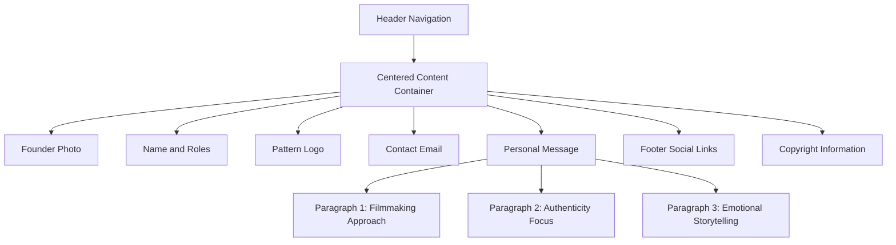
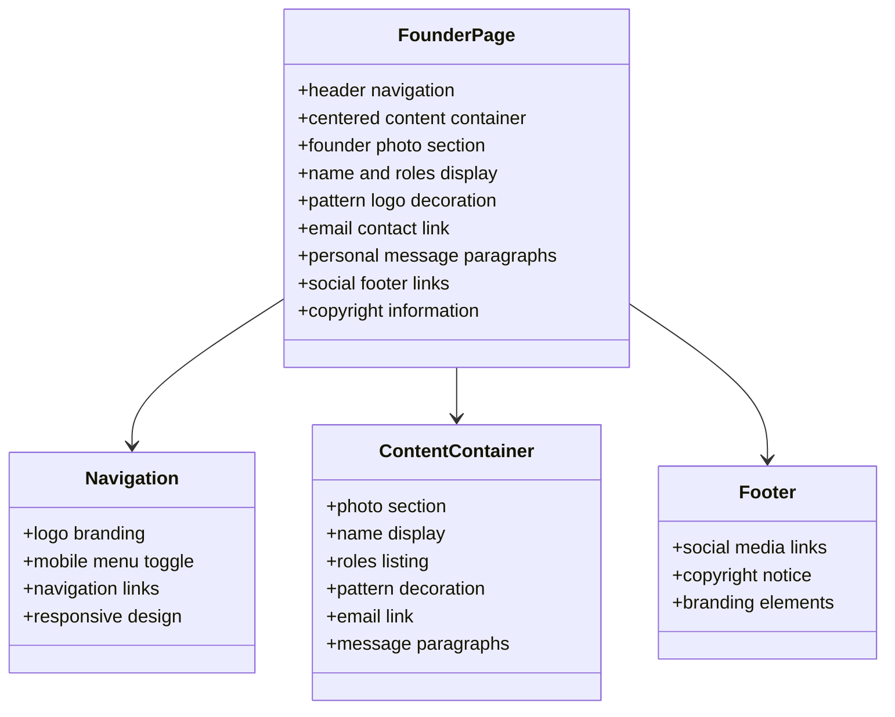

# Founder Page Documentation

<cite>
**Referenced Files in This Document**
- [founder.html](file://founder.html)
- [index.html](file://index.html)
- [assets/styles.css](file://assets/styles.css)
- [assets/main.js](file://assets/main.js)
- [README.md](file://README.md)
</cite>

## Table of Contents
1. [Introduction](#introduction)
2. [Page Structure and Layout](#page-structure-and-layout)
3. [Visual Design and Typography](#visual-design-and-typography)
4. [Content Analysis](#content-analysis)
5. [Technical Implementation](#technical-implementation)
6. [Accessibility Features](#accessibility-features)
7. [Integration with Site Navigation](#integration-with-site-navigation)
8. [Team Section Relationship](#team-section-relationship)
9. [Update Guidelines](#update-guidelines)
10. [Performance Considerations](#performance-considerations)
11. [Conversion Funnel Impact](#conversion-funnel-impact)
12. [Troubleshooting](#troubleshooting)

## Introduction

The Founder Page (`founder.html`) serves as a crucial component of the Knyazev PRO videoproduction studio's website, establishing personal credibility and building trust with potential clients. This page focuses on showcasing Alexey Knyazev's professional credentials, filmmaking philosophy, and personal connection with the audience, acting as a trust-building element in the conversion funnel.

The page follows a centered content design pattern with a full-width photo layout, emphasizing the founder's personal brand while maintaining consistency with the studio's dark-themed aesthetic. It serves as a bridge between the corporate identity established on the homepage and the practical services offered by the studio.

## Page Structure and Layout

The Founder Page employs a structured layout centered around Alexey Knyazev's personal profile, featuring distinct sections that guide visitors through his professional journey and filmmaking approach.

**Diagram sources**
- [founder.html](file://founder.html#L1-L71)

### Layout Architecture

The page utilizes a responsive grid system with the following key structural elements:

- **Contact-Centered Container**: Full-height vertical centering using CSS Grid
- **Contact-Inner Wrapper**: Max-width container (820px) for content alignment
- **Photo Section**: 360px square portrait with border styling
- **Typography Hierarchy**: Progressive sizing from name (56px) to body text (16px)
- **Social Integration**: Footer with multiple social media platforms

**Section sources**
- [founder.html](file://founder.html#L30-L60)
- [assets/styles.css](file://assets/styles.css#L380-L420)

## Visual Design and Typography

The visual design emphasizes minimalism and professionalism, with careful attention to typography hierarchy and spacing.

### Color Scheme and Branding

The page maintains the studio's signature dark theme with subtle brand accents:

| Element | Color Value | Purpose |
|---------|-------------|---------|
| Background | `#0A0A0A` (dark) | Primary background |
| Text | `#E0E0E0` (light gray) | Primary text color |
| Accent | `#B09B7E` (beige) | Brand highlight |
| Border | `#4F4F4F` | Subtle dividers |

### Typography Hierarchy

The typographic scale creates clear visual hierarchy:

| Element | Size | Weight | Spacing |
|---------|------|--------|---------|
| Name | 56px | Bold (800) | Letter spacing: 0.06em |
| Roles | 14px | Normal (400) | Upper case, letter spacing: 0.18em |
| Email | 16px | Normal (400) | Underlined link |
| Body Text | 16px | Normal (400) | Opacity: 90% |

### Image Styling

The founder's photograph features:
- **Dimensions**: 360px × auto aspect ratio
- **Border**: 1px solid background color
- **Object Fit**: Cover for consistent cropping
- **Alignment**: Centered within container

**Section sources**
- [assets/styles.css](file://assets/styles.css#L380-L420)

## Content Analysis

The personal message section constitutes the core narrative of the page, structured around three paragraphs that articulate Alexey Knyazev's filmmaking philosophy and approach.

### Paragraph 1: Filmmaking Approach
The first paragraph establishes the foundation of the studio's work ethic:
- **Core Concept**: "Я делаю фильмы на реальных историях" (I create films based on real stories)
- **Formats Covered**: Advertising videos, brand videos, documentary formats
- **Methodology**: Emphasis on authenticity and working with people under high pressure
- **Value Proposition**: Results-driven approach for teams and brands

### Paragraph 2: Authenticity Focus
This paragraph elaborates on the studio's commitment to genuine storytelling:
- **Collaborative Nature**: Working with teams and brands prioritizing results
- **Emotional Impact**: Belief in strong stories that evoke feelings
- **Format Versatility**: From cinematic advertising campaigns to doc-series
- **Unified Goal**: Creating human-level resonance

### Paragraph 3: Call to Action
The concluding paragraph invites engagement:
- **Direct Invitation**: "Если вам это откликается — напишите на почту" (If this resonates, write to us)
- **Consultation Process**: Discussion of goals, timelines, format selection
- **Team Composition**: Proposal of team structure and stage timing
- **Professional Tone**: Maintains business professionalism while inviting personal connection

### Semantic Structure

The content uses semantic HTML elements appropriately:
- **Paragraph Tags**: Three separate `
` elements for distinct ideas
- **Strong Tag**: Used for emphasis ("Я делаю фильмы на реальных историях")
- **Anchor Tag**: Proper email link with `mailto:` protocol
- **Text Alignment**: Centered text throughout for cohesive design

**Section sources**
- [founder.html](file://founder.html#L45-L55)

## Technical Implementation

The Founder Page leverages modern web technologies with progressive enhancement principles.

### HTML Structure

The page follows semantic HTML5 standards with accessibility attributes:

**Diagram sources**
- [founder.html](file://founder.html#L1-L71)

### CSS Styling System

The page utilizes a comprehensive CSS architecture:

#### Custom Properties
The stylesheet defines a dark theme system using CSS custom properties:
- `--bg`: Primary background color
- `--text`: Primary text color
- `--brand`: Brand accent color
- `--line`: Divider color

#### Responsive Design
Media queries ensure optimal display across devices:
- **Desktop**: Full-width layout with 1200px max-width
- **Tablet**: Adjusted spacing and typography
- **Mobile**: Single-column layout with simplified navigation

#### Animation and Interactivity
Subtle animations enhance user experience:
- **Hover Effects**: Button and link interactions
- **Loading States**: Smooth transitions for modal forms
- **Navigation**: Mobile menu toggle animation

**Section sources**
- [assets/styles.css](file://assets/styles.css#L1-L50)

### JavaScript Functionality

While the Founder Page primarily relies on static content, it inherits functionality from the main JavaScript module:

#### Video Autoplay Handling
The hero video functionality ensures consistent behavior across pages:
- **Mobile Compatibility**: Plays inline on mobile devices
- **Autoplay Policy**: Graceful fallback for blocked autoplay
- **User Interaction**: Manual play initiation on first touch/click

#### Menu Responsiveness
Mobile navigation works consistently across all pages:
- **Toggle Mechanism**: Smooth slide-out menu
- **Close Behavior**: Click outside or link selection closes menu
- **Accessibility**: ARIA labels and keyboard navigation support

**Section sources**
- [assets/main.js](file://assets/main.js#L1-L30)

## Accessibility Features

The Founder Page incorporates comprehensive accessibility features to ensure inclusivity for all users.

### Image Accessibility

Each image includes appropriate alternative text:

| Image Type | Alt Text | Purpose |
|------------|----------|---------|
| Founder Photo | "Алексей Князев" | Identifies the person |
| Studio Logo | "Князев ПРО" | Brand identification |
| Pattern Logo | "Князев ПРО" | Decorative branding |
| Social Icons | Platform names | Describes destination |

### Text Readability

Typography choices prioritize readability:
- **Contrast Ratio**: Sufficient contrast between text and background
- **Line Height**: 1.5 for comfortable reading
- **Font Choice**: Montserrat variable weight for optimal performance
- **Text Opacity**: 90% for body text to reduce visual strain

### Interactive Elements

All interactive components include accessibility attributes:
- **ARIA Labels**: Mobile menu toggle with "Меню" label
- **Focus Indicators**: Clear visual focus for keyboard navigation
- **Link Descriptions**: Descriptive social media links
- **Form Elements**: Proper labeling for future interactive elements

### Keyboard Navigation

The page supports full keyboard navigation:
- **Tab Order**: Logical sequence through interactive elements
- **Enter/Space**: Activation of buttons and links
- **Escape**: Closing modals and menus
- **Arrow Keys**: Navigation within dropdowns and lists

**Section sources**
- [founder.html](file://founder.html#L19-L20)
- [founder.html](file://founder.html#L36-L37)

## Integration with Site Navigation

The Founder Page seamlessly integrates with the overall site navigation structure, maintaining consistency across all pages.

### Navigation Patterns

The page shares identical navigation elements with other site sections:
- **Logo Linking**: Returns to homepage from any page
- **Consistent Menu Items**: Same navigation order and labels
- **Active State**: Clear indication of current page
- **Responsive Behavior**: Mobile menu works identically across pages

### Cross-Page Consistency

Navigation elements maintain uniform appearance:
- **Brand Logo**: Same positioning and styling
- **Menu Toggle**: Consistent mobile menu behavior
- **Link Styling**: Uniform color scheme and hover effects
- **Spacing**: Consistent padding and margins

### Internal Linking

The page includes internal navigation elements:
- **Home Link**: Returns to studio homepage
- **Portfolio Link**: Connects to creative work showcase
- **Price Link**: Links to service offerings
- **Contact Link**: Provides multiple contact methods

**Section sources**
- [founder.html](file://founder.html#L25-L35)
- [index.html](file://index.html#L25-L35)

## Team Section Relationship

The Founder Page complements the team section on the homepage, creating a cohesive presentation of the studio's leadership and expertise.

### Homepage Team Section

The homepage features a grid layout showcasing all team members:
- **Grid Structure**: Four equal columns for team cards
- **Member Profiles**: Photos, names, and roles for each team member
- **Interactive Elements**: Hover effects and smooth transitions
- **Call to Action**: Links to individual profiles

### Founder-Specific Elements

The Founder Page provides additional depth:
- **Extended Biography**: Personal message and filmmaking philosophy
- **Exclusive Content**: Founder's unique perspective and approach
- **Direct Contact**: Email link for immediate communication
- **Visual Emphasis**: Larger photo and prominent placement

### Content Synergy

Both sections work together to build trust:
- **Homepage**: Quick overview of capabilities and team composition
- **Founder Page**: Personal connection and detailed approach explanation
- **Consistent Messaging**: Shared branding and visual language
- **Progressive Disclosure**: Basic info on homepage, detailed info on founder page

**Section sources**
- [index.html](file://index.html#L125-L145)
- [index.html](file://index.html#L170-L185)

## Update Guidelines

Maintaining the Founder Page requires careful consideration of content accuracy and design consistency.

### Content Updates

#### Founder Information
- **Name**: Verify spelling and capitalization
- **Roles**: Update job titles as needed
- **Credentials**: Add new certifications or achievements
- **Experience**: Include recent projects or notable work

#### Personal Message
- **Philosophy**: Reflect current filmmaking approach
- **Approach**: Update methodology descriptions
- **Contact**: Verify email address and social media links
- **Tone**: Maintain professional yet approachable tone

### Visual Updates

#### Photography
- **Image Quality**: Ensure high-resolution original
- **Aspect Ratio**: Maintain 11:14 ratio for consistent cropping
- **Lighting**: Professional studio lighting preferred
- **Background**: Neutral background for clean appearance

#### Branding
- **Logo Usage**: Consistent with studio branding guidelines
- **Color Scheme**: Maintain dark theme consistency
- **Typography**: Use approved font weights and sizes
- **Spacing**: Follow established design patterns

### Technical Updates

#### HTML Structure
- **Semantic Markup**: Maintain proper HTML5 structure
- **Accessibility**: Add or update ARIA attributes as needed
- **SEO**: Optimize meta tags and alt text
- **Validation**: Ensure HTML5 compliance

#### CSS Styling
- **Custom Properties**: Update theme variables if needed
- **Responsive Design**: Test across all breakpoints
- **Performance**: Minimize CSS file size
- **Browser Compatibility**: Test with supported browsers

#### JavaScript
- **Functionality**: Ensure mobile menu works correctly
- **Analytics**: Update tracking codes if necessary
- **Performance**: Monitor load times and optimize
- **Compatibility**: Test with older browser versions

**Section sources**
- [founder.html](file://founder.html#L1-L71)
- [assets/styles.css](file://assets/styles.css#L1-L50)

## Performance Considerations

The Founder Page is optimized for fast loading and smooth user experience across all devices.

### Asset Optimization

#### Image Compression
- **File Formats**: JPEG for photographs, PNG for logos
- **Resolution**: Optimized for display size (360px width)
- **Compression**: Balanced quality vs. file size
- **Lazy Loading**: Not applicable for hero images but optimized for quick load

#### CSS Optimization
- **Minification**: Production-ready minified CSS
- **Critical Path**: Above-the-fold styles inline
- **Custom Properties**: Efficient color and spacing management
- **Media Queries**: Mobile-first responsive design

#### JavaScript Efficiency
- **Vanilla JS**: No external dependencies
- **Event Delegation**: Efficient event handling
- **Memory Management**: Proper cleanup of event listeners
- **Performance Monitoring**: Built-in analytics tracking

### Loading Performance

#### First Contentful Paint (FCP)
- **Optimized Images**: Compressed founder photo
- **Minimal Dependencies**: No external libraries
- **Efficient CSS**: Inline critical styles
- **Fast Server Response**: Local hosting optimization

#### Time to Interactive (TTI)
- **JavaScript Execution**: Minimal blocking scripts
- **DOM Ready**: Fast DOM manipulation
- **Event Binding**: Efficient click handlers
- **User Experience**: Immediate interactivity

### Mobile Performance

#### Touch Responsiveness
- **Tap Targets**: Minimum 44px touch areas
- **Smooth Scrolling**: Hardware-accelerated transitions
- **Viewport Optimization**: Proper mobile meta tags
- **Battery Efficiency**: Optimized animations and transitions

#### Network Efficiency
- **Asset Bundling**: Combined CSS and JavaScript
- **Compression**: Gzip compression support
- **Caching**: Browser caching for static assets
- **CDN Readiness**: Optimized for content delivery networks

**Section sources**
- [assets/styles.css](file://assets/styles.css#L1-L50)
- [assets/main.js](file://assets/main.js#L1-L50)

## Conversion Funnel Impact

The Founder Page plays a strategic role in the studio's conversion funnel, building trust and encouraging engagement at multiple stages.

### Trust Building Stage

#### Personal Credibility
- **Founder Visibility**: Prominent display of Alexey Knyazev's photo and credentials
- **Expertise Demonstration**: Clear articulation of filmmaking philosophy
- **Authenticity**: Genuine personal message resonates with audiences
- **Professional Presentation**: Clean design reflects studio quality

#### Social Proof
- **Team Integration**: Connection to broader studio team
- **Portfolio Link**: Seamless transition to creative work showcase
- **Contact Options**: Multiple ways to initiate dialogue
- **Reputation Building**: Establishes studio reputation through individual branding

### Engagement Stage

#### Direct Communication
- **Email Accessibility**: Clear, clickable email link
- **Immediate Action**: Encourages direct inquiry
- **Personal Connection**: Humanizes the business relationship
- **Response Expectation**: Sets expectation for prompt communication

#### Content Value
- **Philosophical Alignment**: Helps visitors assess cultural fit
- **Quality Assurance**: Demonstrates commitment to authentic storytelling
- **Process Insight**: Provides glimpse into studio methodology
- **Expectation Setting**: Clarifies what clients can expect

### Decision Stage

#### Relationship Building
- **Human Element**: Creates personal connection beyond services
- **Long-term Perspective**: Positions studio as partner, not vendor
- **Cultural Fit**: Helps identify compatible clients
- **Referral Potential**: Satisfied visitors more likely to refer others

#### Call to Action Effectiveness
- **Clear Next Step**: Direct email invitation removes ambiguity
- **Low Barrier**: Simple action requires minimal effort
- **Professional Tone**: Maintains business professionalism
- **Follow-up Opportunity**: Enables personalized client engagement

### Conversion Metrics

| Metric | Impact | Measurement |
|--------|--------|-------------|
| Page Views | Trust establishment | Analytics tracking |
| Email Clicks | Engagement level | Form submission tracking |
| Social Shares | Brand awareness | Social media analytics |
| Lead Generation | Conversion rate | CRM integration |
| Time on Page | Interest level | Session duration |

**Section sources**
- [founder.html](file://founder.html#L50-L55)

## Troubleshooting

Common issues and solutions for maintaining the Founder Page functionality and appearance.

### Image Display Issues

#### Problem: Founder Photo Not Loading
**Symptoms**: Blank space where photo should appear
**Causes**: 
- Incorrect file path
- Missing image file
- Server permission issues

**Solutions**:
1. Verify file path: `assets/img/founder_alexey_Knyazev.jpg`
2. Check file existence and permissions
3. Test with browser developer tools
4. Ensure proper MIME type configuration

#### Problem: Poor Image Quality
**Symptoms**: Blurry or pixelated appearance
**Causes**:
- Insufficient resolution
- Compression artifacts
- Display scaling issues

**Solutions**:
1. Use original high-resolution image
2. Apply appropriate compression settings
3. Test across different devices
4. Consider responsive image implementation

### Text and Typography Issues

#### Problem: Text Overflow or Clipping
**Symptoms**: Text appears cut off or overlaps
**Causes**:
- Insufficient container width
- Font rendering issues
- Viewport scaling problems

**Solutions**:
1. Adjust container max-width
2. Test with different font sizes
3. Verify viewport meta tag
4. Check for conflicting CSS rules

#### Problem: Accessibility Violations
**Symptoms**: Screen reader issues or low contrast
**Causes**:
- Missing alt text
- Insufficient color contrast
- Improper heading structure

**Solutions**:
1. Add descriptive alt text to all images
2. Verify WCAG contrast ratios
3. Use semantic HTML elements
4. Test with accessibility tools

### Navigation and Interaction Issues

#### Problem: Mobile Menu Not Working
**Symptoms**: Menu toggle doesn't respond
**Causes**:
- JavaScript disabled
- Event listener conflicts
- CSS z-index issues

**Solutions**:
1. Verify JavaScript is enabled
2. Check for console errors
3. Test with different browsers
4. Review CSS specificity

#### Problem: Email Link Not Functional
**Symptoms**: Clicking email link doesn't open mail client
**Causes**:
- Incorrect mailto: syntax
- Browser security restrictions
- Mobile device limitations

**Solutions**:
1. Verify mailto: protocol syntax
2. Test with different email clients
3. Consider adding phone number option
4. Implement fallback contact methods

### Performance Issues

#### Problem: Slow Page Load
**Symptoms**: Delayed content appearance
**Causes**:
- Large image file size
- Network latency
- Browser caching issues

**Solutions**:
1. Optimize image compression
2. Implement browser caching
3. Use content delivery network
4. Monitor performance metrics

#### Problem: Mobile Rendering Issues
**Symptoms**: Content misalignment on mobile
**Causes**:
- Responsive breakpoint failures
- Viewport configuration issues
- Touch interaction problems

**Solutions**:
1. Test with various mobile devices
2. Verify viewport meta tag
3. Check media query syntax
4. Test touch gesture responsiveness

**Section sources**
- [founder.html](file://founder.html#L1-L71)
- [assets/main.js](file://assets/main.js#L1-L50)