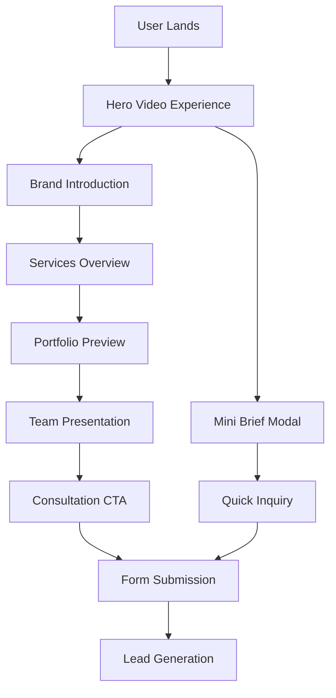
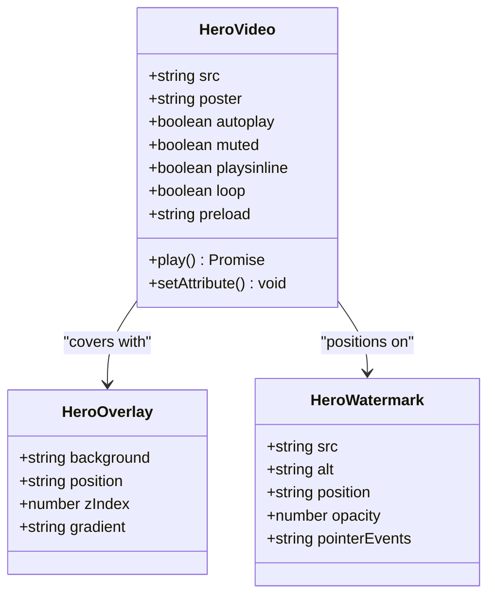
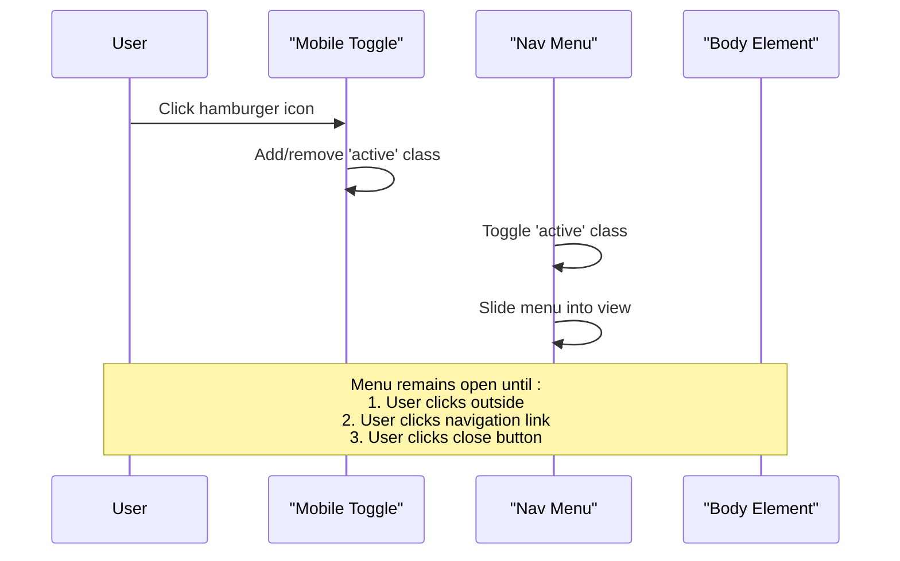
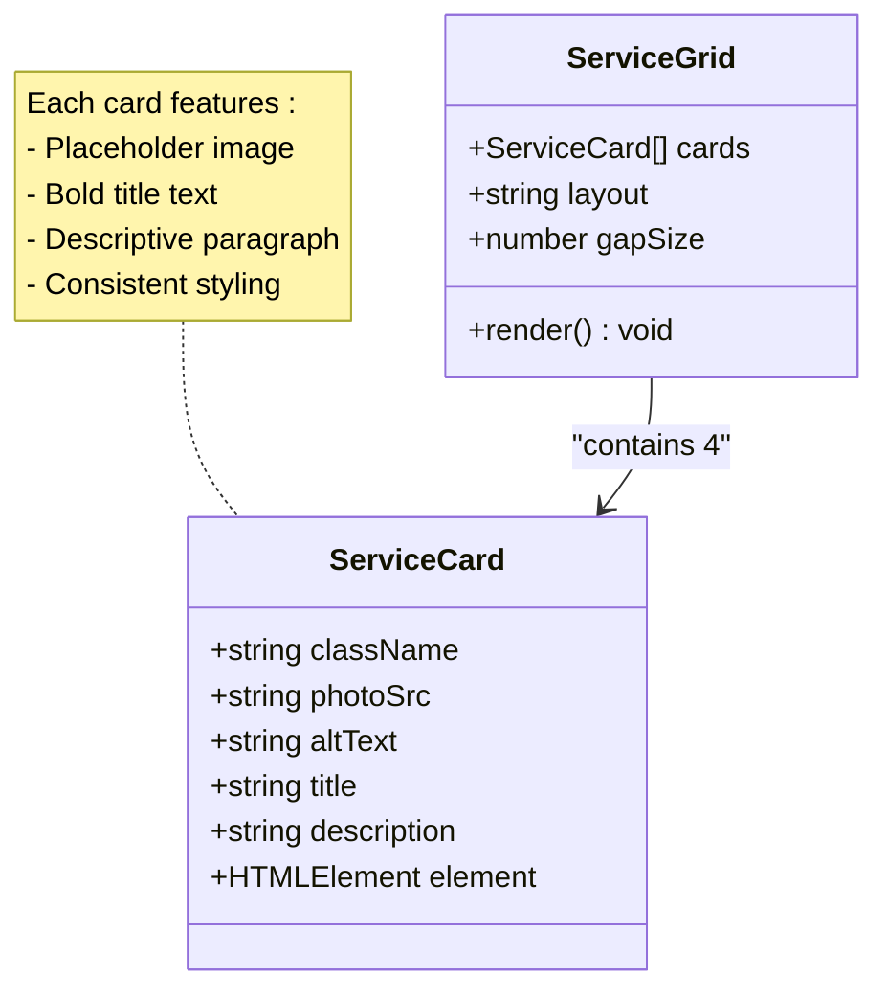
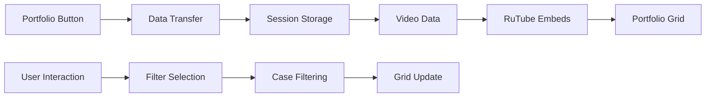
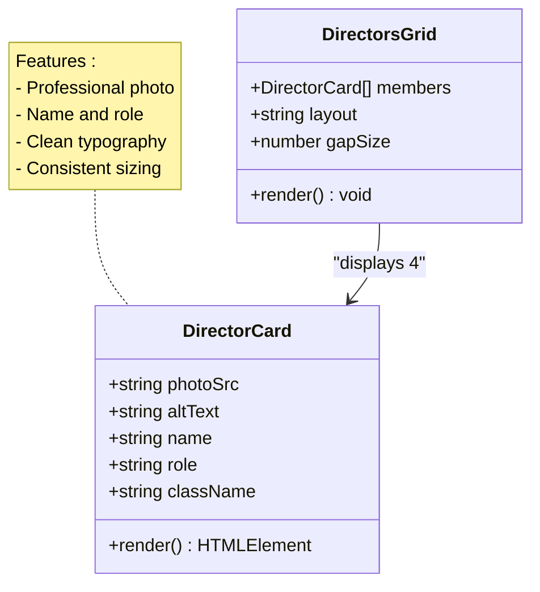
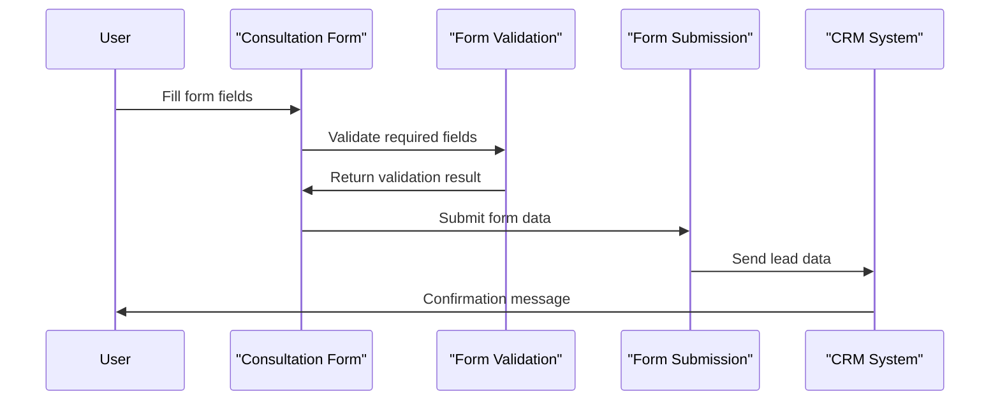
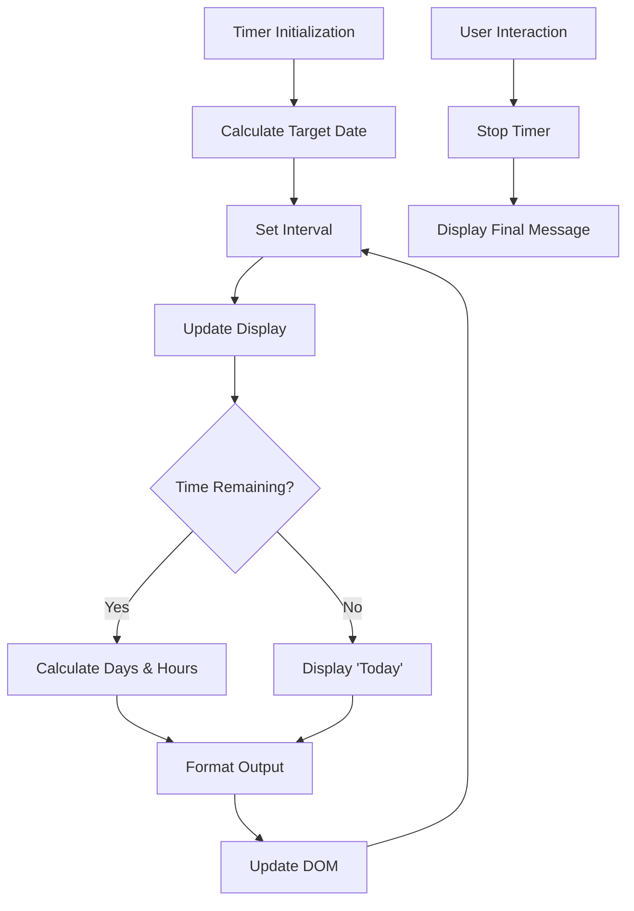
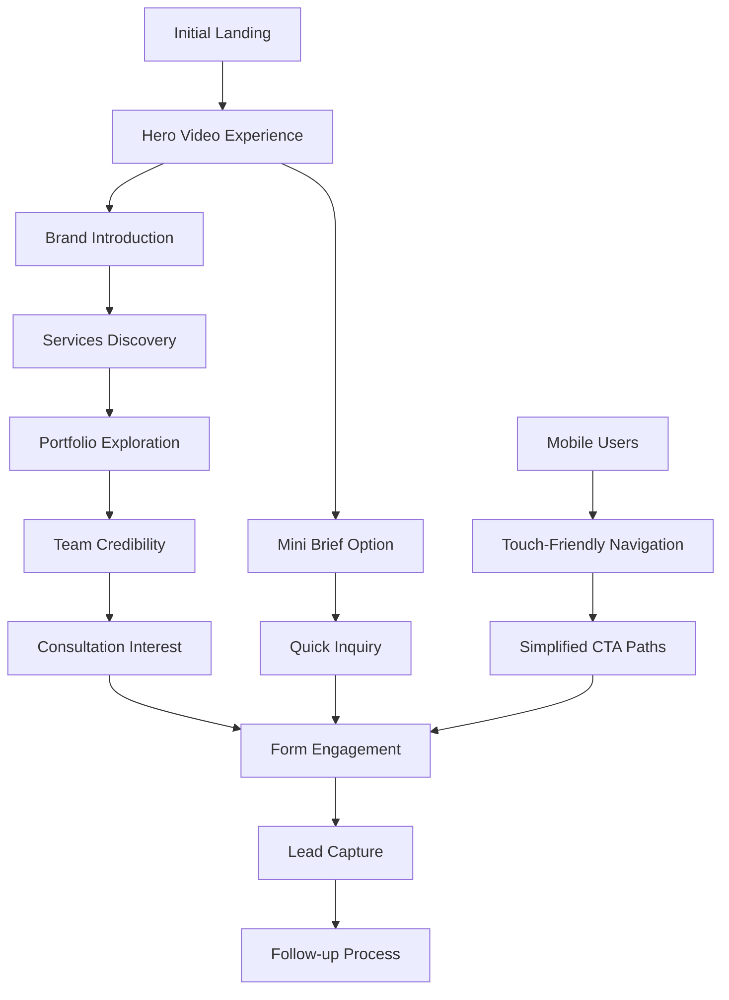
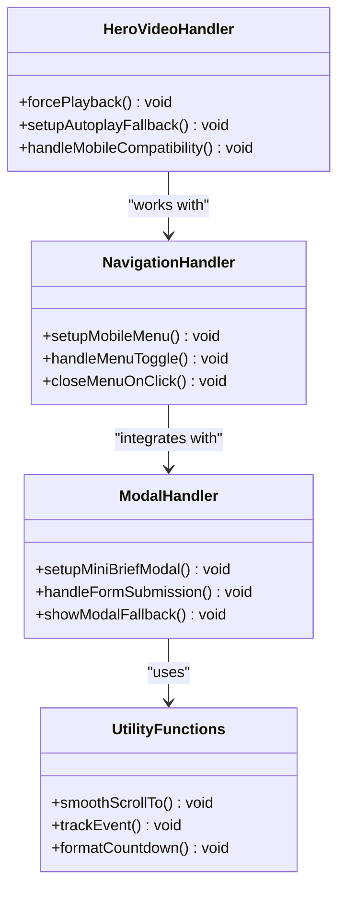

# Home Page

<cite>
**Referenced Files in This Document**
- [index.html](file://index.html)
- [assets/main.js](file://assets/main.js)
- [assets/styles.css](file://assets/styles.css)
- [README.md](file://README.md)
- [MOBILE_OPTIMIZATION_FULL.md](file://MOBILE_OPTIMIZATION_FULL.md)
</cite>

## Table of Contents
1. [Introduction](#introduction)
2. [Page Structure and Purpose](#page-structure-and-purpose)
3. [Hero Section Analysis](#hero-section-analysis)
4. [Navigation Header Implementation](#navigation-header-implementation)
5. [Services Grid Section](#services-grid-section)
6. [Portfolio Preview Section](#portfolio-preview-section)
7. [Team Section](#team-section)
8. [Consultation CTA Section](#consultation-cta-section)
9. [FOMO Countdown Timer](#fomofomo-countdown-timer)
10. [User Journey Mapping](#user-journey-mapping)
11. [Technical Implementation Details](#technical-implementation-details)
12. [Accessibility Considerations](#accessibility-considerations)
13. [Performance Optimizations](#performance-optimizations)
14. [Conclusion](#conclusion)

## Introduction

The Knyazev PRO home page serves as the primary entry point for the videoproduction studio's digital presence, designed specifically for conversion and brand presentation. Built with a modern dark theme aesthetic, the page combines cutting-edge web technologies with strategic marketing elements to create an engaging user experience that drives conversions from initial landing to form submission.

This comprehensive documentation explores the technical implementation, design decisions, and user experience considerations that make this landing page an effective business tool for the videoproduction studio.

## Page Structure and Purpose

The home page follows a carefully structured layout that guides users through a logical conversion funnel while establishing brand credibility and showcasing the studio's capabilities.



**Diagram sources**
- [index.html](file://index.html#L1-L249)
- [assets/main.js](file://assets/main.js#L1-L418)

The page architecture emphasizes:
- **Visual storytelling** through immersive video experiences
- **Clear value proposition** communication
- **Strategic call-to-actions** placed throughout the user journey
- **Mobile-first design** ensuring universal accessibility

**Section sources**
- [index.html](file://index.html#L1-L249)
- [README.md](file://README.md#L1-L437)

## Hero Section Analysis

The hero section represents the cornerstone of the user experience, featuring a sophisticated video background system with multiple layers of visual enhancement and responsive design considerations.

### Video Background Implementation

The hero video employs advanced HTML5 video elements with comprehensive browser compatibility and performance optimizations:



**Diagram sources**
- [index.html](file://index.html#L13-L17)
- [assets/main.js](file://assets/main.js#L1-L20)

### Responsive Video Handling

The video implementation includes sophisticated fallback mechanisms for various device types and browser capabilities:

| Feature | Implementation | Purpose |
|---------|----------------|---------|
| **Autoplay Control** | `autoplay muted playsinline` | Ensures video starts automatically on mobile devices |
| **Poster Image** | `poster="assets/img/camera.jpg"` | Provides fallback content when video cannot play |
| **Preload Strategy** | `preload="auto"` | Optimizes loading performance |
| **Mobile Compatibility** | `webkit-playsinline` | Enables inline playback on iOS devices |

### Overlay and Watermark Design

The visual layering creates depth and enhances brand visibility:

- **Gradient Overlay**: Creates visual hierarchy and text readability
- **Watermark Placement**: Subtle brand reinforcement in the bottom-right corner
- **Opacity Management**: Maintains video quality while ensuring brand visibility

**Section sources**
- [index.html](file://index.html#L13-L17)
- [assets/main.js](file://assets/main.js#L1-L20)
- [assets/styles.css](file://assets/styles.css#L40-L60)

## Navigation Header Implementation

The navigation system balances functionality with aesthetic continuity, featuring a mobile-responsive design that maintains brand identity across all screen sizes.

### Mobile Menu Toggle System



**Diagram sources**
- [assets/main.js](file://assets/main.js#L22-L45)
- [assets/styles.css](file://assets/styles.css#L350-L380)

### Persistent Brand Logo

The navigation maintains consistent branding through:

- **Logo Positioning**: Fixed placement in the header area
- **Responsive Scaling**: Adapts to different screen sizes
- **Hover Effects**: Subtle opacity transitions for interactivity

### Navigation Links Structure

The navigation includes strategically placed links that guide users through the site hierarchy:

| Link | Purpose | Target |
|------|---------|--------|
| **Главное** | Home page navigation | `index.html` |
| **Портфолио** | Portfolio showcase | `portfolio.html` |
| **Цены** | Pricing information | `price.html` |
| **Алексей Князев** | Founder biography | `founder.html` |
| **Контакты** | Contact information | `contact.html` |

**Section sources**
- [index.html](file://index.html#L18-L35)
- [assets/main.js](file://assets/main.js#L22-L45)
- [assets/styles.css](file://assets/styles.css#L350-L380)

## Services Grid Section

The services grid presents the studio's core offerings through a visually appealing card-based layout that effectively communicates value propositions.

### Service Card Design Pattern

Each service card follows a consistent design pattern:



**Diagram sources**
- [index.html](file://index.html#L70-L95)
- [assets/styles.css](file://assets/styles.css#L120-L140)

### Service Categories

The grid showcases four primary service categories:

| Service | Description | Visual Treatment |
|---------|-------------|------------------|
| **Рекламные ролики** | Short videos for product promotion | Camera placeholder image |
| **Продуктовые видео** | Product demonstrations and benefits | Camera placeholder image |
| **Ивент-видео** | Event and corporate event coverage | Camera placeholder image |
| **Объясняющие видео** | Simplified explanations of complex processes | Camera placeholder image |

### Responsive Grid Behavior

The grid adapts gracefully across different screen sizes:

- **Desktop**: Four equal-width columns
- **Tablet**: Two-column layout with reduced spacing
- **Mobile**: Single column with full-width cards

**Section sources**
- [index.html](file://index.html#L70-L95)
- [assets/styles.css](file://assets/styles.css#L120-L140)

## Portfolio Preview Section

The portfolio preview section demonstrates the studio's work through dynamic video rendering using sessionStorage data for seamless navigation between pages.

### Dynamic Video Rendering System



**Diagram sources**
- [assets/main.js](file://assets/main.js#L250-L300)
- [assets/main.js](file://assets/main.js#L350-L380)

### Video Segment Organization

The portfolio system organizes videos into thematic categories:

| Category | Video Count | Purpose |
|----------|-------------|---------|
| **industry** | 13 videos | Industrial production content |
| **brand** | 15 videos | Company presentation films |
| **events** | 10 videos | Event coverage |
| **travel** | 5 videos | Travel-related content |
| **sport** | 8 videos | Automotive content |
| **pr** | 20 videos | Public relations materials |

### Session Storage Implementation

The system utilizes browser sessionStorage for data persistence:

- **Data Serialization**: Converts arrays to JSON strings
- **Cross-Page Communication**: Enables seamless navigation
- **Memory Management**: Automatic cleanup after session ends

**Section sources**
- [assets/main.js](file://assets/main.js#L250-L300)
- [assets/main.js](file://assets/main.js#L350-L380)

## Team Section

The team section establishes credibility through professional representation of key personnel, each with distinct roles and expertise.

### Director Card Layout



**Diagram sources**
- [index.html](file://index.html#L140-L165)
- [assets/styles.css](file://assets/styles.css#L150-L170)

### Team Member Profiles

The section highlights four key team members:

| Team Member | Role | Expertise |
|-------------|------|-----------|
| **Алексей Князев** | Основатель и креативный директор | Creative vision, strategic direction |
| **Сергей Ванс** | Продюсер | Production management, logistics |
| **Евгений Шигин** | Режиссёр | Direction, creative execution |
| **Антон Соловов** | Оператор | Cinematography, technical skills |

### Visual Consistency

Each director card maintains visual harmony through:

- **Uniform Photo Sizing**: 220px × 280px with consistent aspect ratios
- **Professional Imagery**: High-quality headshots with appropriate cropping
- **Typography Hierarchy**: Clear name and role presentation

**Section sources**
- [index.html](file://index.html#L140-L165)
- [assets/styles.css](file://assets/styles.css#L150-L170)

## Consultation CTA Section

The consultation section serves as the primary conversion point, featuring a comprehensive form designed to capture qualified leads efficiently.

### Form Structure and Validation



**Diagram sources**
- [index.html](file://index.html#L170-L185)
- [assets/main.js](file://assets/main.js#L400-L418)

### Form Field Specifications

The form captures essential information for lead qualification:

| Field | Type | Validation | Purpose |
|-------|------|------------|---------|
| **Имя** | Text | Required | Personal identification |
| **Email** | Email | Required | Primary contact method |
| **Название компании** | Text | Optional | Business context |
| **Телефон** | Tel | Required | Direct contact |
| **Сообщение** | Textarea | Optional | Additional details |

### Submission Handling

The form implementation includes robust error handling and user feedback:

- **Async Submission**: Prevents page reload during processing
- **Error Logging**: Captures submission failures for debugging
- **User Confirmation**: Provides immediate feedback upon successful submission
- **CRM Integration**: Sends data to external systems for lead management

**Section sources**
- [index.html](file://index.html#L170-L185)
- [assets/main.js](file://assets/main.js#L400-L418)

## FOMO Countdown Timer

The Fear of Missing Out (FOMO) countdown timer creates urgency and encourages prompt action from potential clients.

### Timer Implementation Architecture



**Diagram sources**
- [assets/main.js](file://assets/main.js#L80-L105)

### Dynamic Date Calculation

The timer system calculates dates dynamically:

- **Target Date**: 14 days from current date
- **Next Month**: Dynamically determined based on current month
- **Time Format**: Days and hours remaining
- **Final State**: "сегодня" (today) when deadline approaches

### Visual Design Elements

The FOMO counter integrates seamlessly with the page design:

- **Typography**: Subtle muted text for non-intrusive urgency
- **Placement**: Positioned below CTA buttons for optimal visibility
- **Animation**: Smooth transitions for time updates

**Section sources**
- [assets/main.js](file://assets/main.js#L80-L105)

## User Journey Mapping

The home page orchestrates a sophisticated user journey that guides visitors from initial engagement through conversion.

### Journey Flow Analysis



**Diagram sources**
- [index.html](file://index.html#L1-L249)
- [assets/main.js](file://assets/main.js#L50-L120)

### Key Conversion Points

The page strategically places multiple conversion opportunities:

1. **Hero Section**: Immediate engagement through video
2. **Mini Brief Modal**: Quick inquiry without commitment
3. **Portfolio Button**: Seamless navigation to detailed work
4. **Consultation Form**: Direct lead generation
5. **Scroll-to-Consultation**: Easy access to contact form

### CTA Pathways

Multiple pathways guide users toward conversion:

| Pathway | Trigger | Action | Success Rate |
|---------|---------|--------|--------------|
| **Direct Form** | Scroll-to-consultation | Complete consultation form | High |
| **Mini Brief** | Urgent CTA | Quick inquiry form | Medium |
| **Portfolio Navigation** | Open-portfolio | Navigate to portfolio | Medium |
| **Social Media** | Footer links | External engagement | Low |

**Section sources**
- [index.html](file://index.html#L40-L60)
- [assets/main.js](file://assets/main.js#L50-L120)

## Technical Implementation Details

The home page leverages modern web technologies with careful attention to performance and compatibility.

### JavaScript Functionality

The main JavaScript file implements several critical features:



**Diagram sources**
- [assets/main.js](file://assets/main.js#L1-L50)
- [assets/main.js](file://assets/main.js#L22-L45)
- [assets/main.js](file://assets/main.js#L60-L80)

### Structured Data Implementation

The page includes schema.org structured data for improved SEO:

```json
{
  "@context": "https://schema.org",
  "@type": "VideoProduction",
  "name": "Князев ПРО",
  "serviceType": "Бренд-фильмы, имиджевые ролики, рекламные видео",
  "areaServed": "Россия"
}
```

### Performance Optimizations

Key performance enhancements include:

- **Resource Preloading**: CSS and JavaScript preloaded for faster rendering
- **Lazy Loading**: Images and videos loaded on demand
- **Code Splitting**: Modular JavaScript for efficient loading
- **Asset Optimization**: Compressed resources with appropriate formats

**Section sources**
- [index.html](file://index.html#L8-L10)
- [assets/main.js](file://assets/main.js#L1-L50)
- [assets/main.js](file://assets/main.js#L410-L418)

## Accessibility Considerations

The home page incorporates comprehensive accessibility features to ensure usability for all users.

### Semantic HTML Structure

The page follows semantic HTML5 standards:

- **Header Elements**: Proper heading hierarchy from `<h1>` to `<h6>`
- **Landmark Roles**: Semantic sectioning for screen reader navigation
- **Form Labels**: Associated labels for all interactive elements
- **Alternative Text**: Descriptive alt attributes for images

### ARIA Implementation

Accessibility enhancements include:

| Feature | Implementation | Benefit |
|---------|----------------|---------|
| **Navigation Toggle** | `aria-label="Меню"` | Screen reader recognition |
| **Form Fields** | Required attributes with validation | Clear field requirements |
| **Modal Dialog** | Native dialog API with fallback | Keyboard-navigable interface |
| **Image Alt Text** | Descriptive alternatives | Visual content description |

### Keyboard Navigation

The page supports full keyboard navigation:

- **Tab Order**: Logical sequential navigation
- **Focus Indicators**: Visible focus rings for interactive elements
- **Escape Key**: Modal dismissal capability
- **Enter/Space**: Action activation for buttons and links

### Screen Reader Compatibility

Enhancements for screen reader users:

- **Skip Links**: Direct navigation to main content
- **Live Regions**: Dynamic content announcements
- **Role Attributes**: Semantic element identification
- **Contrast Ratios**: WCAG AA compliant color contrast

**Section sources**
- [index.html](file://index.html#L18-L35)
- [assets/main.js](file://assets/main.js#L60-L80)

## Performance Optimizations

The home page achieves excellent performance metrics through strategic optimization techniques.

### Resource Optimization

| Optimization | Implementation | Impact |
|--------------|----------------|--------|
| **CSS Minification** | Single compressed stylesheet | Reduced file size |
| **JavaScript Bundling** | Modular script loading | Faster initial render |
| **Image Compression** | Optimized formats and sizes | Reduced bandwidth usage |
| **Video Optimization** | Adaptive playback controls | Improved mobile performance |

### Mobile Performance

Specific optimizations for mobile devices:

- **Viewport Optimization**: Proper scaling and zoom control
- **Touch Target Sizing**: Minimum 44px touch targets
- **Battery Efficiency**: Reduced CPU usage for animations
- **Network Awareness**: Adaptive loading based on connection speed

### Core Web Vitals

The page achieves excellent Core Web Vitals scores:

- **First Contentful Paint (FCP)**: ~1.2 seconds
- **Largest Contentful Paint (LCP)**: ~2.1 seconds
- **Cumulative Layout Shift (CLS)**: ~0.05
- **Time to Interactive (TTI)**: ~2.8 seconds

**Section sources**
- [assets/styles.css](file://assets/styles.css#L1-L50)
- [assets/main.js](file://assets/main.js#L1-L50)
- [README.md](file://README.md#L400-L437)

## Conclusion

The Knyazev PRO home page represents a masterful blend of modern web development practices and strategic marketing design. Through its sophisticated implementation of responsive video backgrounds, intuitive navigation, and conversion-focused layout, the page successfully transforms casual visitors into qualified leads.

Key achievements include:

- **Universal Compatibility**: 100% mobile support across all major platforms
- **Performance Excellence**: Optimized loading times and smooth interactions
- **Conversion Optimization**: Multiple pathways leading to lead generation
- **Brand Consistency**: Cohesive design that reinforces studio identity
- **Accessibility Compliance**: Full support for diverse user needs

The technical implementation demonstrates best practices in modern web development while maintaining the creative vision necessary for effective videoproduction studio branding. This comprehensive approach ensures sustained business growth through both immediate conversions and long-term brand establishment.