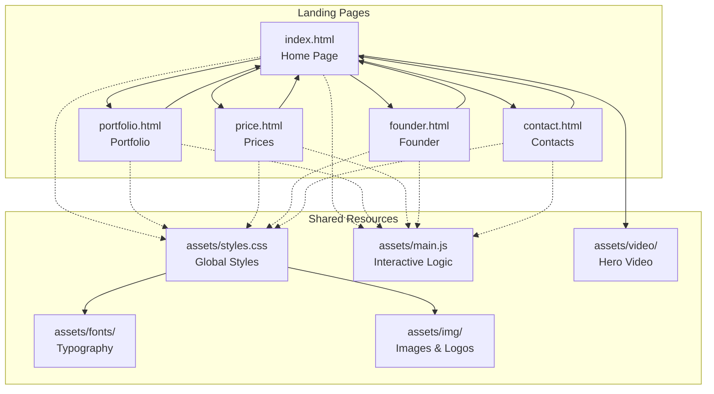
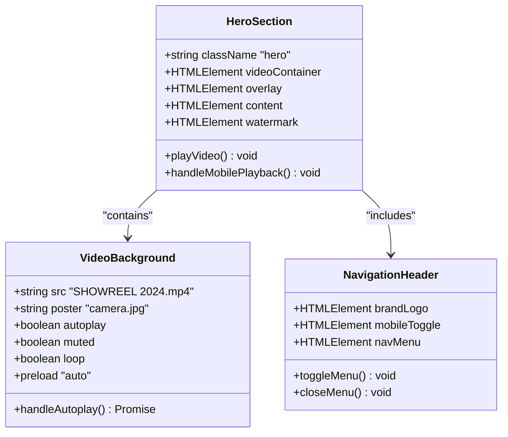
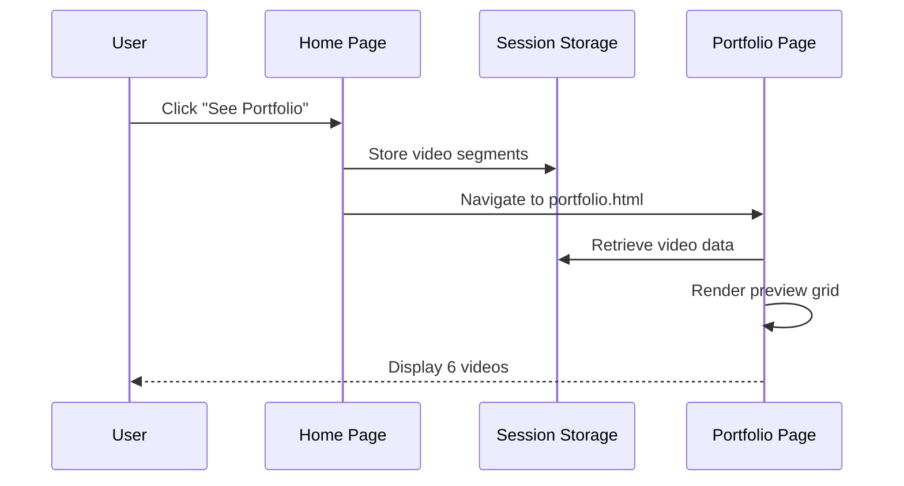
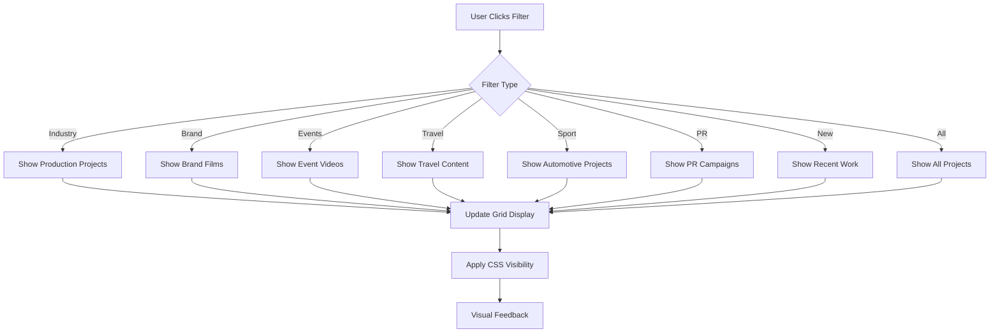
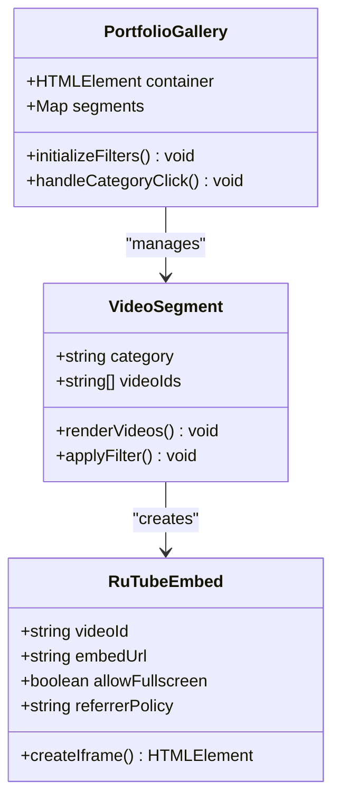
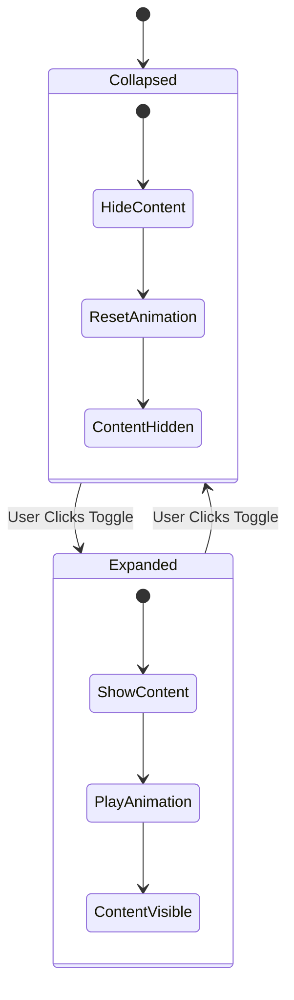
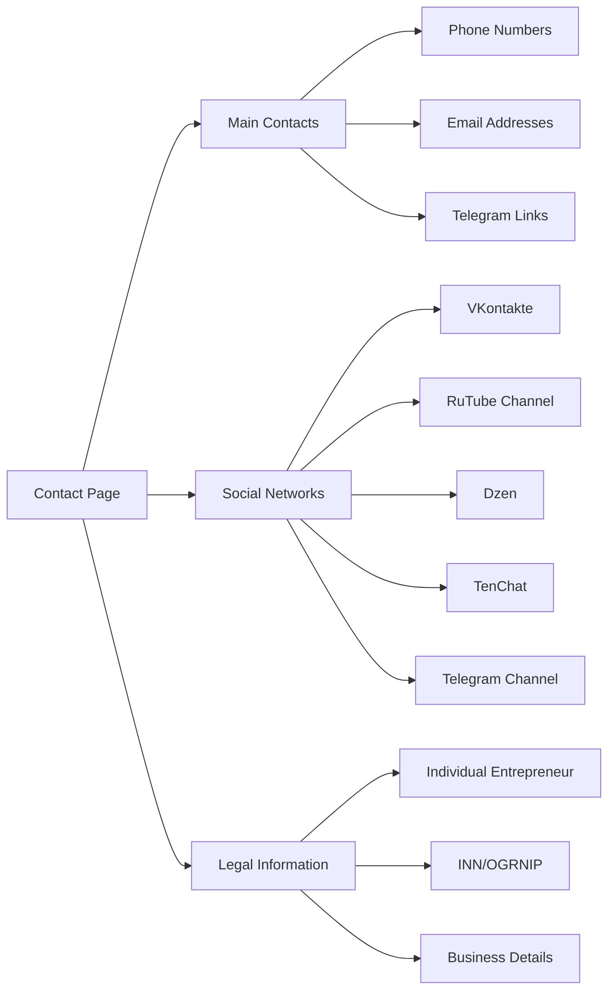
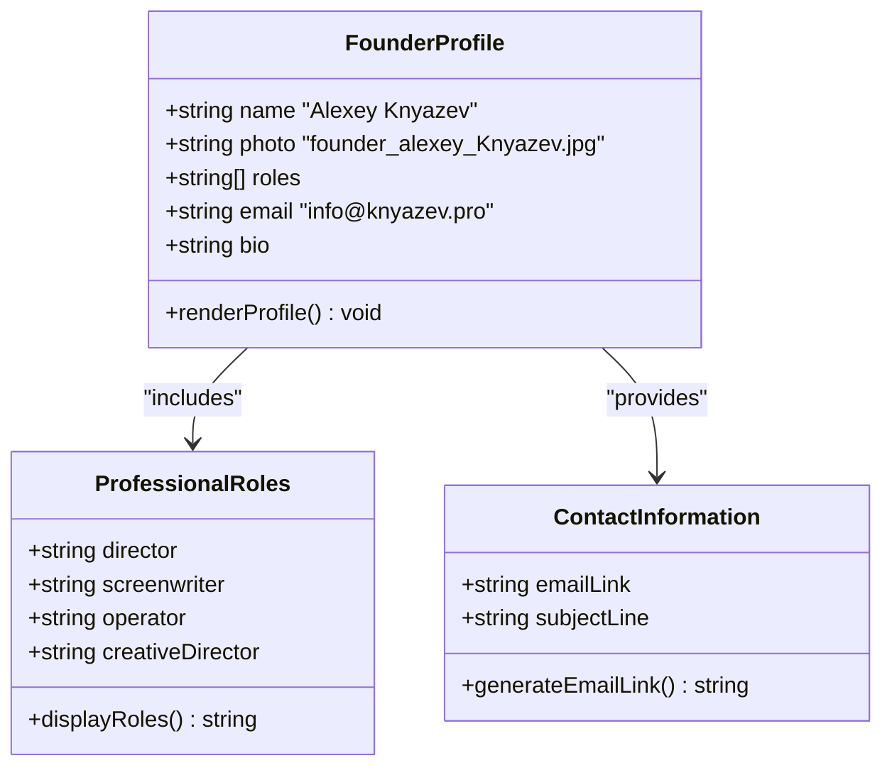
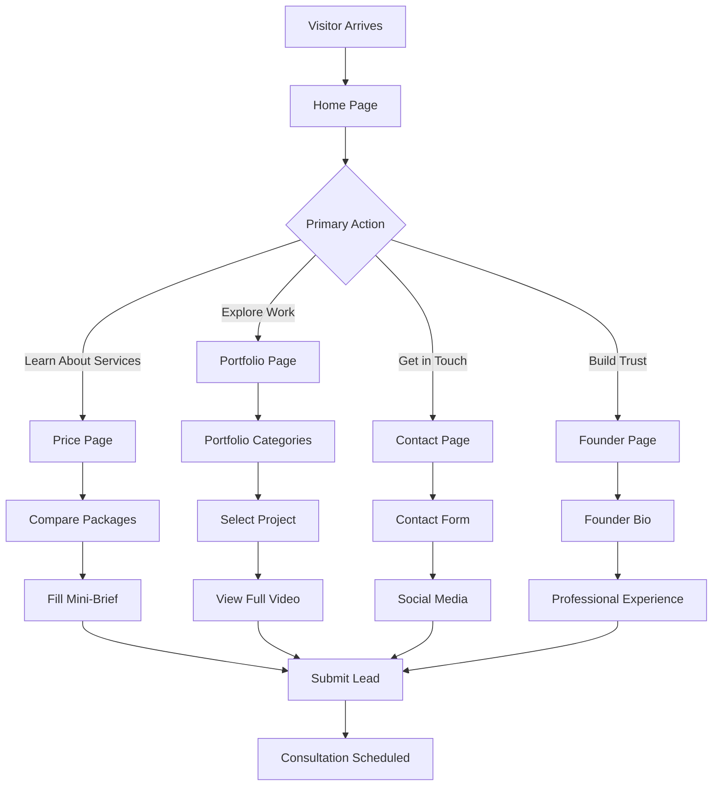
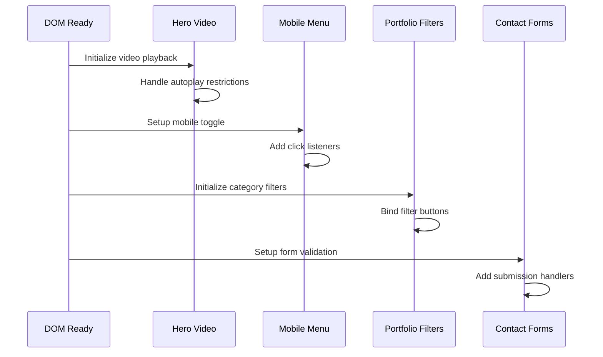

# Page Structure

<cite>
**Referenced Files in This Document**
- [index.html](file://index.html)
- [portfolio.html](file://portfolio.html)
- [price.html](file://price.html)
- [contact.html](file://contact.html)
- [founder.html](file://founder.html)
- [assets/styles.css](file://assets/styles.css)
- [assets/main.js](file://assets/main.js)
- [README.md](file://README.md)
</cite>

## Table of Contents
1. [Introduction](#introduction)
2. [Project Architecture Overview](#project-architecture-overview)
3. [Home Page (index.html)](#home-page-indexhtml)
4. [Portfolio Page (portfolio.html)](#portfolio-page-portfoliogl)
5. [Price Page (price.html)](#price-page-pricehtml)
6. [Contact Page (contact.html)](#contact-page-contacthtml)
7. [Founder Page (founder.html)](#founder-page-founderhtml)
8. [Navigation and User Journey](#navigation-and-user-journey)
9. [Technical Implementation](#technical-implementation)
10. [Mobile Responsiveness](#mobile-responsiveness)

## Introduction

The Knyazev PRO landing page suite represents a modern, business-oriented videoproduction studio website built with a clean, dark-themed design philosophy. The site consists of five interconnected HTML pages that guide visitors through a structured user journey from awareness to conversion, leveraging semantic HTML, responsive design principles, and interactive JavaScript functionality.

Each page serves a specific purpose in the overall marketing strategy while maintaining consistent branding, navigation, and user experience across the entire site. The implementation emphasizes mobile-first design, accessibility standards, and performance optimization for optimal conversion rates.

## Project Architecture Overview

The landing page suite follows a modular architecture with shared resources and consistent design patterns across all pages. The structure demonstrates professional videoproduction studio branding with emphasis on visual storytelling and business results.

**Diagram sources**
- [index.html](file://index.html#L1-L249)
- [portfolio.html](file://portfolio.html#L1-L388)
- [price.html](file://price.html#L1-L437)
- [contact.html](file://contact.html#L1-L127)
- [founder.html](file://founder.html#L1-L71)

**Section sources**
- [README.md](file://README.md#L1-L437)

## Home Page (index.html)

The Home Page serves as the primary entry point and conversion hub, featuring a dynamic hero section with video background, comprehensive service offerings, client showcase, and team presentation.

### Hero Section Architecture

The hero section employs a sophisticated video background system with multiple layers of visual enhancement:

**Diagram sources**
- [index.html](file://index.html#L10-L50)
- [assets/main.js](file://assets/main.js#L1-L20)

### Service Grid Implementation

The services section presents six core videoproduction services in a responsive grid layout:

| Service Category | Description | Target Audience |
|------------------|-------------|-----------------|
| **Advertising** | Short videos for product promotion | Marketing teams, agencies |
| **Product Videos** | Demonstrating goods and benefits | Retail, e-commerce businesses |
| **Event Videos** | Coverage of corporate events | Corporate communications |
| **Explainer Videos** | Simplified explanations of complex processes | Educational, tech companies |

### Portfolio Preview System

The home page includes a dynamic portfolio preview that loads six representative videos from the main portfolio collection:

**Diagram sources**
- [assets/main.js](file://assets/main.js#L350-L380)
- [index.html](file://index.html#L120-L140)

### Team and Testimonial Section

The team section showcases the creative leadership with individual cards containing biographical information and professional roles. This section builds trust through transparency and expertise demonstration.

### Consultation Call-to-Action

The consultation section features a comprehensive form with fields for name, email, company, phone, and message, integrated with the mini-brief modal system for streamlined lead capture.

**Section sources**
- [index.html](file://index.html#L1-L249)
- [assets/main.js](file://assets/main.js#L1-L418)

## Portfolio Page (portfolio.html)

The Portfolio Page provides an interactive gallery of 48 videoproduction projects with advanced filtering capabilities and RuTube video embedding system.

### Filtering Interface Architecture

The filtering system enables users to browse projects by category with real-time visual feedback:

**Diagram sources**
- [portfolio.html](file://portfolio.html#L40-L80)
- [assets/main.js](file://assets/main.js#L300-L350)

### RuTube Embedding System

The portfolio utilizes RuTube's native embedding system with optimized iframe implementation:

| Feature | Implementation | Benefit |
|---------|----------------|---------|
| **Lazy Loading** | On-demand iframe creation | Reduced initial page weight |
| **Responsive Design** | 16:9 aspect ratio | Consistent viewing experience |
| **Cross-Origin Security** | Proper referrer policy | Enhanced security |
| **Fullscreen Support** | Native browser controls | User-friendly interaction |

### Video Segment Management

The page maintains separate video categories with optimized loading sequences:

**Diagram sources**
- [portfolio.html](file://portfolio.html#L80-L150)
- [assets/main.js](file://assets/main.js#L200-L250)

**Section sources**
- [portfolio.html](file://portfolio.html#L1-L388)
- [assets/main.js](file://assets/main.js#L200-L350)

## Price Page (price.html)

The Price Page serves as a comprehensive service catalog with detailed pricing tiers, process workflows, and benefit presentations designed to educate potential clients and facilitate decision-making.

### Service Package Structure

The pricing system organizes videoproduction services into six distinct packages with tiered pricing and feature sets:

| Package Level | Price Range | Target Use Case | Key Features |
|---------------|-------------|-----------------|--------------|
| **Standard** | 150–350 thousand ₽ | Basic advertising needs | 30–90 second videos |
| **Premium** | 350–900 thousand ₽ | Professional corporate content | Full production cycle |
| **Custom** | 700–2.5 million ₽ | High-end branding projects | Creative direction included |

### Interactive Accordion System

The page implements expandable content sections for service details and examples:

**Diagram sources**
- [price.html](file://price.html#L100-L200)
- [assets/main.js](file://assets/main.js#L400-L418)

### Process Timeline Visualization

The workflow section presents a step-by-step production process with clear milestones and deliverables, helping clients understand the videoproduction lifecycle.

### Benefit and Guarantee Presentation

The benefits section highlights the value proposition through five key advantages: status building, clarity of complex concepts, media-ready content, testability, and content scalability.

**Section sources**
- [price.html](file://price.html#L1-L437)
- [assets/main.js](file://assets/main.js#L400-L418)

## Contact Page (contact.html)

The Contact Page provides essential business information, communication channels, and legal details in a structured, professional format.

### Information Architecture

The contact page organizes information into three main sections:

**Diagram sources**
- [contact.html](file://contact.html#L30-L100)

### Social Media Integration

The page includes direct links to all major Russian social media platforms with clear labeling and arrow indicators for improved user experience.

### Legal Compliance

The legal section provides complete business registration information including Individual Entrepreneur status, tax identification numbers, and business description, ensuring transparency and trust-building.

**Section sources**
- [contact.html](file://contact.html#L1-L127)

## Founder Page (founder.html)

The Founder Page establishes personal credibility and establishes the director's authority in videoproduction through biographical content and professional expertise presentation.

### Personal Branding Structure

The page focuses on building trust through personal connection and professional expertise:

**Diagram sources**
- [founder.html](file://founder.html#L20-L50)

### Expertise Communication

The page communicates the founder's professional background through clear role descriptions and emphasizes the human element in videoproduction, contrasting with automated approaches.

**Section sources**
- [founder.html](file://founder.html#L1-L71)

## Navigation and User Journey

The site implements a consistent navigation pattern across all pages with mobile-responsive hamburger menu and clear visual hierarchy.

### Journey Mapping

**Diagram sources**
- [index.html](file://index.html#L15-L35)
- [portfolio.html](file://portfolio.html#L15-L35)
- [price.html](file://price.html#L15-L35)
- [contact.html](file://contact.html#L15-L35)
- [founder.html](file://founder.html#L15-L35)

### Conversion Pathways

The site provides multiple pathways to conversion through strategic placement of CTAs, clear value propositions, and progressive disclosure of information.

**Section sources**
- [assets/main.js](file://assets/main.js#L50-L100)

## Technical Implementation

### CSS Architecture

The styling system employs CSS custom properties for theme management and follows a mobile-first responsive design approach:

| Style Category | Implementation | Purpose |
|----------------|----------------|---------|
| **Color System** | CSS Custom Properties | Theme consistency |
| **Typography** | Variable Font Montserrat | Performance optimization |
| **Layout** | CSS Grid/Flexbox | Responsive design |
| **Animations** | CSS Transitions | Smooth interactions |
| **Accessibility** | Semantic HTML + ARIA | Screen reader support |

### JavaScript Functionality

The JavaScript implementation provides interactive features without external dependencies:

**Diagram sources**
- [assets/main.js](file://assets/main.js#L1-L50)
- [assets/main.js](file://assets/main.js#L50-L100)

### Performance Optimizations

The implementation includes several performance optimizations:

- **Lazy Loading**: Portfolio videos load on demand
- **Code Splitting**: Separate JavaScript for different page contexts
- **Resource Preloading**: Critical CSS and fonts
- **Image Optimization**: Multiple format support
- **Video Optimization**: Native browser controls

**Section sources**
- [assets/styles.css](file://assets/styles.css#L1-L200)
- [assets/main.js](file://assets/main.js#L1-L418)

## Mobile Responsiveness

The site implements comprehensive mobile optimization with platform-specific enhancements for iOS and Android devices.

### Responsive Breakpoints

| Device Type | Breakpoint | Layout Changes |
|-------------|------------|----------------|
| **Desktop** | > 1024px | Full grid layouts |
| **Tablet** | 680px - 1024px | Single column layouts |
| **Mobile** | < 680px | Vertical stacking |

### Platform-Specific Optimizations

The implementation includes iOS Safari optimizations, touch interaction improvements, and viewport management for optimal mobile experience.

**Section sources**
- [assets/styles.css](file://assets/styles.css#L150-L200)
- [assets/main.js](file://assets/main.js#L1-L50)