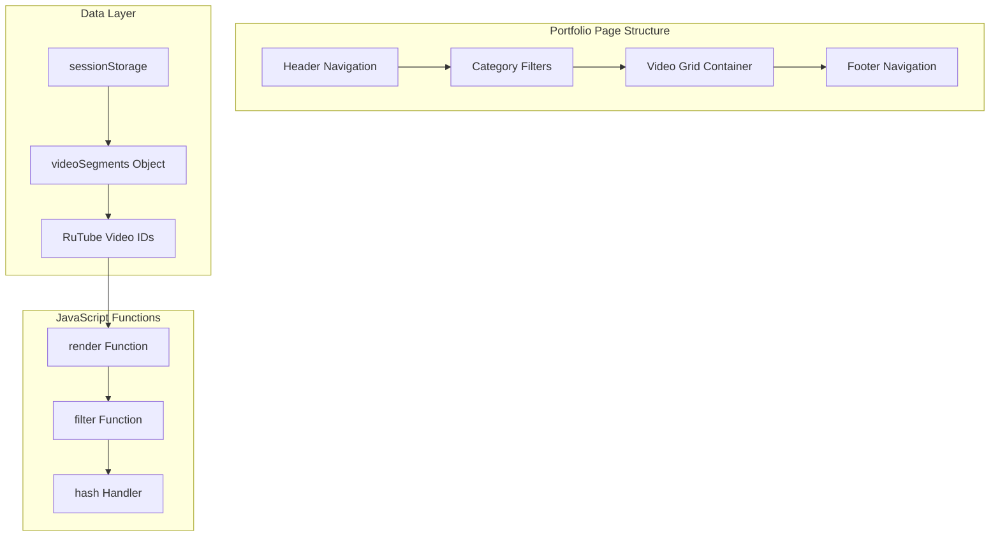
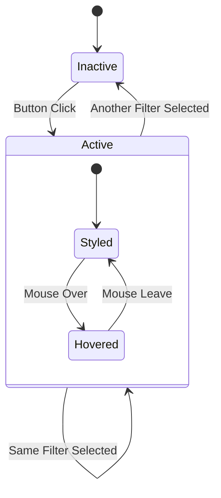
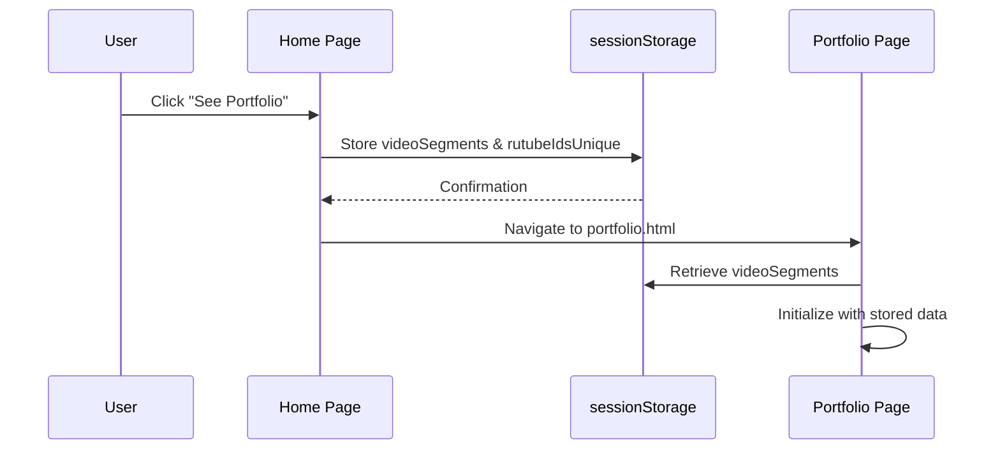
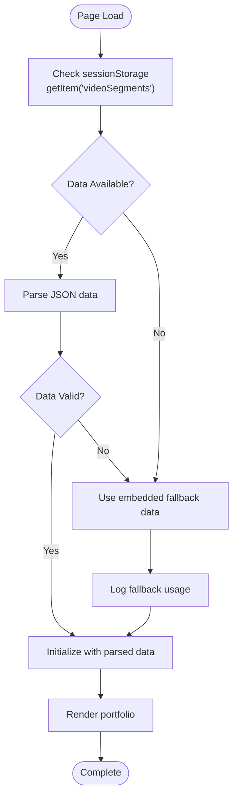
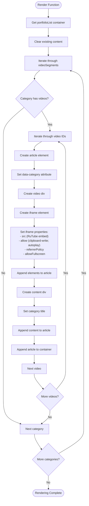
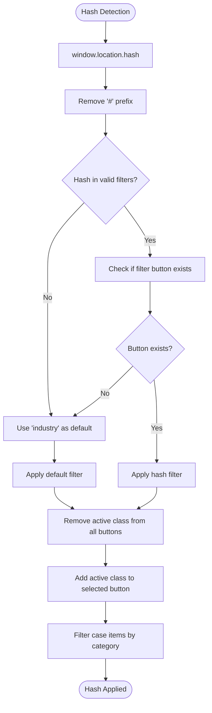
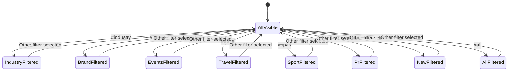
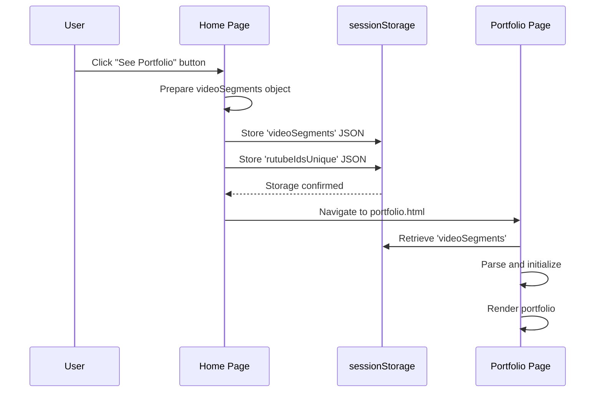

# Portfolio Page

<cite>
**Referenced Files in This Document**
- [portfolio.html](file://portfolio.html)
- [assets/main.js](file://assets/main.js)
- [index.html](file://index.html)
- [assets/styles.css](file://assets/styles.css)
</cite>

## Table of Contents
1. [Introduction](#introduction)
2. [Page Architecture](#page-architecture)
3. [Filtering Interface Implementation](#filtering-interface-implementation)
4. [Data Management and Storage](#data-management-and-storage)
5. [Dynamic Video Rendering](#dynamic-video-rendering)
6. [URL Hash-Based Filtering](#url-hash-based-filtering)
7. [Accessibility and Performance](#accessibility-and-performance)
8. [Integration with Home Page](#integration-with-home-page)
9. [Common Issues and Solutions](#common-issues-and-solutions)
10. [Code Structure Analysis](#code-structure-analysis)

## Introduction

The Portfolio Page serves as a comprehensive showcase of the videoproduction studio's work, featuring an interactive filtering interface that allows users to browse projects by category. Built with modern JavaScript and HTML5 standards, the page implements sophisticated data management using sessionStorage for seamless navigation between pages while maintaining user experience continuity.

The page displays embedded RuTube videos organized into eight distinct categories: Presentation, Brand Films, Event, Travel, Sport Car, PR, New Projects, and All Projects. Each category contains curated video segments that demonstrate the studio's diverse portfolio capabilities.

## Page Architecture

The Portfolio Page follows a structured HTML5 architecture with clear separation of concerns between presentation, behavior, and styling.



**Diagram sources**
- [portfolio.html](file://portfolio.html#L1-L50)
- [assets/main.js](file://assets/main.js#L297-L333)

**Section sources**
- [portfolio.html](file://portfolio.html#L1-L388)
- [assets/styles.css](file://assets/styles.css#L1-L450)

## Filtering Interface Implementation

The filtering system consists of eight category buttons arranged in a responsive grid layout. Each button features a consistent design pattern with brand-specific styling and hover effects.

### Button Structure and Attributes

Each filter button contains:
- **data-filter attribute**: Specifies the category identifier (industry, brand, events, travel, sport, pr, new, all)
- **Active state management**: Visual indication of currently selected filter
- **Brand logo integration**: Consistent branding element for visual coherence
- **Text labels**: Clear category descriptions in uppercase

### Active State Management

The active state is managed through CSS classes and JavaScript event listeners:



**Diagram sources**
- [portfolio.html](file://portfolio.html#L35-L60)
- [assets/styles.css](file://assets/styles.css#L280-L290)

### Category Definitions

| Category | Data Filter | Description | Video Count |
|----------|-------------|-------------|-------------|
| industry | data-filter="industry" | Industrial production projects | 13 videos |
| brand | data-filter="brand" | Company brand films | 15 videos |
| events | data-filter="events" | Event and corporate videos | 10 videos |
| travel | data-filter="travel" | Travel and lifestyle content | 5 videos |
| sport | data-filter="sport" | Automotive and sports projects | 8 videos |
| pr | data-filter="pr" | Public relations and marketing videos | 20 videos |
| new | data-filter="new" | Latest projects | 0 videos |
| all | data-filter="all" | Complete portfolio | 48 videos |

**Section sources**
- [portfolio.html](file://portfolio.html#L35-L60)
- [assets/main.js](file://assets/main.js#L334-L380)

## Data Management and Storage

The page implements a sophisticated data management system using sessionStorage for persistent data storage across page navigations.

### sessionStorage Integration

The data flow begins when users navigate from the home page to the portfolio page:



**Diagram sources**
- [assets/main.js](file://assets/main.js#L326-L333)
- [portfolio.html](file://portfolio.html#L250-L280)

### videoSegments Object Structure

The videoSegments object contains categorized RuTube video IDs organized by project type:

```javascript
const videoSegments = {
  industry: [...],        // Industrial production projects
  brand: [...],           // Company brand films
  events: [...],          // Event and corporate videos
  travel: [...],          // Travel and lifestyle content
  sport: [...],           // Automotive and sports projects
  pr: [...],              // Public relations videos
  other: [],              // Placeholder for future content
  new: [],                // New projects placeholder
  all: [...]              // Complete video collection
};
```

### Fallback Mechanism

When sessionStorage data is unavailable, the system automatically falls back to embedded fallback data:



**Diagram sources**
- [portfolio.html](file://portfolio.html#L250-L280)

**Section sources**
- [portfolio.html](file://portfolio.html#L250-L280)
- [assets/main.js](file://assets/main.js#L326-L333)

## Dynamic Video Rendering

The page employs a dynamic rendering system that creates video elements programmatically using JavaScript DOM manipulation.

### Video Element Creation Process

Each video item is constructed through a series of DOM element creations:



**Diagram sources**
- [portfolio.html](file://portfolio.html#L278-L334)

### Security Attributes Implementation

The iframe embedding system implements comprehensive security measures:

| Attribute | Value | Purpose |
|-----------|-------|---------|
| src | `https://rutube.ru/play/embed/${id}/` | Secure RuTube embed URL |
| allow | `'clipboard-write; autoplay'` | Controlled permissions |
| referrerPolicy | `'no-referrer-when-downgrade'` | Privacy protection |
| allowFullscreen | `true` | Fullscreen capability |
| sandbox | Not explicitly set | Default browser sandboxing |

### Category Title Mapping

The system dynamically generates descriptive titles based on category types:

```javascript
const categoryTitles = {
  industry: 'ПРОМЫШЛЕННЫЙ ПРОЕКТ',
  brand: 'БРЕНД-ФИЛЬМ',
  events: 'ИВЕНТ-ВИДЕО',
  travel: 'TRAVEL-КОНТЕНТ',
  sport: 'АВТОМОБИЛЬНЫЙ ПРОЕКТ',
  pr: 'PR-ВИДЕО',
  other: 'ПРОЕКТ',
  new: 'НОВАЯ РАБОТА'
};
```

**Section sources**
- [portfolio.html](file://portfolio.html#L278-L334)
- [assets/main.js](file://assets/main.js#L297-L333)

## URL Hash-Based Filtering

The page implements sophisticated URL hash-based filtering that enables deep linking and bookmarking of specific categories.

### Hash Detection and Validation

The hash-based filtering system operates through a multi-step validation process:



**Diagram sources**
- [portfolio.html](file://portfolio.html#L336-L350)

### Supported Hash Values

The system recognizes the following hash values for filtering:
- `#industry` - Industrial production projects
- `#brand` - Company brand films
- `#events` - Event and corporate videos
- `#travel` - Travel and lifestyle content
- `#sport` - Automotive and sports projects
- `#pr` - Public relations videos
- `#new` - New projects
- `#all` - Complete portfolio

### Filter Application Logic

The filtering mechanism applies visual and functional changes to the interface:



**Diagram sources**
- [portfolio.html](file://portfolio.html#L352-L365)

**Section sources**
- [portfolio.html](file://portfolio.html#L336-L365)

## Accessibility and Performance

The Portfolio Page implements several accessibility and performance optimization features to ensure broad usability and efficient loading.

### Accessibility Features

#### Keyboard Navigation Support
- Focus indicators for interactive elements
- Tab order preservation
- Screen reader compatibility for video titles

#### Semantic HTML Structure
- Proper heading hierarchy (H1 for page title)
- Descriptive alt attributes for images
- Logical button labeling with data-filter attributes

#### Color Contrast and Visual Design
- High contrast between text and background
- Clear visual feedback for interactive states
- Consistent spacing and sizing for touch targets

### Performance Optimizations

#### Lazy Loading Implementation
While the current implementation loads all videos initially, the architecture supports lazy loading through:

```javascript
// Future enhancement structure
function lazyLoadVideos() {
  const observer = new IntersectionObserver((entries) => {
    entries.forEach(entry => {
      if (entry.isIntersecting) {
        const iframe = entry.target.querySelector('iframe');
        iframe.src = iframe.dataset.src;
        observer.unobserve(entry.target);
      }
    });
  });
  
  document.querySelectorAll('.case-item').forEach(item => {
    observer.observe(item);
  });
}
```

#### Memory Management
- Efficient DOM manipulation using createElement
- Minimal event listener overhead
- Proper cleanup of rendered content

#### Responsive Design Considerations
- CSS Grid-based layout for flexible video arrangement
- Progressive enhancement for older browsers
- Touch-friendly interface elements

**Section sources**
- [portfolio.html](file://portfolio.html#L278-L334)
- [assets/styles.css](file://assets/styles.css#L280-L320)

## Integration with Home Page

The Portfolio Page maintains seamless integration with the home page through a sophisticated data transfer mechanism using sessionStorage.

### Data Transfer Process

The home page prepares data for the portfolio page through a coordinated JavaScript function:



**Diagram sources**
- [assets/main.js](file://assets/main.js#L326-L333)
- [portfolio.html](file://portfolio.html#L250-L280)

### Data Preservation Benefits

This integration provides several advantages:

1. **Seamless Navigation**: Users can move between pages without data loss
2. **Performance Optimization**: Pre-loaded data reduces loading times
3. **Consistency**: Same video collection across all pages
4. **Offline Capability**: Basic functionality works without network connection

### Cross-Page Communication

The sessionStorage mechanism enables communication between pages:

| Data Type | Storage Key | Purpose |
|-----------|-------------|---------|
| Video Segments | `videoSegments` | Complete categorized video collection |
| Unique IDs | `rutubeIdsUnique` | Deduplicated video ID list |
| Portfolio Preview | `home-cases` | Home page video preview |

**Section sources**
- [assets/main.js](file://assets/main.js#L326-L333)
- [portfolio.html](file://portfolio.html#L250-L280)

## Common Issues and Solutions

### sessionStorage Retrieval Failures

**Problem**: Videos fail to load due to sessionStorage data unavailability.

**Root Cause**: Browser privacy settings, storage quota exceeded, or session expiration.

**Solution**: Comprehensive fallback mechanism with embedded data:

```javascript
// Enhanced fallback implementation
const fromHome = sessionStorage.getItem('videoSegments');
let segments = fromHome ? JSON.parse(fromHome) : null;

if (!segments || Object.keys(segments).length === 0) {
  console.warn('Failed to retrieve video segments from sessionStorage, using fallback data');
  segments = {
    // Embedded fallback data structure
    industry: [],
    brand: [],
    events: [],
    travel: [],
    sport: [],
    pr: [],
    other: [],
    new: [],
    all: []
  };
}
```

### Video Embedding Issues

**Problem**: Videos fail to load or display incorrectly.

**Root Cause**: Network connectivity, RuTube service availability, or iframe security restrictions.

**Solution**: Robust error handling and graceful degradation:

```javascript
// Video loading error handling
const iframe = document.createElement('iframe');
iframe.src = `https://rutube.ru/play/embed/${videoId}/`;
iframe.onerror = function() {
  this.style.display = 'none';
  const errorElement = document.createElement('div');
  errorElement.className = 'video-error';
  errorElement.textContent = 'Video failed to load';
  this.parentNode.appendChild(errorElement);
};
```

### Filter State Synchronization

**Problem**: Filter state doesn't persist across page refreshes.

**Solution**: URL hash-based state management with fallback to default:

```javascript
// Enhanced filter initialization
function initializeFilters() {
  const hash = window.location.hash.replace('#', '');
  const validFilters = ['industry', 'brand', 'events', 'travel', 'sport', 'pr', 'new', 'all'];
  const defaultFilter = validFilters.includes(hash) ? hash : 'industry';
  
  const filterButton = document.querySelector(`[data-filter="${defaultFilter}"]`);
  if (filterButton) {
    applyFilter(defaultFilter);
  }
}
```

### Performance Degradation

**Problem**: Large video collections cause slow page loading.

**Solution**: Pagination or virtual scrolling implementation:

```javascript
// Virtual scrolling structure
function setupVirtualScrolling(container, itemsPerPage = 12) {
  let currentPage = 1;
  const totalItems = videoSegments.all.length;
  const totalPages = Math.ceil(totalItems / itemsPerPage);
  
  function loadPage(page) {
    const startIndex = (page - 1) * itemsPerPage;
    const endIndex = Math.min(startIndex + itemsPerPage, totalItems);
    const pageItems = videoSegments.all.slice(startIndex, endIndex);
    
    // Render only visible items
    renderVideos(pageItems);
  }
  
  // Scroll event listener for infinite scrolling
  container.addEventListener('scroll', () => {
    if (container.scrollTop + container.offsetHeight >= container.scrollHeight - 100) {
      if (currentPage < totalPages) {
        currentPage++;
        loadPage(currentPage);
      }
    }
  });
}
```

**Section sources**
- [portfolio.html](file://portfolio.html#L250-L280)
- [portfolio.html](file://portfolio.html#L336-L365)

## Code Structure Analysis

The Portfolio Page demonstrates excellent modular JavaScript architecture with clear separation of concerns.

### Function Organization

The JavaScript code follows a logical structure:

1. **Data Initialization** (`lines 250-280`): sessionStorage retrieval and fallback
2. **DOM Manipulation** (`lines 278-334`): Dynamic video rendering
3. **Event Handling** (`lines 336-365`): Filter application and hash management
4. **Utility Functions** (`lines 366-388`): Helper functions and cleanup

### Variable Naming Conventions

The code employs consistent naming patterns:
- **Descriptive Variables**: `segments`, `filterBar`, `videoSegments`
- **Functional Variables**: `render`, `applyFilter`, `loadRuTubePortfolio`
- **DOM References**: `list`, `filterBar`, `portfolioList`

### Error Handling Patterns

The implementation includes robust error handling:
- **Graceful Degradation**: Fallback data ensures functionality
- **Validation Checks**: Type checking and existence verification
- **Logging**: Console output for debugging and monitoring

### Scalability Considerations

The architecture supports future enhancements:
- **Modular Functions**: Separate rendering and filtering logic
- **Configuration Objects**: Easy modification of categories and titles
- **Event Delegation**: Efficient event handling for dynamic content

**Section sources**
- [portfolio.html](file://portfolio.html#L250-L388)
- [assets/main.js](file://assets/main.js#L297-L380)