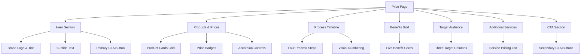
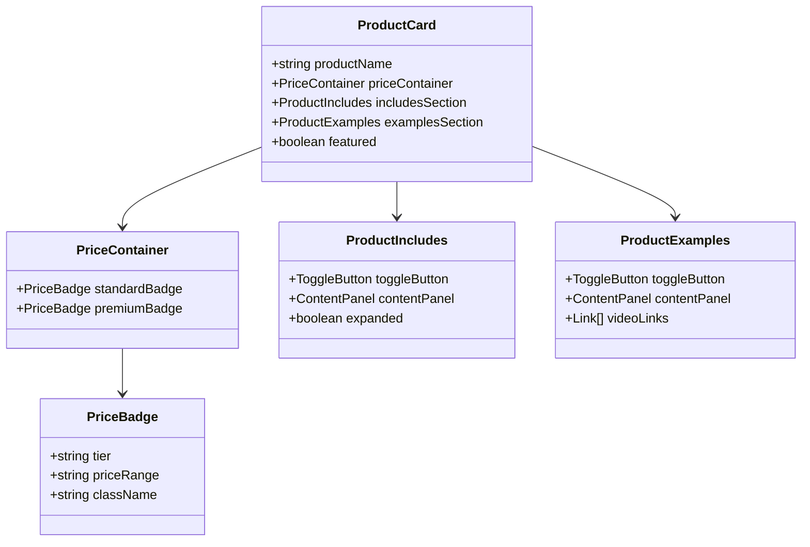
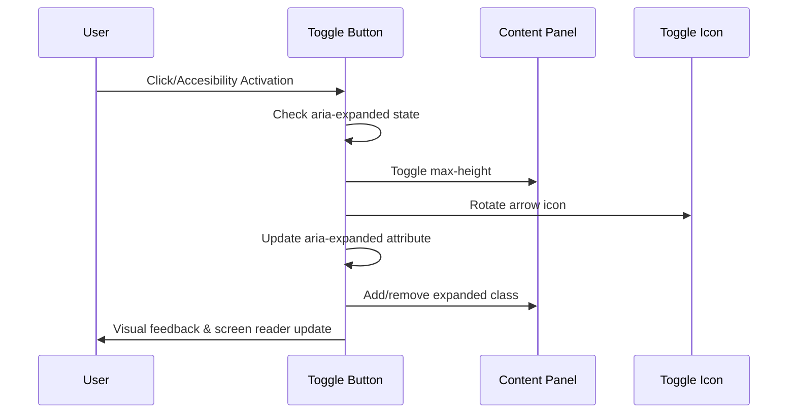
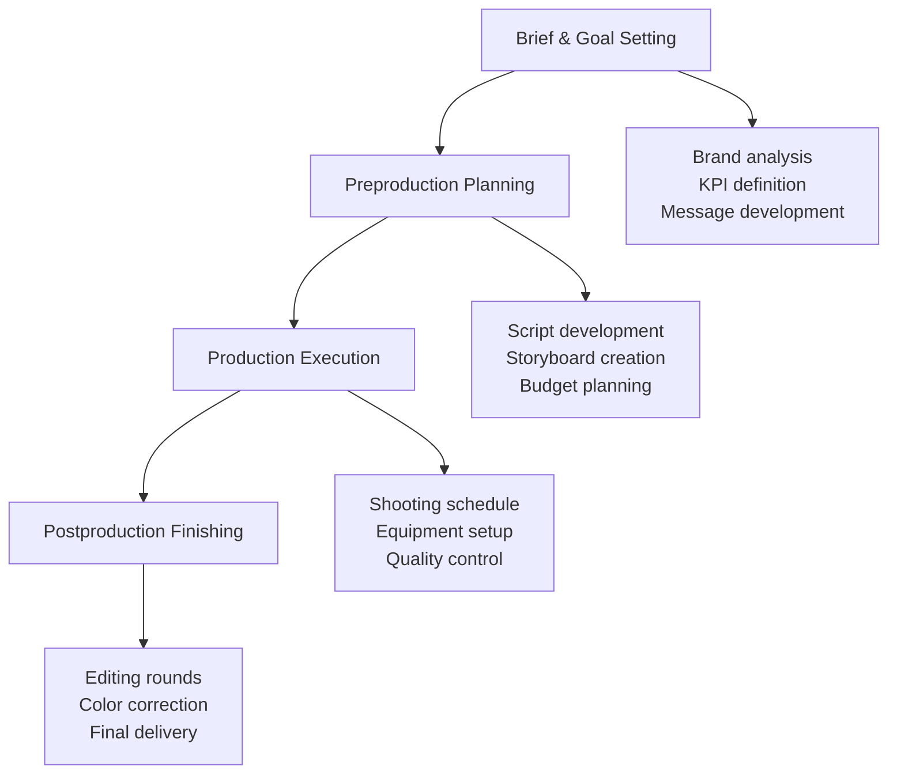
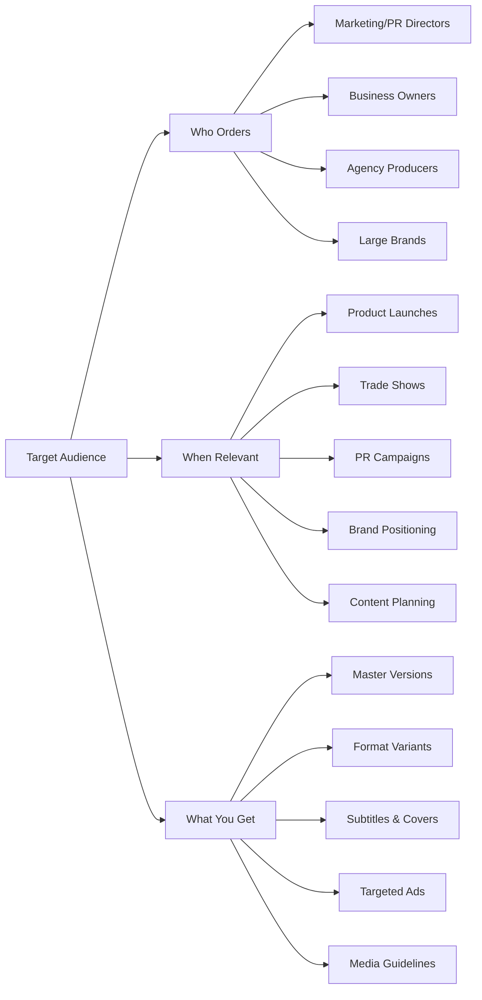
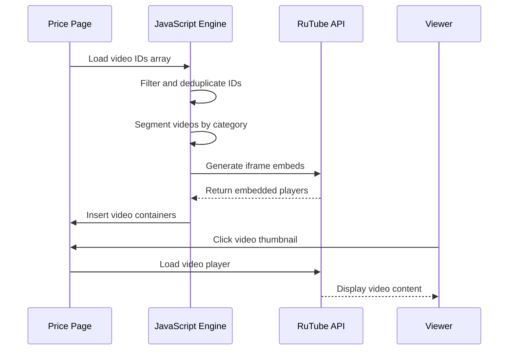

# Price Page Documentation

<cite>
**Referenced Files in This Document**
- [price.html](file://price.html)
- [assets/styles.css](file://assets/styles.css)
- [assets/main.js](file://assets/main.js)
</cite>

## Table of Contents
1. [Introduction](#introduction)
2. [Page Structure Overview](#page-structure-overview)
3. [Products and Pricing Section](#products-and-pricing-section)
4. [Accordion Toggle System](#accordion-toggle-system)
5. [Additional Services Section](#additional-services-section)
6. [Process Timeline Section](#process-timeline-section)
7. [Benefits Grid](#benefits-grid)
8. [Target Audience Section](#target-audience-section)
9. [Call-to-Action Elements](#call-to-action-elements)
10. [RuTube Video Integration](#rutube-video-integration)
11. [Styling and Layout](#styling-and-layout)
12. [Accessibility Features](#accessibility-features)
13. [Performance Considerations](#performance-considerations)
14. [Maintenance Guidelines](#maintenance-guidelines)
15. [Troubleshooting](#troubleshooting)

## Introduction

The Price Page (price.html) serves as the primary pricing and service presentation section of the Knyazev Pro videoproduction studio website. This comprehensive page showcases six distinct product categories with dual pricing tiers, interactive accordion elements, and extensive portfolio examples linked to RuTube video hosting platform. The page follows a structured approach to communicate value propositions while maintaining excellent user experience and accessibility standards.

## Page Structure Overview

The price page is organized into seven main sections, each serving specific informational and conversion purposes:

**Diagram sources**
- [price.html](file://price.html#L1-L437)

**Section sources**
- [price.html](file://price.html#L1-L437)

## Products and Pricing Section

The Products & Prices section forms the core of the page, featuring six distinct product categories with standardized pricing structures and comprehensive feature listings.

### Product Card Architecture

Each product card follows a consistent template structure:

**Diagram sources**
- [price.html](file://price.html#L32-L220)
- [assets/styles.css](file://assets/styles.css#L358-L415)

### Six Product Categories

The page presents six distinct videoproduction services:

| Product Category | Standard Price Range | Premium Price Range | Key Features |
|------------------|---------------------|-------------------|--------------|
| Advertising | 150–350 тыс. ₽ | 350–900 тыс. ₽ | 30–90 sec videos, concept development, full production cycle |
| Presentation | 250–500 тыс. ₽ | 500 тыс.–1,5 млн ₽ | 1–3 minute videos, company visualization, branding integration |
| Brand Film | 300–700 тыс. ₽ | 700 тыс.–2,5 млн ₽ | 2–5 minute documentaries, emotional storytelling, premium post-production |
| Event Overview | 150–350 тыс. ₽ | 350 тыс.–1,5 млн ₽ | 1–3 minute event highlights, multi-camera coverage, guest interviews |
| Imagery | 180–350 тыс. ₽ | 700 тыс.–1,5 млн ₽ | 30–90 sec emotional videos, creative storytelling, artistic direction |
| Social Media Cuts | 100–250 тыс. ₽ | 250 тыс.–500 тыс. ₽ | 5–10 vertical clips, Reels/Shorts adaptation, content series |

### Pricing Badge Styling

The pricing badges utilize a sophisticated color scheme with transparent backgrounds:

- **Standard Badge**: Light gray text (#8F8F8F) with light gray border and subtle background opacity
- **Premium Badge**: White text (#E0E0E0) with white border and soft background glow
- **Layout**: Full-width badges with centered text and responsive margins

**Section sources**
- [price.html](file://price.html#L32-L220)
- [assets/styles.css](file://assets/styles.css#L380-L390)

## Accordion Toggle System

The page implements a sophisticated accordion system using ARIA-compliant toggle controls for both "Подробнее" (Details) and "Смотреть" (View Examples) sections.

### Accessibility Implementation

**Diagram sources**
- [assets/main.js](file://assets/main.js#L355-L395)

### Toggle Control Attributes

Each accordion toggle button utilizes specific ARIA attributes for accessibility:

- **aria-expanded**: Boolean attribute indicating current state (true/false)
- **aria-controls**: References the content panel ID for screen reader navigation
- **Role**: Implicit role of button for keyboard navigation support

### Animation and State Management

The accordion system employs CSS transitions for smooth state changes:

- **Height Transition**: 0.3-second ease-out animation for content expansion/collapse
- **Opacity Transition**: Subtle fade effect for improved visual feedback
- **Icon Rotation**: 180-degree rotation with 0.3-second timing for directional indication

**Section sources**
- [assets/main.js](file://assets/main.js#L355-L395)
- [assets/styles.css](file://assets/styles.css#L398-L415)

## Additional Services Section

The Additional Services section provides supplementary pricing information for specialized videoproduction services, presented in a clean grid layout.

### Service Categories and Pricing

| Service Type | Pricing Structure | Description |
|-------------|------------------|-------------|
| Editing | 80–150 ТЫС. ₽ | From client materials, timeline-dependent |
| Drone | 15–30 ТЫС./ДЕНЬ | Professional aerial footage capture |
| Voiceover | 10–30 ТЫС. | Professional narration and dubbing |
| Motion/CG | 50–200 ТЫС. | 3D graphics and motion design |
| Casting/Locations | Variable | Talent selection and venue coordination |
| Travel/Rider | Separate | Accommodation and equipment transport |

### Grid Layout Implementation

The additional services use a responsive grid system that adapts to screen sizes while maintaining visual hierarchy and readability.

**Section sources**
- [price.html](file://price.html#L222-L235)
- [assets/styles.css](file://assets/styles.css#L378-L385)

## Process Timeline Section

The Process Timeline section outlines the four-stage videoproduction workflow with numbered visual indicators and detailed step descriptions.

### Four-Step Workflow

**Diagram sources**
- [price.html](file://price.html#L237-L320)

### Visual Numbering System

Each process step features a distinctive circular number indicator with brand color accentuation:

- **Size**: 48px diameter with 50% border radius
- **Background**: Brand gold color (#B09B7E) with dark text
- **Positioning**: Top-right corner of each step card
- **Responsive Design**: Maintains proportions across device sizes

### Timeline Content Structure

Each step includes:
- **Visual Number**: Circular indicator with step count
- **Title**: Clear step description in brand color
- **Description**: Detailed process explanation with bullet points
- **Spacing**: Consistent margin and padding for readability

**Section sources**
- [price.html](file://price.html#L237-L320)
- [assets/styles.css](file://assets/styles.css#L386-L395)

## Benefits Grid

The Benefits Grid presents five key advantages of working with Knyazev Pro, each illustrated with compelling copy and visual appeal.

### Five Core Benefits

| Benefit Category | Key Message | Visual Treatment |
|-----------------|-------------|------------------|
| Status & Trust | Corporate-level video quality enhances brand perception | Bold typography with brand color emphasis |
| Clarity of Complexity | Simplifies intricate concepts through storytelling | Subtle iconography with explanatory text |
| Media Readiness | Multi-format content ready for various platforms | Technical specification emphasis |
| Testability & Efficiency | A/B testing capabilities for optimal performance | Data-driven approach highlighting |
| Content Scalability | Comprehensive content package for sustained use | Quantitative benefit with "month's worth" claim |

### Grid Layout and Responsiveness

The benefits grid utilizes CSS Grid with automatic column sizing:

- **Minimum Width**: 300px per card for optimal readability
- **Flexible Columns**: Auto-fit layout that adjusts to available space
- **Gap Management**: Consistent 24px spacing between cards
- **Responsive Behavior**: Single column layout on mobile devices

**Section sources**
- [price.html](file://price.html#L322-L375)
- [assets/styles.css](file://assets/styles.css#L396-L405)

## Target Audience Section

The Target Audience section addresses three critical aspects of the studio's market positioning through a three-column layout.

### Three-Fold Approach

**Diagram sources**
- [price.html](file://price.html#L377-L410)

### Column Structure

Each target audience column features:

- **Header**: Bold title in brand color
- **List Format**: Bullet-point organization for easy scanning
- **Content Density**: Balanced information-to-space ratio
- **Visual Separation**: Distinct borders and padding for clarity

**Section sources**
- [price.html](file://price.html#L377-L410)
- [assets/styles.css](file://assets/styles.css#L370-L377)

## Call-to-Action Elements

The page incorporates multiple strategic CTA buttons positioned throughout to maximize conversion opportunities.

### CTA Button Variants

| CTA Location | Purpose | Button Style | Data Action |
|-------------|---------|--------------|-------------|
| Hero Section | Initial engagement | Primary brand-colored | mini-brief |
| CTA Section | Final conversion | Primary brand-colored | mini-brief |
| Portfolio Link | Content exploration | Secondary outline | open-portfolio |
| Consultation Request | Lead generation | Primary brand-colored | mini-brief |

### Data Attribute System

The CTA system utilizes data-action attributes for enhanced functionality:

- **data-action="mini-brief"**: Triggers modal form for quick consultation requests
- **data-action="open-portfolio"**: Initiates portfolio navigation with video data transfer
- **Tracking Integration**: Automatic analytics event tracking for conversion monitoring

### Modal Form Integration

Clicking any mini-brief CTA opens a streamlined form modal with:

- **Question-Based Design**: Five essential inquiry prompts
- **Validation Support**: Basic form validation for data integrity
- **Submission Tracking**: Automatic analytics event recording
- **Success Feedback**: User-friendly confirmation message

**Section sources**
- [price.html](file://price.html#L399-L415)
- [assets/main.js](file://assets/main.js#L50-L85)

## RuTube Video Integration

The page extensively integrates RuTube video hosting platform for showcasing portfolio examples, demonstrating the studio's capabilities through real-world projects.

### Video Embedding System

**Diagram sources**
- [assets/main.js](file://assets/main.js#L146-L297)

### Video ID Management

The system maintains comprehensive video ID arrays categorized by content type:

- **Industry Videos**: Manufacturing and production-related content
- **Brand Films**: Company profile and corporate storytelling
- **Events**: Event coverage and special occasion videos
- **Travel**: Destination and lifestyle content
- **Sport**: Automotive and performance-related videos
- **PR**: Public relations and promotional content

### Embed Configuration

Each RuTube video embed includes:

- **Responsive Sizing**: Flexible iframe dimensions adapting to container
- **Security Settings**: Proper referrer policy and permission controls
- **Autoplay Support**: Seamless playback experience across devices
- **Full-Screen Capability**: Enhanced viewing experience option

**Section sources**
- [assets/main.js](file://assets/main.js#L146-L297)
- [price.html](file://price.html#L93-L110)
- [price.html](file://price.html#L166-L182)
- [price.html](file://price.html#L201-L218)

## Styling and Layout

The price page employs a sophisticated CSS architecture combining modern grid systems with responsive design principles.

### Color Scheme and Typography

The page utilizes a carefully curated color palette:

- **Primary Background**: Dark charcoal (#0A0A0A) for premium feel
- **Card Background**: Medium gray (#181818) for depth contrast
- **Brand Accent**: Warm gold (#B09B7E) for call-to-action emphasis
- **Text Colors**: High contrast combinations for readability

### Grid System Implementation

The layout employs CSS Grid for precise component arrangement:

- **Products Grid**: Auto-fit columns with minimum 350px width
- **Services Grid**: Responsive two-column layout on larger screens
- **Benefits Grid**: Flexible three-column arrangement
- **Target Grid**: Adaptive three-column structure

### Responsive Breakpoints

The design adapts gracefully across device categories:

- **Desktop**: Full grid layouts with optimal spacing
- **Tablet**: Reduced column counts with adjusted margins
- **Mobile**: Single-column layouts prioritizing content hierarchy

**Section sources**
- [assets/styles.css](file://assets/styles.css#L1-L200)
- [assets/styles.css](file://assets/styles.css#L358-L449)

## Accessibility Features

The price page incorporates comprehensive accessibility features ensuring usability across diverse user needs and assistive technologies.

### ARIA Compliance

Each interactive element includes appropriate ARIA attributes:

- **Accordion Controls**: aria-expanded, aria-controls, role="button"
- **Navigation Elements**: Proper heading hierarchy and landmark roles
- **Form Elements**: Descriptive labels and error handling support
- **Media Elements**: Alternative text and caption support

### Keyboard Navigation

The page supports full keyboard navigation:

- **Focus Indicators**: Visible outlines for interactive elements
- **Tab Order**: Logical sequential navigation flow
- **Escape Keys**: Modal dismissal and accordion collapse functionality
- **Arrow Keys**: Enhanced navigation within complex interfaces

### Screen Reader Support

Comprehensive screen reader compatibility achieved through:

- **Semantic HTML**: Proper element usage for logical content structure
- **Alternative Text**: Descriptive images and multimedia content
- **Live Regions**: Dynamic content updates announced appropriately
- **Skip Links**: Direct navigation to main content areas

**Section sources**
- [assets/main.js](file://assets/main.js#L355-L395)
- [assets/styles.css](file://assets/styles.css#L398-L415)

## Performance Considerations

The price page implements several performance optimization strategies to ensure fast loading and smooth user experience.

### Bundle Optimization

JavaScript optimization includes:

- **Modular Loading**: Separate functionality blocks for efficient execution
- **Event Delegation**: Efficient event handling reducing memory footprint
- **Lazy Loading**: Deferred execution of non-critical features
- **Minification**: Compressed script delivery for reduced bandwidth

### Resource Management

Efficient resource utilization through:

- **Image Optimization**: Strategic use of SVG and optimized raster formats
- **CSS Minimization**: Combined and compressed stylesheet delivery
- **Video Embedding**: Asynchronous loading of external media content
- **Caching Strategies**: Browser caching for static assets

### Interactive Performance

Smooth user interactions maintained through:

- **Debounced Events**: Prevented excessive function calls during rapid interactions
- **Transition Optimization**: Hardware-accelerated CSS animations
- **Memory Management**: Proper cleanup of event listeners and timeouts
- **Progressive Enhancement**: Graceful degradation for older browsers

**Section sources**
- [assets/main.js](file://assets/main.js#L1-L50)
- [assets/styles.css](file://assets/styles.css#L1-L50)

## Maintenance Guidelines

### Updating Pricing Information

To modify pricing tiers:

1. **Locate Product Cards**: Navigate to the Products & Prices section
2. **Update Price Ranges**: Modify values in price-badge elements
3. **Maintain Consistency**: Ensure both Standard and Premium tiers are updated
4. **Test Responsiveness**: Verify pricing badges display correctly across devices

### Adding New Product Categories

For introducing new product offerings:

1. **Duplicate Template**: Copy existing product card structure
2. **Modify Content**: Update product name, features, and pricing
3. **Adjust Grid**: Ensure grid layout accommodates new items
4. **Update Examples**: Add relevant RuTube video links
5. **Test Functionality**: Verify accordion and CTA interactions

### Managing RuTube Videos

Video content maintenance involves:

1. **ID Updates**: Replace outdated video IDs with current ones
2. **Category Assignment**: Update videoSegments object for proper categorization
3. **Embed Validation**: Test video embedding functionality
4. **Performance Monitoring**: Track video load times and user engagement

### Accessibility Updates

Maintaining accessibility compliance requires:

1. **Regular Audits**: Periodic accessibility testing with assistive technologies
2. **Content Updates**: Ensure new content includes proper ARIA attributes
3. **Keyboard Testing**: Verify all interactive elements support keyboard navigation
4. **Screen Reader Testing**: Validate proper announcement of dynamic content changes

## Troubleshooting

### Common Issues and Solutions

**Accordion Not Expanding/Collapsing**
- Verify JavaScript is loaded and functioning
- Check for conflicting CSS transitions
- Ensure proper event listener attachment
- Validate aria-expanded attribute updates

**RuTube Videos Not Loading**
- Confirm video IDs are valid and accessible
- Check network connectivity and CORS policies
- Verify iframe embed permissions
- Test video player compatibility across browsers

**Pricing Display Issues**
- Validate CSS grid layout calculations
- Check responsive breakpoint media queries
- Ensure proper font rendering across devices
- Test color contrast accessibility compliance

**CTA Button Malfunctions**
- Verify data-action attribute values match JavaScript handlers
- Check modal initialization and event binding
- Test form submission functionality
- Validate analytics tracking implementation

### Performance Optimization Tips

**Reducing Load Times**
- Optimize image assets and implement lazy loading
- Minify CSS and JavaScript bundles
- Implement browser caching strategies
- Use content delivery networks for static assets

**Enhancing User Experience**
- Implement progressive enhancement for older browsers
- Add loading states for asynchronous content
- Optimize touch interactions for mobile devices
- Ensure consistent visual feedback for user actions