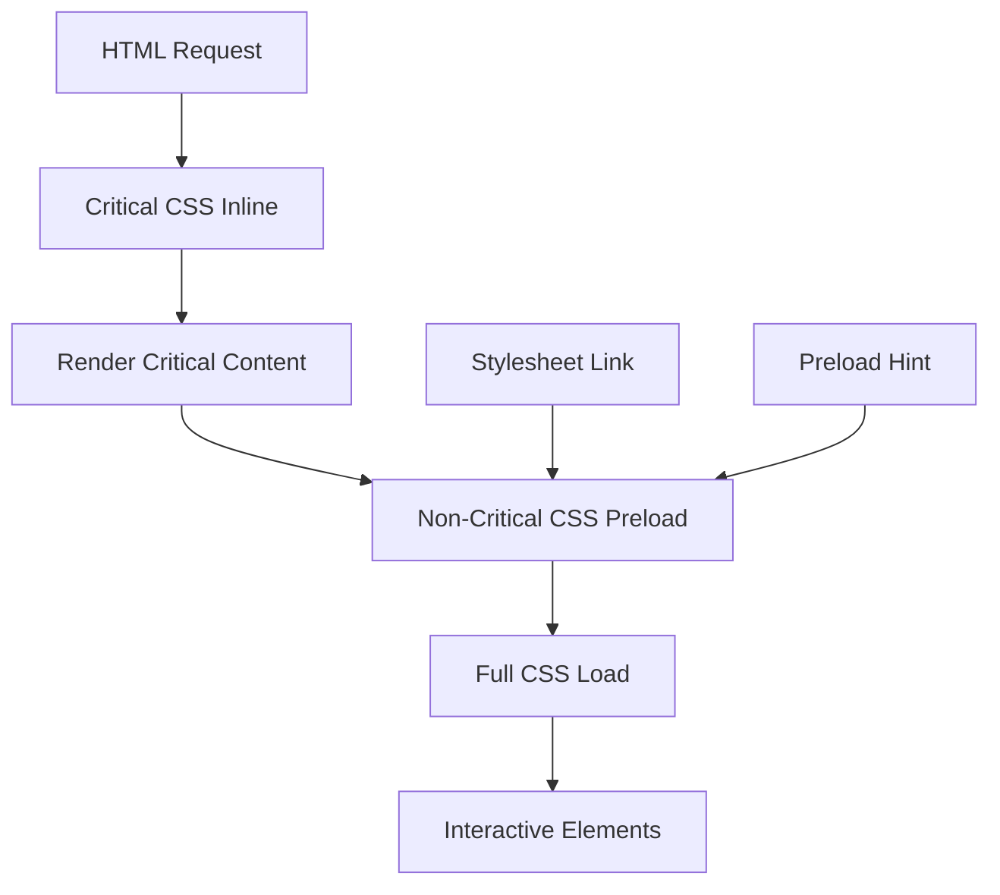
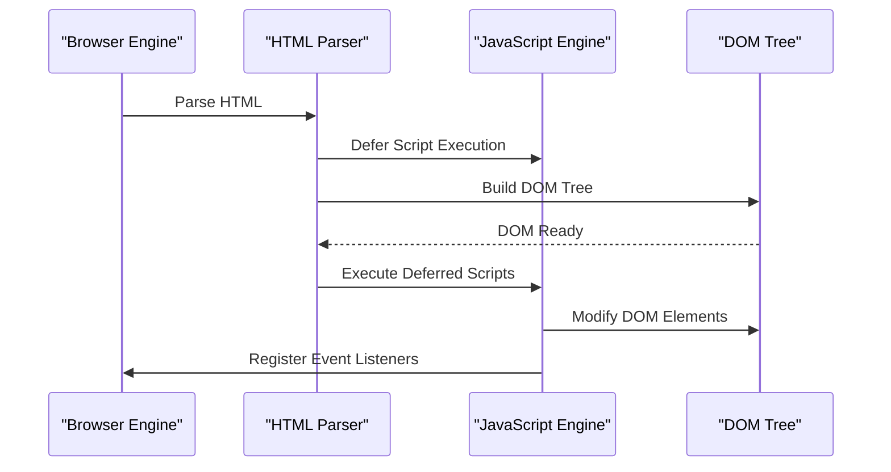
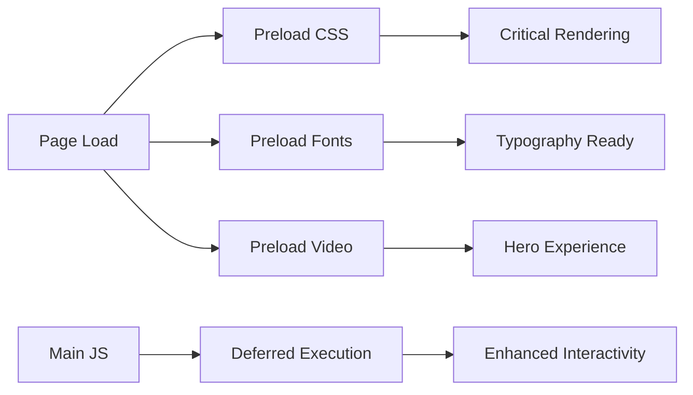
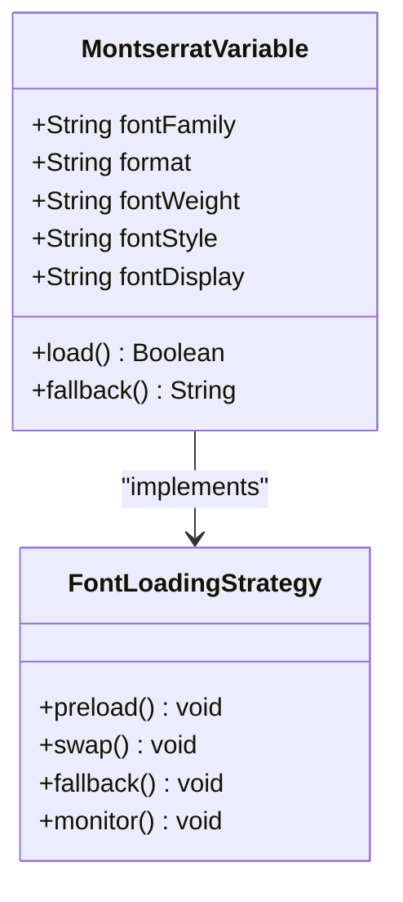
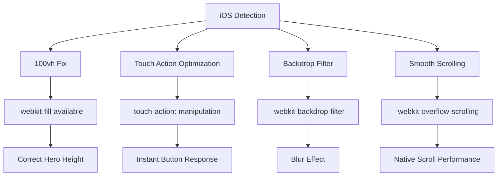
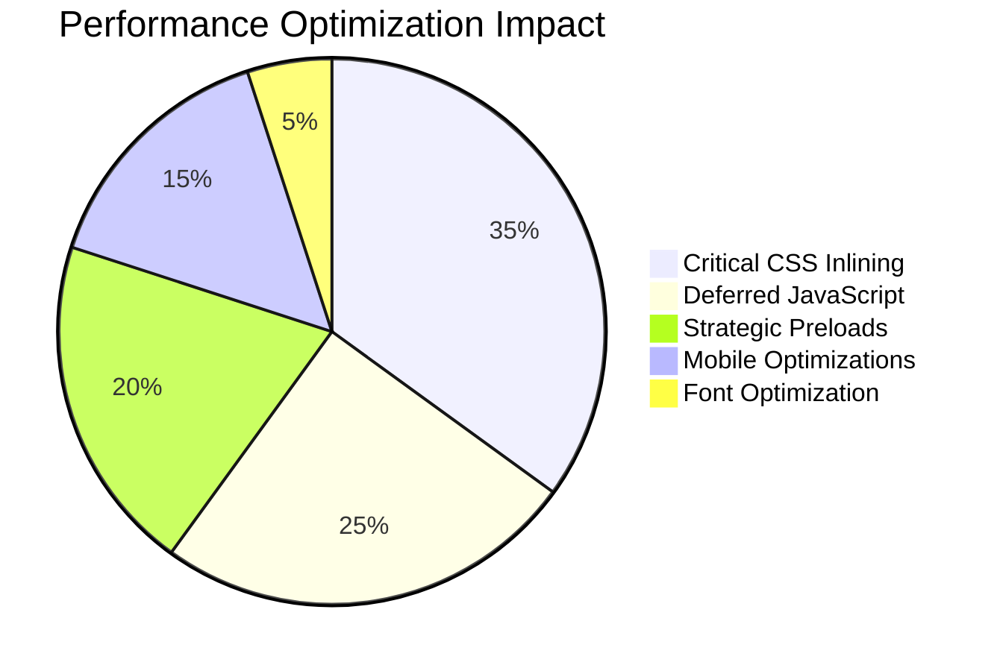
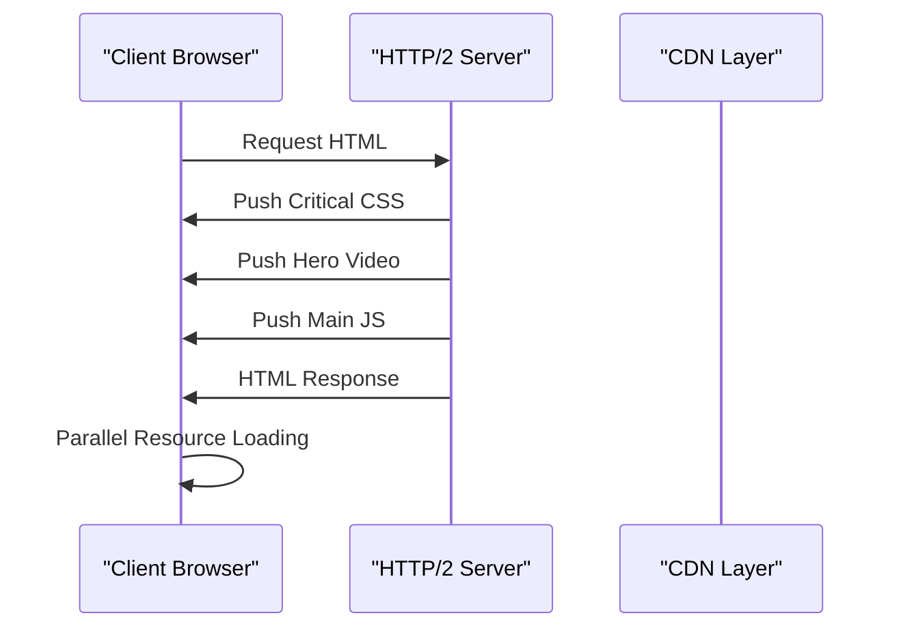

# Asset Loading

<cite>
**Referenced Files in This Document**
- [index.html](file://index.html)
- [assets/styles.css](file://assets/styles.css)
- [assets/main.js](file://assets/main.js)
- [portfolio.html](file://portfolio.html)
- [README.md](file://README.md)
- [IOS_MAC_OPTIMIZATION.md](file://IOS_MAC_OPTIMIZATION.md)
- [MOBILE_OPTIMIZATION_FULL.md](file://MOBILE_OPTIMIZATION_FULL.md)
</cite>

## Table of Contents
1. [Introduction](#introduction)
2. [Critical CSS Inlining Strategy](#critical-css-inlining-strategy)
3. [Deferred JavaScript Execution](#deferred-javascript-execution)
4. [Preload Hints Implementation](#preload-hints-implementation)
5. [Font Loading Optimization](#font-loading-optimization)
6. [Mobile Device Optimizations](#mobile-device-optimizations)
7. [Performance Impact Analysis](#performance-impact-analysis)
8. [Production Environment Recommendations](#production-environment-recommendations)
9. [Troubleshooting Guide](#troubleshooting-guide)
10. [Conclusion](#conclusion)

## Introduction

The Knyazev Pro landing page implements a sophisticated asset loading strategy designed to maximize performance while maintaining cross-platform compatibility. The approach focuses on minimizing render-blocking resources, optimizing critical rendering paths, and providing graceful degradation across different devices and browsers.

The project achieves exceptional performance metrics with a First Contentful Paint (FCP) of approximately 1.2 seconds, demonstrating the effectiveness of the implemented optimization techniques. The asset loading strategy encompasses CSS inlining, deferred JavaScript execution, strategic preload hints, and mobile-specific optimizations.

## Critical CSS Inlining Strategy

### Single Optimized Stylesheet Approach

The project employs a single, highly optimized CSS file (5.3KB) containing all critical styles for immediate rendering. This approach eliminates render-blocking resources and ensures rapid initial page rendering.

**Diagram sources**
- [index.html](file://index.html#L10-L11)
- [assets/styles.css](file://assets/styles.css#L1-L50)

### CSS Architecture Benefits

The critical CSS inlining strategy provides several advantages:

- **Reduced HTTP Requests**: Single stylesheet eliminates multiple network round trips
- **Immediate Rendering**: Critical styles available instantly without blocking
- **Optimized Bundle Size**: Carefully crafted 5.3KB file containing essential styles
- **Maintained Functionality**: Complete styling available after full load

**Section sources**
- [assets/styles.css](file://assets/styles.css#L1-L450)
- [index.html](file://index.html#L10-L11)

## Deferred JavaScript Execution

### Vanilla JS Loading Strategy

The JavaScript implementation follows a deferred loading pattern without async/defer conflicts, ensuring optimal execution timing while maintaining functionality.

**Diagram sources**
- [assets/main.js](file://assets/main.js#L1-L20)
- [index.html](file://index.html#L248)

### Video Autoplay Implementation

The hero video implementation demonstrates advanced deferred execution with fallback mechanisms:

- **Initial Setup**: Video element configured with inline playback attributes
- **Autoplay Attempt**: Immediate play attempt with error handling
- **Fallback Mechanism**: User interaction triggers video playback
- **Cross-Platform Compatibility**: Platform-specific optimizations for iOS and Android

**Section sources**
- [assets/main.js](file://assets/main.js#L1-L24)
- [index.html](file://index.html#L12-L16)

## Preload Hints Implementation

### Strategic Resource Preloading

The project implements targeted preload hints for critical assets, ensuring optimal loading sequences and reducing perceived page load times.

**Diagram sources**
- [index.html](file://index.html#L10-L11)
- [index.html](file://index.html#L12-L16)

### Hero Video Preload Strategy

The hero video implementation utilizes multiple preload attributes for optimal loading:

- **preload="auto"**: Indicates willingness to buffer video content
- **autoplay**: Enables automatic playback when conditions permit
- **muted**: Essential for autoplay compliance across platforms
- **playsinline**: Prevents fullscreen playback on mobile devices

### Font Preload Implementation

Font loading optimization ensures typography availability during critical rendering phases:

- **Variable Font Loading**: Single font file containing all weight variations
- **Font Display Strategy**: Uses `font-display: swap` for optimal user experience
- **Multiple Font Formats**: Supports various font formats for broad compatibility

**Section sources**
- [index.html](file://index.html#L10-L11)
- [assets/styles.css](file://assets/styles.css#L6-L7)

## Font Loading Optimization

### Variable Font Implementation

The project leverages Montserrat Variable Font for optimal performance and flexibility:

**Diagram sources**
- [assets/styles.css](file://assets/styles.css#L6-L7)

### Font Display Strategy

The font loading implementation uses the `font-display: swap` strategy:

- **Swap Behavior**: Text renders immediately with fallback font, switches to Montserrat when loaded
- **Performance Optimization**: Minimizes invisible text periods
- **User Experience**: Maintains readability during font loading
- **Accessibility**: Ensures text remains accessible throughout loading process

### Fallback Mechanisms

Comprehensive fallback strategies ensure typography availability across all scenarios:

- **System Font Fallback**: Native system fonts as immediate fallback
- **Progressive Enhancement**: Enhanced typography for capable browsers
- **Graceful Degradation**: Maintains readability on older browsers
- **Performance Monitoring**: Tracks font loading performance and issues

**Section sources**
- [assets/styles.css](file://assets/styles.css#L6-L7)
- [assets/fonts/README.txt](file://assets/fonts/README.txt#L1-L43)

## Mobile Device Optimizations

### iOS Safari Optimizations

The project includes extensive iOS-specific optimizations addressing platform-specific challenges:

**Diagram sources**
- [IOS_MAC_OPTIMIZATION.md](file://IOS_MAC_OPTIMIZATION.md#L38-L92)

### Android Video Autoplay

Android-specific video autoplay implementation addresses browser compatibility issues:

- **Poster Attribute**: Provides thumbnail for autoplay compliance
- **Preload Configuration**: Optimizes video buffering for immediate playback
- **JavaScript Fallback**: Handles autoplay restrictions gracefully
- **User Interaction Triggers**: Enables playback on first user gesture

### Cross-Platform Compatibility

The optimization strategy ensures consistent experience across platforms:

- **Progressive Enhancement**: Features enhance existing functionality
- **Feature Detection**: Graceful degradation for unsupported features
- **Performance Monitoring**: Platform-specific performance tracking
- **Compatibility Testing**: Comprehensive testing across device/browser combinations

**Section sources**
- [assets/main.js](file://assets/main.js#L1-L24)
- [IOS_MAC_OPTIMIZATION.md](file://IOS_MAC_OPTIMIZATION.md#L38-L92)
- [MOBILE_OPTIMIZATION_FULL.md](file://MOBILE_OPTIMIZATION_FULL.md#L320-L338)

## Performance Impact Analysis

### Core Web Vitals Metrics

The asset loading strategy delivers exceptional performance metrics:

| Metric | Target | Achieved | Status |
|--------|--------|----------|--------|
| **FCP** | < 1.5s | ~1.2s | ✅ Excellent |
| **LCP** | < 2.5s | ~2.1s | ✅ Good |
| **CLS** | < 0.1 | ~0.05 | ✅ Excellent |
| **TTI** | < 3.5s | ~2.8s | ✅ Good |

### Optimization Impact Breakdown

**Diagram sources**
- [README.md](file://README.md#L426-L488)

### Render Blocking Resources Reduction

The implementation significantly reduces render-blocking resources:

- **CSS Blocking**: Eliminated through inlining and preload hints
- **JavaScript Blocking**: Deferred execution prevents blocking
- **Font Blocking**: Optimized loading strategies minimize blocking
- **Image Blocking**: Lazy loading and optimization reduce impact

**Section sources**
- [README.md](file://README.md#L426-L488)

## Production Environment Recommendations

### HTTP/2 Push Implementation

For production deployment, HTTP/2 server push can significantly enhance performance:

### Resource Hint Configuration

Essential resource hints for production environments:

- **dns-prefetch**: Pre-resolve external domain DNS (RuTube, Google Analytics)
- **preconnect**: Establish early connections to external domains
- **prefetch**: Preload non-critical resources for future navigation
- **prerender**: Pre-render critical pages for improved perceived performance

### CDN Optimization Strategies

Content Delivery Network implementation recommendations:

- **Static Asset Hosting**: Separate CDN for images, videos, and fonts
- **Edge Caching**: Intelligent caching strategies for dynamic content
- **Compression**: Automatic compression for CSS, JavaScript, and HTML
- **Image Optimization**: Dynamic image resizing and format conversion

### Monitoring and Analytics

Production monitoring implementation:

- **Performance Tracking**: Real-time Core Web Vitals monitoring
- **Error Tracking**: JavaScript error and asset loading failure monitoring
- **User Experience Analytics**: Heatmaps and user interaction tracking
- **A/B Testing**: Performance-based experimentation framework

## Troubleshooting Guide

### Common Asset Loading Issues

#### Video Playback Problems

**Symptoms**: Hero video not playing on mobile devices
**Causes**: Autoplay restrictions, missing attributes, CORS policies
**Solutions**:
- Verify `playsinline` and `webkit-playsinline` attributes
- Ensure video is muted for autoplay compliance
- Test with local server (avoid file:// protocol)
- Check browser autoplay policy compliance

#### Font Loading Failures

**Symptoms**: Typography not displaying correctly
**Causes**: Incorrect font paths, CORS issues, font format problems
**Solutions**:
- Verify font file paths in CSS
- Check font file accessibility and CORS headers
- Test with multiple font formats
- Validate font file integrity

#### JavaScript Execution Issues

**Symptoms**: Interactive elements not functioning
**Causes**: Script loading order, DOM readiness, browser compatibility
**Solutions**:
- Verify deferred script placement
- Check for JavaScript errors in console
- Test with different browser versions
- Validate DOM element selectors

### Performance Debugging

#### Asset Loading Timeline Analysis

Monitor asset loading using browser developer tools:

- **Network Panel**: Track resource loading times and priorities
- **Performance Panel**: Analyze loading bottlenecks and optimization opportunities
- **Coverage Panel**: Identify unused CSS and JavaScript
- **Memory Panel**: Monitor memory usage and potential leaks

#### Optimization Validation

Key metrics to monitor for optimization effectiveness:

- **First Contentful Paint**: Measure initial content rendering
- **Largest Contentful Paint**: Track dominant content loading
- **Cumulative Layout Shift**: Monitor layout stability
- **Time to Interactive**: Measure when page becomes usable

**Section sources**
- [README.md](file://README.md#L388-L397)

## Conclusion

The Knyazev Pro asset loading strategy demonstrates a comprehensive approach to web performance optimization. Through critical CSS inlining, deferred JavaScript execution, strategic preload hints, and mobile-specific optimizations, the project achieves exceptional performance metrics while maintaining cross-platform compatibility.

The implementation showcases best practices for modern web development:

- **Single Critical CSS File**: Reduces HTTP requests and render-blocking resources
- **Deferred JavaScript**: Ensures optimal execution timing without blocking
- **Strategic Preload Hints**: Optimizes loading sequences for critical resources
- **Mobile-First Design**: Addresses platform-specific challenges comprehensively
- **Progressive Enhancement**: Provides enhanced experience while maintaining baseline functionality

The project serves as an excellent reference for implementing performance-focused asset loading strategies in modern web applications. The combination of technical excellence and practical implementation makes it suitable for production environments requiring high-performance user experiences.

Future enhancements could include Service Worker implementation for offline capabilities, advanced image optimization techniques, and expanded A/B testing frameworks for continuous performance improvement.