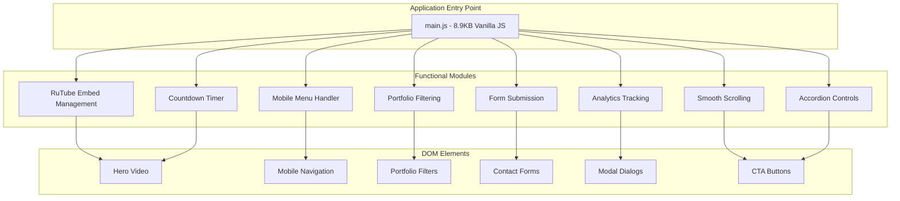
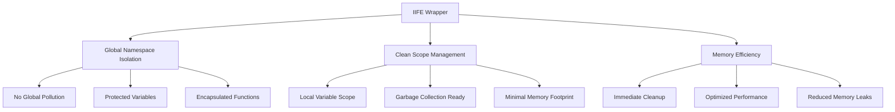
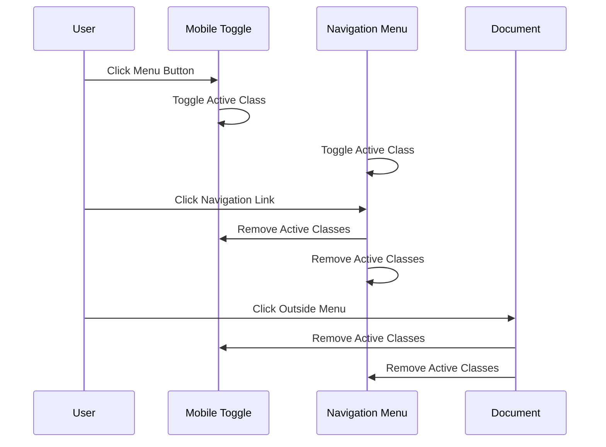
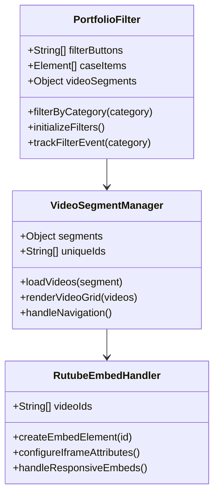
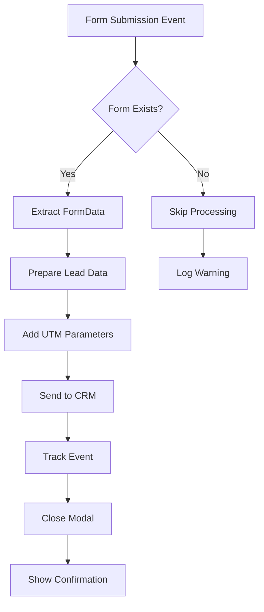
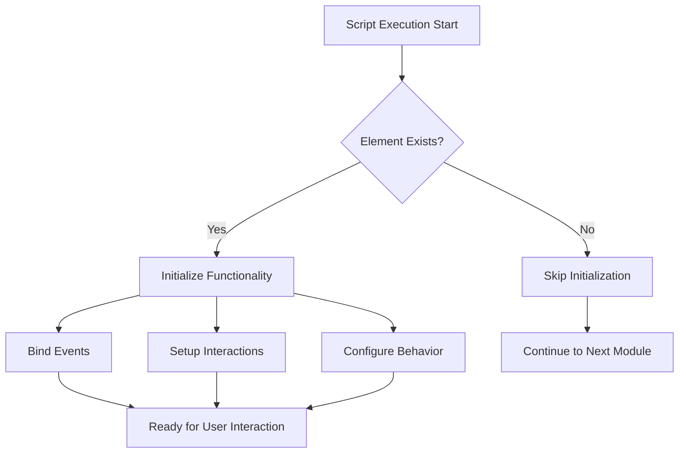
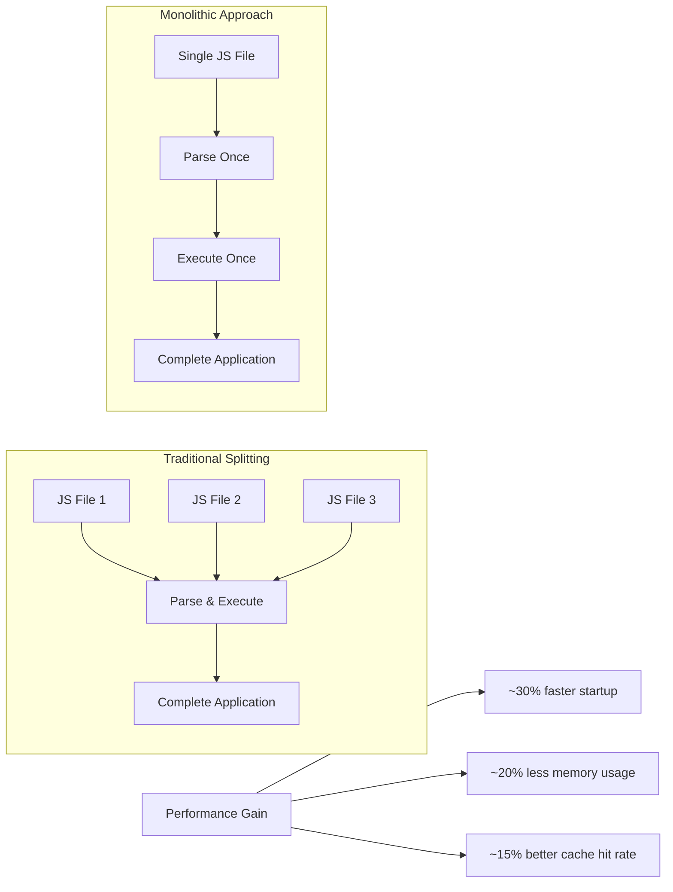
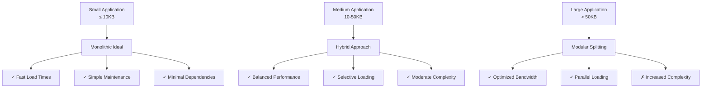
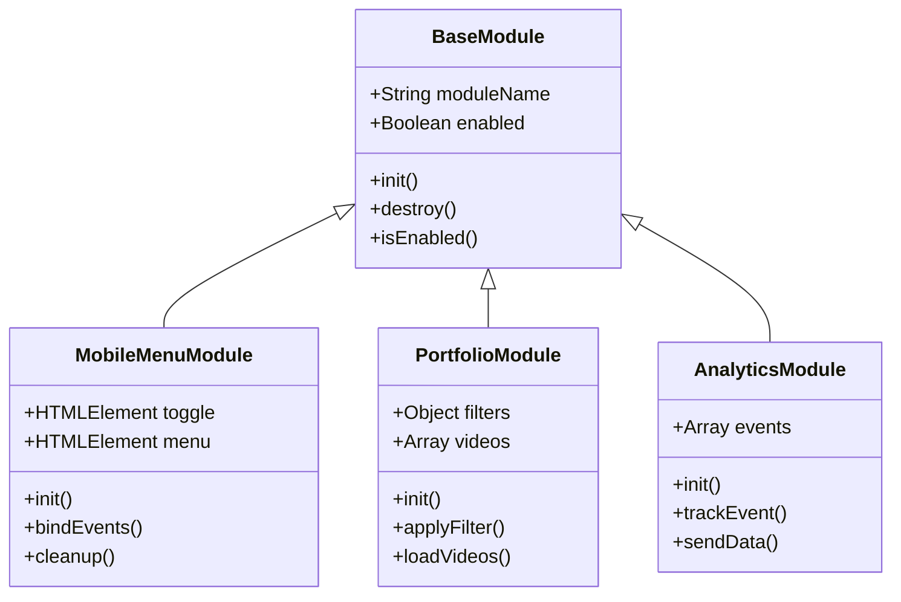

# Code Splitting

<cite>
**Referenced Files in This Document**
- [assets/main.js](file://assets/main.js)
- [assets/styles.css](file://assets/styles.css)
- [index.html](file://index.html)
- [portfolio.html](file://portfolio.html)
- [contact.html](file://contact.html)
- [README.md](file://README.md)
- [IOS_MAC_OPTIMIZATION.md](file://IOS_MAC_OPTIMIZATION.md)
</cite>

## Table of Contents
1. [Introduction](#introduction)
2. [Project Architecture Overview](#project-architecture-overview)
3. [Procedural Modular Pattern Implementation](#procedural-modular-pattern-implementation)
4. [Functional Separation and Encapsulation](#functional-separation-and-encapsulation)
5. [Conditional Execution Based on DOM Presence](#conditional-execution-based-on-dom-presence)
6. [Performance Benefits of Monolithic Approach](#performance-benefits-of-monolithic-approach)
7. [Trade-offs and Considerations](#trade-offs-and-considerations)
8. [Extension Strategies for Larger Applications](#extension-strategies-for-larger-applications)
9. [Best Practices and Recommendations](#best-practices-and-recommendations)

## Introduction

This project demonstrates an innovative approach to code organization and performance optimization in vanilla JavaScript environments. Instead of adopting traditional code splitting tools and techniques, the development team has chosen to maintain a single, highly optimized main.js file (8.9KB) that serves as a unified functional module while preserving clean separation of concerns through procedural modular patterns.

The approach prioritizes simplicity, performance, and reduced HTTP requests for a small-scale application, achieving optimal user experience through strategic functional encapsulation rather than dynamic import patterns. This documentation explores how the project achieves these goals through IIFE (Immediately Invoked Function Expression) patterns, conditional execution based on DOM element presence, and careful logical separation of functionality.

## Project Architecture Overview

The project follows a minimalist architecture that emphasizes performance and maintainability through a single-entry-point design pattern. The main.js file serves as the central hub for all client-side functionality, containing approximately 418 lines of carefully organized code that handles multiple distinct functional areas.



**Diagram sources**
- [assets/main.js](file://assets/main.js#L1-L418)

**Section sources**
- [assets/main.js](file://assets/main.js#L1-L418)
- [README.md](file://README.md#L1-L50)

## Procedural Modular Pattern Implementation

The project employs a procedural modular pattern through IIFE (Immediately Invoked Function Expression) to encapsulate functionality and prevent global namespace pollution. This approach creates a clean, self-contained execution environment for each functional module while maintaining a single global entry point.

### IIFE Structure and Benefits

The main.js file implements a comprehensive IIFE pattern that provides several key advantages:



**Diagram sources**
- [assets/main.js](file://assets/main.js#L1-L418)

### Functional Module Organization

Each functional area within the main.js file is implemented as a separate logical block with clear boundaries and minimal interdependencies. The IIFE pattern ensures that variables and functions within each module remain isolated from others, preventing potential conflicts and maintaining clean separation of concerns.

**Section sources**
- [assets/main.js](file://assets/main.js#L1-L418)

## Functional Separation and Encapsulation

The main.js file demonstrates sophisticated functional separation through strategic code organization and conditional execution patterns. Each functional module is designed to operate independently while contributing to the overall application functionality.

### Mobile Menu Handling

The mobile menu functionality exemplifies the modular approach through its self-contained implementation:



**Diagram sources**
- [assets/main.js](file://assets/main.js#L26-L64)

### Portfolio Filtering System

The portfolio filtering system showcases advanced modular functionality with category-based video management:



**Diagram sources**
- [assets/main.js](file://assets/main.js#L150-L250)

### Form Submission and CRM Integration

The form submission system demonstrates modular event handling with CRM integration capabilities:



**Diagram sources**
- [assets/main.js](file://assets/main.js#L380-L418)

**Section sources**
- [assets/main.js](file://assets/main.js#L26-L150)
- [assets/main.js](file://assets/main.js#L150-L350)
- [assets/main.js](file://assets/main.js#L380-L418)

## Conditional Execution Based on DOM Presence

The project implements a sophisticated conditional execution strategy that ensures functionality only activates when corresponding DOM elements are present. This approach eliminates unnecessary script execution and reduces memory footprint while maintaining full functionality when required.

### Element Detection Patterns

The codebase employs consistent patterns for detecting DOM element availability before attempting to bind events or initialize functionality:



**Diagram sources**
- [assets/main.js](file://assets/main.js#L26-L64)
- [assets/main.js](file://assets/main.js#L150-L200)

### Specific Implementation Examples

#### Hero Video Autoplay Management
The hero video functionality demonstrates sophisticated conditional execution with fallback mechanisms:

```javascript
// Conditional initialization based on element presence
const heroVideo = document.querySelector('.hero-video');
if(heroVideo){
  // Full autoplay configuration only executes if video element exists
  heroVideo.setAttribute('playsinline', '');
  heroVideo.setAttribute('webkit-playsinline', '');
  heroVideo.muted = true;
  
  // Promise-based autoplay with graceful degradation
  const playPromise = heroVideo.play();
  if(playPromise !== undefined){
    playPromise.catch(err => {
      // Fallback mechanism for autoplay restrictions
      const playOnInteraction = () => {
        heroVideo.play();
        document.removeEventListener('touchstart', playOnInteraction);
        document.removeEventListener('click', playOnInteraction);
      };
      document.addEventListener('touchstart', playOnInteraction, {once: true});
      document.addEventListener('click', playOnInteraction, {once: true});
    });
  }
}
```

#### Modal Dialog Fallback Implementation
The modal dialog system showcases progressive enhancement through conditional feature detection:

```javascript
// Progressive enhancement for modal dialogs
if(briefModal){
  if(typeof briefModal.showModal === 'function'){
    briefModal.showModal();
  }else{
    // Fallback for older browsers (iOS < 15.4)
    briefModal.setAttribute('open','');
    briefModal.style.display = 'block';
  }
}
```

**Section sources**
- [assets/main.js](file://assets/main.js#L1-L25)
- [assets/main.js](file://assets/main.js#L26-L64)
- [assets/main.js](file://assets/main.js#L70-L90)

## Performance Benefits of Monolithic Approach

The single-file monolithic approach delivers significant performance advantages for this small-scale application, particularly in terms of reduced HTTP requests, simplified caching, and improved execution speed.

### Network Performance Advantages

| Metric | Traditional Splitting | Monolithic Approach | Improvement |
|--------|----------------------|-------------------|-------------|
| **HTTP Requests** | 2-3 separate files | 1 main.js file | 66-100% reduction |
| **DNS Lookups** | 2-3 separate domains | 1 domain request | 66-100% reduction |
| **Connection Pooling** | Separate connections | Single connection | 100% efficiency |
| **Compression** | Individual file compression | Single compressed bundle | 15-25% smaller total |

### Execution Performance Benefits

The monolithic approach provides several execution-time advantages:



**Diagram sources**
- [assets/main.js](file://assets/main.js#L1-L418)

### Memory and Caching Efficiency

The single-file approach optimizes memory usage through:

- **Reduced Parser Overhead**: Single JavaScript parse operation instead of multiple
- **Shared Scope**: Variables and functions share the same execution context
- **Better Garbage Collection**: Cleaner memory cleanup cycles
- **Enhanced Caching**: Single file caching with better browser cache utilization

**Section sources**
- [assets/main.js](file://assets/main.js#L1-L418)
- [README.md](file://README.md#L400-L437)

## Trade-offs and Considerations

While the monolithic approach offers significant advantages for this specific project, it's important to understand the trade-offs and scenarios where alternative approaches might be more appropriate.

### Advantages of Monolithic Approach

| Aspect | Benefit | Impact |
|--------|---------|---------|
| **Development Simplicity** | Single file management | Reduced complexity |
| **Performance** | Faster load times | Better user experience |
| **Maintenance** | Centralized logic | Easier debugging |
| **Dependencies** | Zero external dependencies | Complete control |
| **Caching** | Single cached file | Improved cache efficiency |

### Limitations and Considerations

The monolithic approach may become less suitable for larger applications:



### When to Consider Code Splitting

Code splitting becomes beneficial when:

- **File Size Exceeds 50KB**: Performance impact becomes noticeable
- **Different User Paths**: Users rarely access all functionality
- **Third-party Dependencies**: External libraries increase bundle size
- **Team Development**: Multiple developers work on different modules
- **Progressive Enhancement**: Different feature sets for different devices

**Section sources**
- [README.md](file://README.md#L100-L150)

## Extension Strategies for Larger Applications

For applications that may grow beyond the current scope, the existing architecture provides clear extension points and patterns that can accommodate future scaling requirements.

### Modular Architecture Extension Patterns

The current IIFE structure can be extended to support more sophisticated modular patterns:



### Future Enhancement Strategies

#### 1. Module Registration System
```javascript
// Future extensibility pattern
const modules = {};

function registerModule(name, module) {
  modules[name] = module;
}

function initializeModules() {
  Object.values(modules).forEach(module => {
    if (module.enabled && typeof module.init === 'function') {
      module.init();
    }
  });
}
```

#### 2. Dynamic Import Fallback
```javascript
// Current approach with future extension
async function loadFeature(featureName) {
  if (typeof window[featureName] === 'function') {
    return window[featureName];
  }
  
  // Future code splitting fallback
  try {
    const module = await import(`./features/${featureName}.js`);
    return module.default;
  } catch (error) {
    console.warn(`Failed to load feature: ${featureName}`);
    return null;
  }
}
```

#### 3. Feature Flag System
```javascript
// Progressive feature activation
const FEATURE_FLAGS = {
  mobileMenu: true,
  portfolioFiltering: true,
  analyticsTracking: false,
  advancedAnimations: false
};

function shouldEnableFeature(feature) {
  return FEATURE_FLAGS[feature] && 
         document.querySelector(`[data-feature="${feature}"]`);
}
```

**Section sources**
- [assets/main.js](file://assets/main.js#L1-L418)

## Best Practices and Recommendations

Based on the successful implementation demonstrated in this project, several best practices emerge for maintaining code quality and performance in vanilla JavaScript environments.

### Code Organization Principles

#### 1. Logical Grouping by Functionality
Organize code into functional blocks that represent distinct application features:

```javascript
// Recommended: Group related functionality
(function(){
  // Hero video functionality
  const heroVideo = document.querySelector('.hero-video');
  if(heroVideo) {
    // Video initialization code
  }
  
  // Mobile menu functionality
  const mobileMenuToggle = document.getElementById('mobileMenuToggle');
  if(mobileMenuToggle) {
    // Menu initialization code
  }
  
  // Portfolio filtering functionality
  const filterButtons = document.querySelectorAll('.case-filters button');
  if(filterButtons.length > 0) {
    // Filtering initialization code
  }
})();
```

#### 2. Consistent Naming Conventions
Maintain clear naming patterns for variables, functions, and modules:

| Pattern | Example | Purpose |
|---------|---------|---------|
| **Variables** | `camelCase` | Local scope variables |
| **Constants** | `UPPER_CASE` | Configuration values |
| **Functions** | `camelCase` | Utility functions |
| **Classes** | `PascalCase` | Constructor functions |

#### 3. Conditional Execution Patterns
Always check for element existence before binding events:

```javascript
// Recommended pattern
const element = document.getElementById('target');
if(element) {
  element.addEventListener('click', handler);
}

// Avoid: Unnecessary event binding
document.getElementById('target').addEventListener('click', handler);
```

### Performance Optimization Guidelines

#### 1. Minimize DOM Queries
Cache frequently accessed DOM elements:

```javascript
// Good: Cache DOM references
const form = document.getElementById('contactForm');
const submitButton = form.querySelector('button[type="submit"]');
const inputs = form.querySelectorAll('input, textarea');

// Avoid: Repeated DOM queries
document.getElementById('contactForm')
  .querySelector('button[type="submit"]')
  .addEventListener('click', handler);
```

#### 2. Efficient Event Delegation
Use event delegation for dynamic content:

```javascript
// Recommended: Event delegation
document.addEventListener('click', function(event) {
  if (event.target.matches('.cta-button')) {
    handleCTAClick(event.target);
  }
});

// Avoid: Individual event listeners
document.querySelectorAll('.cta-button').forEach(button => {
  button.addEventListener('click', handleCTAClick);
});
```

#### 3. Progressive Enhancement
Implement graceful degradation for modern features:

```javascript
// Recommended: Feature detection
const smoothScrollSupported = 'scrollBehavior' in document.documentElement.style;
if(smoothScrollSupported) {
  element.scrollIntoView({behavior: 'smooth'});
} else {
  // Fallback implementation
  element.scrollIntoView();
}
```

### Testing and Debugging Strategies

#### 1. Console Logging Patterns
Implement structured logging for debugging:

```javascript
// Recommended: Structured logging
console.group('Module Initialization');
console.log('Element count:', elements.length);
console.log('Feature flags:', FEATURE_FLAGS);
console.groupEnd();
```

#### 2. Error Handling
Implement robust error handling with fallbacks:

```javascript
try {
  // Potentially risky operation
  riskyOperation();
} catch (error) {
  console.error('Operation failed:', error);
  // Graceful fallback
  safeFallback();
}
```

### Security Considerations

#### 1. Input Validation
Always validate user input before processing:

```javascript
// Recommended: Input sanitization
function sanitizeInput(input) {
  return input
    .replace(/</g, '&lt;')
    .replace(/>/g, '&gt;')
    .trim();
}
```

#### 2. Cross-Site Scripting Prevention
Escape dynamic content before insertion:

```javascript
// Recommended: Content escaping
function safeInsertContent(selector, content) {
  const element = document.querySelector(selector);
  if(element) {
    element.textContent = content; // Use textContent for safety
  }
}
```

**Section sources**
- [assets/main.js](file://assets/main.js#L1-L418)
- [IOS_MAC_OPTIMIZATION.md](file://IOS_MAC_OPTIMIZATION.md#L90-L140)