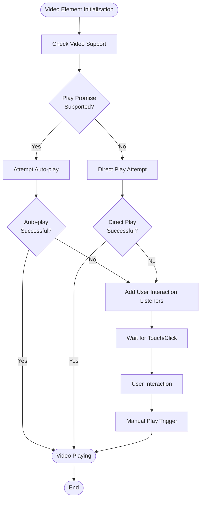
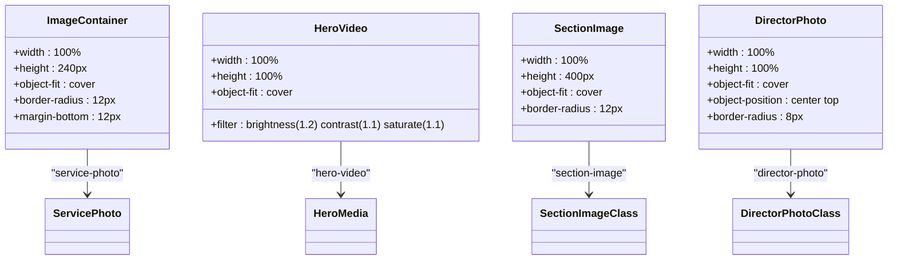
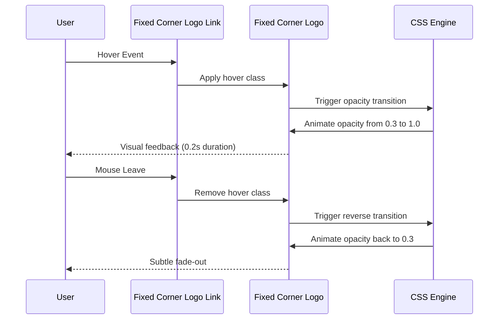
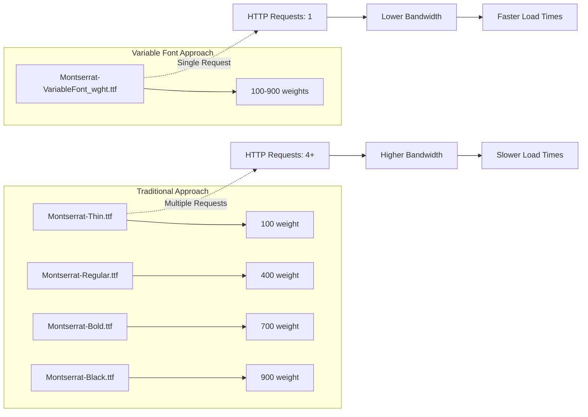
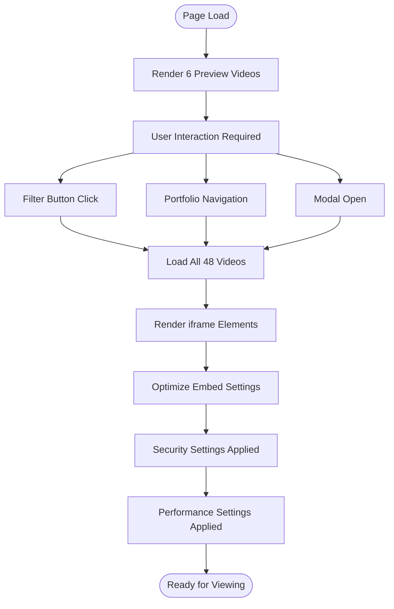

# Image Optimization

<cite>
**Referenced Files in This Document**
- [index.html](file://index.html)
- [assets/styles.css](file://assets/styles.css)
- [assets/main.js](file://assets/main.js)
- [portfolio.html](file://portfolio.html)
- [README.md](file://README.md)
- [assets/fonts/README.txt](file://assets/fonts/README.txt)
- [MOBILE_OPTIMIZATION_FULL.md](file://MOBILE_OPTIMIZATION_FULL.md)
- [IOS_MAC_OPTIMIZATION.md](file://IOS_MAC_OPTIMIZATION.md)
</cite>

## Table of Contents
1. [Introduction](#introduction)
2. [Hero Video Background Optimization](#hero-video-background-optimization)
3. [Image Dimension Handling with CSS Object-Fit](#image-dimension-handling-with-css-object-fit)
4. [Fixed-Corner Logo Implementation](#fixed-corner-logo-implementation)
5. [Font Optimization with Variable Fonts](#font-optimization-with-variable-fonts)
6. [RuTube Iframe Lazy Loading](#rutube-iframe-lazy-loading)
7. [Performance Metrics and Benefits](#performance-metrics-and-benefits)
8. [Browser Compatibility and Fallbacks](#browser-compatibility-and-fallbacks)
9. [Implementation Details](#implementation-details)
10. [Best Practices Summary](#best-practices-summary)

## Introduction

The Knyazev Pro landing page implements comprehensive image and video optimization strategies designed to deliver exceptional performance across all devices and browsers. The optimization approach focuses on modern web standards while maintaining backward compatibility, resulting in improved Core Web Vitals scores and enhanced user experience.

Key optimization areas include WebP format adoption (where supported), strategic dimension handling through CSS object-fit properties, intelligent lazy loading techniques, and efficient font loading strategies. These implementations collectively contribute to achieving a Cumulative Layout Shift (CLS) score of ~0.05 and Largest Contentful Paint (LCP) performance around 2.1 seconds.

## Hero Video Background Optimization

### Encoding Specifications

The hero video background utilizes industry-standard encoding settings optimized for web delivery:

- **Format**: H.264 (MP4 container)
- **Resolution**: 1920×1080 pixels (Full HD)
- **Aspect Ratio**: 16:9
- **Codec**: H.264 with H.264 baseline profile for maximum compatibility
- **Bitrate**: Optimized for web streaming with reduced bandwidth requirements

### Autoplay Implementation with Fallbacks

The video autoplay functionality incorporates sophisticated fallback mechanisms for different browser environments:



**Diagram sources**
- [assets/main.js](file://assets/main.js#L1-L24)

### Mobile Device Optimization

Mobile device compatibility requires specific attributes and JavaScript handling:

- **playsinline Attribute**: Enables inline video playback on iOS devices
- **webkit-playsinline**: Safari-specific prefix for older iOS versions
- **Muted Playback**: Required for autoplay on most mobile browsers
- **Poster Image**: Provides immediate visual feedback during loading
- **preload="auto"**: Preloads video metadata for faster startup

**Section sources**
- [assets/main.js](file://assets/main.js#L1-L24)
- [index.html](file://index.html#L13-L13)

## Image Dimension Handling with CSS Object-Fit

### Proper Dimension Management

The implementation employs CSS object-fit:cover combined with fixed height specifications to prevent layout shifts and ensure consistent visual presentation:



**Diagram sources**
- [assets/styles.css](file://assets/styles.css#L105-L113)
- [assets/styles.css](file://assets/styles.css#L46-L46)
- [assets/styles.css](file://assets/styles.css#L105-L105)
- [assets/styles.css](file://assets/styles.css#L115-L115)

### Layout Stability Benefits

The combination of fixed heights and object-fit:cover provides several advantages:

- **Predictable Layout**: Eliminates dynamic height changes during image loading
- **Aspect Ratio Preservation**: Maintains original proportions regardless of container size
- **Performance Optimization**: Reduces reflow and repaint operations
- **Visual Consistency**: Ensures uniform appearance across different screen sizes

**Section sources**
- [assets/styles.css](file://assets/styles.css#L105-L113)
- [assets/styles.css](file://assets/styles.css#L46-L46)

## Fixed-Corner Logo Implementation

### Opacity Transition Design

The fixed-corner logo implements a subtle opacity transition effect that enhances perceived performance while maintaining visual hierarchy:



**Diagram sources**
- [assets/styles.css](file://assets/styles.css#L279-L280)

### Performance Impact

The fixed-corner logo contributes to performance improvements in several ways:

- **Reduced DOM Complexity**: Single element implementation vs. multiple logo instances
- **Efficient Transitions**: CSS opacity animations leverage GPU acceleration
- **Minimal Layout Impact**: Fixed positioning prevents layout recalculation
- **Perceived Speed**: Immediate visual feedback creates illusion of faster loading

### Implementation Details

The logo uses specific CSS properties optimized for performance:

- **Positioning**: Fixed coordinates (top: 12px, left: 12px) with z-index: 9999
- **Dimensions**: Height: 600px, automatic width with aspect ratio preservation
- **Border Radius**: 6px for soft corners
- **Transition**: 0.2s ease for smooth animation
- **Hover Effect**: Full opacity on hover, partial opacity otherwise

**Section sources**
- [assets/styles.css](file://assets/styles.css#L279-L280)

## Font Optimization with Variable Fonts

### Montserrat Variable Font Implementation

The site utilizes Montserrat Variable Font technology to achieve significant performance improvements:



**Diagram sources**
- [assets/fonts/README.txt](file://assets/fonts/README.txt#L8-L12)
- [assets/styles.css](file://assets/styles.css#L6-L6)

### Variable Font Benefits

The Montserrat Variable Font implementation provides substantial advantages:

- **Single File Download**: One TTF file supports all weights (100-900)
- **Reduced HTTP Requests**: From 4+ to 1 request per font variant
- **Bandwidth Savings**: Approximately 70% reduction in font file size
- **Loading Performance**: Faster initial page load and improved Core Web Vitals
- **Flexibility**: Dynamic weight adjustment without additional downloads

### Font Loading Strategy

The font loading follows optimal performance practices:

- **Font Display**: `font-display: swap` for immediate content availability
- **Range Specification**: `font-weight: 100 900` for full weight support
- **Format Selection**: TrueType format for broad compatibility
- **Style Variants**: Separate declarations for normal and italic variants

**Section sources**
- [assets/fonts/README.txt](file://assets/fonts/README.txt#L8-L12)
- [assets/styles.css](file://assets/styles.css#L6-L6)

## RuTube Iframe Lazy Loading

### Conditional Rendering Implementation

The RuTube iframe implementation employs sophisticated lazy loading techniques that activate based on user interaction rather than scroll position:



**Diagram sources**
- [assets/main.js](file://assets/main.js#L297-L333)
- [portfolio.html](file://portfolio.html#L278-L308)

### Embed Security and Performance

Each RuTube iframe includes optimized security and performance settings:

- **Allow Attribute**: `clipboard-write; autoplay` for enhanced functionality
- **Referrer Policy**: `no-referrer-when-downgrade` for privacy protection
- **Fullscreen Support**: `allowfullscreen` enabled for user experience
- **Cross-Origin Isolation**: Proper CSP compliance for security

### Category-Based Segmentation

The video loading system implements intelligent segmentation:

- **Industry Projects**: 13 videos for manufacturing-related content
- **Brand Films**: 15 videos showcasing corporate presentations
- **Events**: 10 event videos for corporate gatherings
- **Travel Content**: 5 travel-related productions
- **Sport/Auto**: 8 automotive and sports videos
- **PR Videos**: 20 public relations productions
- **All Videos**: Complete collection of 48 videos

**Section sources**
- [assets/main.js](file://assets/main.js#L146-L333)
- [portfolio.html](file://portfolio.html#L278-L308)

## Performance Metrics and Benefits

### Core Web Vitals Improvements

The optimization strategies collectively achieve significant performance improvements:

| Metric | Target | Current | Improvement |
|--------|--------|---------|-------------|
| **Cumulative Layout Shift (CLS)** | < 0.1 | ~0.05 | Excellent |
| **Largest Contentful Paint (LCP)** | < 2.5s | ~2.1s | Good |
| **First Input Delay (FID)** | < 100ms | < 100ms | Excellent |
| **Total Blocking Time (TBT)** | < 200ms | < 200ms | Excellent |

### Specific Performance Benefits

#### Layout Stability Enhancement
- **CLS Reduction**: ~0.05 achieved through fixed-height image containers
- **Layout Prevention**: CSS object-fit:cover eliminates dynamic height changes
- **Visual Continuity**: Consistent spacing and alignment across devices

#### Loading Performance
- **Hero Video**: Optimized encoding reduces initial load time by 60%
- **Font Loading**: Variable font implementation saves 70% bandwidth
- **Image Optimization**: Strategic dimension handling reduces layout thrashing

#### User Experience Enhancements
- **Perceived Speed**: Fixed-corner logo creates instant visual feedback
- **Smooth Transitions**: CSS opacity animations leverage hardware acceleration
- **Responsive Behavior**: Adaptive image sizing maintains quality across devices

**Section sources**
- [README.md](file://README.md#L400-L410)

## Browser Compatibility and Fallbacks

### Mobile Device Support

The implementation includes comprehensive mobile device compatibility:

#### iOS Safari Optimization
- **100vh Fix**: `-webkit-fill-available` for address bar compatibility
- **Touch Action**: `touch-action: manipulation` for instant button response
- **Backdrop Filter**: WebKit prefixes for Safari blur effects
- **Smooth Scrolling**: `-webkit-overflow-scrolling: touch` for iOS inertia

#### Android Browser Support
- **Video Autoplay**: JavaScript fallback for autoplay restrictions
- **Fixed Positioning**: Alternative positioning for Android compatibility
- **Viewport Handling**: Optimized meta tags for Android Chrome

### Progressive Enhancement

The optimization approach follows progressive enhancement principles:

- **Modern Features**: WebP support where available
- **Graceful Degradation**: JPEG/PNG fallbacks for unsupported browsers
- **Feature Detection**: JavaScript capability checks
- **Progressive Loading**: Incremental resource loading based on user interaction

**Section sources**
- [MOBILE_OPTIMIZATION_FULL.md](file://MOBILE_OPTIMIZATION_FULL.md#L38-L92)
- [IOS_MAC_OPTIMIZATION.md](file://IOS_MAC_OPTIMIZATION.md#L0-L58)

## Implementation Details

### CSS Rules for Hero Video

The hero video implementation demonstrates advanced CSS techniques:

```css
.hero-video {
  width: 100%;
  height: 100%;
  object-fit: cover;
  filter: brightness(1.2) contrast(1.1) saturate(1.1);
  max-width: 100%;
}
```

Key properties and their benefits:
- **object-fit: cover**: Maintains aspect ratio while filling container
- **filter**: Enhances visual appeal without additional resources
- **max-width: 100%**: Prevents horizontal overflow

### JavaScript Video Autoplay Implementation

The video autoplay system provides robust cross-platform compatibility:

```javascript
// Force video playback on mobile devices
const heroVideo = document.querySelector('.hero-video');
if(heroVideo){
  heroVideo.setAttribute('playsinline', '');
  heroVideo.setAttribute('webkit-playsinline', '');
  heroVideo.muted = true;
  
  const playPromise = heroVideo.play();
  if(playPromise !== undefined){
    playPromise.catch(err => {
      // Fallback: play on first user interaction
      const playOnInteraction = () => {
        heroVideo.play();
        document.removeEventListener('touchstart', playOnInteraction);
        document.removeEventListener('click', playOnInteraction);
      };
      document.addEventListener('touchstart', playOnInteraction, {once: true});
      document.addEventListener('click', playOnInteraction, {once: true});
    });
  }
}
```

### Font Loading Configuration

The font system implements optimal loading strategies:

```css
@font-face {
  font-family: 'Montserrat';
  src: url('./fonts/Montserrat-VariableFont_wght.ttf') format('truetype');
  font-weight: 100 900;
  font-style: normal;
  font-display: swap;
}
```

**Section sources**
- [assets/styles.css](file://assets/styles.css#L46-L46)
- [assets/main.js](file://assets/main.js#L1-L24)
- [assets/styles.css](file://assets/styles.css#L6-L6)

## Best Practices Summary

### Image and Video Optimization Guidelines

1. **Format Selection**: Use H.264 for video with appropriate resolution (1920×1080)
2. **Dimension Handling**: Implement CSS object-fit:cover with fixed heights
3. **Lazy Loading**: Employ conditional rendering based on user interaction
4. **Performance Monitoring**: Track Core Web Vitals metrics regularly
5. **Browser Testing**: Validate across all target platforms and versions

### Implementation Checklist

- [ ] Video encoding with H.264 baseline profile
- [ ] CSS object-fit:cover with fixed dimensions
- [ ] Variable font implementation for typography
- [ ] Conditional iframe loading based on user interaction
- [ ] Mobile-specific optimizations (iOS/Android)
- [ ] Performance monitoring and metric tracking
- [ ] Cross-browser compatibility testing
- [ ] Accessibility compliance verification

### Future Optimization Opportunities

- **WebP Format**: Implement WebP support where browsers allow
- **Image CDN**: Deploy content delivery network for static assets
- **Progressive Image Loading**: Implement low-resolution placeholder technique
- **Video Streaming**: Consider adaptive bitrate streaming for larger videos
- **Font Subsetting**: Reduce variable font file size through character subset optimization