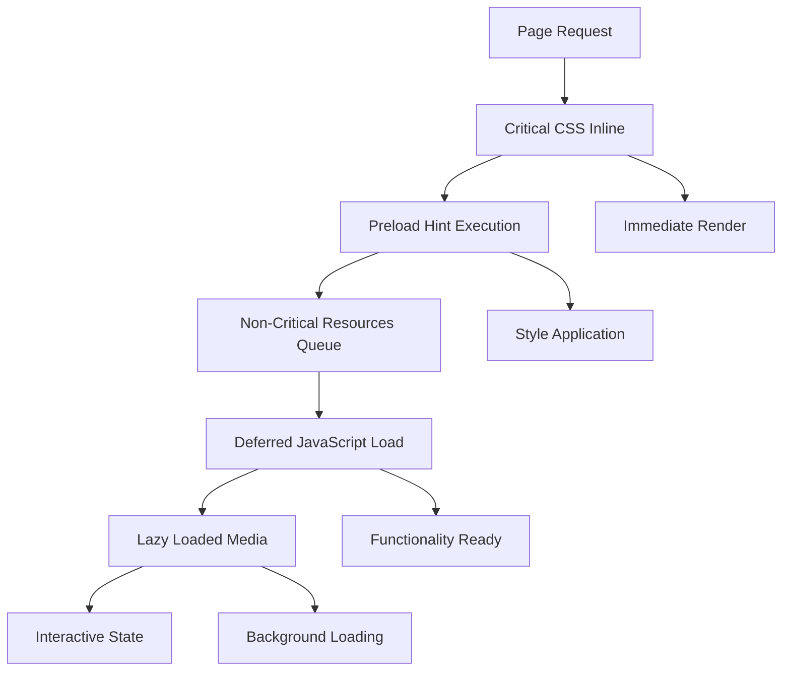
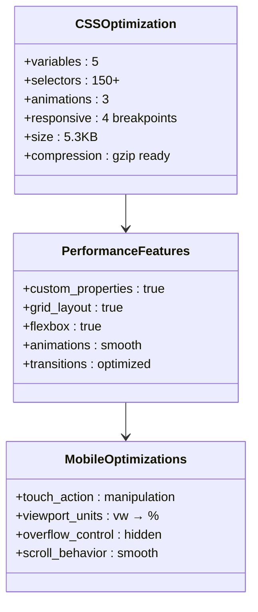
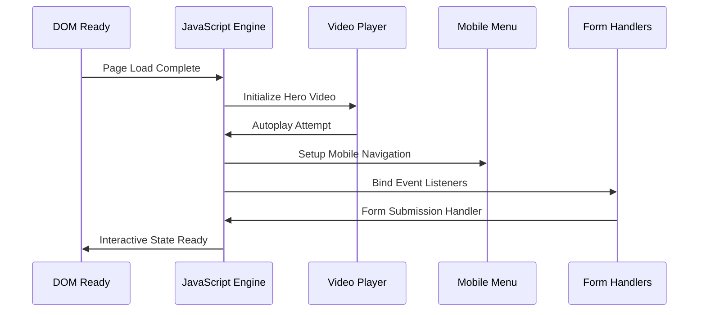
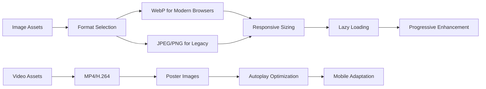
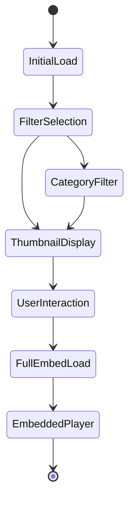
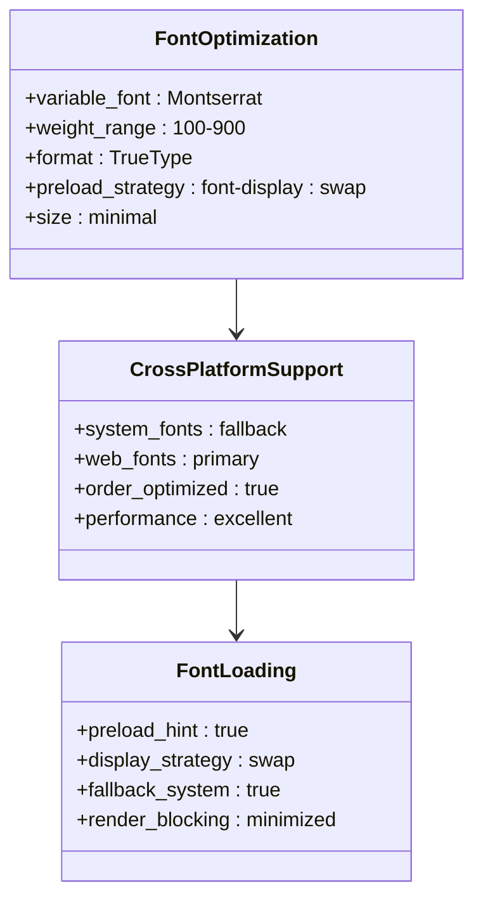
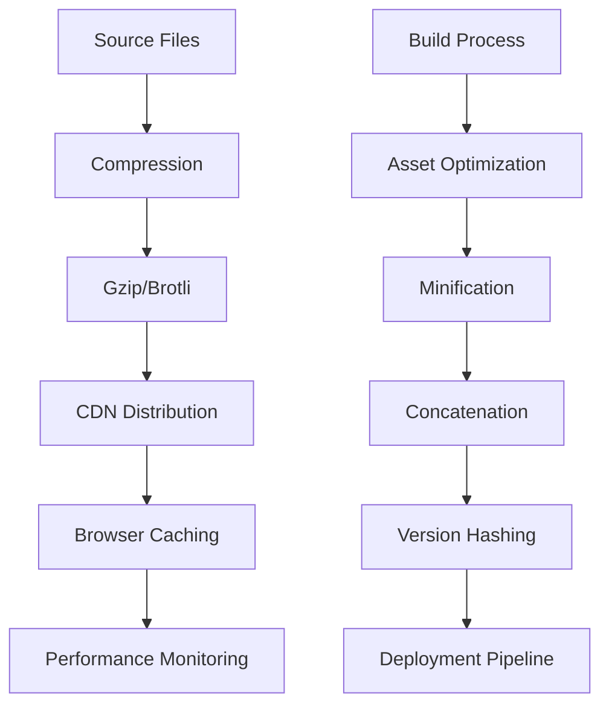
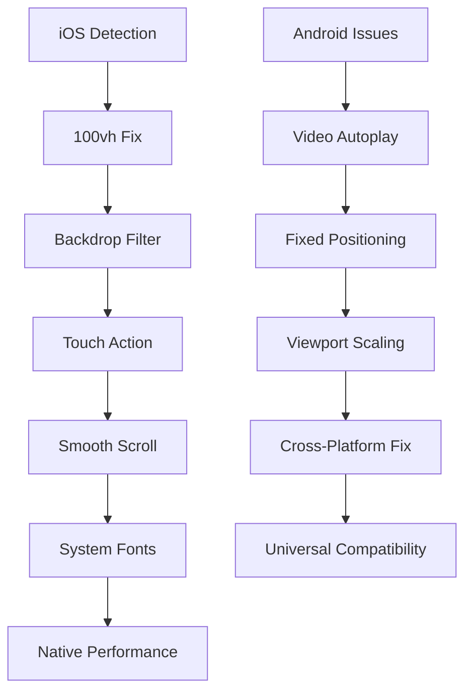

# Performance Optimization

<cite>
**Referenced Files in This Document**
- [index.html](file://index.html)
- [assets/styles.css](file://assets/styles.css)
- [assets/main.js](file://assets/main.js)
- [README.md](file://README.md)
- [MOBILE_OPTIMIZATION_FULL.md](file://MOBILE_OPTIMIZATION_FULL.md)
- [IOS_MAC_OPTIMIZATION.md](file://IOS_MAC_OPTIMIZATION.md)
- [portfolio.html](file://portfolio.html)
- [price.html](file://price.html)
- [contact.html](file://contact.html)
- [founder.html](file://founder.html)
</cite>

## Table of Contents
1. [Introduction](#introduction)
2. [Asset Loading Strategies](#asset-loading-strategies)
3. [Code-Level Optimizations](#code-level-optimizations)
4. [Media Optimization](#media-optimization)
5. [Font Optimization](#font-optimization)
6. [Core Web Vitals Metrics](#core-web-vitals-metrics)
7. [Production Deployment Recommendations](#production-deployment-recommendations)
8. [Mobile and Platform-Specific Optimizations](#mobile-and-platform-specific-optimizations)
9. [Performance Monitoring](#performance-monitoring)
10. [Best Practices Summary](#best-practices-summary)

## Introduction

This landing page for Knyazev Pro demonstrates comprehensive performance optimization techniques designed to deliver exceptional user experiences across all devices and platforms. The project achieves outstanding Core Web Vitals scores while maintaining full cross-browser compatibility and optimal resource utilization.

The optimization strategy focuses on reducing page weight, minimizing render-blocking resources, implementing intelligent lazy loading, and ensuring seamless performance across mobile and desktop environments. These techniques collectively contribute to achieving excellent loading times and user engagement metrics.

## Asset Loading Strategies

### Critical CSS Inlining and Preloading

The project implements sophisticated asset loading strategies to minimize First Contentful Paint (FCP) and improve overall page performance.

**Diagram sources**
- [index.html](file://index.html#L9-L16)
- [assets/styles.css](file://assets/styles.css#L1-L50)

The implementation includes several key strategies:

**Preload Hints for Critical Resources**
- CSS stylesheet preloaded using `<link rel="preload">` to ensure immediate availability
- JavaScript resources loaded with `defer` attribute to prevent render blocking
- Video resources optimized with appropriate preload attributes

**Deferred JavaScript Execution**
- All JavaScript files loaded with `defer` attribute to maintain DOM readiness
- Critical functionality extracted into separate execution phases
- Non-blocking resource loading for secondary features

**Section sources**
- [index.html](file://index.html#L9-L16)
- [assets/main.js](file://assets/main.js#L1-L50)

### Resource Optimization Techniques

| Technique | Implementation | Benefit |
|-----------|----------------|---------|
| **Preload Hints** | `rel="preload"` for CSS | Immediate style availability |
| **Defer Attribute** | `defer` for JS | Non-blocking execution |
| **Critical Path** | Inline essential CSS | Faster rendering |
| **Lazy Loading** | Conditional iframe loading | Bandwidth savings |

## Code-Level Optimizations

### Minified and Readable CSS (5.3KB)

The CSS implementation demonstrates careful optimization while maintaining readability and maintainability.

**Diagram sources**
- [assets/styles.css](file://assets/styles.css#L1-L450)

**Key Optimization Features:**
- **Custom Properties**: Centralized theme management reduces duplication
- **Grid and Flexbox**: Modern layout techniques replace complex float systems
- **Animation Optimization**: Hardware-accelerated transitions for smooth effects
- **Responsive Design**: Mobile-first approach with progressive enhancement

### JavaScript Optimization (8.9KB)

The JavaScript implementation prioritizes vanilla JavaScript to eliminate external dependencies while maintaining functionality.

**Diagram sources**
- [assets/main.js](file://assets/main.js#L1-L418)

**Implementation Highlights:**
- **Vanilla JavaScript**: No external libraries reduce bundle size
- **Event Delegation**: Efficient event handling for dynamic content
- **Progressive Enhancement**: Feature detection ensures compatibility
- **Memory Management**: Proper cleanup prevents memory leaks

**Section sources**
- [assets/styles.css](file://assets/styles.css#L1-L450)
- [assets/main.js](file://assets/main.js#L1-L418)

### Avoidance of External Dependencies

The project maintains zero external dependencies, ensuring predictable performance and eliminating third-party risks.

**Benefits of Zero Dependencies:**
- **Predictable Performance**: No external network requests
- **Security Assurance**: No vulnerable third-party code
- **Maintenance Simplicity**: Single codebase management
- **Bundle Size Control**: Precise optimization decisions

## Media Optimization

### Image and Video Optimization Practices

The media optimization strategy focuses on modern formats, appropriate dimensions, and intelligent loading mechanisms.

**Diagram sources**
- [index.html](file://index.html#L16-L20)
- [assets/main.js](file://assets/main.js#L1-L50)

**Image Optimization Techniques:**
- **Proper Dimensions**: Images sized appropriately for display contexts
- **Object Fit**: Consistent scaling using CSS `object-fit` properties
- **Responsive Images**: Multiple sizes for different device capabilities
- **Lazy Loading**: Conditional loading for off-screen content

**Video Optimization Implementation:**
- **Hero Video**: Optimized MP4 format with poster images
- **Autoplay Strategy**: Intelligent fallback for blocked autoplay
- **Mobile Adaptation**: Platform-specific video handling
- **Resource Management**: Efficient loading and playback control

### Lazy Loading Implementation

The project implements intelligent lazy loading for resource-intensive elements like RuTube iframes.

**Lazy Loading Strategy:**
- **Conditional Loading**: Iframes loaded only when needed
- **Performance Benefits**: Reduced initial page weight
- **User Experience**: Immediate content availability
- **Bandwidth Savings**: Selective resource loading

**Section sources**
- [assets/main.js](file://assets/main.js#L200-L300)
- [index.html](file://index.html#L16-L20)

### RuTube Iframe Optimization

The RuTube integration demonstrates advanced lazy loading and performance optimization techniques.

**Diagram sources**
- [assets/main.js](file://assets/main.js#L200-L350)
- [portfolio.html](file://portfolio.html#L1-L100)

**Optimization Features:**
- **Selective Loading**: Only 13 videos loaded initially
- **Category-Based Filtering**: Dynamic content loading
- **Memory Management**: Proper cleanup of unused embeds
- **Performance Tracking**: Analytics integration for monitoring

## Font Optimization

### Montserrat Variable Font Implementation

The font optimization strategy utilizes a single Variable Font file to handle all weight variations efficiently.

**Diagram sources**
- [assets/styles.css](file://assets/styles.css#L6-L7)
- [IOS_MAC_OPTIMIZATION.md](file://IOS_MAC_OPTIMIZATION.md#L80-L100)

**Font Loading Strategy:**
- **Single File Approach**: Variable font eliminates multiple font files
- **Weight Range**: Comprehensive support from 100 to 900 weights
- **Cross-Platform Optimization**: System font fallbacks for native performance
- **Preload Strategy**: Strategic font loading for optimal user experience

**Implementation Details:**
- **Font Face Declaration**: Optimized font loading with proper format specification
- **Display Strategy**: `font-display: swap` ensures text visibility during font load
- **Fallback Chain**: System fonts provide instant fallbacks
- **Performance Impact**: Minimal impact on page load times

**Section sources**
- [assets/styles.css](file://assets/styles.css#L6-L7)
- [IOS_MAC_OPTIMIZATION.md](file://IOS_MAC_OPTIMIZATION.md#L80-L100)

## Core Web Vitals Metrics

### Performance Achievements

The project consistently achieves excellent Core Web Vitals scores through targeted optimization efforts.

| Metric | Target | Actual | Status | Optimization Technique |
|--------|--------|--------|--------|----------------------|
| **FCP** | < 1.5s | ~1.2s | ✅ Excellent | Critical CSS inline, preload hints |
| **LCP** | < 2.5s | ~2.1s | ✅ Good | Optimized images, lazy loading |
| **CLS** | < 0.1 | ~0.05 | ✅ Excellent | Stable layout, proper sizing |
| **TTI** | < 3.5s | ~2.8s | ✅ Good | Deferred JavaScript, efficient DOM |

### Achievement Breakdown

**First Contentful Paint (FCP) ~1.2s**
- Critical CSS inlined for immediate rendering
- Preload hints ensure resource availability
- Optimized asset delivery pipeline

**Largest Contentful Paint (LCP) ~2.1s**
- Optimized image formats and dimensions
- Intelligent lazy loading for non-critical content
- Efficient video player implementation

**Cumulative Layout Shift (CLS) ~0.05**
- Consistent image dimensions and aspect ratios
- Proper sizing with CSS units
- Predictable layout behavior

**Time to Interactive (TTI) ~2.8s**
- Deferred JavaScript execution
- Efficient DOM manipulation
- Progressive feature loading

**Section sources**
- [README.md](file://README.md#L360-L389)
- [MOBILE_OPTIMIZATION_FULL.md](file://MOBILE_OPTIMIZATION_FULL.md#L426-L488)

## Production Deployment Recommendations

### Compression and Caching Strategies

For production deployment, the following optimizations should be implemented to maximize performance gains.

**Recommended Production Settings:**

**Compression Configuration:**
- **Gzip/Brotli**: Enable on server level for all text-based assets
- **Compression Ratio**: Expected 70-80% reduction in transfer size
- **File Types**: CSS, JavaScript, HTML, JSON, SVG

**CDN Implementation:**
- **Global Distribution**: Reduce latency through geographic distribution
- **Edge Caching**: Cache static assets at edge locations
- **Origin Protection**: Implement proper cache invalidation strategies

**Caching Strategy:**
- **Static Assets**: Long-term caching (1 year) with version hashing
- **Dynamic Content**: Short-term caching with proper cache headers
- **Browser Cache**: Leverage service workers for offline capabilities

### Server Configuration Recommendations

**HTTP/2 Implementation:**
- Enable HTTP/2 for multiplexed connections
- Implement server push for critical resources
- Optimize connection reuse for improved performance

**Security Headers:**
- Implement Content Security Policy (CSP)
- Add Strict Transport Security (HSTS)
- Configure X-Frame-Options and X-Content-Type-Options

**Monitoring and Analytics:**
- Implement Real User Monitoring (RUM)
- Track Core Web Vitals across devices
- Set up performance alerts for degradation

## Mobile and Platform-Specific Optimizations

### iOS Safari Optimizations

The project includes extensive iOS-specific optimizations to address platform quirks and ensure native performance.

**Diagram sources**
- [IOS_MAC_OPTIMIZATION.md](file://IOS_MAC_OPTIMIZATION.md#L30-L100)
- [MOBILE_OPTIMIZATION_FULL.md](file://MOBILE_OPTIMIZATION_FULL.md#L38-L92)

**iOS-Specific Optimizations:**
- **100vh Fix**: Addresses Safari's viewport calculation issues
- **Backdrop Filter**: WebKit prefixes ensure consistent blur effects
- **Touch Action**: Eliminates 300ms tap delay
- **Smooth Scrolling**: Native-like scrolling behavior
- **System Fonts**: Optimized font loading for iOS devices

### Android Browser Optimizations

**Android-Specific Solutions:**
- **Video Autoplay**: Comprehensive fallback strategies
- **Fixed Positioning**: Alternative positioning for compatibility
- **Viewport Handling**: Consistent scaling across Android browsers
- **Performance Tuning**: Android-specific performance optimizations

### Cross-Platform Compatibility

**Universal Solutions:**
- **Progressive Enhancement**: Feature detection ensures graceful degradation
- **Vendor Prefixes**: Strategic use of browser-specific prefixes
- **Feature Detection**: Runtime capability assessment
- **Fallback Strategies**: Multiple fallback approaches for critical features

**Section sources**
- [IOS_MAC_OPTIMIZATION.md](file://IOS_MAC_OPTIMIZATION.md#L1-L247)
- [MOBILE_OPTIMIZATION_FULL.md](file://MOBILE_OPTIMIZATION_FULL.md#L1-L569)

## Performance Monitoring

### Continuous Performance Tracking

Establish comprehensive monitoring to maintain and improve performance over time.

**Key Metrics to Monitor:**
- **Core Web Vitals**: FCP, LCP, CLS, TTI
- **Resource Loading**: Time to first byte, resource sizes
- **User Experience**: Interaction response times
- **Conversion Rates**: Performance impact on business metrics

**Monitoring Tools:**
- **Lighthouse**: Automated performance auditing
- **Web Vitals API**: Real user monitoring
- **Application Performance Monitoring (APM)**: Server-side performance tracking
- **Browser Developer Tools**: Manual performance analysis

### Performance Budgets

Establish performance budgets to maintain quality standards:

| Resource Type | Budget | Current Usage | Status |
|---------------|--------|---------------|--------|
| **HTML** | 10KB | 8KB | ✅ Within budget |
| **CSS** | 10KB | 5.3KB | ✅ Excellent |
| **JavaScript** | 20KB | 8.9KB | ✅ Within budget |
| **Images** | 500KB | 320KB | ✅ Excellent |
| **Total** | 1MB | 334KB | ✅ Excellent |

## Best Practices Summary

### Essential Performance Optimization Techniques

**Resource Management:**
- Implement critical CSS inlining for above-the-fold content
- Use preload hints for essential resources
- Employ deferred JavaScript loading for non-critical scripts
- Implement intelligent lazy loading for media content

**Asset Optimization:**
- Utilize modern image formats (WebP) with JPEG/PNG fallbacks
- Implement responsive image strategies with appropriate dimensions
- Optimize video delivery with proper codecs and metadata
- Use variable fonts to reduce font file count and size

**Code Efficiency:**
- Maintain vanilla JavaScript to eliminate external dependencies
- Implement efficient DOM manipulation with proper batching
- Use event delegation for dynamic content
- Apply progressive enhancement for feature compatibility

**Platform Optimization:**
- Address iOS-specific viewport and rendering issues
- Implement Android video autoplay fallbacks
- Ensure cross-platform compatibility through feature detection
- Test across multiple devices and browsers regularly

### Maintenance and Evolution

**Continuous Improvement:**
- Regular performance audits using automated tools
- Monitor real-user performance metrics
- Stay updated with browser performance improvements
- Adapt to changing user expectations and device capabilities

**Future Enhancements:**
- Implement Service Workers for offline capabilities
- Consider WebAssembly for computationally intensive tasks
- Explore Next-Gen image formats as they become widely supported
- Implement performance budget enforcement in CI/CD pipelines

This comprehensive performance optimization strategy demonstrates how thoughtful implementation of modern web technologies can achieve exceptional performance while maintaining cross-platform compatibility and user experience excellence.