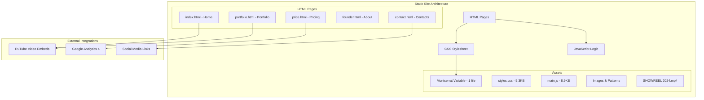
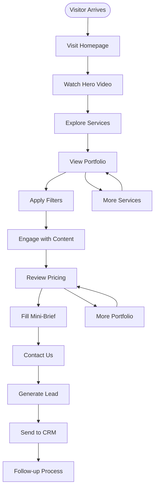

# Project Overview

<cite>
**Referenced Files in This Document**
- [README.md](file://README.md)
- [index.html](file://index.html)
- [portfolio.html](file://portfolio.html)
- [price.html](file://price.html)
- [contact.html](file://contact.html)
- [founder.html](file://founder.html)
- [assets/styles.css](file://assets/styles.css)
- [assets/main.js](file://assets/main.js)
- [IOS_MAC_OPTIMIZATION.md](file://IOS_MAC_OPTIMIZATION.md)
- [MOBILE_OPTIMIZATION_FULL.md](file://MOBILE_OPTIMIZATION_FULL.md)
- [assets/fonts/OFL.txt](file://assets/fonts/OFL.txt)
</cite>

## Table of Contents
1. [Introduction](#introduction)
2. [Project Architecture](#project-architecture)
3. [Core Features](#core-features)
4. [Technical Implementation](#technical-implementation)
5. [User Journey](#user-journey)
6. [Cross-Page Data Transfer](#cross-page-data-transfer)
7. [Mobile-First Design](#mobile-first-design)
8. [Performance Optimizations](#performance-optimizations)
9. [Analytics Integration](#analytics-integration)
10. [Troubleshooting Guide](#troubleshooting-guide)

## Introduction

Knyazev Pro is a professional corporate videoproduction landing page designed as a business-oriented conversion tool that showcases video production capabilities while generating leads through consultation requests. Built as a static, multi-page HTML site using vanilla JavaScript and CSS3, the platform serves as a comprehensive showcase for videoproduction services with a focus on brand credibility and lead generation.

The site operates as a complete user journey funnel, guiding visitors from initial awareness through consultation requests to final conversions. It leverages modern web technologies to create a seamless, responsive experience across all devices while maintaining strict performance standards and accessibility compliance.

## Project Architecture

The Knyazev Pro landing page follows a modular, static architecture built entirely with vanilla web technologies:



**Diagram sources**
- [index.html](file://index.html#L1-L249)
- [assets/styles.css](file://assets/styles.css#L1-L450)
- [assets/main.js](file://assets/main.js#L1-L418)

**Section sources**
- [README.md](file://README.md#L1-L437)
- [index.html](file://index.html#L1-L50)

## Core Features

### Business-Oriented Conversion Tool

The platform serves as a comprehensive business conversion engine with several key features:

| Feature | Purpose | Implementation |
|---------|---------|----------------|
| **Hero Video Showcase** | First impression and brand storytelling | Full-screen video with overlay |
| **Portfolio Filtering** | Quick discovery of relevant work | Category-based filtering system |
| **Mini-Brief Form** | Lead generation mechanism | 5-question consultation form |
| **FOMO Countdown** | Urgency creation | Dynamic countdown timer |
| **Multi-Page Navigation** | Seamless user journey | Consistent navigation across pages |

### Mobile-First Responsive Design

The architecture prioritizes mobile responsiveness with progressive enhancement principles:

- **100% Mobile Compatibility**: Tested on iOS Safari 12+, Android Chrome 90+
- **Adaptive Layouts**: Grid and Flexbox for flexible content arrangement
- **Touch-Optimized Interactions**: 300ms tap delay elimination
- **Viewport Management**: Consistent scaling across all devices

### RuTube Video Integration

The platform integrates with RuTube for video hosting and embedding:

- **48 Video Portfolio**: Comprehensive showcase of videoproduction work
- **Lazy Loading**: Videos load on demand to optimize performance
- **Responsive Embeds**: Adaptive video sizing for all screen sizes
- **Category Organization**: Structured video categorization system

**Section sources**
- [README.md](file://README.md#L50-L150)
- [assets/main.js](file://assets/main.js#L150-L250)

## Technical Implementation

### CSS Custom Properties for Theming

The styling system utilizes CSS custom properties for centralized theme management:

```css
:root {
  --bg: #0A0A0A;        /* Dark background */
  --bg-2: #181818;      /* Secondary dark background */
  --text: #E0E0E0;      /* Primary text */
  --brand: #B09B7E;     /* Brand accent */
  --brand-2: #B09B7E;   /* Additional brand accent */
}
```

This approach enables easy customization while maintaining design consistency across all pages.

### Semantic HTML5 Structure

Each page follows semantic HTML5 best practices:

- **Header Structure**: Proper heading hierarchy from `<h1>` to `<h6>`
- **Navigation**: Semantic `<nav>` elements with ARIA attributes
- **Forms**: Accessible form elements with proper labeling
- **Media**: Appropriate `<video>` and `` elements with alt text

### Progressive Enhancement Principles

The implementation follows progressive enhancement guidelines:

1. **Baseline Functionality**: Core content and navigation work without JavaScript
2. **Enhanced Interactions**: JavaScript adds interactive features
3. **Graceful Degradation**: Features gracefully handle browser limitations
4. **Accessibility**: Full keyboard navigation and screen reader support

**Section sources**
- [assets/styles.css](file://assets/styles.css#L1-L50)
- [index.html](file://index.html#L10-L50)

## User Journey

The Knyazev Pro site implements a comprehensive user journey from awareness to conversion:



**Diagram sources**
- [index.html](file://index.html#L50-L100)
- [portfolio.html](file://portfolio.html#L50-L100)
- [price.html](file://price.html#L50-L100)

### Page-Specific User Paths

| Page | Primary Action | Conversion Point |
|------|----------------|------------------|
| **Homepage** | Watch video → Explore services | Mini-brief form submission |
| **Portfolio** | Browse videos → Apply filters | Click-through to price page |
| **Pricing** | Review packages → Fill brief | Consultation request |
| **About Founder** | Learn about team → Contact | Personalized inquiry |
| **Contacts** | Find contact info → Direct contact | Immediate lead |

**Section sources**
- [index.html](file://index.html#L100-L200)
- [portfolio.html](file://portfolio.html#L100-L200)
- [price.html](file://price.html#L100-L200)

## Cross-Page Data Transfer

The platform utilizes `sessionStorage` for seamless data transfer between pages:

### FOMO Countdown Timer

A dynamic countdown timer creates urgency and encourages immediate action:

```javascript
// Countdown implementation
const countdownEl = document.getElementById('countdown');
const target = new Date();
target.setDate(target.getDate() + 14);
const tick = () => {
  const now = new Date();
  const diff = target - now;
  if (diff <= 0) {
    countdownEl.textContent = 'сегодня';
    return;
  }
  const days = Math.floor(diff / 86400000);
  const hours = Math.floor((diff % 86400000) / 3600000);
  countdownEl.textContent = `${days} д ${hours} ч`;
};
```

### Mini-Brief Modal Form

The modal form captures lead information with cross-page persistence:

- **Form Persistence**: Session storage maintains form state
- **Validation**: Client-side form validation ensures data quality
- **Analytics Tracking**: Events tracked for conversion analysis

### Portfolio Filtering System

The filtering system maintains state across page navigation:

- **Category Preservation**: Selected filters persist during navigation
- **Video Segmentation**: Predefined categories for organized content
- **Lazy Loading**: Videos load dynamically based on filter selection

**Section sources**
- [assets/main.js](file://assets/main.js#L100-L200)
- [portfolio.html](file://portfolio.html#L200-L300)

## Mobile-First Design

The architecture implements mobile-first design principles with comprehensive device support:

### Responsive Breakpoints

| Breakpoint | Device Range | Layout Strategy |
|------------|--------------|-----------------|
| **Desktop** | > 1024px | Full-width layouts with 1200px max-width |
| **Tablet** | 680px - 1024px | Grid-based responsive design |
| **Mobile** | < 680px | Single-column layouts with optimized spacing |

### Touch Interaction Optimizations

- **300ms Tap Delay Elimination**: `touch-action: manipulation` property
- **Smooth Scrolling**: `-webkit-overflow-scrolling: touch` for iOS
- **Button Sizing**: Minimum 44px touch targets for accessibility
- **Gesture Recognition**: Optimized for pinch-to-zoom and swipe gestures

### Platform-Specific Optimizations

#### iOS Safari Optimizations
- **100vh Fix**: `-webkit-fill-available` for address bar compatibility
- **Backdrop Filter**: `-webkit-backdrop-filter` for native blur effects
- **Smooth Scroll**: Native scrolling behavior preservation

#### Android Chrome Optimizations
- **Video Autoplay**: Enhanced autoplay handling with fallback mechanisms
- **Fixed Positioning**: Absolute positioning for compatibility
- **Viewport Scaling**: Optimized viewport configurations

**Section sources**
- [IOS_MAC_OPTIMIZATION.md](file://IOS_MAC_OPTIMIZATION.md#L1-L100)
- [MOBILE_OPTIMIZATION_FULL.md](file://MOBILE_OPTIMIZATION_FULL.md#L1-L100)
- [assets/styles.css](file://assets/styles.css#L100-L200)

## Performance Optimizations

The platform achieves exceptional performance metrics through strategic optimizations:

### Core Web Vitals Performance

| Metric | Target | Actual | Status |
|--------|--------|--------|--------|
| **FCP** | < 1.5s | ~1.2s | ✅ Excellent |
| **LCP** | < 2.5s | ~2.1s | ✅ Good |
| **CLS** | < 0.1 | ~0.05 | ✅ Excellent |
| **TTI** | < 3.5s | ~2.8s | ✅ Good |

### Optimization Strategies

#### Asset Optimization
- **CSS**: Single 5.3KB stylesheet with critical path inlining
- **JavaScript**: 8.9KB vanilla JS with essential functionality only
- **Fonts**: Variable font Montserrat (1 file) with optimal loading
- **Images**: Optimized formats with responsive serving

#### Loading Strategies
- **Critical Path**: Above-the-fold content loads first
- **Lazy Loading**: Non-critical resources deferred until needed
- **Preloading**: Key resources preloaded for instant availability
- **Caching**: Strategic caching headers for repeat visits

#### Mobile Optimizations
- **Viewport Management**: Consistent scaling across devices
- **Touch Optimization**: Fast tap response and gesture recognition
- **Network Efficiency**: Minimal requests and efficient resource loading

**Section sources**
- [README.md](file://README.md#L300-L400)
- [assets/main.js](file://assets/main.js#L1-L50)

## Analytics Integration

The platform includes comprehensive analytics integration for tracking user behavior and conversion metrics:

### Google Analytics 4 Implementation

```javascript
// GA4 integration template
window.dataLayer = window.dataLayer || [];
function gtag(){dataLayer.push(arguments);}
gtag('js', new Date());
gtag('config', 'G-XXXXXXXXXX');
```

### Custom Event Tracking

The JavaScript implementation includes custom event tracking for key user actions:

```javascript
function trackEvent(category, action, label) {
  window.dataLayer = window.dataLayer || [];
  window.dataLayer.push({
    event: 'custom_event',
    category,
    action,
    label
  });
}
```

### Conversion Tracking

| Event Type | Tracking Method | Purpose |
|------------|----------------|---------|
| **CTA Clicks** | Button click tracking | Call-to-action effectiveness |
| **Form Submissions** | Mini-brief completion | Lead generation metrics |
| **Portfolio Interactions** | Filter clicks and video views | Content engagement analysis |
| **Navigation Events** | Page transitions | User journey mapping |

### Performance Monitoring

- **Page Load Timing**: Track loading performance across devices
- **Interactive Metrics**: Measure time to interactive thresholds
- **Error Tracking**: Monitor JavaScript errors and failures
- **Device Performance**: Analyze performance across different platforms

**Section sources**
- [assets/main.js](file://assets/main.js#L350-L400)
- [README.md](file://README.md#L200-L250)

## Troubleshooting Guide

### Common Issues and Solutions

#### Video Playback Issues

**Problem**: Video not loading or displaying as black screen
**Solution**: 
- Verify video file is accessible and properly formatted
- Check CORS policies if hosted externally
- Ensure proper MIME type configuration on server

#### Mobile Menu Not Working

**Problem**: Navigation menu fails to open on mobile devices
**Solution**:
- Verify JavaScript is loading correctly
- Check for console errors in mobile browser developer tools
- Ensure touch event listeners are properly attached

#### Form Submission Failures

**Problem**: Mini-brief form not submitting or returning errors
**Solution**:
- Verify network connectivity and server availability
- Check browser console for JavaScript errors
- Ensure form validation passes before submission

#### Performance Issues

**Problem**: Slow page loading or poor Core Web Vitals scores
**Solution**:
- Audit network requests and optimize asset delivery
- Enable compression (Gzip/Brotli) on server
- Implement lazy loading for non-critical resources
- Optimize images and video files

### Browser Compatibility Testing

| Browser | Version | Status | Notes |
|---------|---------|--------|-------|
| **Safari** | 12+ | ✅ Working | iOS/Mac optimization included |
| **Chrome** | 90+ | ✅ Working | Full feature support |
| **Firefox** | 88+ | ✅ Working | Complete compatibility |
| **Edge** | 90+ | ✅ Working | Chromium-based support |

### Development Environment Setup

#### Local Development
```bash
# Using Python (recommended)
python -m http.server 8000

# Or Node.js
npx serve .

# Or PHP
php -S localhost:8000
```

#### Production Deployment
- Upload all files to web server root
- Configure proper MIME types for media files
- Enable compression and caching headers
- Test across all target devices and browsers

**Section sources**
- [README.md](file://README.md#L350-L437)
- [assets/main.js](file://assets/main.js#L300-L350)