# Desktop Layout Architecture

<cite>
**Referenced Files in This Document**
- [assets/styles.css](file://assets/styles.css)
- [index.html](file://index.html)
- [assets/main.js](file://assets/main.js)
- [README.md](file://README.md)
- [MOBILE_OPTIMIZATION_FULL.md](file://MOBILE_OPTIMIZATION_FULL.md)
</cite>

## Table of Contents
1. [Introduction](#introduction)
2. [Grid System Foundation](#grid-system-foundation)
3. [Container-Based Layout Architecture](#container-based-layout-architecture)
4. [Typography Hierarchy](#typography-hierarchy)
5. [Interactive Elements](#interactive-elements)
6. [Navigation and Header Design](#navigation-and-header-design)
7. [Background and Visual Treatment](#background-and-visual-treatment)
8. [Responsive Breakpoints](#responsive-breakpoints)
9. [Performance Optimizations](#performance-optimizations)
10. [Implementation Examples](#implementation-examples)

## Introduction

The desktop layout architecture of Knyazev Pro follows a sophisticated CSS Grid-based system designed specifically for video production studio websites. This architecture emphasizes professional presentation, optimal content density, and seamless user interaction across desktop resolutions. The design system combines modern CSS Grid patterns with thoughtful typography hierarchy and interactive elements that enhance the user experience while maintaining brand consistency.

## Grid System Foundation

### Four-Column Services Grid

The foundation of the desktop experience centers around the four-column services grid, implemented using CSS Grid with `grid-template-columns: repeat(4,1fr)` for optimal content distribution.

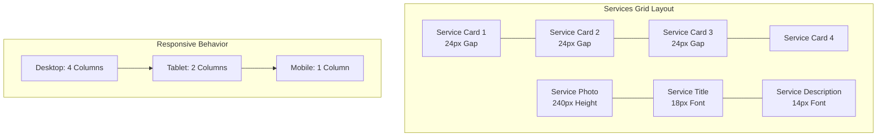

**Diagram sources**
- [assets/styles.css](file://assets/styles.css#L108-L112)

The services grid provides a balanced presentation of creative services with consistent spacing and visual hierarchy. Each service card maintains a standardized structure with photo, title, and description elements, ensuring predictable content consumption patterns.

**Section sources**
- [assets/styles.css](file://assets/styles.css#L108-L112)

### Three-Column Case List

The case list utilizes a three-column grid arrangement optimized for showcasing portfolio items with minimal spacing between elements.

```mermaid
graph TB
subgraph "Case List Grid"
A[Case Item 1<br/>2px Gap] --- B[Case Item 2<br/>2px Gap]
B --- C[Case Item 3]
D[Case Video<br/>200px Height] --- E[Case Content<br/>Hidden by Default]
end
subgraph "Layout Features"
F[Width: calc(100% + 48px)<br/>Negative Margin Compensation] --- G[Padding: 24px<br/>Box Sizing: Border Box]
G --- H[Overflow: Hidden<br/>Clean Container Edge]
end
```

**Diagram sources**
- [assets/styles.css](file://assets/styles.css#L146-L152)

The case list employs a clever width calculation technique using `width: calc(100% + 48px)` combined with negative margins to create seamless grid alignment while maintaining proper container boundaries.

**Section sources**
- [assets/styles.css](file://assets/styles.css#L146-L152)

### Four-Column Directors Grid

The directors grid mirrors the services grid structure but with specialized styling for team member presentation.

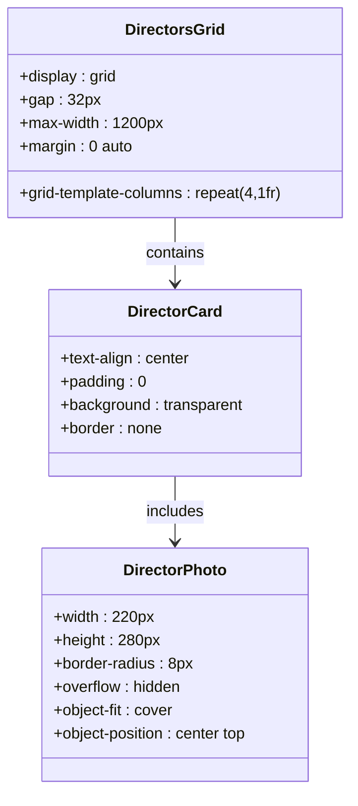

**Diagram sources**
- [assets/styles.css](file://assets/styles.css#L127-L135)

**Section sources**
- [assets/styles.css](file://assets/styles.css#L127-L135)

## Container-Based Layout Architecture

### Max-Width Container System

The layout architecture centers around a 1200px max-width container with 24px padding, creating a balanced content area that works optimally across desktop displays.

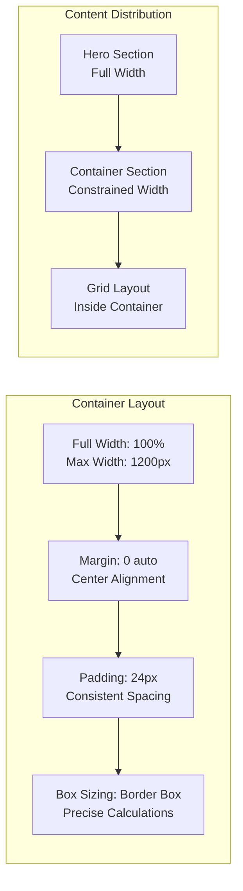

**Diagram sources**
- [assets/styles.css](file://assets/styles.css#L34-L34)

The container system ensures consistent spacing and prevents content from becoming too wide on ultra-wide displays while maintaining readability and focus.

**Section sources**
- [assets/styles.css](file://assets/styles.css#L34-L34)

### Two-Column Section Layout

Critical sections utilize a two-column grid layout with equal fractional units and 48px gap for balanced content presentation.

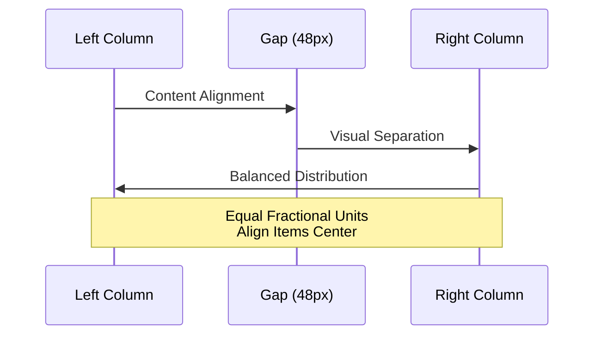

**Diagram sources**
- [assets/styles.css](file://assets/styles.css#L102-L102)

This layout pattern is particularly effective for showcasing services, team members, and consultation forms, providing clear visual separation while maintaining content balance.

**Section sources**
- [assets/styles.css](file://assets/styles.css#L102-L102)

## Typography Hierarchy

### Desktop-Specific Typography

The typography system is optimized for larger screens with carefully calibrated font sizes and weights that create a professional visual hierarchy.

| Element Type | Font Size | Weight | Line Height | Purpose |
|--------------|-----------|--------|-------------|---------|
| Section Titles | 48px | 800 | 1.2 | Major section headings |
| Hero Headings | 48px | 800 | 1.2 | Primary hero content |
| Body Text | 18px | 400 | 1.5 | General paragraph content |
| Service Titles | 18px | 700 | 1.2 | Service card headings |
| Service Descriptions | 14px | 400 | 1.4 | Supporting service text |

**Section sources**
- [assets/styles.css](file://assets/styles.css#L24-L52)

### Letter Spacing and Kerning

The typography system incorporates subtle letter spacing adjustments for improved readability on desktop displays:

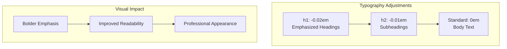

**Diagram sources**
- [assets/styles.css](file://assets/styles.css#L24-L28)

## Interactive Elements

### Hover Effects and Transitions

The desktop interface features sophisticated hover effects that enhance user interaction without overwhelming the visual design.

```mermaid
stateDiagram-v2
[*] --> Resting
Resting --> Hover : Mouse Enter
Hover --> Active : Click/Touch
Active --> Hover : Release
Hover --> Resting : Mouse Leave
note right of Hover : transform : translateY(-1px)<br/>Button Lift Effect
note left of Active : Background Change<br/>Border Highlight
```

**Diagram sources**
- [assets/styles.css](file://assets/styles.css#L68-L68)

The primary hover effect applies a subtle lift transformation to buttons, creating a tactile feedback response that enhances the interactive experience.

**Section sources**
- [assets/styles.css](file://assets/styles.css#L68-L68)

### Service Card Interactions

Service cards feature enhanced hover effects with background transitions and border animations that highlight selected services during portfolio browsing.

```mermaid
flowchart TD
A[Mouse Hover] --> B{Is Service Card?}
B --> |Yes| C[Apply Transform<br/>translateY(-1px)]
B --> |No| D[Standard Hover]
C --> E[Enhanced Visual Feedback]
E --> F[Brand Color Transition]
F --> G[Subtle Shadow Increase]
D --> H[Opacity Change]
H --> I[Color Shift]
```

**Diagram sources**
- [assets/styles.css](file://assets/styles.css#L108-L112)

**Section sources**
- [assets/styles.css](file://assets/styles.css#L108-L112)

### Filter Button Interactions

Filter buttons utilize a sophisticated hover animation with both visual and functional feedback.

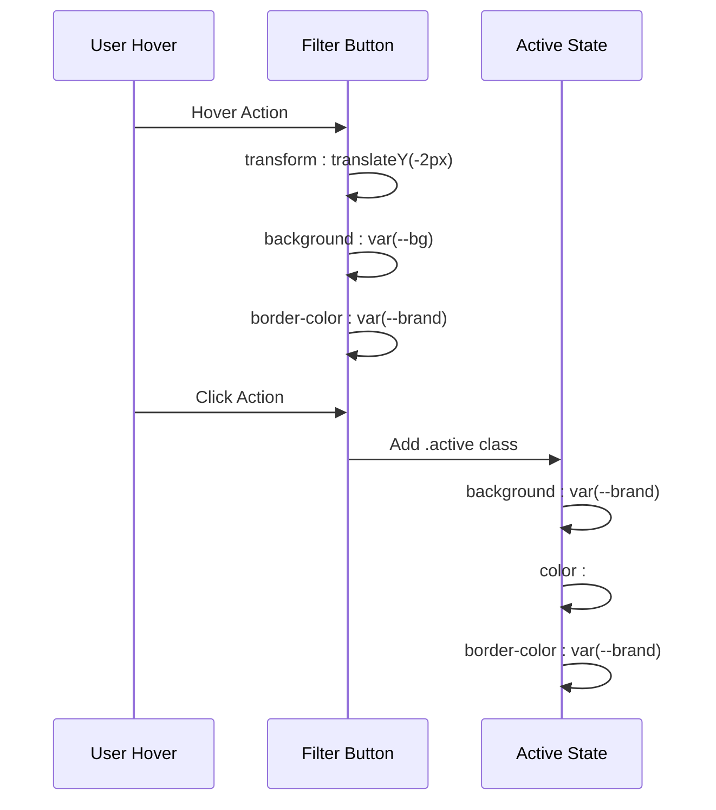

**Diagram sources**
- [assets/styles.css](file://assets/styles.css#L142-L144)

**Section sources**
- [assets/styles.css](file://assets/styles.css#L142-L144)

## Navigation and Header Design

### Fixed Corner Logo Behavior

The fixed corner logo creates a sophisticated branding element that becomes more prominent on hover, providing subtle visual interest without distracting from content.

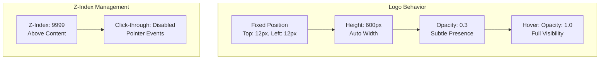

**Diagram sources**
- [assets/styles.css](file://assets/styles.css#L281-L283)

**Section sources**
- [assets/styles.css](file://assets/styles.css#L281-L283)

### Desktop Navigation Styling

The desktop navigation features inline-flex contact-nav with pipe-separated list items for clean, professional presentation.

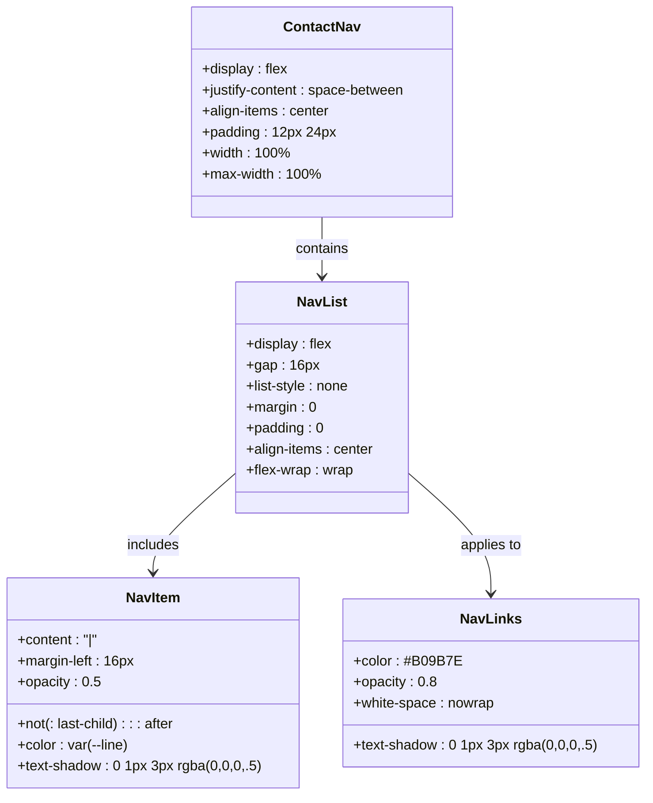

**Diagram sources**
- [assets/styles.css](file://assets/styles.css#L301-L305)

**Section sources**
- [assets/styles.css](file://assets/styles.css#L301-L305)

### Hero Navigation Enhancement

The hero navigation system provides a sophisticated backdrop blur effect with enhanced text rendering for optimal readability against dynamic backgrounds.

```mermaid
flowchart LR
A[Hero Video Background] --> B[Backdrop Filter Blur]
B --> C[RGBA Overlay]
C --> D[Text Shadow Enhancement]
D --> E[Brand Color Highlight]
E --> F[Hover State Animation]
subgraph "Technical Implementation"
G[backdrop-filter: blur(10px)]
H[backdrop-filter: blur(20px) on Mobile]
I[Text Shadow: 0 1px 3px rgba]
end
```

**Diagram sources**
- [assets/styles.css](file://assets/styles.css#L311-L313)

**Section sources**
- [assets/styles.css](file://assets/styles.css#L311-L313)

## Background and Visual Treatment

### Full Cover Background Image

The background image treatment utilizes full cover sizing with gradient overlays for optimal visual impact and content readability.

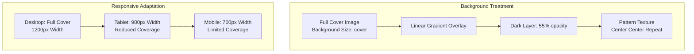

**Diagram sources**
- [assets/styles.css](file://assets/styles.css#L82-L92)

The background system adapts responsively, reducing coverage on smaller screens while maintaining visual impact and content legibility.

**Section sources**
- [assets/styles.css](file://assets/styles.css#L82-L92)

### Section Background Patterns

Each section features a sophisticated background pattern system combining solid colors with texture overlays for depth and visual interest.

| Section Type | Background Color | Pattern Overlay | Pattern Source |
|--------------|------------------|-----------------|----------------|
| Section Light | White (#FFFFFF) | Beige Pattern | Logo Pattern Raster |
| Section Dark | Dark Gray (#0A0A0A) | Black Pattern | Logo Pattern Raster |
| Gradient Blend | Semi-transparent | Full Coverage | Linear Gradient |

**Section sources**
- [assets/styles.css](file://assets/styles.css#L74-L82)

## Responsive Breakpoints

### Desktop-First Design Approach

The layout architecture follows a desktop-first approach with progressive enhancement for tablet and mobile devices.

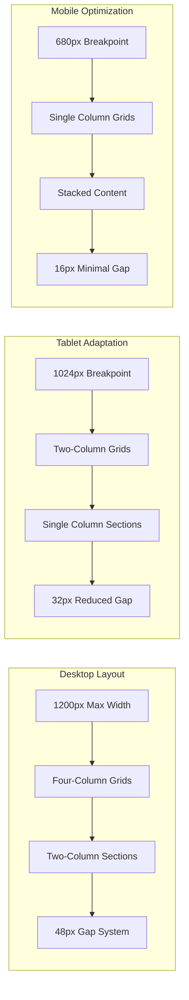

**Diagram sources**
- [assets/styles.css](file://assets/styles.css#L181-L263)

**Section sources**
- [assets/styles.css](file://assets/styles.css#L181-L263)

### Adaptive Grid Systems

The adaptive grid system ensures optimal content distribution across all device categories while maintaining design integrity.

| Device Category | Grid Columns | Gap Size | Container Width |
|-----------------|--------------|----------|-----------------|
| Desktop (>1024px) | 4 columns | 24px | 1200px max |
| Tablet (1024px) | 2 columns | 32px | 1200px max |
| Mobile (<680px) | 1 column | 16px | 100% width |

## Performance Optimizations

### Efficient Grid Implementation

The grid system leverages CSS Grid's native performance characteristics while minimizing layout thrashing through strategic use of fractional units and consistent spacing.

```mermaid
flowchart TD
A[CSS Grid Layout] --> B[Hardware Acceleration]
B --> C[Smooth Transitions]
C --> D[Minimal Reflows]
E[Fractional Units<br/>1fr, repeat()] --> F[Predictable Layout]
F --> G[Optimized Rendering]
H[Container Constraints<br/>1200px Max Width] --> I[Reduced Paint Area]
I --> J[Improved Performance]
```

**Diagram sources**
- [assets/styles.css](file://assets/styles.css#L102-L170)

### Memory-Efficient Background Patterns

The background pattern system uses efficient CSS gradients and background images that minimize memory usage while maintaining visual quality.

**Section sources**
- [assets/styles.css](file://assets/styles.css#L74-L92)

## Implementation Examples

### Complete Desktop Layout Example

The following demonstrates how the various layout components integrate to create a cohesive desktop experience:

```mermaid
graph TB
subgraph "Hero Section"
A[Full Width Hero Video] --> B[Overlay Gradient]
B --> C[Container-Constrained Content]
C --> D[48px Bottom Padding]
end
subgraph "Services Section"
E[Container 1200px] --> F[48px Section Padding]
F --> G[4-Column Grid]
G --> H[Service Cards]
end
subgraph "Two-Column Section"
I[Container 1200px] --> J[48px Section Padding]
J --> K[2-Column Grid]
K --> L[Content Left]
K --> M[Image Right]
end
subgraph "Portfolio Section"
N[Container 1200px] --> O[48px Section Padding]
O --> P[Filter Buttons 4-Column]
P --> Q[Case List 3-Column]
end
```

**Diagram sources**
- [index.html](file://index.html#L30-L120)
- [assets/styles.css](file://assets/styles.css#L34-L170)

### Interactive Element Integration

The interactive elements work seamlessly with the layout system to provide enhanced user experience:

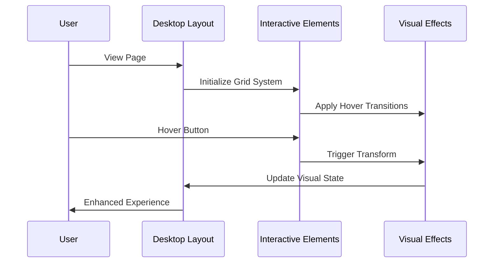

**Diagram sources**
- [assets/main.js](file://assets/main.js#L15-L45)
- [assets/styles.css](file://assets/styles.css#L68-L144)

**Section sources**
- [index.html](file://index.html#L30-L120)
- [assets/styles.css](file://assets/styles.css#L34-L170)
- [assets/main.js](file://assets/main.js#L15-L45)

The desktop layout architecture represents a sophisticated approach to video production studio website design, combining modern CSS Grid patterns with thoughtful typography, interactive elements, and performance optimizations. This system provides a professional foundation that scales effectively across different screen sizes while maintaining design integrity and user experience excellence.