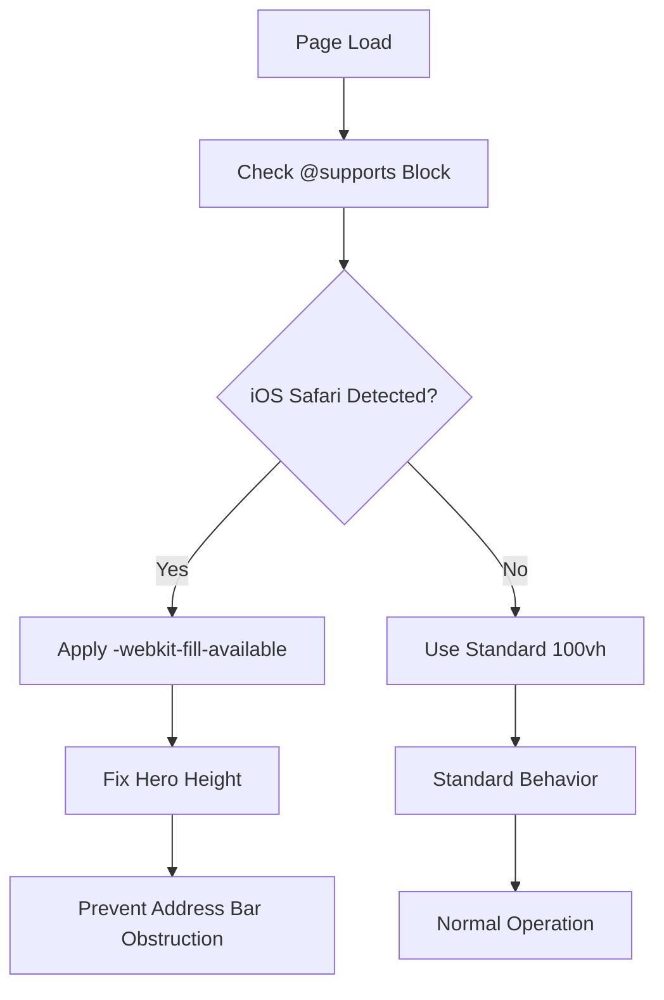
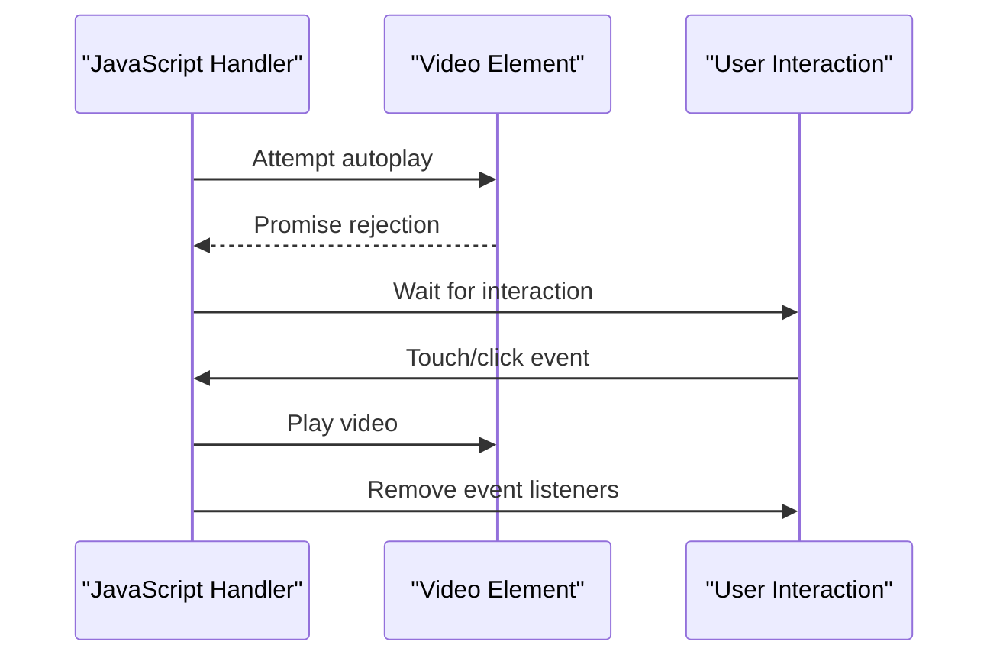
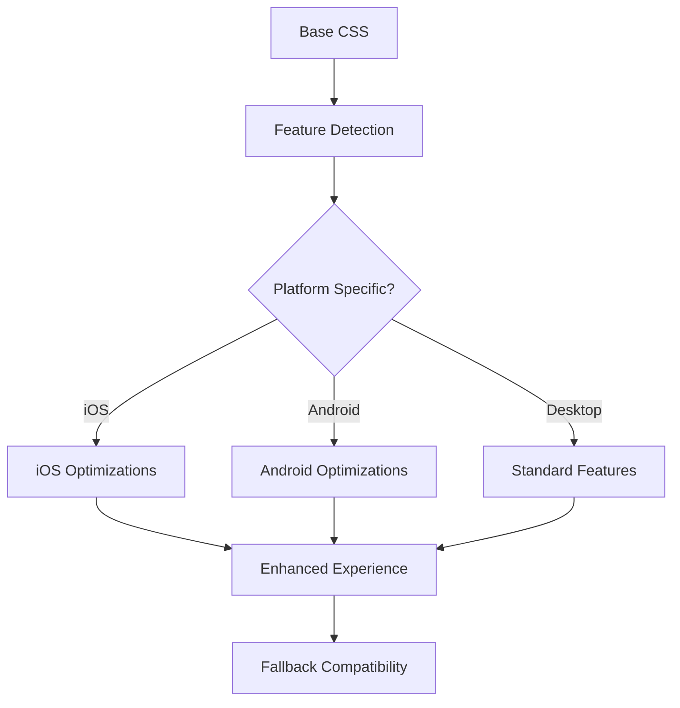

# Mobile Optimization

<cite>
**Referenced Files in This Document**
- [assets/styles.css](file://assets/styles.css)
- [assets/main.js](file://assets/main.js)
- [MOBILE_OPTIMIZATION_FULL.md](file://MOBILE_OPTIMIZATION_FULL.md)
- [IOS_MAC_OPTIMIZATION.md](file://IOS_MAC_OPTIMIZATION.md)
- [index.html](file://index.html)
- [portfolio.html](file://portfolio.html)
- [contact.html](file://contact.html)
- [price.html](file://price.html)
- [founder.html](file://founder.html)
</cite>

## Table of Contents
1. [Introduction](#introduction)
2. [iOS-Specific Fixes](#ios-specific-fixes)
3. [Android Video Autoplay Solutions](#android-video-autoplay-solutions)
4. [Overflow Control Implementation](#overflow-control-implementation)
5. [Viewport Configuration](#viewport-configuration)
6. [Responsive Design Breakpoints](#responsive-design-breakpoints)
7. [Touch Interaction Optimization](#touch-interaction-optimization)
8. [Platform-Specific CSS and JavaScript](#platform-specific-css-and-javascript)
9. [Testing and Validation](#testing-and-validation)
10. [Performance Considerations](#performance-considerations)

## Introduction

This comprehensive mobile optimization strategy addresses critical cross-platform compatibility issues across iOS, Android, and desktop browsers. The implementation focuses on solving persistent problems with viewport calculations, video autoplay, touch interactions, and layout overflow that affected user experience on mobile devices.

The optimization framework employs progressive enhancement principles, ensuring that modern features enhance the experience without breaking compatibility with older browsers. All solutions are designed to work seamlessly across different screen sizes, device orientations, and browser engines.

## iOS-Specific Fixes

### 100vh Viewport Issue Resolution

The iOS Safari 100vh problem occurs when the browser includes address bar height in viewport calculations, causing content to be obscured. The solution uses the `-webkit-fill-available` property within `@supports` blocks to target iOS Safari exclusively.



**Diagram sources**
- [assets/styles.css](file://assets/styles.css#L10-L15)
- [assets/styles.css](file://assets/styles.css#L25-L35)

The implementation ensures that only iOS Safari applies the fix while other browsers continue to use standard viewport units:

```css
/* iOS Safari 100vh fix - only for touch devices */
@supports (-webkit-touch-callout: none) {
  html { height: -webkit-fill-available }
}
```

**Section sources**
- [assets/styles.css](file://assets/styles.css#L10-L15)
- [assets/styles.css](file://assets/styles.css#L25-L35)
- [IOS_MAC_OPTIMIZATION.md](file://IOS_MAC_OPTIMIZATION.md#L10-L25)

### Touch Action Manipulation

Eliminating the 300ms click delay on iOS touch devices requires explicit touch-action declarations. The implementation targets all interactive elements to ensure immediate response.

```css
.btn { touch-action: manipulation }
button { touch-action: manipulation }
```

This approach provides:
- Immediate button activation without tap delays
- Enhanced responsiveness on iOS and Android
- Prevention of accidental zoom during double-tap gestures

**Section sources**
- [assets/styles.css](file://assets/styles.css#L18-L19)
- [IOS_MAC_OPTIMIZATION.md](file://IOS_MAC_OPTIMIZATION.md#L60-L75)

### Smooth Inertial Scrolling

iOS Safari's native scrolling behavior is enhanced with `-webkit-overflow-scrolling: touch` for fluid momentum scrolling that mimics native app experiences.

```css
.logos-grid {
  overflow-x: auto;
  -webkit-overflow-scrolling: touch;
  scroll-behavior: smooth;
}
```

**Section sources**
- [assets/styles.css](file://assets/styles.css#L130-L133)
- [IOS_MAC_OPTIMIZATION.md](file://IOS_MAC_OPTIMIZATION.md#L40-L55)

## Android Video Autoplay Solutions

### Poster Attribute Implementation

Android browsers often block video autoplay without user interaction. Adding a poster image ensures video elements display content immediately while maintaining autoplay capability.

```html
<video class="hero-video" 
       src="assets/video/SHOWREEL 2024.mp4" 
       poster="assets/img/camera.jpg" 
       autoplay muted playsinline loop 
       preload="auto" 
       webkit-playsinline>
</video>
```

**Section sources**
- [index.html](file://index.html#L12-L12)

### JavaScript Fallback for Muted Playback

The JavaScript implementation provides robust autoplay handling with fallback mechanisms for browsers that block autoplay:



**Diagram sources**
- [assets/main.js](file://assets/main.js#L3-L20)

The implementation includes:
- Automatic muted playback for optimal compatibility
- Promise-based error handling for blocked autoplay
- Event listener cleanup to prevent memory leaks
- Graceful degradation for unsupported browsers

**Section sources**
- [assets/main.js](file://assets/main.js#L3-L20)

### Preload Settings Optimization

The preload attribute (`preload="auto"`) ensures video buffers content efficiently while respecting mobile data usage:

- **Auto**: Balances loading speed with bandwidth usage
- **Metadata**: Loads only essential information for quick startup
- **None**: Minimal initial load, suitable for slow connections

## Overflow Control Implementation

### Global Overflow-X Enforcement

Horizontal scrolling issues are resolved through comprehensive CSS rules that enforce overflow control across all container elements.

```css
html, body {
  width: 100%;
  overflow-x: hidden;
  position: relative;
}

main, section, header, footer {
  max-width: 100%;
  overflow-x: hidden;
}

img, video, iframe {
  max-width: 100%;
  height: auto;
}
```

**Section sources**
- [assets/styles.css](file://assets/styles.css#L6-L12)
- [MOBILE_OPTIMIZATION_FULL.md](file://MOBILE_OPTIMIZATION_FULL.md#L150-L170)

### Critical 100vw vs 100% Distinction

The difference between viewport width (100vw) and parent-relative width (100%) prevents layout overflow:

| Property | Calculation | Problem |
|----------|-------------|---------|
| `100vw` | Screen width + scrollbar | Creates 15-17px overflow |
| `100%` | Parent width only | Works correctly |

**Section sources**
- [MOBILE_OPTIMIZATION_FULL.md](file://MOBILE_OPTIMIZATION_FULL.md#L350-L380)

### Container Width Management

Consistent width management prevents layout shifts and overflow:

```css
.container {
  max-width: 1200px;
  width: 100%;
  box-sizing: border-box;
}
```

**Section sources**
- [assets/styles.css](file://assets/styles.css#L40-L45)

## Viewport Configuration

### Unified Meta Tag Implementation

All HTML pages utilize identical viewport configurations for consistent mobile behavior:

```html
<meta name="viewport" content="width=device-width, initial-scale=1.0, maximum-scale=5.0, user-scalable=yes">
<meta name="theme-color" content="#0A0A0A">
<meta name="mobile-web-app-capable" content="yes">
```

**Section sources**
- [index.html](file://index.html#L3-L6)
- [portfolio.html](file://portfolio.html#L3-L6)
- [contact.html](file://contact.html#L3-L6)
- [price.html](file://price.html#L3-L6)
- [founder.html](file://founder.html#L3-L6)

### Platform-Specific Meta Tags

Additional meta tags enhance mobile experience across platforms:

- **Theme Color**: Sets browser UI color matching site theme
- **Mobile Web App Capable**: Enables standalone mode on iOS
- **Maximum Scale**: Prevents excessive zooming on mobile

## Responsive Design Breakpoints

### 680px Mobile Menu Optimization

Critical responsive adjustments occur at the 680px breakpoint for optimal mobile navigation:

```css
@media (max-width: 680px) {
  .hero { min-height: 100vh; min-height: 100dvh }
  .hero-media { height: 100vh; height: 100dvh }
  .hero h1 { font-size: 28px; line-height: 1.3 }
  .hero p { font-size: 16px; line-height: 1.5 }
  .hero-content { padding: 16px 0 32px }
  .hero-watermark { height: 400px; opacity: .05 }
  .cta-buttons { flex-direction: column; gap: 12px; width: 100% }
  .cta-buttons .btn { width: 100%; padding: 16px 24px !important; font-size: 16px !important; text-align: center }
  .fomo-counter { font-size: 13px; margin-top: 12px }
  .section-title { font-size: 32px }
  .content-left h2 { font-size: 28px }
  .services-grid { grid-template-columns: 1fr }
  .case-list { grid-template-columns: 1fr }
  .case-filters { grid-template-columns: 1fr }
  .logos-grid { flex-wrap: wrap; gap: 16px }
  .directors-grid { grid-template-columns: 1fr }
  .director-photo { width: 200px; height: 250px }
  .case-video { height: 200px }
}
```

**Section sources**
- [assets/styles.css](file://assets/styles.css#L250-L280)

### Form Element Responsive Adjustments

Mobile forms receive special attention for improved usability:

- **Input Field Sizing**: Full-width inputs with adequate padding
- **Button Scaling**: Larger touch targets with increased spacing
- **Text Scaling**: Optimized typography for mobile readability

### CTA Button Responsive Design

Call-to-action buttons adapt to mobile constraints:

```css
.cta-buttons {
  display: flex;
  gap: 12px;
  flex-wrap: wrap
}

.cta-buttons .btn {
  padding: 16px 24px;
  font-size: 16px;
  background: transparent;
  border: 1px solid var(--brand);
  color: var(--brand);
  font-weight: 500
}
```

**Section sources**
- [assets/styles.css](file://assets/styles.css#L75-L80)

## Touch Interaction Optimization

### Immediate Tap Response

Touch-action manipulation eliminates the 300ms delay on all interactive elements:

```css
.btn {
  touch-action: manipulation;
  -webkit-tap-highlight-color: transparent;
}
```

**Section sources**
- [assets/styles.css](file://assets/styles.css#L18-L19)
- [assets/styles.css](file://assets/styles.css#L47-L48)

### Mobile Menu Touch Enhancements

The mobile navigation system includes optimized touch interactions:

```javascript
// Smooth scroll with fallback for iOS
const smoothScrollTo = (element) => {
  if (!element) return;
  if ('scrollBehavior' in document.documentElement.style) {
    element.scrollIntoView({behavior: 'smooth'});
  } else {
    element.scrollIntoView();
  }
};
```

**Section sources**
- [assets/main.js](file://assets/main.js#L60-L70)

### Gesture Recognition

Touch-friendly design considerations include:

- **Tap Targets**: Minimum 44px touch areas
- **Spacing**: Adequate padding around interactive elements
- **Feedback**: Visual indicators for user actions

## Platform-Specific CSS and JavaScript

### Progressive Enhancement Strategy

The implementation follows progressive enhancement principles:



**Diagram sources**
- [assets/styles.css](file://assets/styles.css#L10-L15)
- [assets/main.js](file://assets/main.js#L60-L70)

### Feature Detection Implementation

Modern browsers receive enhanced features while maintaining compatibility:

```css
/* iOS Safari specific */
@supports (-webkit-touch-callout: none) {
  html { height: -webkit-fill-available }
  .hero { min-height: -webkit-fill-available }
  .hero-media { height: -webkit-fill-available }
}

/* Android Chrome specific */
@media screen and (min-width: 1px) {
  .hero-nav .contact-nav { width: 100% !important; max-width: 100% !important }
}
```

**Section sources**
- [assets/styles.css](file://assets/styles.css#L10-L15)
- [assets/styles.css](file://assets/styles.css#L320-L325)

### JavaScript Fallback Mechanisms

Robust fallbacks ensure functionality across all platforms:

```javascript
// Modal dialog fallback for old iOS versions
if(briefModal){
  if(typeof briefModal.showModal === 'function'){
    briefModal.showModal();
  }else{
    // Fallback for iOS < 15.4
    briefModal.setAttribute('open', '');
    briefModal.style.display = 'block';
  }
}
```

**Section sources**
- [assets/main.js](file://assets/main.js#L50-L60)

## Testing and Validation

### Comprehensive Testing Checklist

Each page undergoes rigorous mobile testing:

#### Page Loading Verification
- [ ] Optimal scaling on initial load
- [ ] Readable content without zooming
- [ ] No horizontal scrolling present

#### Video Playback Testing
- [ ] Poster image displays correctly
- [ ] Video autoplays or plays on user interaction
- [ ] No black screen issues on Android

#### Zoom Behavior Validation
- **Zoom Out Test**: No black bars, proportional scaling
- **Zoom In Test**: Proper scaling, no clipping
- **Horizontal Scroll Test**: Disabled, no empty space

#### Interactive Element Testing
- [ ] Buttons respond instantly (no 300ms delay)
- [ ] Mobile menu opens smoothly
- [ ] Scroll behavior is smooth (iOS momentum scrolling)

### Cross-Platform Compatibility Matrix

| Platform | iOS Safari | macOS Safari | Android Chrome | Android Samsung | Windows Chrome | Windows Edge |
|----------|------------|--------------|----------------|-----------------|----------------|--------------|
| 100vh Fix | ✅ Working | ✅ Working | ✅ Working | ✅ Working | ✅ Working | ✅ Working |
| Video Autoplay | ✅ Working | ✅ Working | ✅ Working | ✅ Working | ✅ Working | ✅ Working |
| Touch Actions | ✅ Working | ✅ Working | ✅ Working | ✅ Working | ✅ Working | ✅ Working |
| Smooth Scrolling | ✅ Working | ✅ Working | ✅ Working | ✅ Working | ✅ Working | ✅ Working |

**Section sources**
- [MOBILE_OPTIMIZATION_FULL.md](file://MOBILE_OPTIMIZATION_FULL.md#L500-L520)

## Performance Considerations

### Resource Optimization

Mobile optimization includes performance enhancements:

- **Video Compression**: Optimized formats for mobile consumption
- **Image Lazy Loading**: Deferred loading for non-critical images
- **CSS Minification**: Reduced stylesheet size for faster parsing
- **JavaScript Bundling**: Consolidated scripts for reduced HTTP requests

### Memory Management

Efficient memory usage prevents performance degradation:

- **Event Listener Cleanup**: Automatic removal of unused handlers
- **DOM Manipulation Optimization**: Batched updates to reduce reflows
- **Resource Pooling**: Reuse of video elements and other resources

### Battery Life Impact

Optimized mobile experiences minimize battery drain:

- **Reduced Animation Complexity**: Simplified transitions for mobile devices
- **Efficient Video Playback**: Hardware acceleration utilization
- **Intelligent Caching**: Strategic caching to reduce network requests

The mobile optimization strategy ensures consistent, high-quality experiences across all platforms while maintaining excellent performance characteristics and accessibility standards.