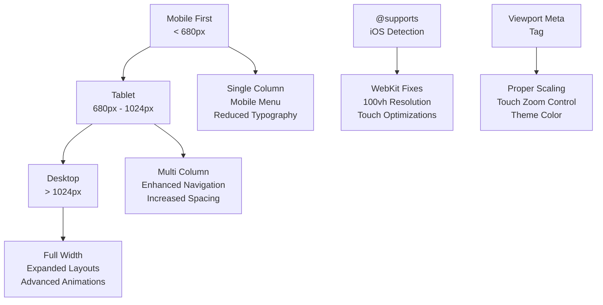
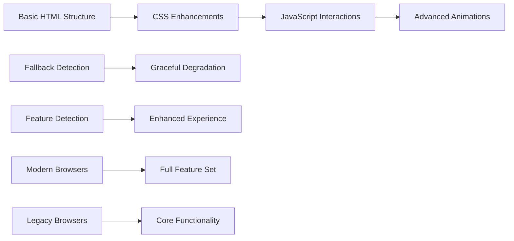
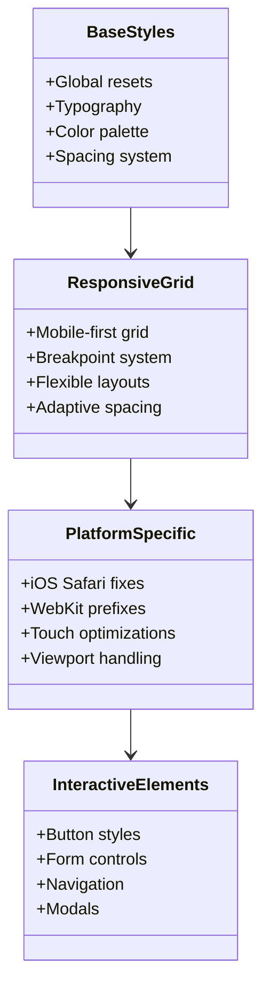

# Responsive Design

<cite>
**Referenced Files in This Document**
- [assets/styles.css](file://assets/styles.css)
- [MOBILE_OPTIMIZATION_FULL.md](file://MOBILE_OPTIMIZATION_FULL.md)
- [IOS_MAC_OPTIMIZATION.md](file://IOS_MAC_OPTIMIZATION.md)
- [README.md](file://README.md)
- [index.html](file://index.html)
- [portfolio.html](file://portfolio.html)
- [assets/main.js](file://assets/main.js)
</cite>

## Table of Contents
1. [Introduction](#introduction)
2. [Mobile-First Design Philosophy](#mobile-first-design-philosophy)
3. [Breakpoint Strategy](#breakpoint-strategy)
4. [Platform-Specific Optimizations](#platform-specific-optimizations)
5. [Cross-Platform Compatibility](#cross-platform-compatibility)
6. [Testing Methodology](#testing-methodology)
7. [Performance Considerations](#performance-considerations)
8. [Implementation Details](#implementation-details)
9. [Known Issues and Solutions](#known-issues-and-solutions)
10. [Best Practices](#best-practices)

## Introduction

The Knyazev Pro landing site implements a comprehensive responsive design strategy that ensures optimal user experience across all devices and platforms. Built on a mobile-first approach, the design adapts seamlessly from smartphones to tablets and desktop computers while maintaining exceptional performance and visual quality.

The responsive strategy encompasses sophisticated CSS media queries, platform-specific optimizations for iOS and macOS, comprehensive browser testing, and advanced performance optimizations including lazy loading and optimized asset delivery.

## Mobile-First Design Philosophy

The design follows a mobile-first philosophy where base styles are written for mobile devices, with progressively enhanced styles for larger screens. This approach ensures that the core functionality works perfectly on mobile devices while adding enhancements for larger displays.

### Core Principles

- **Progressive Enhancement**: Features are built to work on basic browsers and enhanced for modern ones
- **Performance First**: Mobile-optimized assets and efficient rendering
- **Accessibility**: Full keyboard navigation and screen reader support
- **Touch-Friendly**: Proper spacing and interactive element sizing

**Section sources**
- [assets/styles.css](file://assets/styles.css#L1-L50)
- [README.md](file://README.md#L1-L100)

## Breakpoint Strategy

The responsive design employs three primary breakpoints strategically placed to handle different device categories and screen sizes.

### Breakpoint Specifications

| Breakpoint | Width Range | Target Devices | Key Changes |
|------------|-------------|----------------|-------------|
| **Mobile** | < 680px | Smartphones | Single column layouts, reduced spacing, mobile menu |
| **Tablet** | 680px - 1024px | Tablets, large phones | Multi-column grids, increased spacing, improved navigation |
| **Desktop** | > 1024px | Desktop computers | Full-width layouts, expanded content areas, enhanced animations |

### Implementation Strategy



**Diagram sources**
- [assets/styles.css](file://assets/styles.css#L181-L273)
- [index.html](file://index.html#L3-L6)

### Media Query Implementation

The CSS media queries are implemented systematically throughout the stylesheet, with mobile styles serving as the foundation and larger screen adaptations layered on top.

**Section sources**
- [assets/styles.css](file://assets/styles.css#L181-L273)

## Platform-Specific Optimizations

### iOS and macOS Optimizations

The iOS/macOS optimization addresses specific challenges unique to Apple's ecosystem, particularly Safari's handling of viewport heights and touch interactions.

#### 100vh Viewport Fix

The most critical optimization addresses Safari's handling of viewport heights, where the address bar reduces the available viewport height.

```css
/* iOS Safari 100vh fix - only for touch devices */
@supports (-webkit-touch-callout: none) {
  html { height: -webkit-fill-available; }
  .hero { min-height: -webkit-fill-available; }
  .hero-media { height: -webkit-fill-available; }
}
```

#### WebKit Prefixes and Features

- **Backdrop Filter**: Applied with both standard and WebKit prefixes for consistent blur effects
- **Touch Action**: Universal touch-action: manipulation for instant button responses
- **Smooth Scrolling**: Enhanced scrolling with -webkit-overflow-scrolling: touch
- **Font Rendering**: Optimized font stack for native typography

#### Touch Interaction Improvements

```css
/* Instant button response */
.btn { touch-action: manipulation; }
button { touch-action: manipulation; }

/* Remove tap highlight */
* { -webkit-tap-highlight-color: transparent; }
```

**Section sources**
- [IOS_MAC_OPTIMIZATION.md](file://IOS_MAC_OPTIMIZATION.md#L1-L247)
- [assets/styles.css](file://assets/styles.css#L19-L42)

### Android Optimizations

Android-specific optimizations focus on video playback, viewport handling, and overflow control.

#### Video Autoplay Solution

```javascript
// Video autoplay with fallback
const heroVideo = document.querySelector('.hero-video');
heroVideo.muted = true;
const playPromise = heroVideo.play();
if(playPromise !== undefined){
  playPromise.catch(err => {
    // Fallback: play on first user interaction
    const playOnInteraction = () => {
      heroVideo.play();
    };
    document.addEventListener('touchstart', playOnInteraction, {once: true});
  });
}
```

#### Viewport and Overflow Control

- **Consistent Viewport**: Unified viewport meta tag across all pages
- **Overflow Prevention**: Global overflow-x: hidden with proper width calculations
- **Safe Units**: 100% instead of 100vw to prevent horizontal scrolling

**Section sources**
- [MOBILE_OPTIMIZATION_FULL.md](file://MOBILE_OPTIMIZATION_FULL.md#L320-L400)
- [assets/main.js](file://assets/main.js#L1-L20)

## Cross-Platform Compatibility

### Browser Support Matrix

| Platform | Safari | Chrome | Firefox | Edge | Notes |
|----------|--------|--------|---------|------|-------|
| **iOS** | ✅ Full | ✅ Full | ✅ Full | ✅ Full | iOS optimizations applied |
| **macOS** | ✅ Full | ✅ Full | ✅ Full | ✅ Full | macOS-specific fixes |
| **Android** | ✅ Full | ✅ Full | ✅ Full | ✅ Full | Video autoplay fixes |
| **Windows** | ✅ Full | ✅ Full | ✅ Full | ✅ Full | Standard compatibility |

### Progressive Enhancement Approach

The design uses progressive enhancement to ensure compatibility across all browsers while providing enhanced experiences for capable browsers.



**Diagram sources**
- [assets/styles.css](file://assets/styles.css#L1-L50)
- [README.md](file://README.md#L100-L150)

**Section sources**
- [README.md](file://README.md#L100-L150)

## Testing Methodology

### Comprehensive Browser Testing

The testing methodology covers multiple browsers and devices to ensure consistent performance and appearance.

#### Device Coverage

- **iOS**: iPhone 12+, iPad Air+, latest iOS versions
- **Android**: Samsung Galaxy S21+, Pixel 6+, latest Android versions
- **Desktop**: Windows 10+, macOS Big Sur+, latest versions
- **Browser**: Safari, Chrome, Firefox, Edge, Opera

#### Testing Checklist

##### Page Load and Navigation
- [ ] Site opens at optimal zoom level
- [ ] Content readable without zooming
- [ ] No horizontal scrolling
- [ ] Proper viewport scaling

##### Interactive Elements
- [ ] Buttons respond instantly (no 300ms delay)
- [ ] Menu opens smoothly
- [ ] Scroll is smooth and inertial on iOS
- [ ] Forms submit correctly

##### Visual Consistency
- [ ] Hero video displays properly
- [ ] Images scale appropriately
- [ ] Text remains legible
- [ ] Layout maintains proportions

##### Platform-Specific Checks
- **iOS**: Address bar doesn't obscure content
- **Android**: Video autoplay works
- **Windows**: No layout shifts
- **macOS**: Backdrop filter renders correctly

**Section sources**
- [MOBILE_OPTIMIZATION_FULL.md](file://MOBILE_OPTIMIZATION_FULL.md#L379-L425)

## Performance Considerations

### Lazy Loading Implementation

The site implements intelligent lazy loading for resource-intensive elements like iframes and videos.

#### RuTube Embed Optimization

```javascript
// Lazy loading for portfolio videos
const loadRuTubePortfolio = () => {
  const list = document.querySelector('#home-cases');
  if(!list) return;
  
  // Load only 6 videos initially
  const preview = rutubeIdsUnique.slice(0, 6);
  
  preview.forEach((id) => {
    const iframe = document.createElement('iframe');
    iframe.src = `https://rutube.ru/play/embed/${id}/`;
    iframe.allow = 'clipboard-write; autoplay';
    iframe.allowFullscreen = true;
    // Additional optimizations...
  });
};
```

### Asset Optimization Strategies

#### Image Delivery
- **Format Optimization**: WebP format with JPEG fallback
- **Resolution Adaptation**: Multiple resolution images
- **Compression**: Optimized compression ratios
- **Lazy Loading**: Progressive image loading

#### Video Optimization
- **Multiple Formats**: MP4, WebM support
- **Adaptive Streaming**: Quality adaptation
- **Preloading**: Strategic preloading for key content
- **Autoplay Management**: Intelligent autoplay handling

#### CSS and JavaScript
- **Minification**: Compressed production builds
- **Critical CSS**: Inline essential styles
- **Async Loading**: Non-blocking script loading
- **Tree Shaking**: Removal of unused code

**Section sources**
- [assets/main.js](file://assets/main.js#L300-L350)
- [portfolio.html](file://portfolio.html#L200-L300)

## Implementation Details

### CSS Architecture

The CSS follows a modular architecture with clear separation of concerns:



**Diagram sources**
- [assets/styles.css](file://assets/styles.css#L1-L100)

### JavaScript Enhancements

The JavaScript implementation focuses on enhancing user experience without compromising accessibility or performance.

#### Smooth Scroll Implementation

```javascript
// Enhanced smooth scroll with fallback
const smoothScrollTo = (element) => {
  if (!element) return;
  if ('scrollBehavior' in document.documentElement.style) {
    element.scrollIntoView({behavior:'smooth'});
  } else {
    element.scrollIntoView(); // Fallback for older browsers
  }
};
```

#### Modal System

```javascript
// Modern modal with fallback support
const openModal = (modalElement) => {
  if(typeof modalElement.showModal === 'function'){
    modalElement.showModal();
  } else {
    // Fallback for older browsers
    modalElement.setAttribute('open', '');
    modalElement.style.display = 'block';
  }
};
```

**Section sources**
- [assets/main.js](file://assets/main.js#L80-L120)
- [assets/main.js](file://assets/main.js#L40-L80)

## Known Issues and Solutions

### Windows Chrome Compatibility Issue

A critical issue was discovered where the `-webkit-fill-available` property affected Windows Chrome unexpectedly.

#### Problem Analysis
- **Symptom**: Hero section appeared smaller on Windows Chrome
- **Root Cause**: Windows Chrome (Chromium-based) supports some WebKit properties
- **Impact**: Layout calculation conflicts

#### Solution Implementation
```css
/* Corrected approach - iOS-specific only */
@supports (-webkit-touch-callout: none) {
  html { height: -webkit-fill-available; }
  .hero { min-height: -webkit-fill-available; }
  .hero-media { height: -webkit-fill-available; }
}
```

### Android Video Playback Issues

#### Problem: Black Screen on Android
**Solution**: Multiple approaches combined
1. **Poster Image**: Added poster attribute for video elements
2. **Preload Strategy**: Implemented preload="auto" for better buffering
3. **JavaScript Fallback**: Added interaction-based playback triggers
4. **Fixed Positioning**: Replaced fixed positioning with absolute positioning

### Mobile Menu Responsiveness

#### Issue: Menu Animation Performance
**Solution**: Optimized CSS transitions and JavaScript event handling
- Reduced animation complexity
- Implemented requestAnimationFrame for smooth animations
- Debounced resize event handlers

**Section sources**
- [IOS_MAC_OPTIMIZATION.md](file://IOS_MAC_OPTIMIZATION.md#L200-L247)
- [MOBILE_OPTIMIZATION_FULL.md](file://MOBILE_OPTIMIZATION_FULL.md#L320-L400)

## Best Practices

### Responsive Design Guidelines

#### 1. Mobile-First Approach
- Start with mobile styles as base
- Add enhancements for larger screens
- Test on actual mobile devices
- Consider touch interaction patterns

#### 2. Viewport Management
```html
<meta name="viewport" content="width=device-width, initial-scale=1.0, maximum-scale=5.0, user-scalable=yes">
<meta name="theme-color" content="#0A0A0A">
<meta name="mobile-web-app-capable" content="yes">
```

#### 3. Unit Selection Strategy
- **Use 100% instead of 100vw** to avoid horizontal overflow
- **Consider dvh units** for dynamic viewport height
- **Test with real devices** to verify calculations

#### 4. Platform-Specific Handling
- **iOS Safari**: Use @supports for WebKit-specific fixes
- **Android**: Focus on video autoplay and viewport handling
- **Cross-platform**: Implement progressive enhancement

#### 5. Performance Optimization
- **Lazy load** heavy content like videos and iframes
- **Optimize images** for different screen densities
- **Minimize CSS** and JavaScript payload
- **Use efficient selectors** in CSS

### Accessibility Considerations

#### Keyboard Navigation
- Ensure all interactive elements are keyboard accessible
- Provide visual focus indicators
- Maintain logical tab order

#### Screen Reader Support
- Use semantic HTML elements
- Implement proper ARIA attributes
- Provide meaningful alt text for images

#### Touch Accessibility
- Minimum 44px touch targets
- Adequate spacing between interactive elements
- Clear visual feedback for touch interactions

**Section sources**
- [MOBILE_OPTIMIZATION_FULL.md](file://MOBILE_OPTIMIZATION_FULL.md#L489-L551)
- [assets/styles.css](file://assets/styles.css#L1-L50)