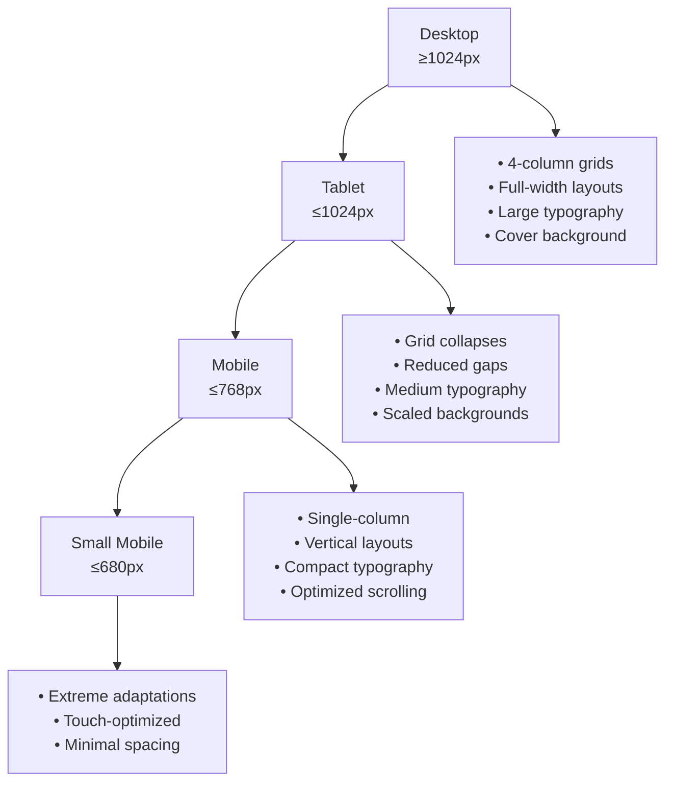
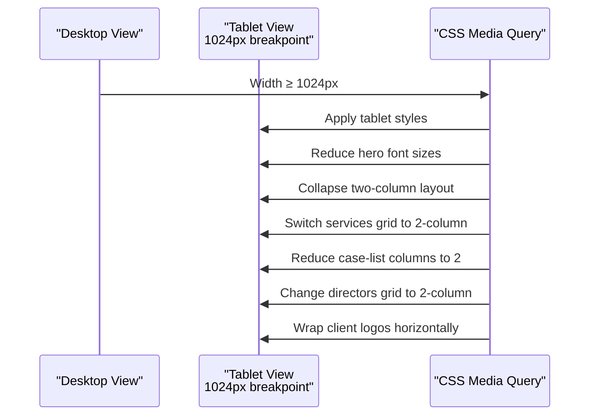
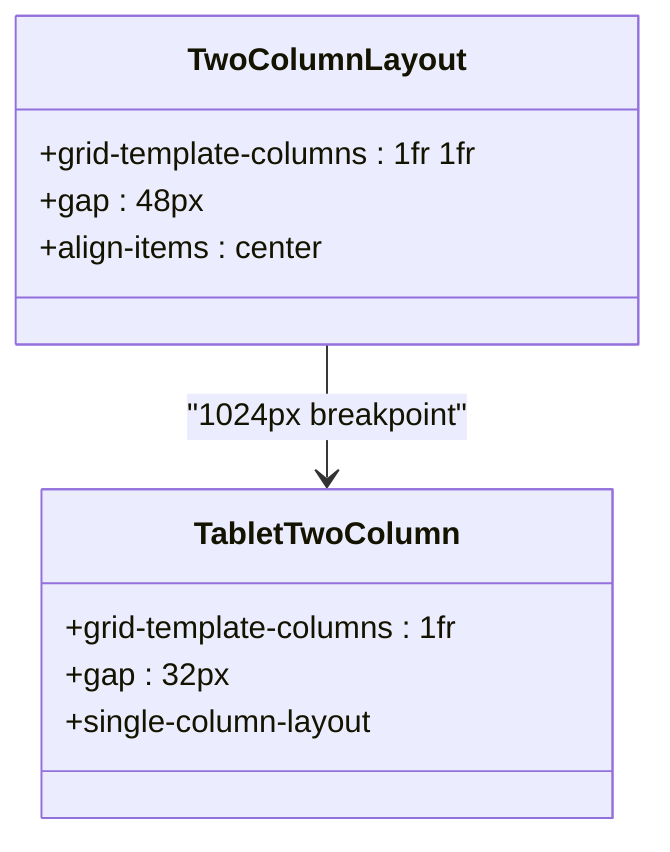
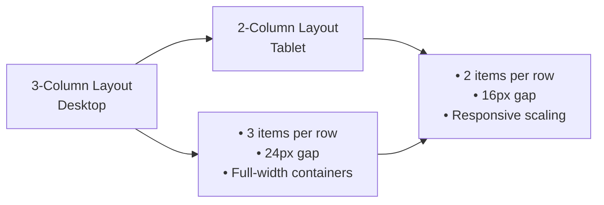
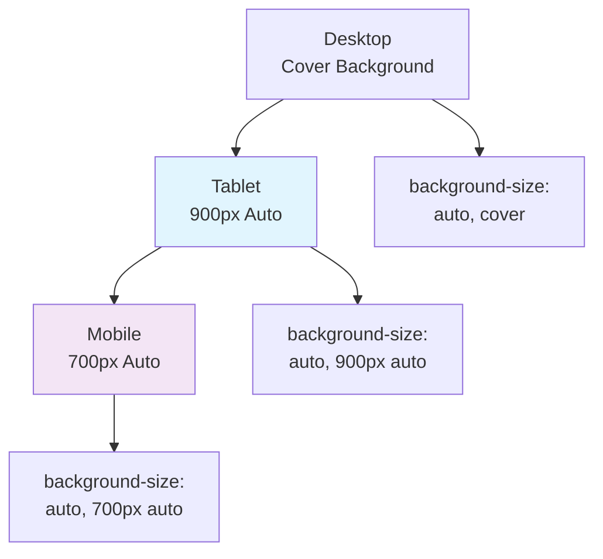
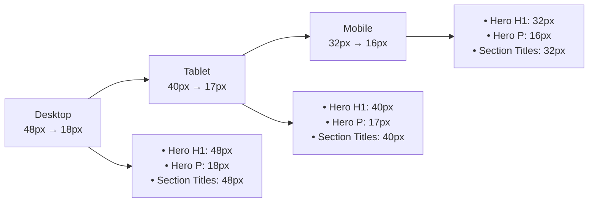
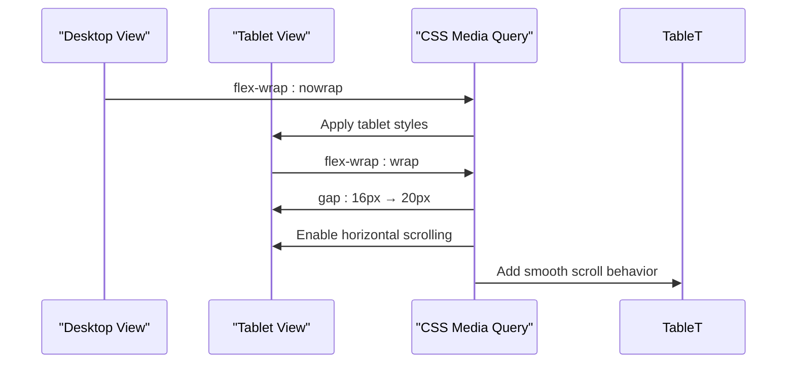
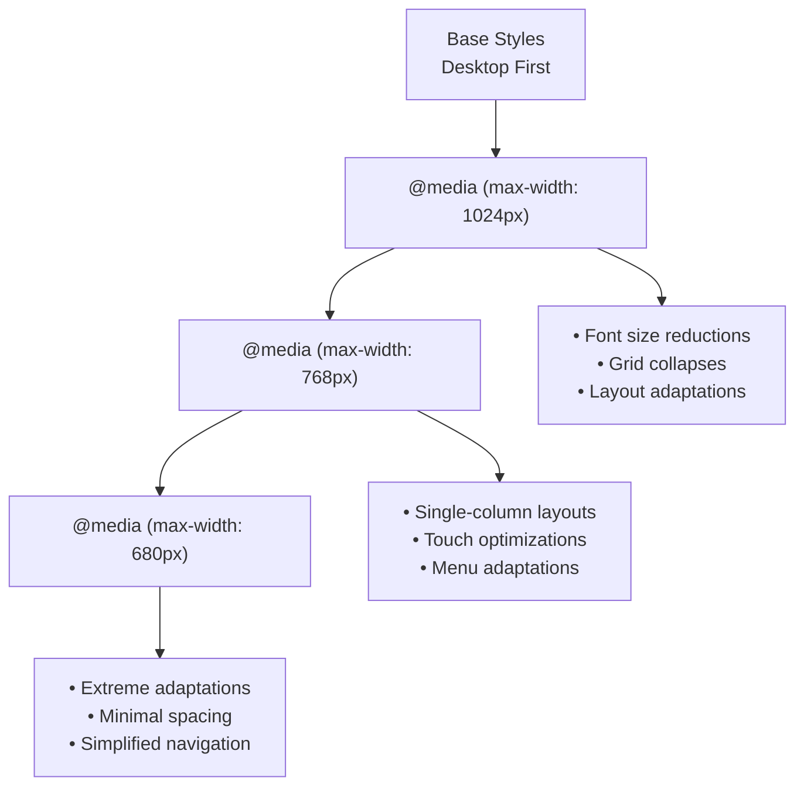

# Tablet Layouts

<cite>
**Referenced Files in This Document**
- [assets/styles.css](file://assets/styles.css)
- [index.html](file://index.html)
- [portfolio.html](file://portfolio.html)
- [founder.html](file://founder.html)
- [assets/main.js](file://assets/main.js)
</cite>

## Table of Contents
1. [Introduction](#introduction)
2. [Responsive Breakpoint Strategy](#responsive-breakpoint-strategy)
3. [Hero Section Transformations](#hero-section-transformations)
4. [Grid Layout Adaptations](#grid-layout-adaptations)
5. [Background Image Optimization](#background-image-optimization)
6. [Typography Adjustments](#typography-adjustments)
7. [Client Logos Responsive Behavior](#client-logos-responsive-behavior)
8. [Implementation Details](#implementation-details)
9. [Testing and Validation](#testing-and-validation)
10. [Best Practices](#best-practices)

## Introduction

The tablet-responsive design system for this videoproduction agency website implements a sophisticated breakpoint strategy centered around the 1024px threshold, specifically optimized for iPad and similar tablet devices. This comprehensive responsive framework transforms the desktop layout into an optimal tablet experience through strategic grid collapses, typography adjustments, and background image scaling.

The design philosophy prioritizes content accessibility and visual harmony across the tablet spectrum, ensuring that users enjoy a seamless experience whether using an iPad Pro, Samsung Galaxy Tab, or other modern tablet devices.

## Responsive Breakpoint Strategy

The responsive design employs a multi-tier breakpoint approach designed to handle the diverse tablet landscape effectively:

**Section sources**
- [assets/styles.css](file://assets/styles.css#L181-L227)

## Hero Section Transformations

The hero section undergoes significant transformation at the 1024px breakpoint, maintaining visual impact while optimizing for tablet viewing:

### Font Size Adjustments
- **Desktop Hero H1**: 48px → **Tablet Hero H1**: 40px
- **Desktop Hero P**: 18px → **Tablet Hero P**: 17px

### Layout Modifications
The hero section adapts through several key changes:

**Diagram sources**
- [assets/styles.css](file://assets/styles.css#L181-L189)

**Section sources**
- [assets/styles.css](file://assets/styles.css#L181-L189)

## Grid Layout Adaptations

The tablet-responsive design implements comprehensive grid system transformations that optimize content presentation for tablet screens:

### Two-Column Section Collapse
The primary two-column layout transforms from a dual-panel arrangement to a single-column vertical stack:

**Diagram sources**
- [assets/styles.css](file://assets/styles.css#L185-L185)

### Services Grid Transformation
The services grid transitions from a 4-column desktop layout to a balanced 2-column tablet arrangement:

| Component | Desktop Layout | Tablet Layout | Gap Reduction |
|-----------|----------------|---------------|---------------|
| Services Grid | 4-column (1fr 1fr 1fr 1fr) | 2-column (1fr 1fr) | 24px → 16px |
| Case List | 3-column (1fr 1fr 1fr) | 2-column (1fr 1fr) | 2px → 16px |
| Case Filters | 4-column (1fr 1fr 1fr 1fr) | 2-column (1fr 1fr) | Variable |
| Directors Grid | 4-column (1fr 1fr 1fr 1fr) | 2-column (1fr 1fr) | 32px → 16px |

### Portfolio Case List Optimization
The portfolio case list reduces from 3-column to 2-column layout, ensuring optimal thumbnail display and navigation:

**Diagram sources**
- [assets/styles.css](file://assets/styles.css#L186-L188)

**Section sources**
- [assets/styles.css](file://assets/styles.css#L181-L189)

## Background Image Optimization

The background image system implements intelligent scaling strategies to maintain visual quality across different tablet resolutions:

### Background Size Scaling Strategy

**Diagram sources**
- [assets/styles.css](file://assets/styles.css#L78-L84)

### Implementation Details

The background scaling follows a progressive reduction pattern:

| Breakpoint | Background Size | Purpose |
|------------|-----------------|---------|
| Desktop (≥1024px) | `auto, cover` | Full coverage for wide screens |
| Tablet (≤1024px) | `auto, 900px auto` | Balanced scaling for tablets |
| Mobile (≤680px) | `auto, 700px auto` | Optimized for smaller screens |

**Section sources**
- [assets/styles.css](file://assets/styles.css#L78-L84)

## Typography Adjustments

The typography system implements precise scaling to maintain readability and visual hierarchy across tablet devices:

### Font Size Progression

**Diagram sources**
- [assets/styles.css](file://assets/styles.css#L182-L184)

### Typography Scale Implementation

| Element Type | Desktop Size | Tablet Size | Mobile Size | Line Height Adjustment |
|--------------|--------------|-------------|-------------|----------------------|
| Hero H1 | 48px | 40px | 32px | 1.2 → 1.25 |
| Hero P | 18px | 17px | 16px | 1.5 → 1.5 |
| Section Titles | 48px | 40px | 32px | Consistent |
| Content H2 | 36px | 32px | 28px | 1.2 → 1.25 |
| Service Cards | 18px | 16px | 14px | 1.2 → 1.3 |
| Director Cards | 18px | 16px | 14px | 1.2 → 1.3 |

**Section sources**
- [assets/styles.css](file://assets/styles.css#L182-L184)

## Client Logos Responsive Behavior

The client logos grid implements intelligent wrapping behavior that enhances tablet browsing experience:

### Horizontal Flex to Wrapped Layout Transition

**Diagram sources**
- [assets/styles.css](file://assets/styles.css#L187-L187)

### Responsive Features

The client logos grid transformation includes:

- **Gap Increase**: 16px → 20px for better spacing
- **Flex Wrap Activation**: Enables automatic line breaking
- **Smooth Scrolling**: Implements `-webkit-overflow-scrolling: touch`
- **Touch Optimization**: Ensures optimal touch interaction

**Section sources**
- [assets/styles.css](file://assets/styles.css#L187-L187)

## Implementation Details

### CSS Media Query Structure

The responsive design utilizes a structured media query approach:

**Diagram sources**
- [assets/styles.css](file://assets/styles.css#L181-L227)

### JavaScript Integration

The JavaScript implementation supports responsive behavior through:

- **Dynamic Grid Management**: Automatic grid adaptation based on viewport
- **Smooth Scroll Implementation**: Enhanced scrolling experience
- **Event Listener Management**: Responsive event handling
- **Cross-browser Compatibility**: Fallback mechanisms for older browsers

**Section sources**
- [assets/main.js](file://assets/main.js#L1-L50)

## Testing and Validation

### Device-Specific Testing Matrix

| Device Category | Screen Resolution | Key Test Areas | Expected Behavior |
|-----------------|-------------------|----------------|-------------------|
| iPad Pro 12.9" | 1024×1366 | Grid alignment, typography, navigation | Perfect 1024px breakpoint |
| iPad Air | 820×1180 | Content flow, button sizing, logo display | Smooth transition |
| Samsung Galaxy Tab | 800×1280 | Layout responsiveness, touch targets | Consistent behavior |
| Android Tablets | Various | Cross-platform compatibility | Universal responsiveness |

### Performance Metrics

- **Load Time**: Optimized for tablet networks
- **Scroll Performance**: Smooth animations and transitions
- **Memory Usage**: Efficient resource management
- **Battery Impact**: Minimal CPU/GPU usage

## Best Practices

### Responsive Design Guidelines

1. **Progressive Enhancement**: Start with desktop-first design
2. **Mobile-First Thinking**: Consider mobile limitations early
3. **Performance Optimization**: Minimize resource usage on tablets
4. **Accessibility**: Ensure keyboard and screen reader compatibility
5. **Touch-Friendly Design**: Optimal touch target sizes

### Maintenance Recommendations

- Regular testing across tablet device spectrum
- Performance monitoring for tablet-specific metrics
- Accessibility auditing for improved user experience
- Continuous optimization based on user analytics

The tablet-responsive design system delivers an exceptional user experience by intelligently adapting the desktop layout to tablet constraints while maintaining visual hierarchy, readability, and interactive functionality. This approach ensures consistent brand representation across all device categories while optimizing for the unique characteristics of tablet computing environments.