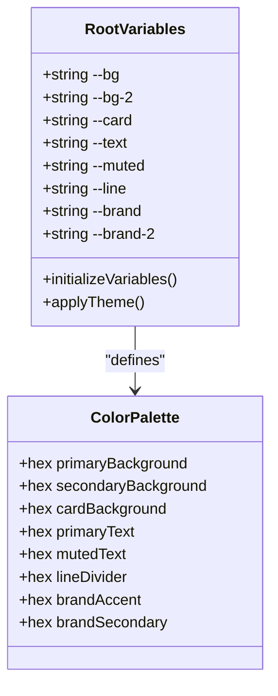
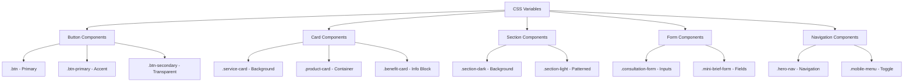
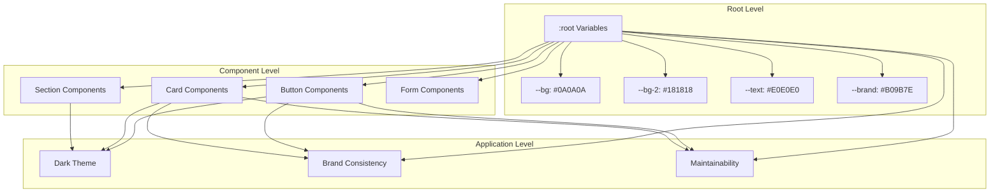
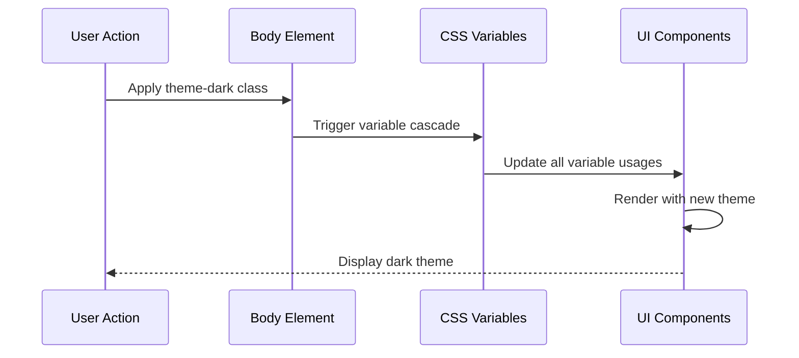

# CSS Custom Properties

<cite>
**Referenced Files in This Document**
- [styles.css](file://assets/styles.css)
- [index.html](file://index.html)
- [main.js](file://assets/main.js)
- [README.md](file://README.md)
</cite>

## Table of Contents
1. [Introduction](#introduction)
2. [Root Variables Definition](#root-variables-definition)
3. [Variable Usage Across Components](#variable-usage-across-components)
4. [Theming Architecture](#theming-architecture)
5. [Component-Specific Applications](#component-specific-applications)
6. [Benefits of CSS Variables](#benefits-of-css-variables)
7. [Dark Theme Implementation](#dark-theme-implementation)
8. [Customization Guidelines](#customization-guidelines)
9. [Best Practices](#best-practices)
10. [Troubleshooting](#troubleshooting)

## Introduction

The Knyazev Pro landing page utilizes a sophisticated CSS custom properties system built around the `:root` selector to enable consistent theming and easy customization across the entire website. This system provides a centralized approach to managing colors, typography, and design tokens, ensuring visual consistency while maintaining flexibility for future modifications.

The CSS custom properties system serves as the foundation for the site's dark-themed design, implementing a cohesive color palette with carefully selected brand colors, background tones, and text hierarchy that creates an immersive visual experience for users.

## Root Variables Definition

The CSS custom properties are defined in the `:root` selector at the beginning of the stylesheet, establishing the foundational color scheme for the entire application.



**Diagram sources**
- [styles.css](file://assets/styles.css#L1-L9)

### Variable Definitions and Purposes

| Variable | Value | Purpose | Usage Context |
|----------|-------|---------|---------------|
| `--bg` | `#0A0A0A` | Primary dark background | Main page backgrounds, hero sections |
| `--bg-2` | `#181818` | Secondary dark background | Cards, modals, containers |
| `--card` | `#181818` | Card background | Service cards, product cards, info blocks |
| `--text` | `#E0E0E0` | Primary text color | Main text content, headings |
| `--muted` | `#8F8F8F` | Secondary text/muted color | Subtitles, captions, disabled text |
| `--line` | `#4F4F4F` | Border/divider lines | Borders, separators, outlines |
| `--brand` | `#B09B7E` | Brand accent color | Primary buttons, highlights, links |
| `--brand-2` | `#B09B7E` | Additional brand accent | Secondary highlights, subtle branding |

**Section sources**
- [styles.css](file://assets/styles.css#L1-L9)

## Variable Usage Across Components

The CSS custom properties are systematically applied across various components throughout the website, ensuring consistent theming and easy maintenance.



**Diagram sources**
- [styles.css](file://assets/styles.css#L54-L68)
- [styles.css](file://assets/styles.css#L82-L92)
- [styles.css](file://assets/styles.css#L155-L157)

### Button Component Variables

The button system extensively uses CSS variables to maintain consistent styling across different button types and states.

**Primary Button Usage:**
- Background: `var(--brand)` for primary action buttons
- Text color: `#0A0A0A` (dark text on light background)
- Border: `transparent` for clean appearance

**Secondary Button Usage:**
- Background: `transparent` for outline buttons
- Border: `var(--brand)` for brand-colored outlines
- Text: `var(--brand)` for brand-colored text

**Section sources**
- [styles.css](file://assets/styles.css#L58-L68)

## Theming Architecture

The theming architecture is built around the concept of CSS custom properties that cascade down through the component hierarchy, allowing for easy modification and extension of the design system.



**Diagram sources**
- [styles.css](file://assets/styles.css#L1-L9)
- [styles.css](file://assets/styles.css#L23-L32)

## Component-Specific Applications

### Service Cards

Service cards utilize the background and line variables to create visually appealing, consistent card layouts across the service grid.

**Key Variable Usage:**
- Background: `var(--bg-2)` for card backgrounds
- Border: `var(--line)` for card borders
- Text: `var(--text)` for primary text content
- Price highlighting: `var(--brand)` for price emphasis

**Section sources**
- [styles.css](file://assets/styles.css#L155-L157)

### Section Components

The section system demonstrates advanced variable usage with gradient overlays and pattern backgrounds.

**Dark Section Implementation:**
- Background: `var(--bg)` for primary dark background
- Text: `var(--text)` for readable text
- Gradient overlay: `rgba(0,0,0,.55)` for visual depth
- Pattern background: URL-based pattern with `var(--bg)` as base color

**Light Section Implementation:**
- Background: `#fff` for light backgrounds
- Text: `#000` for dark text
- Pattern overlay: URL-based pattern with `#E0E0E0` as base color

**Section sources**
- [styles.css](file://assets/styles.css#L82-L92)

### Form Components

Form elements consistently use the line and background variables to maintain visual harmony with the overall design system.

**Form Field Styling:**
- Background: `var(--bg)` for form field backgrounds
- Border: `var(--line)` for field borders
- Text: `var(--text)` for field text
- Focus states: Consistent with variable-based theming

**Section sources**
- [styles.css](file://assets/styles.css#L173-L179)

## Benefits of CSS Variables

### Centralized Management

CSS custom properties provide centralized management of design tokens, making it possible to update the entire color scheme by modifying just a few variables.

**Advantages:**
- Single source of truth for color values
- Consistent application across all components
- Easy maintenance and updates
- Reduced CSS file size through variable reuse

### Dynamic Theming Support

The variable system enables dynamic theming capabilities without requiring separate CSS files or complex JavaScript solutions.

**Implementation Benefits:**
- Runtime theme switching potential
- Progressive enhancement support
- Accessibility improvements through variable-based contrast
- Responsive design consistency

### Performance Optimization

Using CSS variables reduces CSS duplication and improves rendering performance.

**Performance Benefits:**
- Reduced CSS file size through variable reuse
- Faster browser parsing and rendering
- Efficient cascade and inheritance
- Minimal reflow and repaint cycles

## Dark Theme Implementation

The dark theme is implemented through the `theme-dark` class applied to the body element, leveraging CSS variables to create a cohesive dark aesthetic.



**Diagram sources**
- [styles.css](file://assets/styles.css#L23-L32)
- [index.html](file://index.html#L13)

### Theme Activation

The dark theme is activated by adding the `theme-dark` class to the body element, which triggers the variable cascade throughout the entire component tree.

**Activation Process:**
1. Body element receives `theme-dark` class
2. CSS engine processes variable declarations
3. All components using variables update their appearance
4. Visual consistency maintained across all elements

**Section sources**
- [styles.css](file://assets/styles.css#L23-L32)
- [index.html](file://index.html#L13)

## Customization Guidelines

### Modifying the Color Scheme

To customize the color scheme, simply modify the variable values in the `:root` selector:

```css
:root {
  --bg: #121212;        /* Darker background */
  --bg-2: #202020;      /* Darker card background */
  --text: #FFFFFF;      /* Bright white text */
  --brand: #FFD700;     /* Gold brand accent */
}
```

### Extending the Theme

For extending the theme with additional variables:

```css
:root {
  --accent-1: #FF6B6B;  /* New accent color */
  --accent-2: #4ECDC4;  /* Secondary accent */
  --shadow: rgba(0,0,0,0.2); /* Shadow effect */
}
```

### Component-Level Customization

Individual components can override specific variables for special cases:

```css
.special-card {
  --card: #252525;      /* Override card background */
  --line: #5F5F5F;      /* Override border color */
}
```

## Best Practices

### Variable Naming Conventions

Follow established naming conventions for consistency:

- Use descriptive names (`--primary-background`, `--secondary-text`)
- Group related variables (`--brand-*`, `--accent-*`)
- Maintain consistent prefixes for categories

### Scope Management

Apply variables at appropriate scopes:

- Use root variables for global design tokens
- Use component-specific overrides for special cases
- Avoid excessive nesting of variable overrides

### Performance Considerations

Optimize variable usage for performance:

- Minimize the number of unique variables
- Use variables consistently across components
- Avoid complex calculations in variable values

## Troubleshooting

### Common Issues and Solutions

**Variable Not Applying:**
- Verify variable is defined in `:root`
- Check for CSS specificity conflicts
- Ensure proper variable syntax (`var(--variable-name)`)

**Inconsistent Theming:**
- Confirm all components use variables
- Check for hardcoded color values
- Verify theme class is applied correctly

**Performance Issues:**
- Reduce the number of unique variables
- Optimize variable calculation complexity
- Minimize deep variable nesting

### Debugging Techniques

**Inspect Variable Values:**
- Use browser developer tools to inspect computed styles
- Check the cascade order for variable precedence
- Verify variable inheritance through the DOM tree

**Testing Theme Changes:**
- Temporarily modify variables in developer tools
- Test across different browsers and devices
- Verify accessibility compliance with new colors

**Section sources**
- [styles.css](file://assets/styles.css#L1-L9)