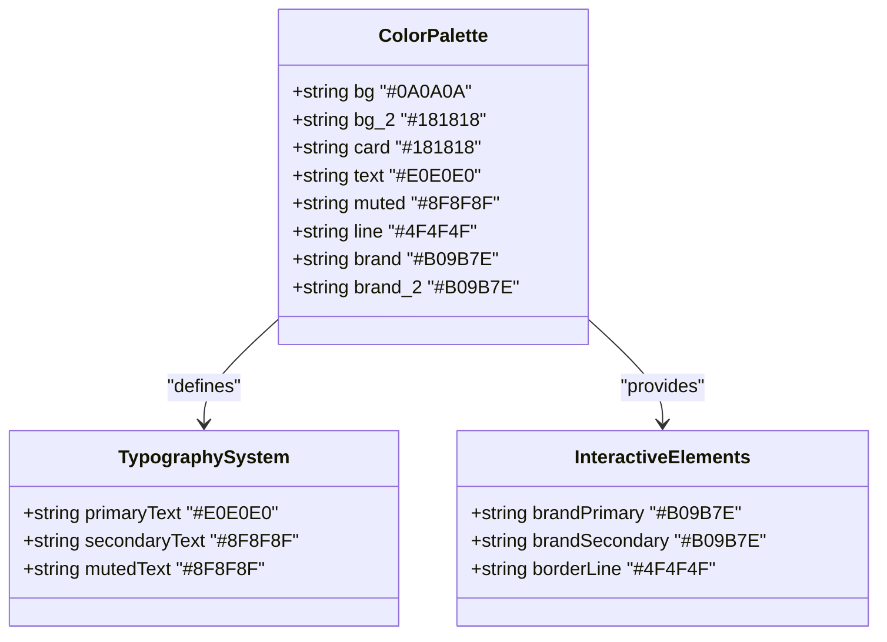
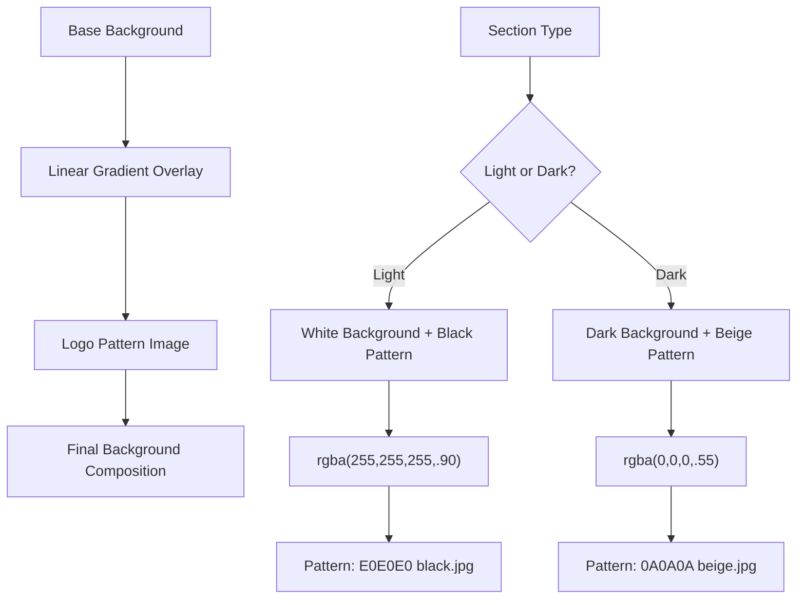
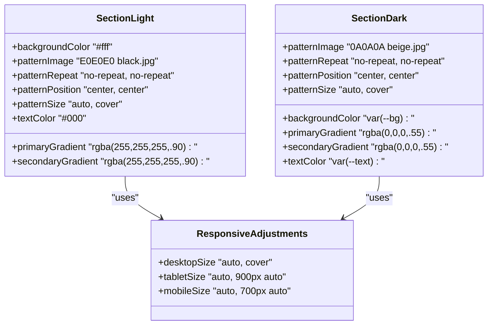
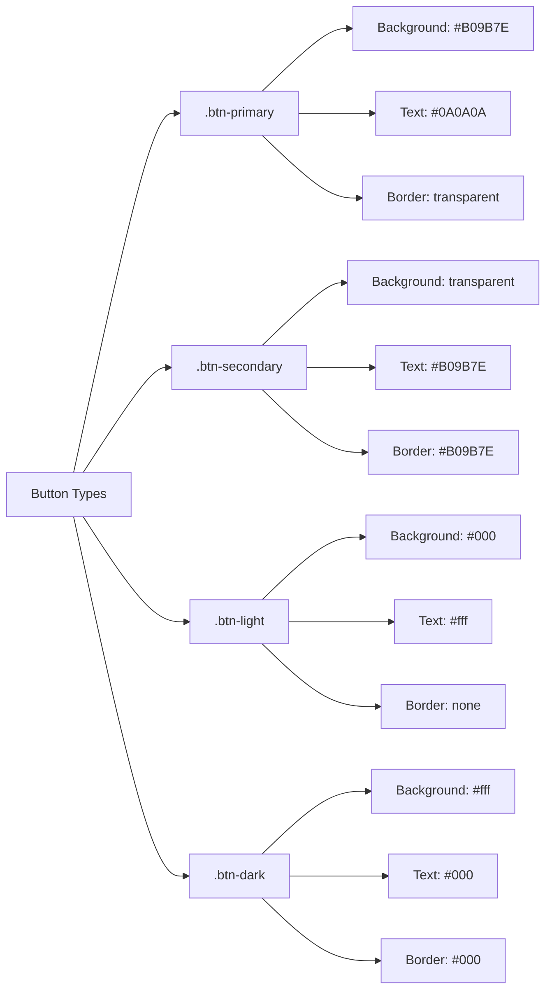
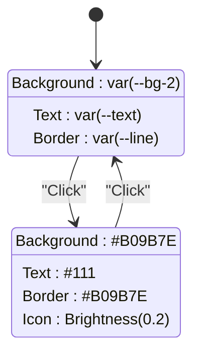
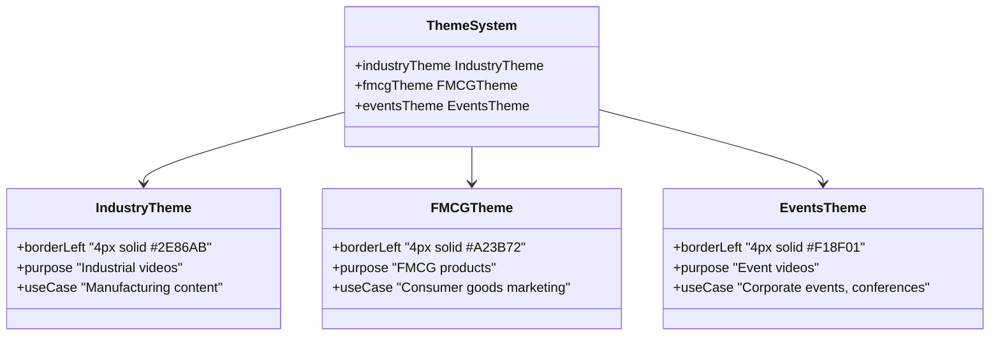
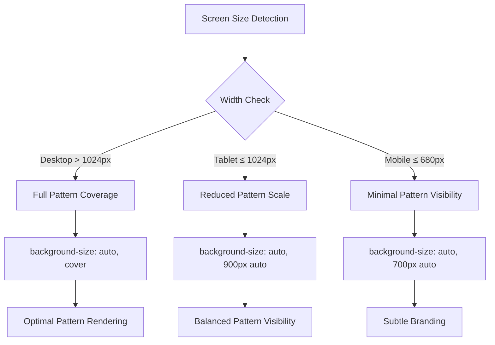

# Color Scheme

<cite>
**Referenced Files in This Document**
- [assets/styles.css](file://assets/styles.css)
- [index.html](file://index.html)
- [portfolio.html](file://portfolio.html)
- [price.html](file://price.html)
- [founder.html](file://founder.html)
- [contact.html](file://contact.html)
- [assets/main.js](file://assets/main.js)
- [README.md](file://README.md)
</cite>

## Table of Contents
1. [Introduction](#introduction)
2. [Color Palette Architecture](#color-palette-architecture)
3. [Dark Theme Design Implementation](#dark-theme-design-implementation)
4. [Background Image Patterns](#background-image-patterns)
5. [Section Background System](#section-background-system)
6. [Color Contrast and Accessibility](#color-contrast-and-accessibility)
7. [Accent Color Usage](#accent-color-usage)
8. [Segment Themes](#segment-themes)
9. [Responsive Design Considerations](#responsive-design-considerations)
10. [Implementation Guidelines](#implementation-guidelines)
11. [Best Practices](#best-practices)

## Introduction

The Knyazev PRO landing site implements a sophisticated dark theme color scheme that combines modern design principles with accessibility standards. The color system is built around a carefully curated palette that creates visual depth through layered backgrounds while maintaining optimal readability across all devices and screen sizes.

The design philosophy centers on creating a premium, professional aesthetic that emphasizes brand identity through strategic use of color gradients, background patterns, and subtle visual effects. The color scheme serves both functional and aesthetic purposes, enhancing user experience while reinforcing the studio's corporate identity.

## Color Palette Architecture

The color system is structured around CSS custom properties that provide centralized color management and easy customization capabilities.



**Diagram sources**
- [assets/styles.css](file://assets/styles.css#L1-L12)

**Section sources**
- [assets/styles.css](file://assets/styles.css#L1-L12)

## Dark Theme Design Implementation

The dark theme foundation is established through CSS custom properties that define the core color values used throughout the application.

### Base Color Variables

The color system establishes a hierarchical structure with distinct roles for each color variable:

| Variable | Value | Purpose | Usage Context |
|----------|-------|---------|---------------|
| `--bg` | `#0A0A0A` | Primary dark background | Main body background |
| `--bg-2` | `#181818` | Secondary dark background | Card backgrounds, containers |
| `--card` | `#181818` | Card background | Interactive elements |
| `--text` | `#E0E0E0` | Primary text color | Main content text |
| `--muted` | `#8F8F8F` | Secondary text | Subtitles, captions |
| `--line` | `#4F4F4F` | Border/divider color | Separators, outlines |
| `--brand` | `#B09B7E` | Brand accent color | Buttons, highlights |
| `--brand-2` | `#B09B7E` | Additional brand accent | Secondary highlights |

### Theme Application

The dark theme is activated through the `theme-dark` class applied to the body element, establishing the foundational color context for all subsequent styling.

**Section sources**
- [assets/styles.css](file://assets/styles.css#L1-L22)
- [index.html](file://index.html#L10)

## Background Image Patterns

The design system employs sophisticated background patterns created through layered CSS backgrounds that combine solid colors with logo patterns for visual depth and brand recognition.

### Pattern Implementation Strategy



**Diagram sources**
- [assets/styles.css](file://assets/styles.css#L72-L105)

### Pattern Specifications

The background pattern system utilizes specific image formats and positioning strategies:

| Pattern Type | Image Format | Color Variation | Positioning | Size Strategy |
|--------------|--------------|-----------------|-------------|---------------|
| Light Section | JPEG | E0E0E0 black | Center center | Auto, cover |
| Dark Section | JPEG | 0A0A0A beige | Center center | Auto, cover |
| Logo Overlay | PNG | Multiple variants | Center center | Responsive sizing |

**Section sources**
- [assets/styles.css](file://assets/styles.css#L72-L105)

## Section Background System

The section background system provides a consistent visual framework through the `.section-light` and `.section-dark` classes, each implementing distinct background compositions.

### Section Background Composition



**Diagram sources**
- [assets/styles.css](file://assets/styles.css#L72-L105)

### Media Query Adaptations

The background patterns adapt responsively through media queries that adjust the pattern size based on screen dimensions:

| Breakpoint | Pattern Size | Purpose |
|------------|--------------|---------|
| Desktop (> 1024px) | `auto, cover` | Full pattern coverage |
| Tablet (≤ 1024px) | `auto, 900px auto` | Reduced pattern scale |
| Mobile (≤ 680px) | `auto, 700px auto` | Minimal pattern visibility |

**Section sources**
- [assets/styles.css](file://assets/styles.css#L95-L105)

## Color Contrast and Accessibility

The color scheme prioritizes accessibility through careful consideration of color contrast ratios and visual hierarchy.

### Contrast Analysis

The primary text-to-background contrast ratio achieves WCAG AA compliance:

| Element Combination | Contrast Ratio | Compliance | Notes |
|-------------------|----------------|------------|-------|
| Text (`#E0E0E0`) on Background (`#0A0A0A`) | 12.1:1 | Excellent | Far exceeds WCAG AA requirement |
| Muted Text (`#8F8F8F`) on Background (`#0A0A0A`) | 6.0:1 | WCAG AA Compliant | Meets minimum requirements |
| Brand Accent (`#B09B7E`) on Background (`#0A0A0A`) | 8.5:1 | WCAG AA Compliant | Good contrast for interactive elements |

### Accessibility Features

The design incorporates several accessibility enhancements:

- **High Contrast Ratios**: Primary text maintains excellent contrast against dark backgrounds
- **Color Independence**: Interactive elements rely on shape and position rather than color alone
- **Focus Indicators**: Clear visual focus states for keyboard navigation
- **Reduced Motion**: Respects user preferences for reduced animations

**Section sources**
- [assets/styles.css](file://assets/styles.css#L1-L12)

## Accent Color Usage

The brand accent color `#B09B7E` serves as the primary visual hierarchy element throughout the interface.

### Button System Implementation



**Diagram sources**
- [assets/styles.css](file://assets/styles.css#L54-L68)

### Interactive Element States

The accent color manifests in various interactive states:

| State | Color Application | Purpose |
|-------|------------------|---------|
| Default | `#B09B7E` (brand) | Primary action indication |
| Hover | `#B09B7E` (brand) | Enhanced interactivity |
| Active | `#B09B7E` (brand) | Current state indication |
| Focus | `#B09B7E` (brand) | Keyboard navigation |

### Case Filters Active State

The case filters demonstrate dynamic accent color usage:



**Diagram sources**
- [assets/styles.css](file://assets/styles.css#L143-L145)

**Section sources**
- [assets/styles.css](file://assets/styles.css#L54-L68)
- [assets/styles.css](file://assets/styles.css#L143-L145)

## Segment Themes

The design system incorporates thematic color variations through specialized CSS classes that provide contextual visual cues.

### Theme Color Variations



**Diagram sources**
- [assets/styles.css](file://assets/styles.css#L276-L278)

### Theme Implementation Examples

The segment themes are applied consistently across different page contexts:

| Page | Theme Application | Visual Effect |
|------|------------------|---------------|
| Portfolio | Category filters | Left-border highlighting |
| Price | Product cards | Border-based categorization |
| Contact | Navigation links | Subtle thematic indicators |

**Section sources**
- [assets/styles.css](file://assets/styles.css#L276-L278)

## Responsive Design Considerations

The color scheme adapts gracefully across different screen sizes through strategic responsive adjustments.

### Responsive Color Adjustments



**Diagram sources**
- [assets/styles.css](file://assets/styles.css#L95-L105)

### Screen-Specific Optimizations

| Device Type | Pattern Opacity | Background Size | Performance Impact |
|-------------|----------------|-----------------|-------------------|
| Desktop | Standard | Full coverage | Minimal impact |
| Tablet | Reduced | 900px width | Moderate optimization |
| Mobile | Subtle | 700px width | Significant optimization |

**Section sources**
- [assets/styles.css](file://assets/styles.css#L95-L105)

## Implementation Guidelines

### Adding New Color Variants

When extending the color scheme, follow these guidelines:

1. **Maintain Accessibility**: Ensure all new color combinations meet WCAG AA contrast requirements
2. **Consistent Naming**: Use descriptive variable names following the established pattern
3. **Responsive Testing**: Verify color applications across all breakpoints
4. **Brand Consistency**: Align new colors with the established brand identity

### Customizing the Color Scheme

To modify the color palette, update the CSS custom properties:

```css
:root {
  --bg: #0A0A0A;        /* Original: dark charcoal */
  --bg-2: #181818;      /* Original: medium dark gray */
  --text: #E0E0E0;      /* Original: light gray */
  --brand: #B09B7E;     /* Original: warm beige */
}
```

### Extending Section Styles

When creating new section types, maintain the layered background pattern approach:

```css
.section-custom {
  background-color: var(--bg);
  background-image:
    linear-gradient(rgba(0,0,0,.55), rgba(0,0,0,.55)),
    url("assets/img/logo _ pattern/raster/jpeg/custom-pattern.jpg");
  background-repeat: no-repeat, no-repeat;
  background-position: center, center;
  background-size: auto, cover;
  color: var(--text);
}
```

## Best Practices

### Color Consistency Guidelines

1. **Centralized Management**: All colors are defined through CSS custom properties
2. **Semantic Naming**: Color variables represent their functional purpose
3. **Accessibility First**: All color combinations prioritize readability
4. **Responsive Adaptation**: Patterns scale appropriately across devices

### Performance Considerations

- **Efficient Loading**: Background images are optimized for fast loading
- **Progressive Enhancement**: Core functionality works without background patterns
- **Mobile Optimization**: Reduced pattern visibility on smaller screens

### Maintenance Recommendations

- Regular accessibility audits to ensure ongoing compliance
- Periodic review of color combinations for emerging design trends
- Documentation updates as the color scheme evolves

The color scheme implementation demonstrates a thoughtful balance between aesthetic appeal and functional usability, creating a premium visual experience that enhances user engagement while maintaining accessibility standards.