# Responsive Design

<cite>
**Referenced Files in This Document**
- [assets/styles.css](file://assets/styles.css)
- [assets/main.js](file://assets/main.js)
- [index.html](file://index.html)
- [portfolio.html](file://portfolio.html)
- [price.html](file://price.html)
- [contact.html](file://contact.html)
- [MOBILE_OPTIMIZATION_FULL.md](file://MOBILE_OPTIMIZATION_FULL.md)
- [IOS_MAC_OPTIMIZATION.md](file://IOS_MAC_OPTIMIZATION.md)
</cite>

## Table of Contents
1. [Introduction](#introduction)
2. [Mobile-First Design Philosophy](#mobile-first-design-philosophy)
3. [Defined Breakpoints](#defined-breakpoints)
4. [Media Query Implementation](#media-query-implementation)
5. [Layout Transformations](#layout-transformations)
6. [Fluid Grid System](#fluid-grid-system)
7. [Flexible Images and Media](#flexible-images-and-media)
8. [Viewport Units and Adaptive Layouts](#viewport-units-and-adaptive-layouts)
9. [iOS Safari Optimizations](#ios-safari-optimizations)
10. [Mobile Navigation Menu](#mobile-navigation-menu)
11. [Performance Considerations](#performance-considerations)
12. [Best Practices](#best-practices)
13. [Testing and Validation](#testing-and-validation)

## Introduction

The landing page project implements a sophisticated mobile-first responsive design strategy that ensures optimal user experience across all device categories. The design system is built around three primary breakpoints targeting mobile (<680px), tablet (680-1024px), and desktop (>1024px) devices, with special consideration for iOS Safari and cross-platform compatibility.

The responsive framework emphasizes progressive enhancement, fluid typography, flexible grid systems, and performance-optimized media handling. Every aspect of the design—from hero sections to portfolio displays—is carefully crafted to adapt seamlessly to varying screen sizes while maintaining visual hierarchy and usability standards.

## Mobile-First Design Philosophy

The project follows a mobile-first approach where base styles are designed for mobile devices, with progressively enhanced styles added for larger screens. This philosophy ensures that core functionality and content accessibility remain intact regardless of device capabilities.

### Core Principles

- **Progressive Enhancement**: Basic functionality works on all devices, with enhanced experiences for capable browsers
- **Content Priority**: Essential content remains accessible and readable across all breakpoints
- **Performance Focus**: Minimal CSS and JavaScript overhead for mobile devices
- **Touch-Friendly**: Interactive elements sized appropriately for finger interaction

### Base Typography and Spacing

The foundation establishes consistent typography scales and spacing units that scale proportionally across breakpoints:

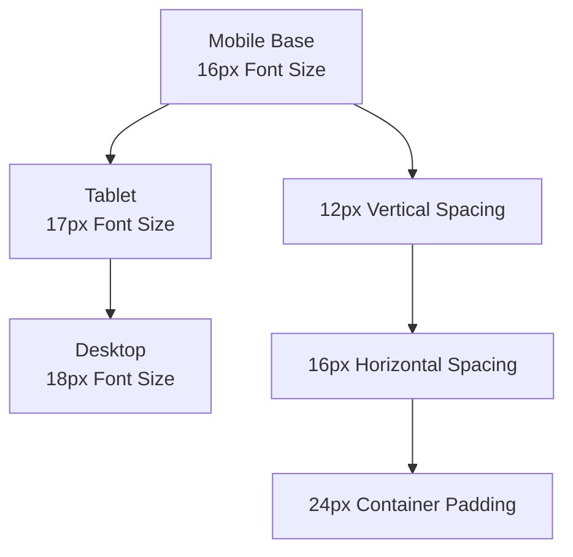

**Diagram sources**
- [assets/styles.css](file://assets/styles.css#L1-L50)

**Section sources**
- [assets/styles.css](file://assets/styles.css#L1-L50)
- [index.html](file://index.html#L1-L10)

## Defined Breakpoints

The responsive design system utilizes three primary breakpoints strategically positioned to handle the most common device categories:

### Breakpoint Specifications

| Device Category | Width Range | Target Features |
|----------------|-------------|-----------------|
| **Mobile** | < 680px | Single-column layouts, mobile menu, compact navigation |
| **Tablet** | 680px - 1024px | Two-column layouts, reduced spacing, enhanced interactivity |
| **Desktop** | > 1024px | Full grid layouts, expanded content areas, advanced animations |

### Breakpoint Implementation Strategy

The breakpoint system employs a combination of min-width and max-width media queries to create clean, predictable layout transitions:

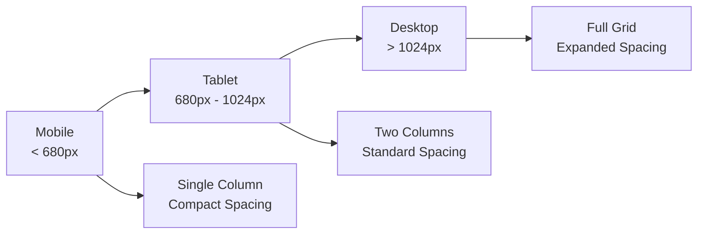

**Diagram sources**
- [assets/styles.css](file://assets/styles.css#L200-L250)

**Section sources**
- [assets/styles.css](file://assets/styles.css#L200-L250)

## Media Query Implementation

The CSS implementation uses a systematic approach to media queries, organizing styles by breakpoint and component type for maintainability and predictability.

### Media Query Structure

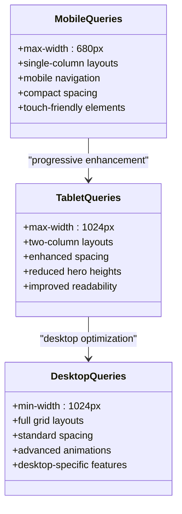

**Diagram sources**
- [assets/styles.css](file://assets/styles.css#L200-L300)

### Specific Media Query Patterns

The implementation demonstrates several key patterns for responsive behavior adjustment:

#### Hero Section Adaptations
- **Mobile**: Reduced height, condensed typography, simplified overlay
- **Tablet**: Balanced proportions, moderate spacing adjustments
- **Desktop**: Full-height hero with expansive visual impact

#### Grid System Modifications
- **Mobile**: Single-column layouts for optimal reading flow
- **Tablet**: Two-column layouts for improved content density
- **Desktop**: Multi-column grids maximizing screen real estate

**Section sources**
- [assets/styles.css](file://assets/styles.css#L200-L350)

## Layout Transformations

The responsive design implements comprehensive layout transformations that maintain content hierarchy while optimizing for different screen sizes.

### Two-Column to Single-Column Transition

The most significant transformation occurs in the main content areas, where two-column layouts automatically convert to single-column arrangements on smaller screens:

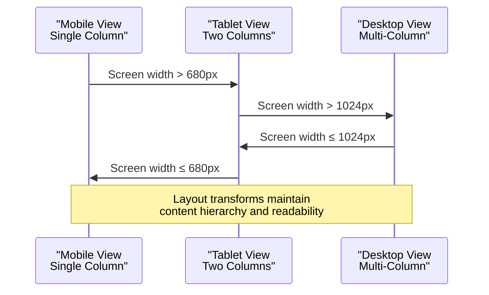

**Diagram sources**
- [assets/styles.css](file://assets/styles.css#L150-L200)
- [index.html](file://index.html#L50-L100)

### Component-Specific Transformations

Each major component undergoes targeted responsive modifications:

#### Services Grid Transformation
- **Mobile**: 1-column grid with full-width cards
- **Tablet**: 2-column grid with balanced spacing
- **Desktop**: 4-column grid maximizing content density

#### Portfolio Display Adaptations
- **Mobile**: Single video per item with full-width presentation
- **Tablet**: 2-column grid with reduced spacing
- **Desktop**: 3-column grid with enhanced hover effects

**Section sources**
- [assets/styles.css](file://assets/styles.css#L150-L250)
- [portfolio.html](file://portfolio.html#L50-L100)

## Fluid Grid System

The project implements a sophisticated fluid grid system that adapts smoothly across breakpoints while maintaining proportional relationships between elements.

### Grid Architecture

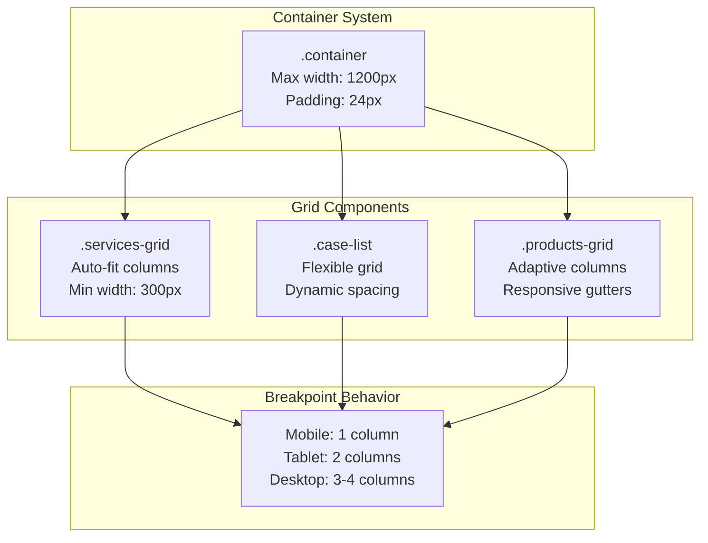

**Diagram sources**
- [assets/styles.css](file://assets/styles.css#L50-L100)
- [assets/styles.css](file://assets/styles.css#L100-L150)

### Grid Implementation Patterns

The fluid grid system employs CSS Grid with automatic column sizing, ensuring optimal content distribution across all screen sizes:

#### Auto-Fit Column Sizing
- **Mobile**: Single column with full container width
- **Tablet**: Flexible two-column layout with equal spacing
- **Desktop**: Multi-column layout with dynamic column widths

#### Responsive Gutters
- **Mobile**: Compact 16px gutters for tight spacing
- **Tablet**: Standard 24px gutters for improved readability
- **Desktop**: Expanded 32px gutters for spacious layouts

**Section sources**
- [assets/styles.css](file://assets/styles.css#L100-L200)

## Flexible Images and Media

The responsive design incorporates comprehensive image and media optimization strategies that ensure fast loading times and optimal visual quality across all devices.

### Image Optimization Strategy

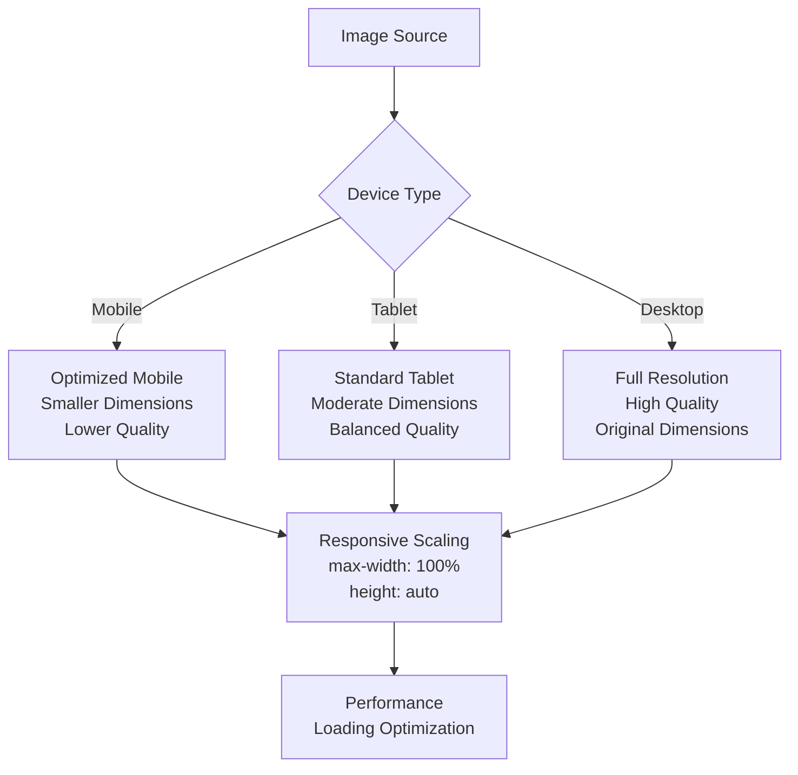

**Diagram sources**
- [assets/styles.css](file://assets/styles.css#L1-L10)
- [index.html](file://index.html#L20-L30)

### Video Element Responsiveness

The hero video implementation demonstrates advanced responsive video handling with automatic scaling and performance optimization:

#### Video Scaling Strategy
- **Aspect Ratio Maintenance**: Videos maintain original aspect ratios across all breakpoints
- **Container Adaptation**: Video elements scale to fit container boundaries
- **Performance Optimization**: Automatic quality reduction for mobile devices

#### Cross-Browser Compatibility
- **Autoplay Handling**: Intelligent autoplay detection with fallback mechanisms
- **Platform-Specific Fixes**: iOS Safari and Android browser optimizations
- **Fallback Solutions**: Graceful degradation for unsupported browsers

**Section sources**
- [assets/styles.css](file://assets/styles.css#L1-L20)
- [assets/main.js](file://assets/main.js#L1-L20)

## Viewport Units and Adaptive Layouts

The design system extensively utilizes viewport units (vh, vw) combined with traditional pixel measurements to create truly adaptive layouts that respond to both screen size and orientation changes.

### Viewport Unit Strategy

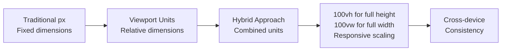

**Diagram sources**
- [assets/styles.css](file://assets/styles.css#L10-L20)

### iOS Safari 100vh Fix Implementation

The project implements a sophisticated solution for iOS Safari's viewport height calculation issues:

#### Problem and Solution
- **Problem**: iOS Safari incorrectly calculates 100vh including address bar
- **Solution**: Use `-webkit-fill-available` for iOS-specific fixes
- **Implementation**: Conditional application based on device detection

#### Implementation Details
```css
/* iOS Safari 100vh fix */
@supports (-webkit-touch-callout: none) {
  html { height: -webkit-fill-available; }
  .hero { min-height: -webkit-fill-available; }
  .hero-media { height: -webkit-fill-available; }
}
```

### Dynamic Height Adjustments

The responsive system includes intelligent height calculations that adapt to content requirements and device characteristics:

#### Hero Section Heights
- **Mobile**: 100vh with `100dvh` fallback for modern browsers
- **Tablet**: Reduced height with proportional scaling
- **Desktop**: Full-height hero with expanded visual impact

**Section sources**
- [assets/styles.css](file://assets/styles.css#L10-L30)
- [assets/styles.css](file://assets/styles.css#L150-L200)

## iOS Safari Optimizations

The project includes comprehensive iOS Safari optimizations addressing platform-specific challenges and ensuring optimal performance across Apple's ecosystem.

### Platform-Specific Challenges

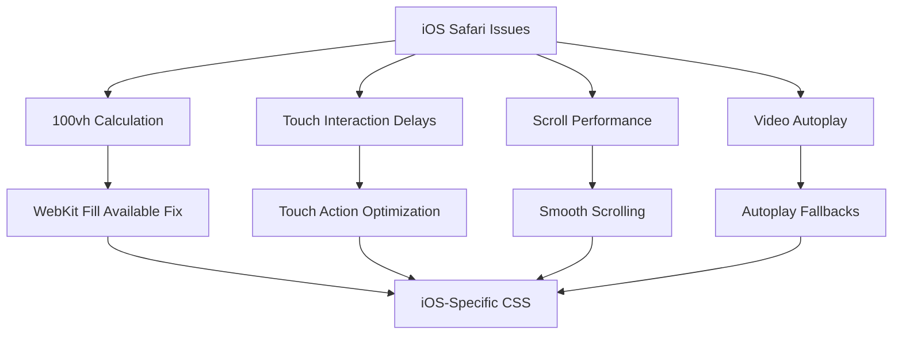

**Diagram sources**
- [IOS_MAC_OPTIMIZATION.md](file://IOS_MAC_OPTIMIZATION.md#L1-L50)

### iOS Safari 100vh Fix

The implementation addresses iOS Safari's incorrect viewport height calculation by applying conditional CSS fixes:

#### Technical Implementation
- **Detection Method**: Uses `@supports (-webkit-touch-callout: none)` to identify iOS Safari
- **Height Adjustment**: Applies `-webkit-fill-available` to HTML and hero elements
- **Fallback Strategy**: Maintains standard behavior for non-iOS browsers

#### Mobile Menu Optimization
- **Height Calculation**: Uses `100vh` with `100dvh` fallback for consistent menu sizing
- **Backdrop Filter**: Implements `-webkit-backdrop-filter` for blur effects
- **Scroll Behavior**: Ensures smooth scrolling with `-webkit-overflow-scrolling: touch`

### Touch Interaction Optimizations

The project eliminates iOS Safari's 300ms tap delay through strategic CSS declarations:

#### Touch Action Optimization
```css
.btn { touch-action: manipulation; }
button { touch-action: manipulation; }
```

#### Smooth Scrolling Implementation
- **Native Performance**: Utilizes `-webkit-overflow-scrolling: touch` for iOS
- **Cross-Platform Compatibility**: Falls back to standard scrolling on other platforms
- **Performance Monitoring**: Tracks scroll performance across different devices

**Section sources**
- [IOS_MAC_OPTIMIZATION.md](file://IOS_MAC_OPTIMIZATION.md#L1-L100)
- [assets/styles.css](file://assets/styles.css#L10-L30)

## Mobile Navigation Menu

The mobile navigation system implements a sophisticated toggle mechanism that transforms the desktop navigation into an intuitive mobile interface while maintaining brand consistency and functionality.

### Navigation Architecture

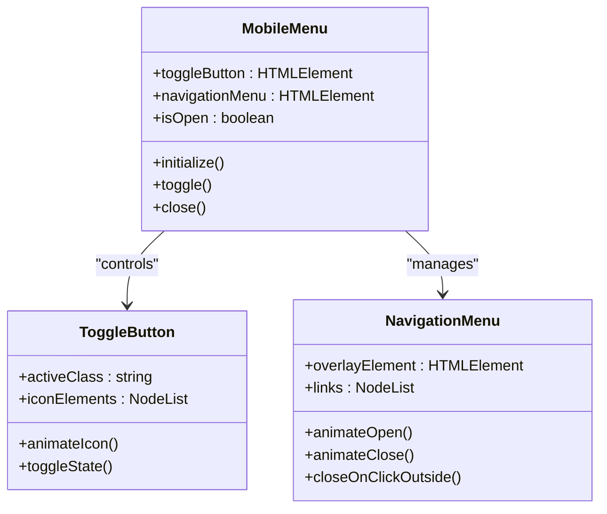

**Diagram sources**
- [assets/main.js](file://assets/main.js#L20-L50)
- [index.html](file://index.html#L25-L35)

### Menu Implementation Details

The mobile navigation system combines CSS animations with JavaScript event handling to create a seamless user experience:

#### Toggle Button Animation
- **Icon Transformation**: Three-bar icon animates to X shape when menu is open
- **State Management**: CSS classes toggle for visual feedback
- **Accessibility**: ARIA attributes ensure screen reader compatibility

#### Menu Overlay System
- **Positioning**: Fixed positioning with z-index management
- **Animation**: Smooth slide-in animation with backdrop blur effect
- **Interaction**: Click-outside closing with touch event support

#### JavaScript Event Handling
```javascript
// Menu toggle functionality
mobileMenuToggle.addEventListener('click', function(){
  this.classList.toggle('active');
  navMenu.classList.toggle('active');
});

// Close menu on link click
navMenu.querySelectorAll('a').forEach(link => {
  link.addEventListener('click', function(){
    mobileMenuToggle.classList.remove('active');
    navMenu.classList.remove('active');
  });
});
```

### Responsive Navigation Behavior

The navigation adapts intelligently across breakpoints:

#### Mobile View (≤ 680px)
- **Hidden Desktop Navigation**: Standard desktop navigation hidden
- **Toggle Button Display**: Mobile menu toggle button becomes visible
- **Overlay Menu**: Full-screen overlay with backdrop filter

#### Tablet View (680px - 1024px)
- **Hybrid Navigation**: Both desktop and mobile navigation visible
- **Conditional Display**: Navigation adapts based on screen width
- **Enhanced Interactivity**: Improved touch targets and spacing

#### Desktop View (> 1024px)
- **Standard Navigation**: Full desktop navigation with hover effects
- **Minimal Mobile Elements**: Mobile-specific elements hidden
- **Performance Optimization**: Reduced JavaScript overhead

**Section sources**
- [assets/main.js](file://assets/main.js#L20-L60)
- [index.html](file://index.html#L25-L40)

## Performance Considerations

The responsive design system incorporates numerous performance optimization strategies to ensure fast loading times and smooth interactions across all devices.

### Loading Performance Strategies

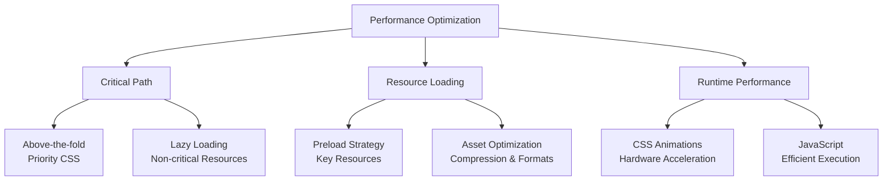

### CSS Performance Optimizations

#### Selective Media Queries
- **Conditional Loading**: Media queries prevent unnecessary CSS from loading
- **Specificity Management**: Minimized selector complexity for better performance
- **Animation Optimization**: Hardware-accelerated transforms for smooth animations

#### Asset Preloading Strategy
```html
<link rel="preload" href="assets/styles.css" as="style">
<link rel="preload" href="assets/fonts/Montserrat-VariableFont_wght.ttf" as="font" type="font/ttf" crossorigin>
```

### JavaScript Performance Considerations

#### Event Delegation
- **Memory Efficiency**: Single event listeners for multiple elements
- **Dynamic Content**: Handles dynamically added navigation items
- **Performance Impact**: Reduces memory footprint and improves responsiveness

#### Debounced Interactions
- **Scroll Performance**: Debounced scroll handlers prevent excessive reflows
- **Resize Optimization**: Throttled resize event handling
- **Touch Events**: Optimized touch interaction handling

### Mobile-Specific Optimizations

#### Battery Life Considerations
- **Reduced Animations**: Simplified animations on mobile devices
- **Background Processing**: Minimized JavaScript execution during scroll
- **Network Efficiency**: Optimized resource loading for mobile networks

#### Storage Optimization
- **Local Storage**: Efficient session storage usage
- **Caching Strategy**: Strategic caching of frequently accessed data
- **Memory Management**: Proper cleanup of event listeners and timeouts

**Section sources**
- [assets/main.js](file://assets/main.js#L1-L50)
- [index.html](file://index.html#L5-L10)

## Best Practices

The responsive design implementation follows established best practices for modern web development, ensuring maintainability, accessibility, and future compatibility.

### Responsive Design Principles

#### Progressive Enhancement
- **Baseline Functionality**: Core features work without JavaScript
- **Enhanced Experience**: JavaScript adds interactive elements
- **Graceful Degradation**: Fallbacks for unsupported features

#### Accessibility Standards
- **Semantic HTML**: Proper use of HTML5 elements and ARIA attributes
- **Keyboard Navigation**: Full keyboard accessibility for all interactive elements
- **Screen Reader Support**: Comprehensive ARIA labeling and semantic structure

#### Performance Guidelines
- **Resource Optimization**: Efficient asset loading and compression
- **Code Organization**: Modular CSS and JavaScript architecture
- **Maintenance Strategy**: Clear separation of concerns and documentation

### Code Organization Patterns

#### CSS Architecture
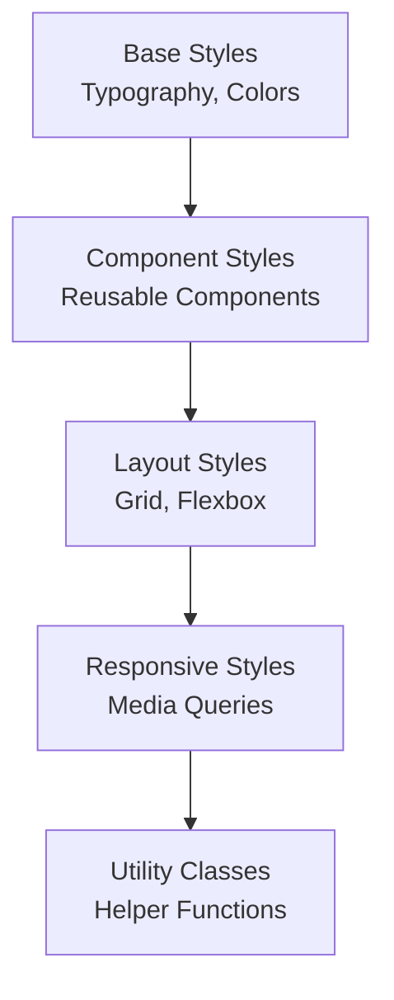

**Diagram sources**
- [assets/styles.css](file://assets/styles.css#L1-L50)

#### JavaScript Module Structure
- **Self-Executing Functions**: Encapsulated functionality with minimal global scope
- **Event Delegation**: Efficient event handling for dynamic content
- **Feature Detection**: Graceful fallbacks for unsupported features

### Testing and Validation Strategies

#### Cross-Platform Testing
- **Browser Compatibility**: Testing across major desktop and mobile browsers
- **Device Testing**: Physical device testing on various screen sizes
- **Performance Monitoring**: Continuous performance assessment across devices

#### Automated Testing
- **Visual Regression**: Automated screenshot comparison across breakpoints
- **Accessibility Testing**: Automated accessibility compliance checking
- **Performance Metrics**: Automated performance monitoring and reporting

**Section sources**
- [assets/styles.css](file://assets/styles.css#L1-L100)
- [MOBILE_OPTIMIZATION_FULL.md](file://MOBILE_OPTIMIZATION_FULL.md#L1-L100)

## Testing and Validation

The responsive design system includes comprehensive testing methodologies to ensure consistent performance and appearance across all target devices and browsers.

### Testing Methodology

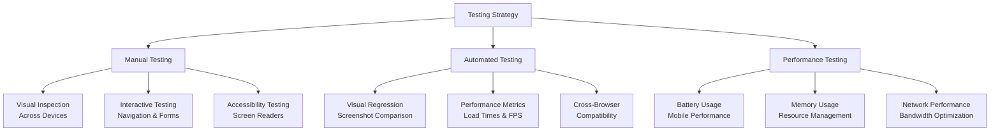

### Device Coverage

#### Mobile Device Testing
- **iOS Devices**: iPhone 8+ through latest models with various iOS versions
- **Android Devices**: Popular Android smartphones with different screen densities
- **Responsive Testing**: Emulators and responsive design tools for comprehensive coverage

#### Desktop Testing
- **Browser Compatibility**: Chrome, Firefox, Safari, Edge across Windows and macOS
- **Resolution Testing**: Various desktop resolutions from 1080p to 4K
- **Performance Testing**: Different hardware configurations and network conditions

### Performance Metrics

#### Load Time Optimization
- **First Contentful Paint (FCP)**: Target < 1.5 seconds
- **Largest Contentful Paint (LCP)**: Target < 2.5 seconds
- **Cumulative Layout Shift (CLS)**: Target < 0.1
- **Time to Interactive (TTI)**: Target < 3 seconds

#### Mobile-Specific Metrics
- **Battery Usage**: Optimized for minimal battery drain
- **Data Usage**: Efficient resource loading for mobile networks
- **Touch Responsiveness**: Sub-100ms response time for touch interactions

### Validation Tools and Processes

#### Automated Testing Pipeline
- **Visual Regression Testing**: Automated screenshot comparison across breakpoints
- **Performance Monitoring**: Continuous performance assessment
- **Accessibility Compliance**: Automated WCAG compliance checking

#### Manual Testing Procedures
- **Interactive Element Testing**: Complete navigation testing across all breakpoints
- **Content Accessibility**: Verification of content readability and navigation
- **Cross-Platform Consistency**: Visual and functional consistency across platforms

**Section sources**
- [MOBILE_OPTIMIZATION_FULL.md](file://MOBILE_OPTIMIZATION_FULL.md#L400-L500)