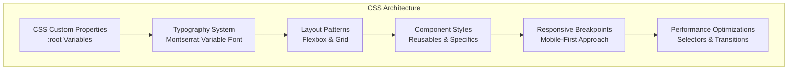
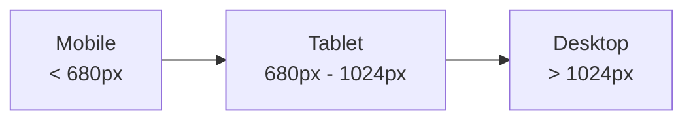

# Styling Strategy

<cite>
**Referenced Files in This Document**
- [styles.css](file://assets/styles.css)
- [main.js](file://assets/main.js)
- [index.html](file://index.html)
- [portfolio.html](file://portfolio.html)
- [price.html](file://price.html)
- [founder.html](file://founder.html)
- [contact.html](file://contact.html)
- [README.md](file://README.md)
</cite>

## Table of Contents
1. [Introduction](#introduction)
2. [CSS Architecture Overview](#css-architecture-overview)
3. [CSS Custom Properties and Theming](#css-custom-properties-and-theming)
4. [Mobile-First Responsive Design](#mobile-first-responsive-design)
5. [Typography System](#typography-system)
6. [Layout Techniques](#layout-techniques)
7. [Dark Theme Implementation](#dark-theme-implementation)
8. [Component-Specific Styling](#component-specific-styling)
9. [Performance Optimizations](#performance-optimizations)
10. [Cross-Browser Compatibility](#cross-browser-compatibility)
11. [Conclusion](#conclusion)

## Introduction

The Knyazev Pro landing page employs a sophisticated CSS architecture designed for modern web applications with emphasis on performance, accessibility, and cross-platform compatibility. The styling strategy combines cutting-edge CSS techniques with traditional approaches to create a seamless user experience across all devices and browsers.

The design system is built around a dark theme foundation with carefully crafted color palettes, responsive typography, and flexible layout systems that adapt gracefully from mobile to desktop interfaces.

## CSS Architecture Overview

The CSS architecture follows a modular, component-based approach with clear separation of concerns:



**Diagram sources**
- [styles.css](file://assets/styles.css#L1-L20)

The architecture emphasizes:
- **Modularity**: Clear separation between global styles, components, and utilities
- **Maintainability**: Consistent naming conventions and structured organization
- **Performance**: Efficient selectors and minimal reflows
- **Accessibility**: Semantic markup with proper contrast ratios

**Section sources**
- [styles.css](file://assets/styles.css#L1-L450)

## CSS Custom Properties and Theming

The styling system utilizes CSS Custom Properties (variables) defined in the `:root` selector for comprehensive theming capabilities:

### Core Color Palette

```css
:root {
  --bg: #0A0A0A;        /* основной тёмный фон */
  --bg-2: #181818;     /* второй тёмный фон/карточки */
  --card: #181818;     /* фон карточек */
  --text: #E0E0E0;     /* основной текст на тёмном */
  --muted: #8F8F8F;    /* вторичный текст */
  --line: #4F4F4F;     /* границы/разделители */
  --brand: #B09B7E;    /* акцент бренда */
  --brand-2: #B09B7E;  /* дополнительный акцент */
}
```

### Theme Application

The dark theme is activated through the `theme-dark` class applied to the body element:

```css
body.theme-dark {
  background: var(--bg);
  color: var(--text);
  font-family: -apple-system, BlinkMacSystemFont, 'Montserrat', system-ui, 
               Segoe UI, Roboto, Inter, Arial, sans-serif;
  line-height: 1.5;
  font-weight: 400;
  min-height: 100vh;
  position: relative;
}
```

### Pattern Overlays

The design incorporates sophisticated pattern overlays for visual interest:

```css
.section-light {
  background-color: #fff;
  background-image:
    linear-gradient(rgba(255,255,255,.90), rgba(255,255,255,.90)),
    url("assets/img/logo _ pattern/raster/jpeg/full version E0E0E0 black.jpg");
  background-repeat: no-repeat, no-repeat;
  background-position: center, center;
  background-size: auto, cover;
  color: #000;
}

.section-dark {
  background-color: var(--bg);
  background-image:
    linear-gradient(rgba(0,0,0,.55), rgba(0,0,0,.55)),
    url("assets/img/logo _ pattern/raster/jpeg/full version 0A0A0A beige.jpg");
  background-repeat: no-repeat, no-repeat;
  background-position: center, center;
  background-size: auto, cover;
  color: var(--text);
}
```

**Section sources**
- [styles.css](file://assets/styles.css#L1-L20)
- [styles.css](file://assets/styles.css#L21-L35)

## Mobile-First Responsive Design

The responsive design strategy prioritizes mobile experiences while scaling up gracefully for larger screens:

### Breakpoint Strategy



### Responsive Media Queries

The design implements three primary breakpoint categories:

```css
/* Tablet layout adjustments */
@media (max-width: 1024px) {
  .hero h1 { font-size: 40px; }
  .hero p { font-size: 17px; }
  .two-column { grid-template-columns: 1fr; gap: 32px; }
  .services-grid { grid-template-columns: repeat(2, 1fr); }
  /* ... additional tablet styles ... */
}

/* Mobile-specific adjustments */
@media (max-width: 768px) {
  .hero h1 { font-size: 32px; line-height: 1.25; }
  .hero p { font-size: 16px; }
  .cta-buttons .btn { 
    padding: 18px 28px !important; 
    font-size: 17px !important; 
  }
  /* Mobile menu implementation */
  .mobile-menu-toggle { display: flex !important; }
  /* ... mobile menu styles ... */
}

/* Small mobile adjustments */
@media (max-width: 680px) {
  .hero { min-height: 100vh; min-height: 100dvh; }
  .hero h1 { font-size: 28px; line-height: 1.3; }
  .hero p { font-size: 16px; line-height: 1.5; }
  .section-title { font-size: 32px; }
  /* ... additional small mobile styles ... */
}
```

### Mobile Menu Implementation

The responsive navigation system adapts seamlessly across device sizes:

```css
/* Mobile menu toggle */
.mobile-menu-toggle {
  display: none;
  flex-direction: column;
  gap: 5px;
  background: transparent;
  border: none;
  cursor: pointer;
  padding: 8px;
  z-index: 20;
}

.mobile-menu-toggle span {
  display: block;
  width: 28px;
  height: 3px;
  background: var(--brand);
  border-radius: 2px;
  transition: all .3s ease;
}

.mobile-menu-toggle.active span:nth-child(1) {
  transform: rotate(45deg) translate(8px, 8px);
}

.mobile-menu-toggle.active span:nth-child(3) {
  transform: rotate(-45deg) translate(7px, -7px);
}
```

**Section sources**
- [styles.css](file://assets/styles.css#L300-L350)
- [styles.css](file://assets/styles.css#L351-L420)

## Typography System

The typography system leverages the Montserrat Variable Font for optimal performance and flexibility:

### Variable Font Implementation

```css
@font-face {
  font-family: 'Montserrat';
  src: url('./fonts/Montserrat-VariableFont_wght.ttf') format('truetype');
  font-weight: 100 900;
  font-style: normal;
  font-display: swap;
}

@font-face {
  font-family: 'Montserrat';
  src: url('./fonts/Montserrat-Italic-VariableFont_wght.ttf') format('truetype');
  font-weight: 100 900;
  font-style: italic;
  font-display: swap;
}
```

### Type Scale and Hierarchy

The typographic hierarchy establishes clear visual relationships:

```css
/* Heading hierarchy */
h1 { font-weight: 800; letter-spacing: -0.02em; }
h2 { font-weight: 700; letter-spacing: -0.01em; }
h3 { font-weight: 600; }
h4 { font-weight: 500; }
p { font-weight: 400; }
.btn { font-weight: 500; }

/* Component-specific typography */
.case-content h4 { font-weight: 600; }
.service-card h3 { font-weight: 600; }
.faq-item h4 { font-weight: 500; }
```

### Responsive Typography

Typography scales appropriately across breakpoints:

```css
.hero h1 { font-size: 48px; margin: 0 0 16px; line-height: 1.2; }
.hero p { font-size: 18px; color: var(--muted); margin: 0 0 24px; line-height: 1.5; }

@media (max-width: 1024px) {
  .hero h1 { font-size: 40px; }
  .hero p { font-size: 17px; }
}

@media (max-width: 768px) {
  .hero h1 { font-size: 32px; line-height: 1.25; }
  .hero p { font-size: 16px; }
}

@media (max-width: 680px) {
  .hero h1 { font-size: 28px; line-height: 1.3; }
  .hero p { font-size: 16px; line-height: 1.5; }
}
```

**Section sources**
- [styles.css](file://assets/styles.css#L22-L28)
- [styles.css](file://assets/styles.css#L36-L45)

## Layout Techniques

The layout system combines Flexbox and CSS Grid for maximum flexibility and control:

### Flexbox for Alignment and Spacing

```css
/* Button container with flex alignment */
.cta-buttons {
  display: flex;
  gap: 12px;
  flex-wrap: wrap;
}

/* Button styling with flex properties */
.btn {
  display: inline-flex;
  align-items: center;
  justify-content: center;
  gap: 8px;
  padding: 12px 18px;
  border-radius: 10px;
  border: 1px solid var(--line);
  background: var(--bg-2);
  color: var(--text);
  cursor: pointer;
  transition: transform .15s ease, background .2s;
  touch-action: manipulation;
}
```

### Grid for Complex Layouts

```css
/* Services grid layout */
.services-grid {
  display: grid;
  grid-template-columns: repeat(4, 1fr);
  gap: 24px;
  margin-bottom: 48px;
}

/* Two-column layout */
.two-column {
  display: grid;
  grid-template-columns: 1fr 1fr;
  gap: 48px;
  align-items: center;
}

/* Portfolio grid */
.case-list {
  display: grid;
  grid-template-columns: repeat(3, 1fr);
  gap: 2px;
  max-width: 100%;
  width: calc(100% + 48px);
  margin: 0 -24px;
  padding: 0 24px;
  box-sizing: border-box;
  overflow: hidden;
}
```

### Container System

```css
.container {
  max-width: 1200px;
  width: 100%;
  margin: 0 auto;
  padding: 24px;
  box-sizing: border-box;
}
```

**Section sources**
- [styles.css](file://assets/styles.css#L46-L55)
- [styles.css](file://assets/styles.css#L120-L130)
- [styles.css](file://assets/styles.css#L131-L140)

## Dark Theme Implementation

The dark theme implementation creates a cohesive visual experience with careful attention to color contrast and visual hierarchy:

### Background Patterns

```css
/* Dark section with pattern overlay */
.section-dark {
  background-color: var(--bg);
  background-image:
    linear-gradient(rgba(0,0,0,.55), rgba(0,0,0,.55)),
    url("assets/img/logo _ pattern/raster/jpeg/full version 0A0A0A beige.jpg");
  background-repeat: no-repeat, no-repeat;
  background-position: center, center;
  background-size: auto, cover;
  color: var(--text);
}

/* Responsive pattern sizing */
@media (max-width: 1024px) {
  .section-dark { background-size: auto, 900px auto; }
}

@media (max-width: 680px) {
  .section-dark { background-size: auto, 700px auto; }
}
```

### Color Contrast Considerations

The theme maintains WCAG AA compliance for accessibility:

```css
/* Text and background combinations */
--bg: #0A0A0A;        /* Dark background */
--text: #E0E0E0;      /* Light text */
--muted: #8F8F8F;     /* Secondary text */
--line: #4F4F4F;      /* Borders and dividers */

/* Brand accent colors */
--brand: #B09B7E;      /* Primary brand color */
--brand-2: #B09B7E;   /* Secondary brand color */
```

### Visual Effects

```css
/* Hero video effects */
.hero-video {
  width: 100%;
  height: 100%;
  object-fit: cover;
  filter: brightness(1.2) contrast(1.1) saturate(1.1);
  max-width: 100%;
}

/* Hero overlay for readability */
.hero-overlay {
  position: absolute;
  inset: 0;
  background: linear-gradient(180deg, rgba(0,0,0,.3) 0%, rgba(0,0,0,.6) 100%);
  z-index: 1;
}
```

**Section sources**
- [styles.css](file://assets/styles.css#L36-L50)
- [styles.css](file://assets/styles.css#L56-L65)

## Component-Specific Styling

Each component follows consistent styling patterns with specific adaptations:

### Button System

```css
/* Base button styling */
.btn {
  display: inline-flex;
  align-items: center;
  justify-content: center;
  gap: 8px;
  padding: 12px 18px;
  border-radius: 10px;
  border: 1px solid var(--line);
  background: var(--bg-2);
  color: var(--text);
  cursor: pointer;
  transition: transform .15s ease, background .2s;
  touch-action: manipulation;
}

/* Button variants */
.btn-primary {
  background: var(--brand);
  color: #0A0A0A;
  border-color: transparent;
}

.btn-secondary {
  background: transparent;
}

.btn-large {
  padding: 14px 22px;
  font-size: 18px;
}

/* Hover effects */
.btn:hover {
  transform: translateY(-1px);
}
```

### Card Components

```css
/* Service card styling */
.service-card {
  background: var(--bg-2);
  border: 1px solid var(--line);
  padding: 18px;
  border-radius: 12px;
}

/* Highlighted card */
.service-card.highlighted {
  outline: 2px solid var(--brand);
  background: linear-gradient(180deg, rgba(230,178,92,.08), transparent);
}

/* Card with transparent background */
.service-card.plain {
  background: transparent;
  border: none;
  padding: 0;
}
```

### Form Elements

```css
/* Consultation form styling */
.consultation-form {
  display: grid;
  gap: 16px;
}

.consultation-form input,
.consultation-form textarea {
  width: 100%;
  padding: 12px;
  border: 1px solid #ddd;
  border-radius: 8px;
  font-family: inherit;
}

.consultation-form textarea {
  height: 120px;
  resize: vertical;
}
```

**Section sources**
- [styles.css](file://assets/styles.css#L66-L85)
- [styles.css](file://assets/styles.css#L141-L160)
- [styles.css](file://assets/styles.css#L180-L195)

## Performance Optimizations

The styling system incorporates several performance optimization techniques:

### Efficient Selectors

```css
/* Specificity optimization */
.btn { /* Base button class */ }
.btn-primary { /* Modifier class */ }
.btn-secondary { /* Modifier class */ }

/* Component-specific selectors */
.service-card { /* Base card class */ }
.service-card.plain { /* Modifier class */ }
.service-card.highlighted { /* Modifier class */ }
```

### Transition Performance

```css
/* Hardware-accelerated transitions */
.btn {
  transition: transform .15s ease, background .2s;
  will-change: transform, background;
}

/* Smooth scrolling with fallback */
.smooth-scroll {
  scroll-behavior: smooth;
  -webkit-overflow-scrolling: touch;
}
```

### Minimized Reflows

```css
/* Layout stability */
.container {
  max-width: 1200px;
  width: 100%;
  margin: 0 auto;
  padding: 24px;
  box-sizing: border-box;
}

/* Prevent layout shifts */
img, video, iframe {
  max-width: 100%;
  height: auto;
}
```

### Font Loading Optimization

```css
/* Fast font loading */
@font-face {
  font-family: 'Montserrat';
  src: url('./fonts/Montserrat-VariableFont_wght.ttf') format('truetype');
  font-weight: 100 900;
  font-style: normal;
  font-display: swap;
}
```

**Section sources**
- [styles.css](file://assets/styles.css#L66-L75)
- [styles.css](file://assets/styles.css#L76-L85)
- [styles.css](file://assets/styles.css#L22-L28)

## Cross-Browser Compatibility

The styling system addresses browser-specific challenges:

### iOS Safari Optimizations

```css
/* 100vh fix for iOS Safari */
@supports (-webkit-touch-callout: none) {
  html { height: -webkit-fill-available; }
  .hero { min-height: -webkit-fill-available; }
  .hero-media { height: -webkit-fill-available; }
}

/* Backdrop-filter with vendor prefixes */
.hero-nav {
  backdrop-filter: blur(10px);
  -webkit-backdrop-filter: blur(10px);
  background: rgba(0,0,0,.1);
}
```

### Touch Interaction

```css
/* Touch-friendly interactions */
button, .btn {
  touch-action: manipulation;
}

/* Mobile menu touch support */
.mobile-menu-toggle {
  touch-action: manipulation;
}
```

### Legacy Browser Support

```css
/* Progressive enhancement */
body {
  font-family: -apple-system, BlinkMacSystemFont, 'Montserrat', system-ui, 
               Segoe UI, Roboto, Inter, Arial, sans-serif;
}

/* Fallback fonts */
body {
  font-family: system-ui, -apple-system, BlinkMacSystemFont, 
               Segoe UI, Roboto, Helvetica, Arial, sans-serif;
}
```

**Section sources**
- [styles.css](file://assets/styles.css#L15-L20)
- [styles.css](file://assets/styles.css#L21-L25)

## Conclusion

The CSS architecture demonstrates a mature approach to modern web styling with emphasis on performance, accessibility, and maintainability. The combination of CSS Custom Properties, responsive design principles, and efficient layout techniques creates a robust foundation for the Knyazev Pro landing page.

Key strengths of the implementation include:

- **Consistent theming** through CSS Custom Properties
- **Mobile-first responsive design** with graceful degradation
- **Performance-conscious** selector patterns and transition optimizations
- **Cross-browser compatibility** with targeted fixes for specific platforms
- **Semantic typography** with variable font support
- **Flexible layout system** combining Flexbox and Grid

This architecture serves as an excellent example of contemporary CSS practices while maintaining backward compatibility and accessibility standards.