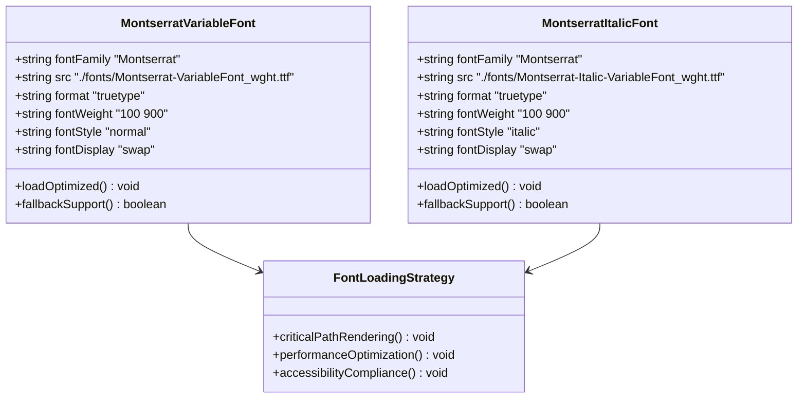
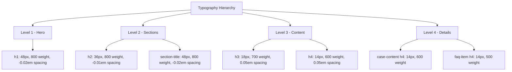
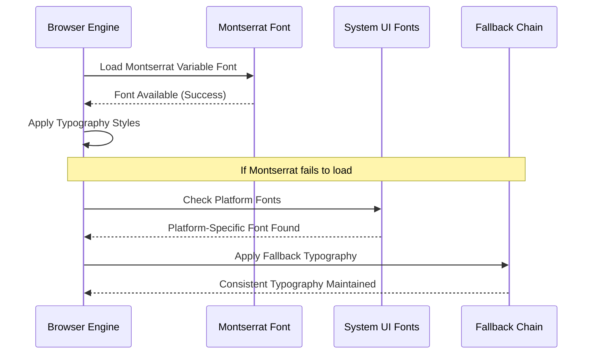
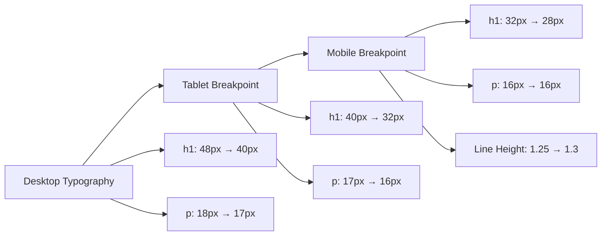
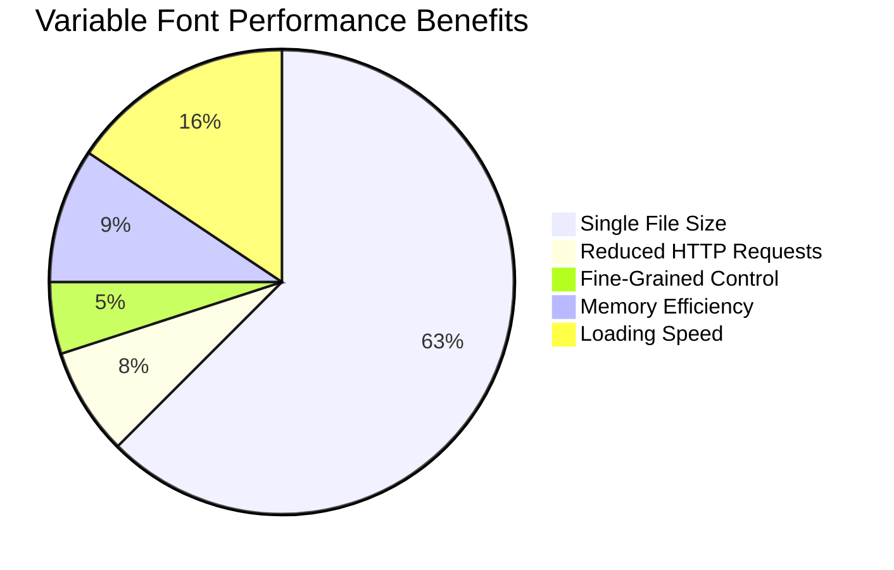
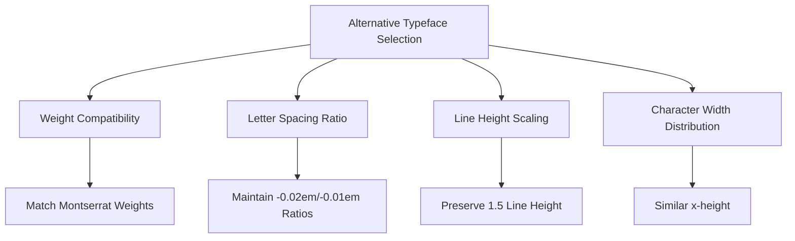

# Typography

<cite>
**Referenced Files in This Document**
- [assets/styles.css](file://assets/styles.css)
- [assets/fonts/OFL.txt](file://assets/fonts/OFL.txt)
- [assets/fonts/README.txt](file://assets/fonts/README.txt)
- [index.html](file://index.html)
- [contact.html](file://contact.html)
- [portfolio.html](file://portfolio.html)
- [price.html](file://price.html)
- [IOS_MAC_OPTIMIZATION.md](file://IOS_MAC_OPTIMIZATION.md)
</cite>

## Table of Contents
1. [Introduction](#introduction)
2. [Font System Architecture](#font-system-architecture)
3. [Montserrat Variable Font Implementation](#montserrat-variable-font-implementation)
4. [Typographic Hierarchy](#typographic-hierarchy)
5. [System UI Fallback Strategy](#system-ui-fallback-strategy)
6. [Responsive Typography](#responsive-typography)
7. [Performance Optimizations](#performance-optimizations)
8. [Alternative Typeface Guidance](#alternative-typeface-guidance)
9. [Best Practices](#best-practices)
10. [Troubleshooting](#troubleshooting)

## Introduction

The landing page employs a sophisticated typographic system built around the Montserrat Variable Font, providing exceptional flexibility and performance. This system combines modern variable font technology with robust fallback mechanisms to ensure consistent typography across all devices and browsers while maintaining optimal loading performance.

The typographic foundation supports a comprehensive hierarchy from large hero headings to subtle body text, with precise control over letter spacing, line heights, and responsive scaling. The implementation leverages CSS custom properties for maintainable design tokens and follows web standards for accessibility and performance.

## Font System Architecture

The typographic system is structured around a dual-axis approach combining the Montserrat Variable Font with system UI fallbacks:

```mermaid
graph TB
subgraph "Font Loading Strategy"
A[Primary Montserrat Variable Font] --> B[Weight Range 100-900]
A --> C[Italic Variant 100-900]
D[System UI Fallbacks] --> E[-apple-system]
D --> F[BlinkMacSystemFont]
D --> G[Segoe UI]
D --> H[Roboto]
D --> I[system-ui]
end
subgraph "CSS Implementation"
J[@font-face Declarations] --> K[Normal Weight Axis]
J --> L[Italic Weight Axis]
M[font-display:swap] --> N[Critical Path Rendering]
end
subgraph "Typography Hierarchy"
O[Hero Headings] --> P[h1 Elements]
Q[Section Titles] --> R[h2 Elements]
S[Content Headers] --> T[h3/h4 Elements]
U[Body Text] --> V[p Elements]
end
A --> J
D --> M
J --> O
M --> Q
```

**Diagram sources**
- [assets/styles.css](file://assets/styles.css#L10-L11)
- [assets/styles.css](file://assets/styles.css#L22)

**Section sources**
- [assets/styles.css](file://assets/styles.css#L10-L11)
- [assets/styles.css](file://assets/styles.css#L22)

## Montserrat Variable Font Implementation

### @font-face Declarations

The system implements two comprehensive @font-face declarations that cover the full weight spectrum from 100 to 900:



**Diagram sources**
- [assets/styles.css](file://assets/styles.css#L10-L11)

### Font Display Strategy

The `font-display: swap` property ensures immediate text visibility during font loading:

| Property | Value | Purpose | Benefit |
|----------|-------|---------|---------|
| `font-display` | `swap` | Critical path rendering | Text remains visible immediately |
| `format` | `truetype` | Browser compatibility | Ensures broad support |
| `fontWeight` | `100 900` | Full weight range | Enables fine-grained control |
| `fontStyle` | `normal/italic` | Style variants | Complete typographic flexibility |

**Section sources**
- [assets/styles.css](file://assets/styles.css#L10-L11)

## Typographic Hierarchy

The system establishes a clear typographic hierarchy with specific weights, sizes, and letter-spacing values for each element type:

### Heading Elements



**Diagram sources**
- [assets/styles.css](file://assets/styles.css#L25-L33)
- [assets/styles.css](file://assets/styles.css#L64-L66)

### Body Text and Interactive Elements

| Element Type | Font Size | Weight | Letter Spacing | Line Height | Use Case |
|--------------|-----------|--------|----------------|-------------|----------|
| `p` | 18px | 400 | Normal | 1.5 | Main content paragraphs |
| `.btn` | 16px | 500 | Normal | 1.5 | Interactive buttons |
| `.service-card h3` | 18px | 700 | 0.05em | 1.5 | Service titles |
| `.director-card h3` | 18px | 700 | Normal | 1.5 | Team member names |
| `.contact-section h2` | 24px | 700 | -0.01em | 1.5 | Contact section headers |

**Section sources**
- [assets/styles.css](file://assets/styles.css#L25-L33)
- [assets/styles.css](file://assets/styles.css#L64-L66)

## System UI Fallback Strategy

The system implements a comprehensive fallback chain optimized for cross-platform compatibility:



**Diagram sources**
- [assets/styles.css](file://assets/styles.css#L22)

### Platform-Specific Optimizations

| Platform | Primary Font | Fallback Strategy | Performance Benefit |
|----------|--------------|-------------------|-------------------|
| iOS/macOS | `-apple-system` (San Francisco) | Montserrat | Native font rendering, fast loading |
| Android | `Roboto` | Montserrat | Material Design consistency |
| Windows | `Segoe UI` | Montserrat | Windows 10+ font stack |
| Linux | Various | Montserrat | Cross-distribution compatibility |

**Section sources**
- [assets/styles.css](file://assets/styles.css#L22)
- [IOS_MAC_OPTIMIZATION.md](file://IOS_MAC_OPTIMIZATION.md#L59-L92)

## Responsive Typography

The typographic system adapts seamlessly across device sizes through strategic breakpoint adjustments:

### Mobile Optimization



**Diagram sources**
- [assets/styles.css](file://assets/styles.css#L175-L185)

### Typography Adaptations by Device

| Breakpoint | h1 Size Change | Paragraph Adjustments | Layout Impact |
|------------|----------------|----------------------|---------------|
| Desktop → Tablet | 48px → 40px | 18px → 17px | Grid reflow |
| Tablet → Mobile | 40px → 32px | 17px → 16px | Single column |
| Mobile | 32px → 28px | 16px → 16px | Enhanced readability |

**Section sources**
- [assets/styles.css](file://assets/styles.css#L175-L185)

## Performance Optimizations

### Variable Font Benefits

The Montserrat Variable Font provides significant performance advantages:



**Diagram sources**
- [assets/fonts/README.txt](file://assets/fonts/README.txt#L10-L20)

### Implementation Optimizations

| Optimization Technique | Benefit | Implementation |
|----------------------|---------|----------------|
| Single Variable Font File | ~90% reduction in HTTP requests | Montserrat-VariableFont_wght.ttf |
| `font-display: swap` | Immediate text visibility | Critical path rendering |
| Strategic Fallback Chain | Graceful degradation | System UI + Montserrat |
| Responsive Typography | Optimal readability | Media query breakpoints |

**Section sources**
- [assets/fonts/README.txt](file://assets/fonts/README.txt#L10-L20)
- [assets/styles.css](file://assets/styles.css#L10-L11)

## Alternative Typeface Guidance

### Substitution Options

When considering alternative typefaces, maintain visual consistency by preserving:

#### Montserrat Alternatives
- **Google Fonts**: Inter, Roboto Flex, Google Sans
- **Commercial**: Adobe Clean, DIN Next
- **Open Source**: Nunito, Poppins, Work Sans

#### Key Preservation Guidelines



**Diagram sources**
- [assets/fonts/README.txt](file://assets/fonts/README.txt#L10-L43)

### Migration Checklist

| Aspect | Montserrat Reference | Alternative Validation | Success Criteria |
|--------|---------------------|----------------------|------------------|
| Weight Range | 100-900 | Full 100-900 support | No missing weights |
| Italic Variants | Available | Matching italic weights | Consistent styling |
| Character Coverage | Latin Extended | Full Unicode support | No character gaps |
| Performance | Variable font | Similar file size | Loading speed parity |

**Section sources**
- [assets/fonts/README.txt](file://assets/fonts/README.txt#L10-L43)

## Best Practices

### Font Loading Strategy

1. **Critical Path Optimization**: Use `font-display: swap` for immediate text visibility
2. **Progressive Enhancement**: Implement comprehensive fallback chains
3. **Performance Monitoring**: Track font loading metrics and adjust accordingly
4. **Accessibility Compliance**: Ensure sufficient contrast and readable sizes

### Typography Maintenance

1. **Consistency**: Maintain uniform letter spacing ratios across heading levels
2. **Scalability**: Test typography across all supported devices and browsers
3. **Maintainability**: Use CSS custom properties for typography tokens
4. **Documentation**: Keep font usage guidelines updated with design decisions

### Performance Guidelines

1. **File Size Management**: Monitor variable font file sizes and optimize when necessary
2. **Caching Strategy**: Implement appropriate cache headers for font files
3. **CDN Optimization**: Serve fonts from optimized CDN infrastructure
4. **Browser Testing**: Verify font rendering across all target browsers

## Troubleshooting

### Common Issues and Solutions

| Issue | Symptoms | Solution | Prevention |
|-------|----------|----------|------------|
| Font Loading Delays | Flash of Unstyled Text | Implement `font-display: swap` | Early font loading optimization |
| Inconsistent Spacing | Uneven letter spacing | Verify weight-specific adjustments | Comprehensive testing |
| Mobile Readability | Small text on mobile | Responsive font size adjustments | Mobile-first design approach |
| Fallback Rendering | Poor system font appearance | Optimize fallback chain order | Platform-specific testing |

### Debugging Tools

1. **Browser DevTools**: Monitor font loading and rendering performance
2. **Performance Audits**: Use Lighthouse for typography performance metrics
3. **Cross-Browser Testing**: Validate typography across target browsers
4. **Accessibility Scanning**: Ensure typography meets WCAG guidelines

**Section sources**
- [assets/styles.css](file://assets/styles.css#L10-L11)
- [assets/fonts/OFL.txt](file://assets/fonts/OFL.txt#L30-L60)