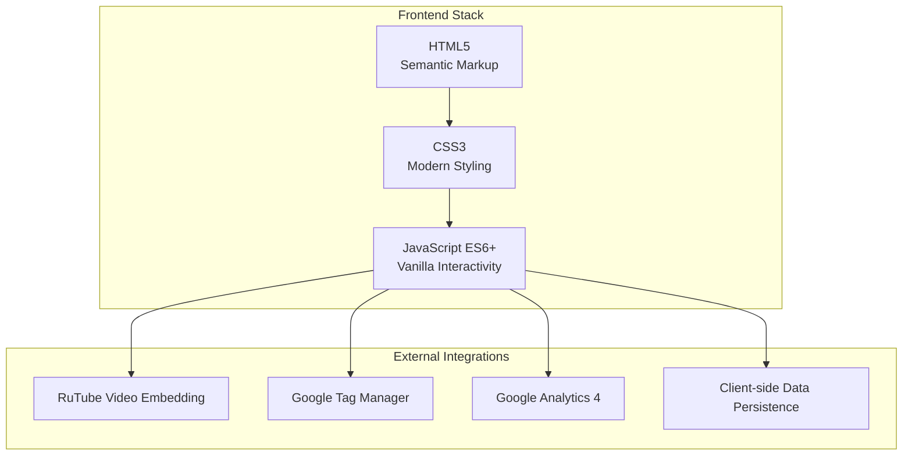
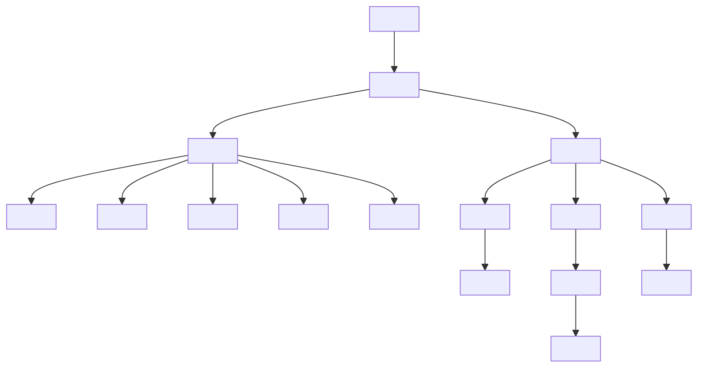
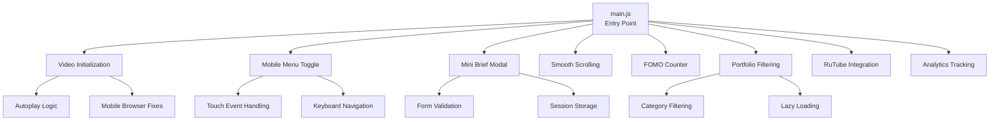

# Technology Stack & Dependencies

<cite>
**Referenced Files in This Document**
- [index.html](file://index.html)
- [portfolio.html](file://portfolio.html)
- [price.html](file://price.html)
- [founder.html](file://founder.html)
- [contact.html](file://contact.html)
- [assets/main.js](file://assets/main.js)
- [assets/styles.css](file://assets/styles.css)
- [README.md](file://README.md)
</cite>

## Table of Contents
1. [Introduction](#introduction)
2. [Frontend Technology Stack](#frontend-technology-stack)
3. [HTML5 Implementation](#html5-implementation)
4. [CSS3 Advanced Features](#css3-advanced-features)
5. [Vanilla JavaScript Architecture](#vanilla-javascript-architecture)
6. [External Dependencies](#external-dependencies)
7. [Browser Compatibility](#browser-compatibility)
8. [Performance Optimizations](#performance-optimizations)
9. [Development Philosophy](#development-philosophy)
10. [Implementation Examples](#implementation-examples)

## Introduction

The Landing project represents a modern, dependency-free frontend architecture designed for optimal performance, maintainability, and cross-platform compatibility. Built with pure HTML5, CSS3, and vanilla JavaScript ES6+, this technology stack delivers a seamless user experience across all devices while maintaining exceptional performance characteristics.

The project demonstrates a commitment to lean, efficient development practices by avoiding external libraries and frameworks, resulting in smaller bundle sizes, faster load times, and greater control over the codebase. This approach aligns with contemporary web development trends emphasizing minimalism and performance optimization.

## Frontend Technology Stack

### Core Technologies

The project utilizes a carefully selected trio of technologies that work synergistically to deliver exceptional performance and maintainability:



**Diagram sources**
- [assets/main.js](file://assets/main.js#L1-L418)
- [assets/styles.css](file://assets/styles.css#L1-L450)
- [index.html](file://index.html#L1-L249)

### Technology Selection Rationale

The choice of pure technologies over external libraries stems from several strategic advantages:

- **Performance**: Elimination of library overhead results in faster load times and improved runtime performance
- **Maintainability**: Single codebase reduces complexity and maintenance burden
- **Control**: Complete ownership of functionality enables precise customization and optimization
- **Reliability**: Predictable behavior without external dependency conflicts
- **Security**: Reduced attack surface through minimized third-party code

**Section sources**
- [README.md](file://README.md#L1-L437)

## HTML5 Implementation

### Semantic Markup Architecture

The HTML5 implementation emphasizes semantic structure and accessibility, providing clear meaning and structure to the content hierarchy:



**Diagram sources**
- [index.html](file://index.html#L1-L50)
- [portfolio.html](file://portfolio.html#L1-L50)

### Accessibility Features

The implementation incorporates comprehensive accessibility features:

- **Semantic Elements**: Proper use of `<header>`, `<main>`, `<footer>`, `<section>`, and `<article>` tags
- **ARIA Labels**: Comprehensive `aria-label` attributes for interactive elements
- **Keyboard Navigation**: Full keyboard accessibility support
- **Screen Reader Optimization**: Structured heading hierarchy and descriptive text
- **Focus Management**: Clear focus indicators and logical tab order

### SEO Optimization

The HTML structure includes essential SEO elements:

- **Structured Metadata**: Descriptive meta tags with appropriate content
- **Schema Markup**: JSON-LD structured data for video production services
- **Mobile-Friendly Design**: Responsive viewport configuration
- **Performance Headers**: Resource preloading and connection hints

**Section sources**
- [index.html](file://index.html#L1-L249)
- [portfolio.html](file://portfolio.html#L1-L388)
- [price.html](file://price.html#L1-L437)

## CSS3 Advanced Features

### CSS Custom Properties (Variables)

The project extensively uses CSS Custom Properties for consistent theming and easy customization:

```css
:root {
  --bg: #0A0A0A;        /* основной тёмный фон */
  --bg-2: #181818;      /* второй тёмный фон/карточки */
  --card: #181818;      /* фон карточек */
  --text: #E0E0E0;      /* основной текст на тёмном */
  --muted: #8F8F8F;     /* вторичный текст */
  --line: #4F4F4F;      /* границы/разделители */
  --brand: #B09B7E;     /* акцент бренда */
  --brand-2: #B09B7E;   /* дополнительный акцент */
}
```

### Modern Layout Techniques

The CSS implementation leverages advanced layout capabilities:

#### Flexbox Implementation
- **Navigation Systems**: Flexible navigation menus with adaptive spacing
- **Content Alignment**: Dynamic content centering and alignment
- **Responsive Grids**: Adaptive grid layouts for various screen sizes

#### CSS Grid System
- **Section Layouts**: Complex multi-column section structures
- **Card Grids**: Responsive product and portfolio grids
- **Two-Column Designs**: Flexible content arrangement patterns

#### Advanced Typography

The project utilizes variable fonts for optimal performance:

```css
@font-face {
  font-family: 'Montserrat';
  src: url('./fonts/Montserrat-VariableFont_wght.ttf') format('truetype');
  font-weight: 100 900;
  font-style: normal;
  font-display: swap;
}

@font-face {
  font-family: 'Montserrat';
  src: url('./fonts/Montserrat-Italic-VariableFont_wght.ttf') format('truetype');
  font-weight: 100 900;
  font-style: italic;
  font-display: swap;
}
```

### Animation and Transitions

Sophisticated animation systems enhance user experience:

#### Hover Effects
- **Button Interactions**: Subtle scale transformations and color transitions
- **Card Animations**: Smooth elevation changes on hover
- **Menu Transitions**: Fluid slide animations for mobile navigation

#### Loading Animations
- **Pulse Effects**: Animated call-to-action buttons
- **Progress Indicators**: Smooth loading state animations
- **Fade Transitions**: Seamless content switching

**Section sources**
- [assets/styles.css](file://assets/styles.css#L1-L450)

## Vanilla JavaScript Architecture

### Modular ES6+ Implementation

The JavaScript architecture follows modern ES6+ patterns with careful module organization:



**Diagram sources**
- [assets/main.js](file://assets/main.js#L1-L418)

### Event-Driven Architecture

The JavaScript implementation employs a robust event-driven pattern:

#### Video Playback Management
- **Autoplay Detection**: Intelligent autoplay capability detection
- **Fallback Mechanisms**: User interaction triggers for blocked autoplay
- **Mobile Optimization**: Platform-specific video handling

#### Interactive Element Management
- **Modal Systems**: Native dialog API utilization
- **Form Interactions**: Dynamic form validation and submission
- **Navigation Controls**: Responsive menu systems

#### Data Persistence
- **Session Storage**: Cross-page data sharing
- **Local Storage**: Persistent user preferences
- **State Management**: Application state synchronization

### Performance Optimizations

The JavaScript implementation incorporates several performance optimization techniques:

#### Lazy Loading Patterns
- **Resource Preloading**: Critical resource prioritization
- **Conditional Loading**: On-demand script loading
- **Memory Management**: Efficient cleanup and garbage collection

#### Event Debouncing
- **Resize Handlers**: Optimized resize event processing
- **Scroll Events**: Throttled scroll event handling
- **Input Validation**: Debounced form validation

#### Module Pattern
- **Namespace Isolation**: Clean global namespace management
- **Dependency Injection**: Explicit dependency management
- **Utility Functions**: Reusable helper modules

**Section sources**
- [assets/main.js](file://assets/main.js#L1-L418)

## External Dependencies

### RuTube Video Embedding

The project integrates RuTube video hosting service for portfolio content delivery:

#### Implementation Strategy
- **Dynamic Embed Generation**: Runtime iframe creation with optimized parameters
- **Lazy Loading**: Videos loaded only when needed
- **Responsive Design**: Adaptive video sizing across devices
- **Performance Optimization**: Minimal bandwidth usage

#### Video Categories
The portfolio contains 48 videos organized into specialized categories:

| Category | Count | Description |
|----------|-------|-------------|
| Industry | 13 | Production and manufacturing content |
| Brand Films | 15 | Corporate presentation videos |
| Events | 10 | Event coverage and highlights |
| Travel | 5 | Travel and lifestyle content |
| Sports | 8 | Automotive and sports content |
| PR | 20 | Public relations and advertising |

### Analytics Integration

#### Google Tag Manager (GTM)
- **Event Tracking**: Comprehensive user interaction tracking
- **Data Layer Management**: Structured data collection
- **Cross-Platform Analytics**: Unified analytics across platforms

#### Google Analytics 4 (GA4)
- **Custom Events**: Business-specific conversion tracking
- **User Behavior Analysis**: Detailed user journey tracking
- **Performance Metrics**: Core Web Vitals monitoring

### Client-Side Data Persistence

#### Session Storage Implementation
- **Cross-Page Communication**: Data sharing between pages
- **Temporary State Management**: Session-based data storage
- **Performance Optimization**: Reduced server requests

**Section sources**
- [assets/main.js](file://assets/main.js#L150-L250)
- [README.md](file://README.md#L100-L150)

## Browser Compatibility

### Supported Platforms

The technology stack ensures broad compatibility across modern browsers:

#### Desktop Browsers
- **Chrome**: Version 90+ (recommended 120+)
- **Firefox**: Version 88+ (recommended 115+)
- **Safari**: Version 14+ (recommended 17+)
- **Edge**: Version 90+ (recommended 120+)

#### Mobile Browsers
- **iOS Safari**: Version 12+ with full optimization
- **Android Chrome**: Version 90+ with enhanced performance
- **Samsung Browser**: Version 14+ full support
- **Firefox Mobile**: Version 88+ complete compatibility

### Progressive Enhancement

The implementation follows progressive enhancement principles:

#### Feature Detection
- **Capability Testing**: Runtime feature availability checks
- **Graceful Degradation**: Fallback implementations for unsupported features
- **Polyfill Integration**: Selective polyfill application

#### Mobile Optimization
- **Touch Interaction**: Native touch event handling
- **Viewport Management**: Adaptive viewport configuration
- **Performance Adaptation**: Device-specific optimizations

**Section sources**
- [README.md](file://README.md#L150-L200)

## Performance Optimizations

### Resource Optimization

#### CSS Optimization
- **Single File Architecture**: Consolidated stylesheet (5.3 KB)
- **Critical Path Optimization**: Essential styles prioritization
- **Minification**: Compressed CSS delivery
- **Selective Loading**: Conditional style application

#### JavaScript Optimization
- **Vanilla Architecture**: Zero dependency JavaScript (8.9 KB)
- **Tree Shaking**: Unused code elimination
- **Module Bundling**: Logical code organization
- **Async Loading**: Non-blocking script execution

#### Font Optimization
- **Variable Fonts**: Single font file supporting all weights (100-900)
- **Subset Loading**: Character subset optimization
- **Font Display Strategy**: Optimal font loading behavior
- **Performance Metrics**: Measured font rendering performance

### Loading Strategies

#### Preloading Implementation
- **Critical Resources**: Essential CSS and JavaScript preloading
- **Connection Hints**: DNS and connection prefetching
- **Resource Prioritization**: Strategic resource ordering

#### Lazy Loading Patterns
- **Intersection Observer**: Efficient element visibility detection
- **Progressive Enhancement**: Content loading based on user interaction
- **Bandwidth Optimization**: Intelligent resource loading

### Mobile Performance

#### iOS-Specific Optimizations
- **100vh Fix**: Safari viewport height normalization
- **Touch Action Optimization**: Native touch response enhancement
- **Backdrop Filter**: Hardware-accelerated background effects

#### Cross-Platform Consistency
- **Performance Benchmarking**: Regular performance testing
- **Device-Specific Tuning**: Platform-optimized implementations
- **Quality Assurance**: Comprehensive testing across devices

**Section sources**
- [README.md](file://README.md#L350-L400)

## Development Philosophy

### Dependency-Free Architecture

The project embodies a philosophy of minimalism and self-sufficiency:

#### Benefits of Vanilla Approach
- **Reduced Complexity**: Simpler codebase with fewer moving parts
- **Improved Performance**: Faster load times and better runtime performance
- **Enhanced Security**: Reduced attack surface through minimal third-party code
- **Greater Control**: Complete customization and modification freedom
- **Long-term Stability**: No dependency update concerns

#### Maintenance Advantages
- **Code Transparency**: Full visibility into all functionality
- **Debugging Efficiency**: Simplified troubleshooting processes
- **Version Independence**: No compatibility issues with external updates
- **Documentation Clarity**: Self-documenting code structure

### Modern Development Practices

#### ES6+ Adoption
- **Arrow Functions**: Concise function definitions
- **Template Literals**: Readable string interpolation
- **Destructuring**: Clean data extraction patterns
- **Async/Await**: Promise-based asynchronous operations

#### Modular Organization
- **Logical Separation**: Clear functional boundaries
- **Reusability**: Component-based architecture
- **Testability**: Isolated functionality units
- **Scalability**: Easy feature addition and modification

**Section sources**
- [README.md](file://README.md#L50-L100)

## Implementation Examples

### CSS Variable Usage

The project demonstrates sophisticated CSS variable usage for theme management:

```css
:root {
  --bg: #0A0A0A;
  --bg-2: #181818;
  --text: #E0E0E0;
  --muted: #8F8F8F;
  --line: #4F4F4F;
  --brand: #B09B7E;
}
```

These variables enable:
- **Consistent Theming**: Uniform color application across components
- **Easy Customization**: Simple theme modifications
- **Accessibility Compliance**: Sufficient contrast ratios
- **Brand Consistency**: Professional color scheme maintenance

### Event Listener Patterns

The JavaScript implementation showcases modern event handling:

```javascript
// Smooth scrolling with fallback
const smoothScrollTo = (element) => {
  if (!element) return;
  if ('scrollBehavior' in document.documentElement.style) {
    element.scrollIntoView({behavior:'smooth'});
  } else {
    element.scrollIntoView();
  }
};
```

### RuTube Integration

The video embedding system demonstrates external service integration:

```javascript
// Dynamic video loading
function loadRuTubePortfolio() {
  const list = document.querySelector('#home-cases');
  if(!list) return;
  
  const preview = rutubeIdsUnique.slice(0, 6);
  preview.forEach((id, index) => {
    const iframe = document.createElement('iframe');
    iframe.src = `https://rutube.ru/play/embed/${id}/`;
    iframe.allow = 'clipboard-write; autoplay';
    iframe.referrerPolicy = 'no-referrer-when-downgrade';
    iframe.allowFullscreen = true;
    video.appendChild(iframe);
  });
}
```

### Session Storage Implementation

Cross-page data persistence demonstrates practical application:

```javascript
// Data sharing between pages
document.querySelectorAll('[data-action="open-portfolio"]').forEach(btn => {
  btn.addEventListener('click', () => {
    try {
      sessionStorage.setItem('rutubeIdsUnique', JSON.stringify(rutubeIdsUnique));
      sessionStorage.setItem('videoSegments', JSON.stringify(videoSegments));
    } catch(e) {}
    window.location.href = 'portfolio.html';
  });
});
```

**Section sources**
- [assets/styles.css](file://assets/styles.css#L1-L50)
- [assets/main.js](file://assets/main.js#L100-L200)
- [assets/main.js](file://assets/main.js#L300-L350)